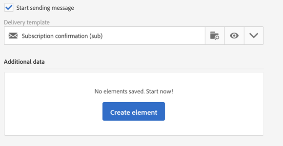
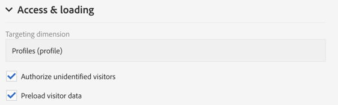
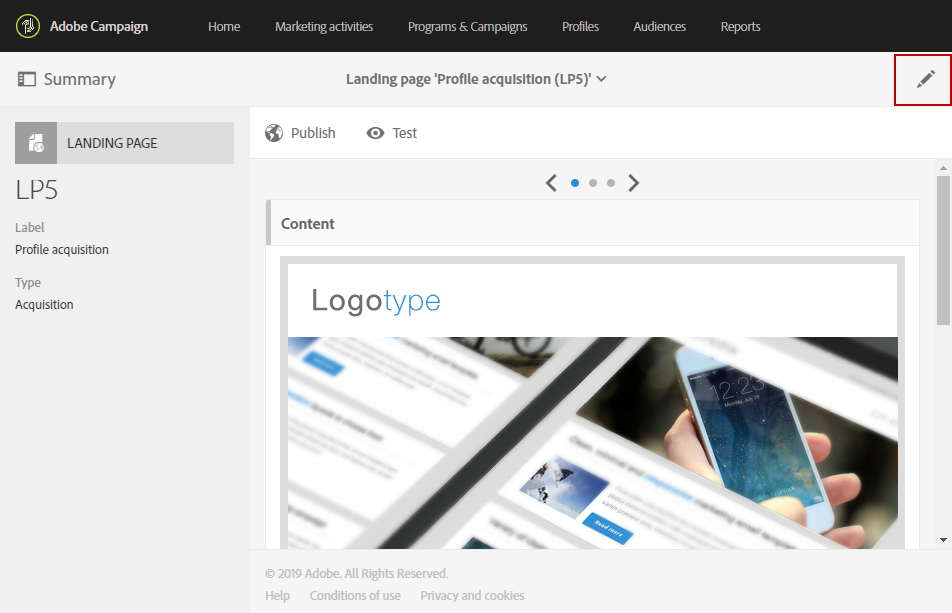
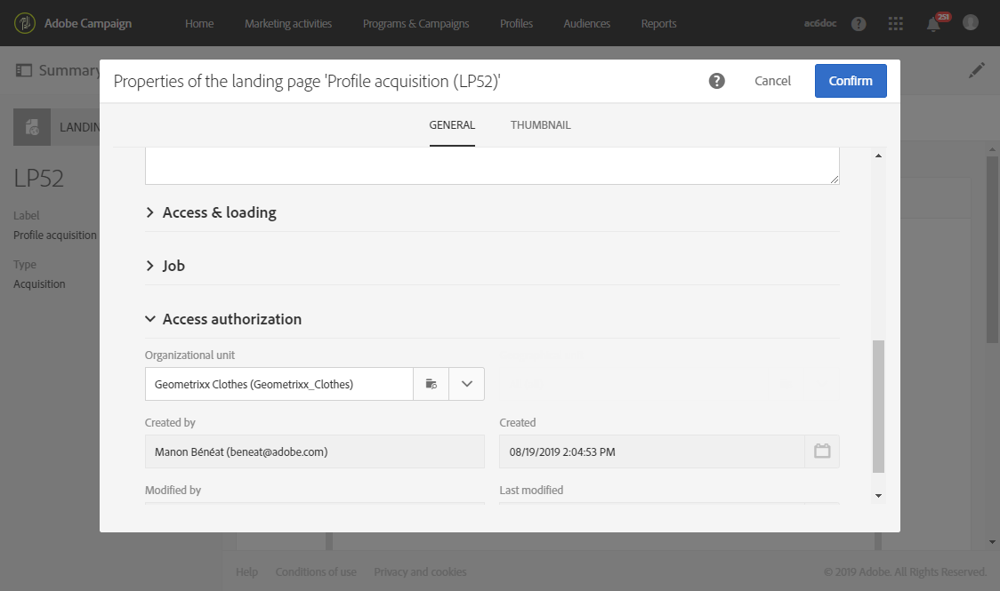
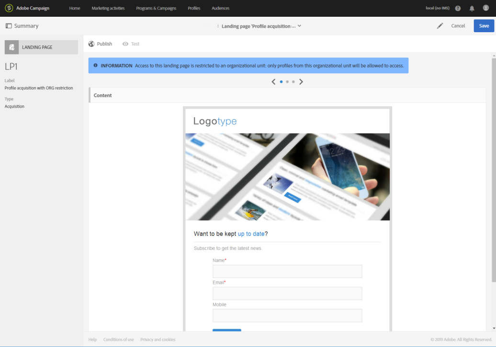
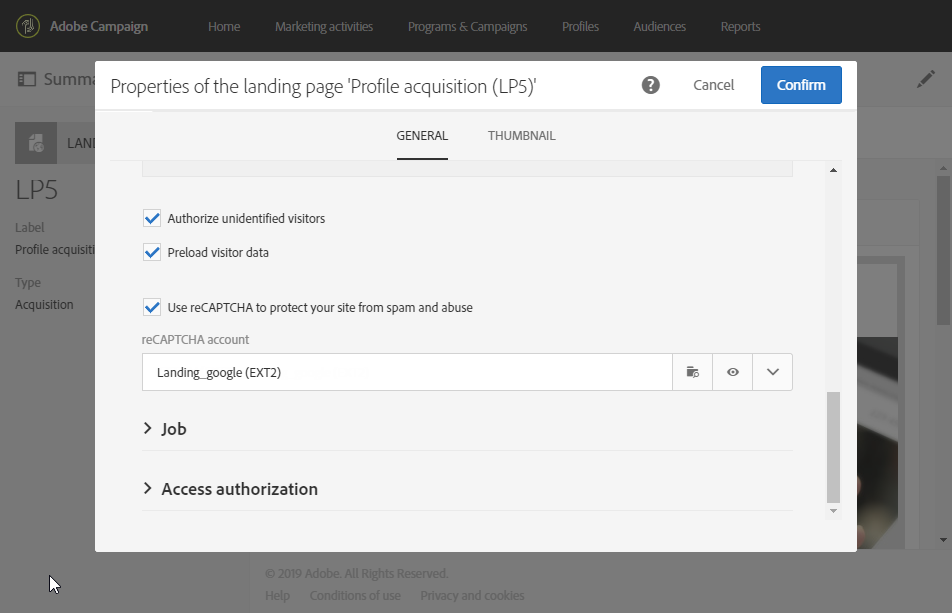
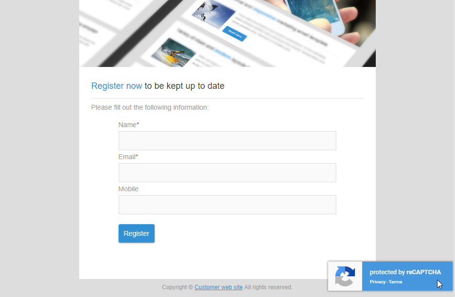

# Configuring a landing page {#configuring-landing-page}

## Confirm a landing page submission {#confirm-a-landing-page-submission}

When a landing page is submitted by a visitor, you can configure the actions triggered. To do this:

1. Edit the landing page properties accessed via the  icon in the landing page dashboard, and display the **[!UICONTROL Job]** parameters.

   

1. Under the **[!UICONTROL Specific actions]** section, select **[!UICONTROL Start sending message]** to determine the sending of an automatic message, for example to confirm subscription to a service. You need then to select an email delivery template.

   Note that if a confirmation message is already configured at the service level, you should not select one in this screen to avoid sending multiple confirmation messages. Refer to [Configure a service](../../audiences/using/creating-a-service.md). 

1. Create **[!UICONTROL Additional data]** to enable storing additional data when the landing page is being submitted. This data is not visible to people who visit the page. Only constant values are taken into account.

   

## Linking a landing page to a service {#linking-a-landing-page-to-a-service}

You can link a form to a service so that profiles can subscribe to a specific service when validating the landing pages.

The parameters for linking a landing page allow you to specify the performed action type and whether the landing page is specifically linked to a single service or whether it is generic.

In order to select the service to link, you need to:

1. Edit the landing page properties accessed via the  icon in the landing page dashboard, and display the **[!UICONTROL Job]** parameters.

   

1. Choose **[!UICONTROL Subscription]** in the **[!UICONTROL Specific actions]** drop-down list.

   

1. Select **[!UICONTROL Specific service]** to link the landing page to a single service. Do not select this option if you would like to use several services with the landing page.

   Use the **[!UICONTROL Specified service in the URL]** option to allow the landing page to be used for several services. You therefore must reference the landing page when configuring the service.

## Setting permissions and pre-loading data {#setting-permissions-and-pre-loading-data}

Access to a landing page can be restricted to identified visitors, who come from a link in a message sent by Campaign for example, or to a specific organizational unit. 
In the case of identified visitors, you can preload their data in the landing page. To do this:

1. Edit the landing page properties accessed via the  icon in the landing page dashboard, and display the **[!UICONTROL Access & loading]** parameters. 

   

1. Select **[!UICONTROL Preload visitor data]**.

   If a visitor to the page corresponds to a profile in the database, their data is displayed in the form's fields that are mapped with the database data and the landing page's personalization elements are taken into account.

   

You can also authorize any visitor to access the landing page, using the **[!UICONTROL Authorize unidentified visitors]** option.

<!--Use the URL parameters to identify the visitors, using the **[!UICONTROL Authorize visitor identification via URL parameters]** option: then you must choose the loading key and map the filter parameters with the parameters of the corresponding URL.-->

Landing pages can also be linked to an organizational unit. This will define the users' access to the different landing pages. To assign an organizational unit:

1. Access your landing page properties via the **[!UICONTROL Edit properties]** icon.

   

1. Unfold the **[!UICONTROL Access authorization]**.

1. Click the drop-down menu and select your organizational unit. For more information on how to create organization unit, refer to this [page](../../administration/using/organizational-units.md).

   

1. The **[!UICONTROL Created by]**, **[!UICONTROL Created]**, **[!UICONTROL Access authorization]** and **[!UICONTROL Last modified]** fields are automatically completed.

1. Click **[!UICONTROL Confirm]** then **[!UICONTROL Save]**.

Your landing page can now only be accessed and managed by users within the chosen organizational unit.

   

## Setting Google reCAPTCHA {#setting-google-recaptcha}

You can set up Google reCAPTCHA V3 with your landing page to protect it from spam and abuse caused by bots. To be able to use it with your landing page, you first need to create an external account. For more information on how to configure it, refer to this [section](../../administration/using/external-accounts.md#google-recaptcha-external-account).

Once your Google reCAPTCHA V3 external account has been set up, you can add it to your landing page:

1. Before publishing your landing page, access the page properties accessed via the  icon from you landing page dashboard.

   

1. Unfold the **[!UICONTROL Access & loading]** menu.
1. Check the **[!UICONTROL Use reCAPTCHA to protect your site from spam and abuse]** option.
1. Select your previously created Google reCAPTCHA external account.

   

1. Click **[!UICONTROL Confirm]**.

Your landing page is now set up with Google reCAPTCHA which can be seen at the bottom of your page.

Google reCAPTCHA will then return a score based on users' interactions with your page. To check your score, connect to your Google admin console.
