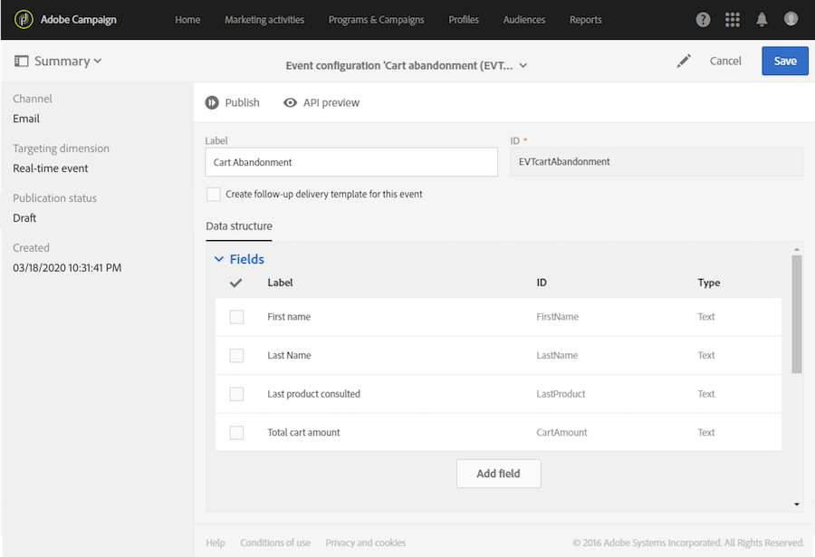

# Configuring transactional messaging{#configuring-transactional-messaging}

To send a transactional message with Adobe Campaign, your first need to describe the structure of the event data.

Event configuration must be performed by an [administrator](../../administration/using/users-management.md#functional-administrators) following the steps below.

>[!NOTE]
>
>The configuration can vary depending on the type of transactional message you want to send. For more on this, refer to [Transactional event specific configurations](#transactional-event-specific-configurations).

Once the event is published:

* The API that will be used by your website developer is deployed and the transactional events can now be sent. See [Integrating the triggering of the event in a website](#integrating-the-triggering-of-the-event-in-a-website).

* The corresponding transactional message is automatically created. See [Getting started with transactional messaging](../../channels/using/getting-started-with-transactional-msg.md).

## Creating an event {#creating-an-event}

To get started, create the event corresponding to your needs.

>[!IMPORTANT]
>
>Only users holding the **[!UICONTROL Administration]** role and being part of the **[!UICONTROL All]** [organizational unit](../../administration/using/organizational-units.md) have the appropriate rights to create an event configuration.

1. Click the **[!UICONTROL Adobe Campaign]** logo, in the top left corner, then select **[!UICONTROL Marketing plans]** > **[!UICONTROL Transactional messages]** > **[!UICONTROL Event configuration]**.
1. Click the **[!UICONTROL Create]** button.
1. Give a **[!UICONTROL Label]** and an **[!UICONTROL ID]** to the event. The **[!UICONTROL ID]** field is mandatory and should begin with the prefix "EVT". If you do not use this prefix, it is automatically added once you click **[!UICONTROL Create]**. 

   

   >[!IMPORTANT]
   >
   >The ID must not exceed 64 characters, including the EVT prefix.

1. Select the channel that will be used to send your transactional messages **[!UICONTROL Email]**, **[!UICONTROL Mobile (SMS)]** or **[!UICONTROL Mobile application]** (push notification).

   >[!NOTE]
   >
   >Only one channel can be used for each event configuration. Once the event is created, you cannot change the channel.

1. Select the targeting dimension corresponding to the desired event configuration and click **[!UICONTROL Create]**.

   Event-based transactional messages target data contained in the event itself, whereas profile-based transactional messages target data contained in the Adobe Campaign database. For more on this, refer to [Transactional event specific configurations](#transactional-event-specific-configurations).

>[!NOTE]
>
>The number of created real-time events can have an impact on your platform. To ensure optimal performance, make sure you delete real-time events that you do not need anymore. See [Deleting an event](#deleting-an-event).

## Defining the event attributes {#defining-the-event-attributes}

In the **[!UICONTROL Fields]** section, define the attributes that will be integrated into the event content and will then be able to be used to personalize the transactional message.

The steps for adding and modifying fields are the same as for [custom resources](../../developing/using/configuring-the-resource-s-data-structure.md#adding-fields-to-a-resource).

>[!NOTE]
>
>If you want to create a multilingual transactional message, define an additional event attribute with the **[!UICONTROL AC_language]** ID. This only applies to event transactional messages. After the event is published, the steps for editing the content of a multilingual transactional message are the same as for a multilingual standard email. See [Creating a multilingual email](../../channels/using/creating-a-multilingual-email.md).

## Defining data collections {#defining-data-collections}

You can add to the event content a collection of elements, each element itself including several attributes.

This collection can be used in a transactional email to add [product listings](../../channels/using/event-transactional-messages.md#using-product-listings-in-a-transactional-message) to the content of the message, for example a list of products - with the price, reference number, quantity, etc. for each product of the list.

1. In the **[!UICONTROL Collections]** section, click the **[!UICONTROL Create element]** button.

   

1. Add a label and an ID for your collection.
1. Add all the fields you want to display in the transactional message for each product of the list.

   In this example, we added the following fields:

   

1. The **[!UICONTROL Enrichment]** tab allows you to enrich each item of the collection. This will enable you to personalize the elements of the corresponding product listing with information from the Adobe Campaign database or from other resources that you created.

>[!NOTE]
>
>The steps for enriching the elements of a collection are the same as described in the [Enriching the event](#enriching-the-transactional-message-content) section. Note that enriching the event will not allow you to enrich a collection: you need to add an enrichment to the collection itself in the **[!UICONTROL Collections]** section.

Once the event and the message are published, you will be able to use this collection in your transactional message.

Here is the API preview for this example:

**Related topics:**

* [Previewing and publishing the event](#previewing-and-publishing-the-event)
* [Using product listings in a transactional message](../../channels/using/event-transactional-messages.md#using-product-listings-in-a-transactional-message)

## Enriching the event {#enriching-the-transactional-message-content}

You can enrich the transactional message content with information from the Adobe Campaign database in order to personalize your messages. From the last name or CRM ID of each of your recipients, for example, you can recover data such as their address or date of birth or any other custom field added in the Profile table, in order to personalize the information that is sent to them.

It is possible to enrich the transactional message content with information from extended **[!UICONTROL Profile and services Ext API]**. For more information, refer to [Extending the API: Publishing the extension](../../developing/using/step-2--publish-the-extension.md)

This information can also be stored in new resources. In that case, the resource must be linked to the **[!UICONTROL Profile]** or **[!UICONTROL Service]** resources either directly, or via another table. For example, in the configuration below, it is possible to enrich the transactional message content with information from the **[!UICONTROL Product]** resource like the product category or ID, if the **[!UICONTROL Product]** resource is linked to the **[!UICONTROL Profile]** resource.

For more on resource creation and publishing, refer to [this page](../../developing/using/key-steps-to-add-a-resource.md).

1. In the **[!UICONTROL Enrichment]** section, click the **[!UICONTROL Create element]** button.

   

1. Select the resource with which you want to link your message. In this case, choose the **[!UICONTROL Profile]** resource.

   

1. Use the **[!UICONTROL Create element]** button to link a field from the selected resource to one of the fields you previously added to the event (see [Defining the event attributes](#defining-the-event-attributes)).

   

1. In this example, we reconcile the **[!UICONTROL Last name]** and the **[!UICONTROL First name]** fields with the corresponding fields in the **[!UICONTROL Profile]** resource.

   

    You can also enrich the transactional message content using the **[!UICONTROL Service]** resource. For more on services, see this [section](../../audiences/using/creating-a-service.md).

1. If you are creating or editing a profile-based event, in the **[!UICONTROL Targeting enrichment]** section, select the enrichment that will be used as the message target during the delivery execution.

   

   >[!NOTE]
   >
   >Selecting a targeting enrichment based on the **[!UICONTROL Profile]** resource is mandatory for profile-based events.

Once the event and the message are published, this link will allow you to enrich the content of the transactional message.

**Related topics:**

* [Previewing and publishing the event](#previewing-and-publishing-the-event).
* [Personalizing a transactional message](../../channels/using/event-transactional-messages.md#personalizing-a-transactional-message).

## Transactional event specific configurations {#transactional-event-specific-configurations}

Transactional event configuration may vary depending on the type of transactional message you want to send (event or profile), and the channel that will be used.

The following sections detail what specific configuration should be set according to the desired transactional message. For more on the general steps to configure an event, refer to [Creating an event](#creating-an-event).

### Event-based transactional messages {#event-based-transactional-messages}

To send an event-based transactional message, you first need to create and configure an event targeting the data contained in the event itself.
For more information, see [Engaging with transactional messaging](https://helpx.adobe.com/campaign/kb/simplify-campaign-management.html#Managedatatofuelengagingexperiences).

1. When creating the event configuration, select the **[!UICONTROL Real-time event]** targeting dimension (see [Creating an event](#creating-an-event)).
1. Add fields to the event, in order to be able to personalize the transactional message (see [Defining the event attributes](#defining-the-event-attributes)).
1. Enrich the transactional message content if you want to use additional information from the Adobe Campaign database (see [Enriching the transactional message content](#enriching-the-transactional-message-content)).

   >[!NOTE]
   >
   >Event-based transactional messaging is supposed to use only the data that are in the sent event to define the recipient and the message content personalization. However, you can enrich the content of your transactional message using information from the Adobe Campaign database.

1. Preview and publish the event (see [Previewing and publishing the event](#previewing-and-publishing-the-event)).

   When previewing the event, the REST API contains an attribute specifying the email address or mobile phone according to the selected channel.

   Once the event has been published, a transactional message linked to the new event is automatically created. In order for the event to trigger sending a transactional message, you must modify and publish the message that was just created, see [Event transactional messages](../../channels/using/event-transactional-messages.md).

1. Integrate the event into your website (see [Integrating the triggering of the event in a website](#integrating-the-triggering-of-the-event-in-a-website)).

### Profile-based transactional messages {#profile-based-transactional-messages}

To send a profile-based transactional message, you first need to create and configure an event targeting data contained in the Adobe Campaign database.

1. When creating the event configuration, select the **[!UICONTROL Profile event]** targeting dimension (see [Creating an event](#creating-an-event)).
1. Add fields to the event, in order to be able to personalize the transactional message (see [Defining the event attributes](#defining-the-event-attributes)). You must add at least one field to create an enrichment. You do not need to create other fields such as **First name** and **Last name** as you will be able to use personalization fields from the Adobe Campaign database. 
1. Create an enrichment in order to link the event to the **[!UICONTROL Profile]** resource (see [Enriching the transactional message content](#enriching-the-transactional-message-content)). Creating an enrichment is mandatory when using a **[!UICONTROL Profile]** targeting dimension.
1. Preview and publish the event (see [Previewing and publishing the event](#previewing-and-publishing-the-event)).

   When previewing the event, the REST API does not contain an attribute specifying the email address or the mobile phone as it will be retrieved from the **[!UICONTROL Profile]** resource.

   Once the event has been published, a transactional message linked to the new event is automatically created. In order for the event to trigger sending a transactional message, you must modify and publish the message that was just created, see [Sending a profile transactional message](../../channels/using/profile-transactional-messages.md#sending-a-profile-transactional-message).

1. Integrate the event into your website (see [Integrating the triggering of the event in a website](#integrating-the-triggering-of-the-event-in-a-website)).

### Configuring an event to send a follow-up message {#configuring-an-event-to-send-a-follow-up-message}

A follow-up message is a predefined marketing delivery template that can be used in a workflow to send messages to the recipients of a specific transactional message. For more on this, see [Follow-up messages](../../channels/using/follow-up-messages.md).

1. Use the same event configuration that you created to send an event transactional message. See [Event-based transactional messages](#event-based-transactional-messages).
1. When configuring your event, check the **[!UICONTROL Create follow-up delivery template for this event]** box before publishing the event.

   

1. Preview and publish the event (see [Previewing and publishing the event](#previewing-and-publishing-the-event)).

   Once the event has been published, a transactional message and a follow-up delivery template linked to the new event are automatically created. For more on using follow-up messages, see [Sending a follow-up message](../../channels/using/follow-up-messages.md#sending-a-follow-up-message).
