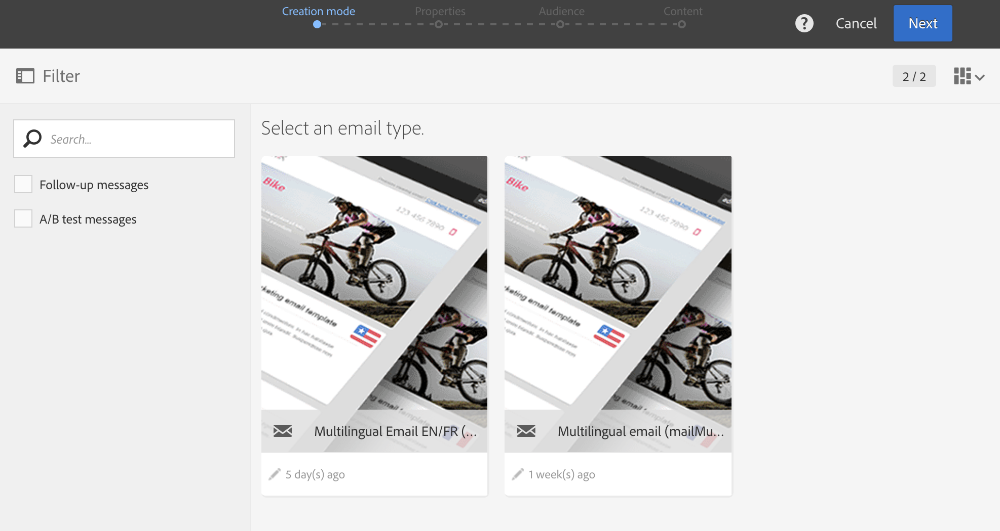
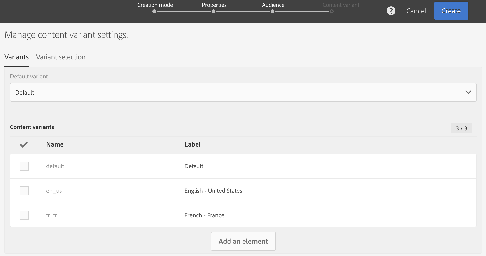
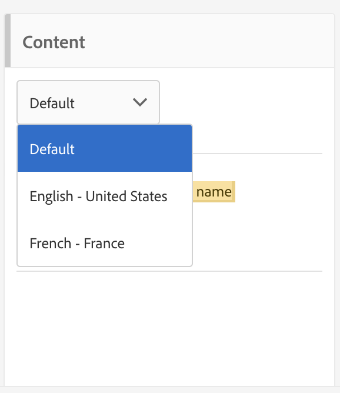

# Creating a multilingual email{#creating-a-multilingual-email}

Creating a multilingual email

You can send a multilingual email to profiles with different preferred languages: each profile will receive a variant of the email in his preferred language.

To do this, check that you have a multilingual email template available. If not, learn how to create one in [this section](../../start/using/creating-a-multilingual-template.md).

The audience is based on profiles with a completed preferred language information.

1. Create a new email based on a [multilingual template](../../start/using/creating-a-multilingual-template.md).

   

1. Define the general properties and the target audience of the email, just as for a standard email. Refer to the [Creating audiences](../../audiences/using/creating-audiences.md) section.
1. At the fourth step in the creation wizard, define the variant options. If the [multilingual template](../../start/using/creating-a-multilingual-template.md) already contains all the right parameters, you can directly click on the **[!UICONTROL Create]** button.

   

   If needed, add variants using the **[!UICONTROL Add an element]** button. **[!UICONTROL Default]** variant must not be deleted. When set to **[!UICONTROL default]** , [the profile's preferred language](../../audiences/using/creating-profiles.md) is used to choose the variant. You can also set the **[!UICONTROL Default]** variant to any other language.

1. Confirm email creation: the email dashboard will then be displayed.
1. Define the email content for each variant. Depending on the template that you have chosen, you can define several subjects, several sender names, or several different contents. Use the drop-down menu to navigate between the different variants of the element. For more information, consult the [content editor](../../designing/using/about-email-content-design.md) section.

   

1. Test and validate your message. Refer to the [Sending proof](../../sending/using/managing-test-profiles-and-sending-proofs.md#sending-proofs) section.
1. Schedule the send with the **[!UICONTROL Send after confirmation option]** .
1. Once your email is sent, you can access its logs and reports to measure the success of your campaign. For more on reporting, refer to [this section](../../reporting/using/about-dynamic-reports.md).

