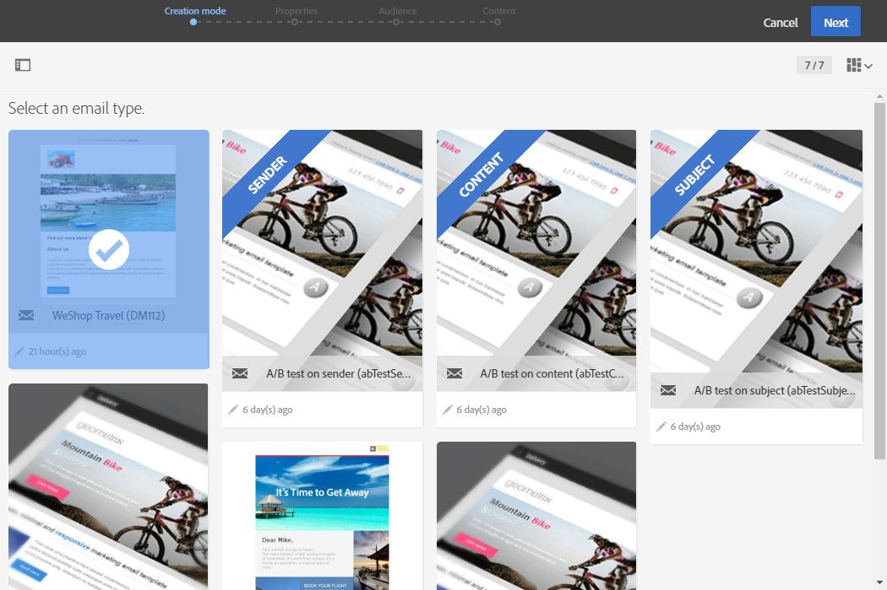
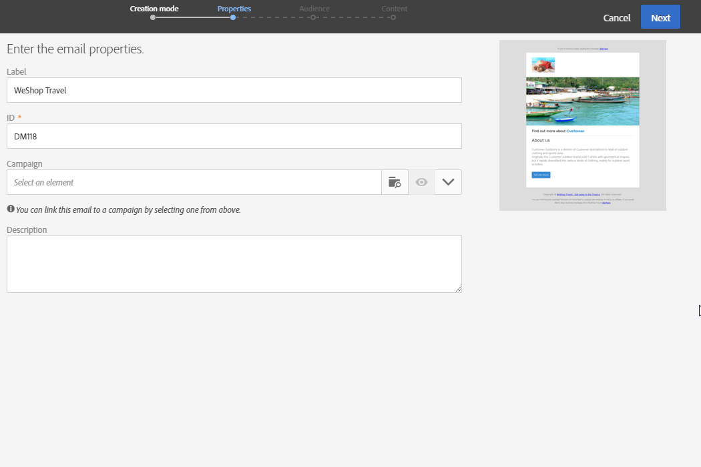
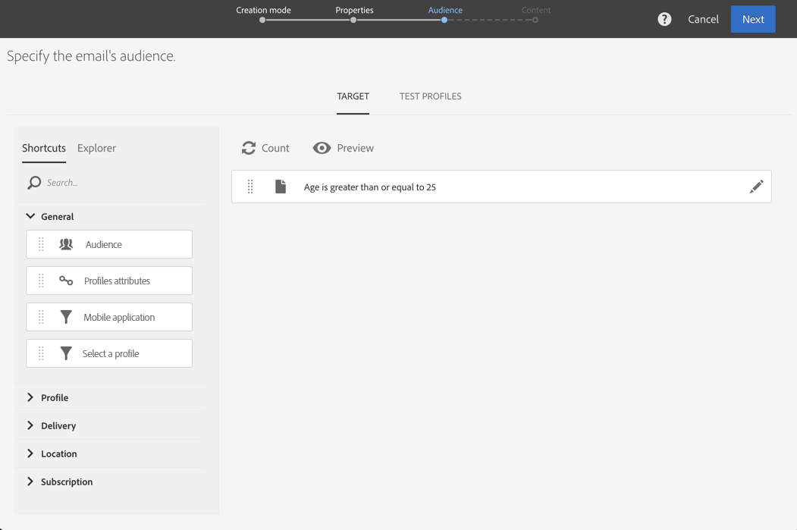
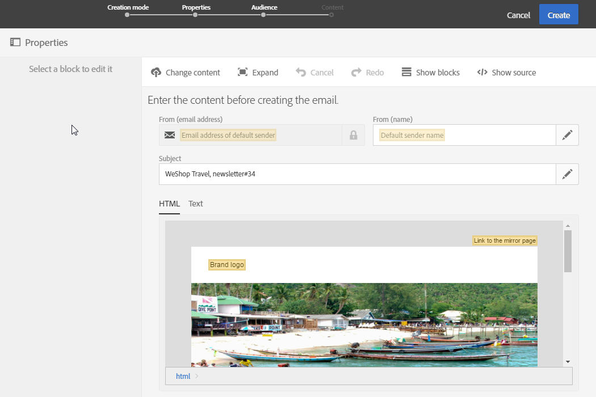
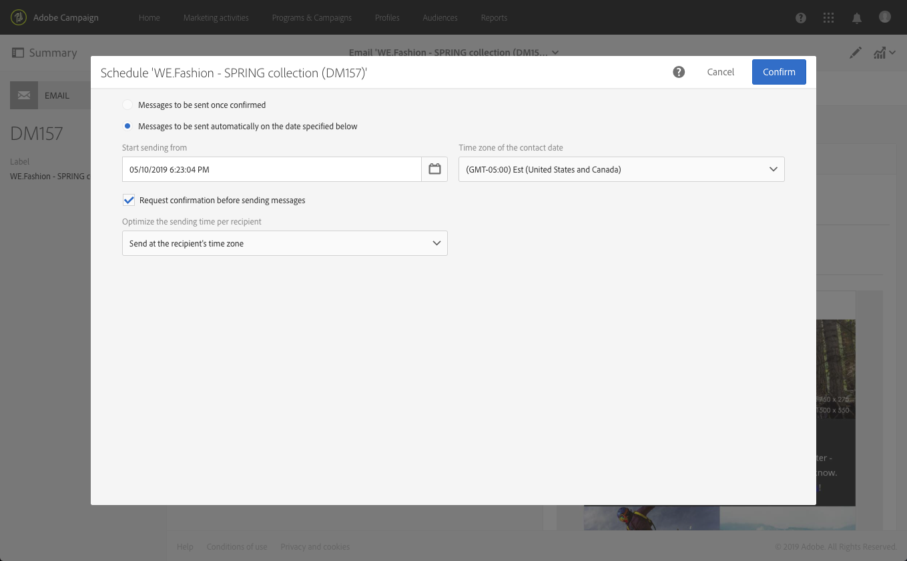
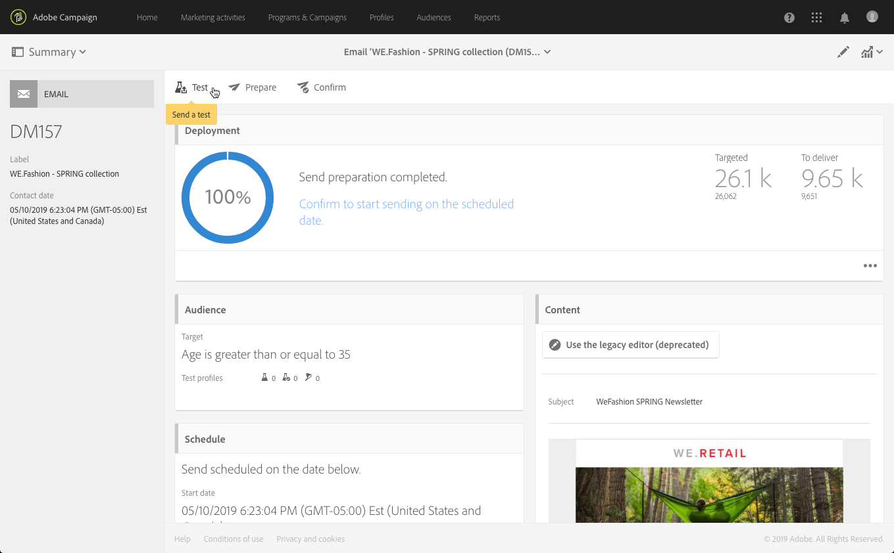
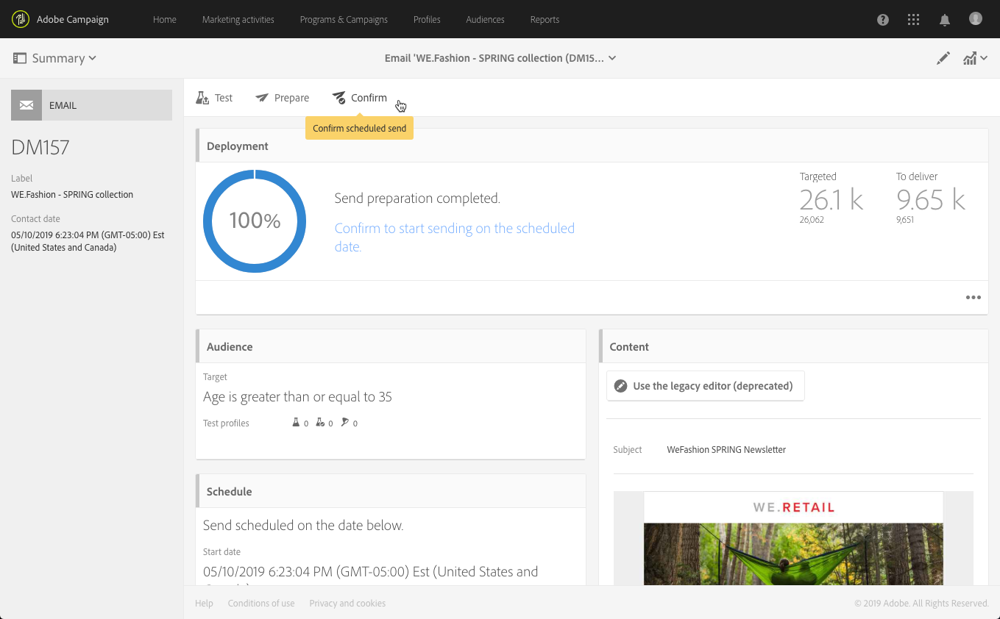

# Creating an email{#creating-an-email}

You can create an email from a [campaign](../../start/using/marketing-activities.md#creating-a-marketing-activity), from the Adobe Campaign [home page](../../start/using/interface-description.md#home-page), or in the [marketing activity list](../../start/using/marketing-activities.md#about-marketing-activities). You can also create single-send and recurring emails from a workflow.

1. Once you have started creating an email marketing activity, select the template you would like to use.

   By default, you can choose from several templates for each marketing activity. This allows you to pre-configure certain parameters according to your needs and also assign a brand to your delivery. For more on this, see [Managing templates](../../start/using/marketing-activity-templates.md).

   

   >[!NOTE]
   >
   >Follow-up and A/B test templates are hidden by default. Check the boxes on the left side ( **[!UICONTROL Filter]** lateral panel) if you want to display them.

1. Enter the email's general properties. You can enter a name in the **Label** field and edit the ID. Both the activity name and its ID appear in the interface, but they are not visible to the message recipients.

   You can add a description that the user can see in the campaign content.

   

   >[!NOTE]
   >
   >You can create your email within a parent campaign from the home page or the list of marketing activities. Select it from the campaigns that have already been created.

1. Define the target of your message based on your business criteria. See [About profiles](../../audiences/using/about-profiles.md).

   You can also define the test profiles who will validate the message. See [Managing test profiles](../../audiences/using/managing-test-profiles.md).

   

1. Define and personalize the message content, sender name and subject using the [Email Designer](../../designing/using/designing-content-in-adobe-campaign.md). For more on this, see [About email content design](../../designing/using/designing-content-in-adobe-campaign.md).

   

   You can design your message directly using a pre-defined content template, or using Dreamweaver or Adobe Experience Manager. If you don't feel like a designer, you can also upload a content that has been prepared for you, or import an existing content from a URL. See [Selecting an existing content](../../designing/using/using-existing-content.md).

1. Preview your message. See [Previewing messages](../../sending/using/previewing-messages.md).
1. Confirm creating the email.

   >[!NOTE]
   >
   >To be able to save your email, you first need to make some edits to the content. If you click **[!UICONTROL Cancel]** at this point, you will not complete the wizard and your email will not be created.

   The email dashboard is then displayed. It allows you to check your message and [prepare the send](../../sending/using/preparing-the-send.md).

   The **[!UICONTROL Edit properties]** button in the upper-right corner allows you to edit the properties of the email. You can, for example, configure the email so that its label is computed at the delivery preparation time.  Available parameters are listed in [this section](../../administration/using/configuring-email-channel.md#list-of-email-properties).

   

1. Schedule the sending. See [Scheduling messages](../../sending/using/about-scheduling-messages.md).

   

1. Prepare your message to analyze its target. See [Preparing the send](../../sending/using/confirming-the-send.md).

   

   >[!NOTE]
   >
   >You can set global cross-channel fatigue rules that will automatically exclude oversollicited profiles from campaigns. For more on this, see [Fatigue rules](../../sending/using/fatigue-rules.md).

1. Send proofs to check and validate your message and monitor its inbox rendering. See [Sending proof](../../sending/using/sending-proofs.md).

   

1. Send the message and check its delivery through the message dashboard and logs. See [Sending messages](../../sending/using/confirming-the-send.md).

   

1. Measure the impact of your message with delivery reports. For more on reporting, see [this section](../../reporting/using/about-dynamic-reports.md).

**Related topics**:

* [Creating an email](https://docs.adobe.com/content/help/en/campaign-learn/campaign-standard-tutorials/getting-started/create-email-from-homepage.html) video
* [Creating a personalized email](https://helpx.adobe.com/campaign/kb/acs-get-started-with-emails.html) step-by-step guide
* [Adobe Campaign and Dreamweaver integration](https://docs.adobe.com/content/help/en/campaign-learn/campaign-standard-tutorials/designing-content/email-designer/dreamweaver-integration.html) video
* [Integrating with Adobe Experience Manager](../../integrating/using/integrating-with-experience-manager.md)
