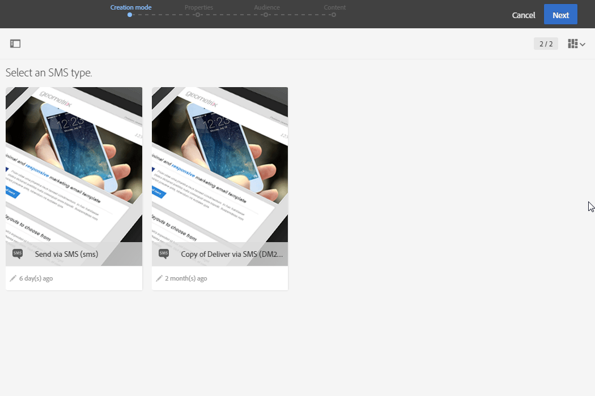
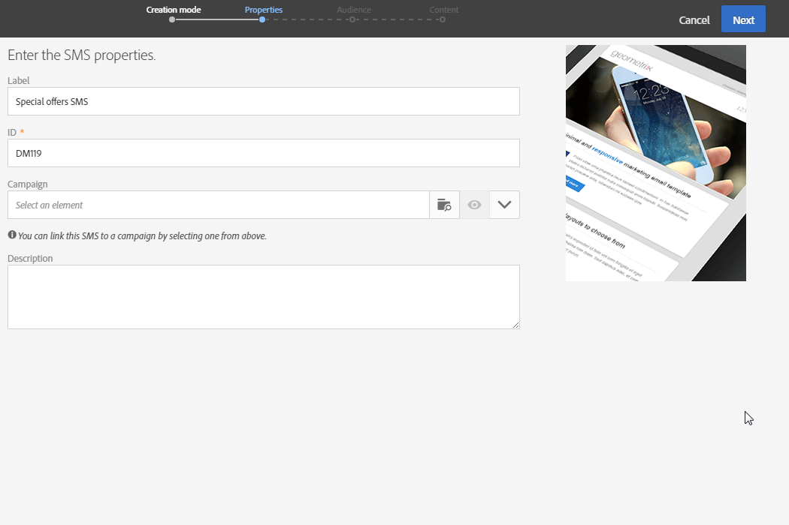
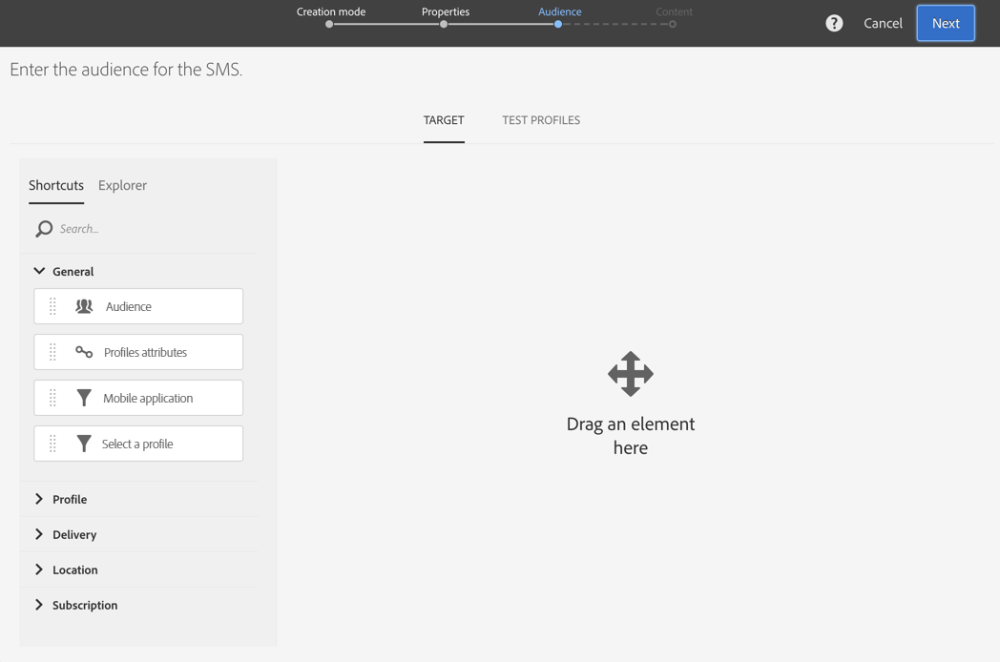
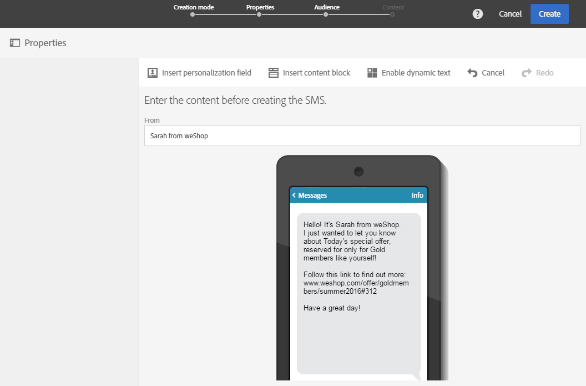
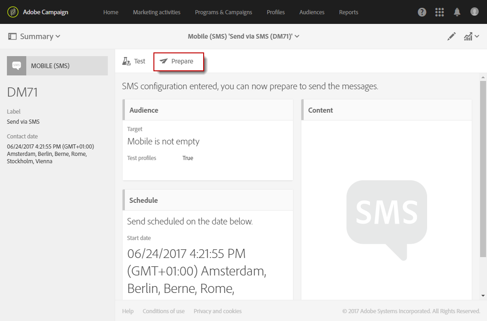
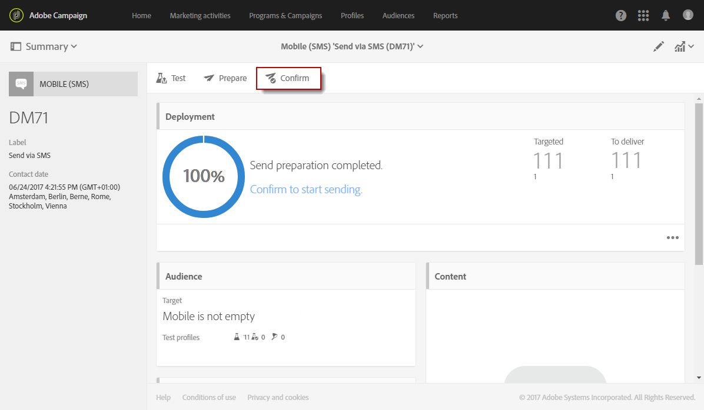

# Creating an SMS message{#creating-an-sms-message}

Creating an SMS delivery is very similar to creating a regular email. The following steps describe the configuration that is specific to this channel. Refer to [Creating an email](../../channels/using/creating-an-email.md) for more information on other options.

Advanced SMS parameters are detailed in the [SMS configuration](../../administration/using/configuring-sms-channel.md) section.

To create and send SMS messages to a mobile phone, you need:

* A **[!UICONTROL Routing]** external account configured on the **[!UICONTROL Mobile (SMS)]** channel with the **[!UICONTROL Bulk delivery]** mode. For more on this, refer to the [Routing](../../administration/using/configuring-sms-channel.md#defining-an-sms-routing) section.
* A delivery template that is correctly linked to this external account.

1. Create an SMS delivery. You can do it from the Adobe Campaign [home page](../../start/using/interface-description.md#home-page), in a [campaign](../../start/using/marketing-activities.md#creating-a-marketing-activity) or in the [marketing activity list](../../start/using/programs-and-campaigns.md#creating-a-campaign).

   You can also add an SMS activity in a workflow. For more on this, refer to the [Workflows](../../automating/using/sms-delivery.md) guide.

   When creating a message, a wizard is displayed to walk you through the most important steps. What is defined through the wizard can still be edited afterward from the message dashboard.

1. Select the template you would like to use. You can choose either the out-of-the-box SMS template or one of your own templates.

   

   To deliver to a mobile telephone, the delivery template must be correctly linked to the SMS routing external account.

1. Enter the general properties of the SMS.

   

   Both the activity label and its ID appear in the interface, but they are not visible to the message recipients.

1. Specify the audience that you want to target. You can select an existing audience or directly target a population by defining and combining rules.

   

1. Add content to your SMS. You can also define the content by clicking the **[!UICONTROL Content]** section of the delivery dashboard, once the SMS creation is finalized. See [About SMS content design](../../designing/using/about-sms-and-push-content-design.md).

   If you have inserted personalization fields or conditional text into the content of your SMS message, the length of the message may vary from one recipient to another. indeed, these factors may introduce characters that are not taken into account by the GSM encoding. This is why the message length has to be evaluated once personalization has been carried out. See [Personalizing SMS messages](../../channels/using/personalizing-sms-messages.md).

   

1. Confirm creating the message. Its dashboard is then displayed.
1. Schedule the sending. The SMS can be sent manually right after the message preparation or automatically at a scheduled date. See . [Scheduling messages](../../sending/using/about-scheduling-messages.md)
1. Prepare the message to analyze its validity, personalization and target.

   

   >[!NOTE]
   >
   >You can set global cross-channel fatigue rules that will automatically exclude oversollicited profiles from campaigns. See [Fatigue rules](../../administration/using/fatigue-rules.md).

1. Send proofs to check and validate your message and monitor its inbox rendering. See the [Sending proof](../../sending/using/managing-test-profiles-and-sending-proofs.md#sending-proofs) section.
1. Confirm the sending of the message. The sending will start accordingly to the schedule you have defined.

   

The message is sent. You can check its delivery through the message dashboard and logs.

Once the sending is finished, you can start measuring the impact of your message with built-in or custom delivery reports.

**Related topics:**

* [About SMS and push content edition](../../designing/using/about-sms-and-push-content-design.md)
* [Managing templates](../../start/using/about-templates.md)
* [Create an SMS delivery](https://helpx.adobe.com/campaign/kt/acs/using/acs-creating-a-sms-delivery-feature-video-use.html) video

