# Creating the direct mail{#creating-the-direct-mail}

Creating the direct mail

Creating a direct mail delivery is very similar to creating a regular email. The following steps describe the configuration that is specific to this channel. Refer to [Creating an email](../../channels/using/creating-an-email.md) for more information on other options.

1. Create a new direct mail delivery. You can create one from the Adobe Campaign [home page](../../start/using/interface-description.md#home-page), in a [campaign](../../start/using/marketing-activities.md#creating-a-marketing-activity) or in a [marketing activity list](../../start/using/programs-and-campaigns.md#creating-a-campaign).

   >[!NOTE]
   >
   >You can also add a direct mail activity in a workflow. For more on this, refer to the [Workflows](../../automating/using/direct-mail-delivery.md) guide.

   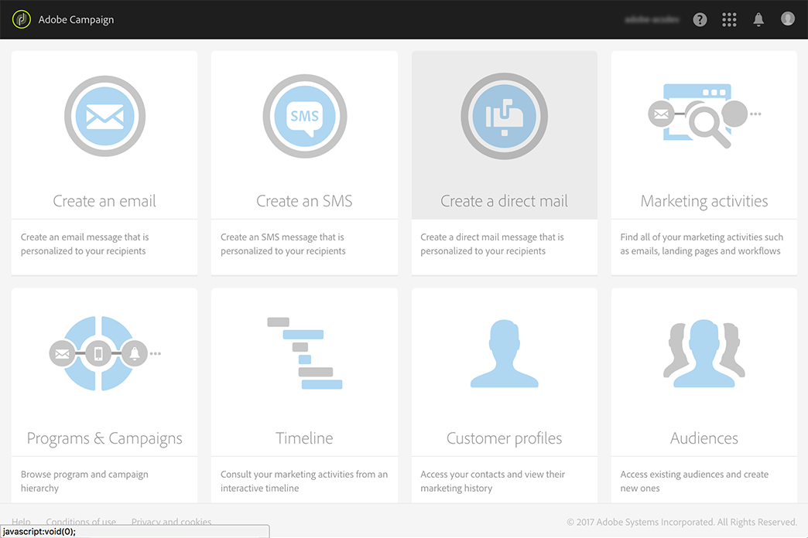

1. Choose either the out-of-the-box **Direct mail** template or one of your own templates. For more information on templates, refer to the [Managing templates](../../start/using/about-templates.md) section.

   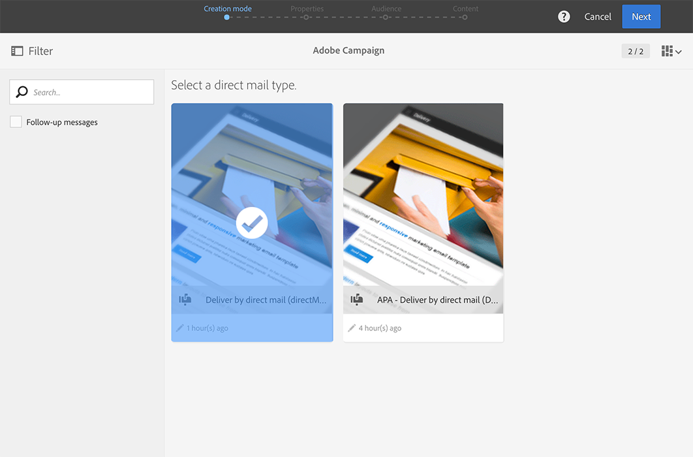

1. Enter the general properties of the delivery.

   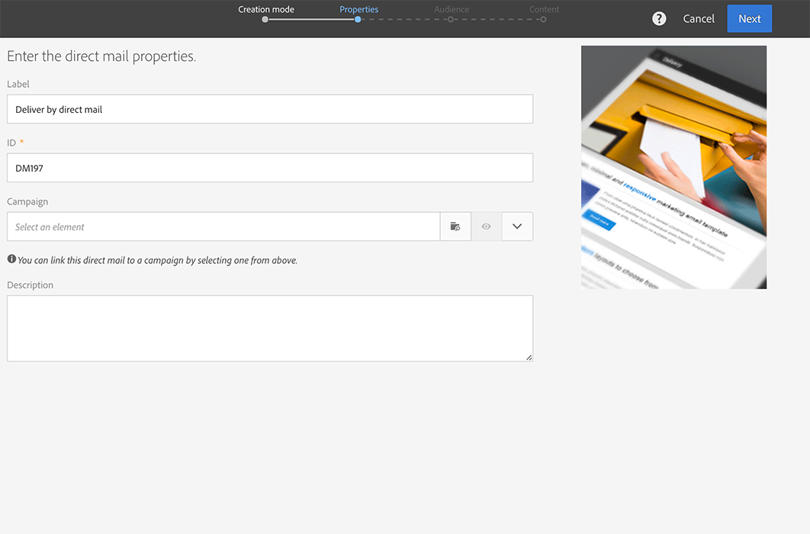

1. Define the audience you wish to include in the extraction file as well as the test and trap profiles. See [Defining the direct mail audience](../../channels/using/defining-the-direct-mail-audience.md). 

   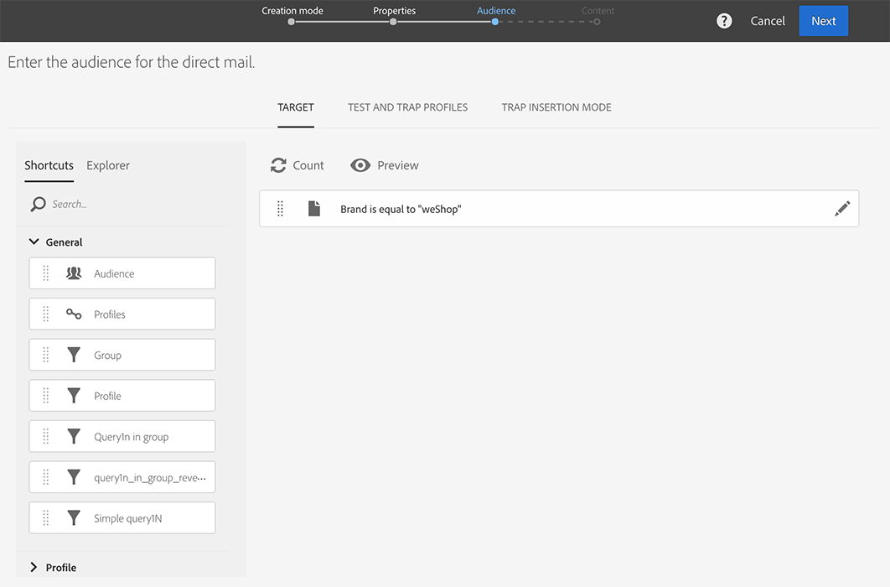

   >[!NOTE]
   >
   >The audience definition is very similar to defining a regular email audience. See [Creating audiences](../../audiences/using/creating-audiences.md).

1. Edit the content of your file: columns to include for each profile, file structure, header and footer. See [Defining the direct mail content](../../channels/using/defining-the-direct-mail-content.md).

   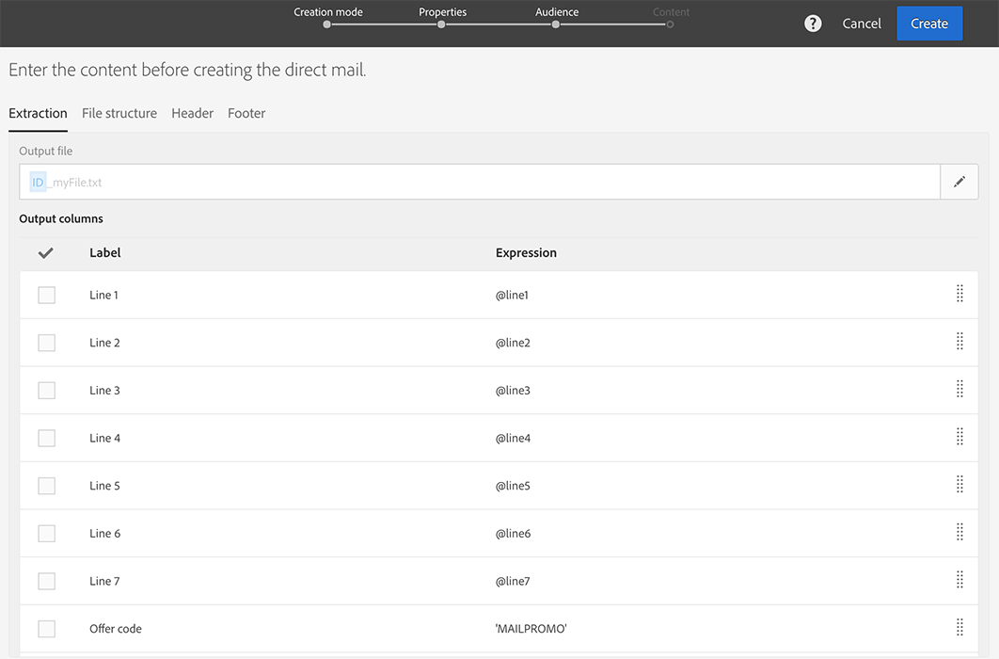

1. Click on the **Schedule** section of the delivery dashboard to define the contact date. For direct mail, the contact date is mandatory. For more information, refer to [Scheduling the send](../../sending/using/about-scheduling-messages.md).

   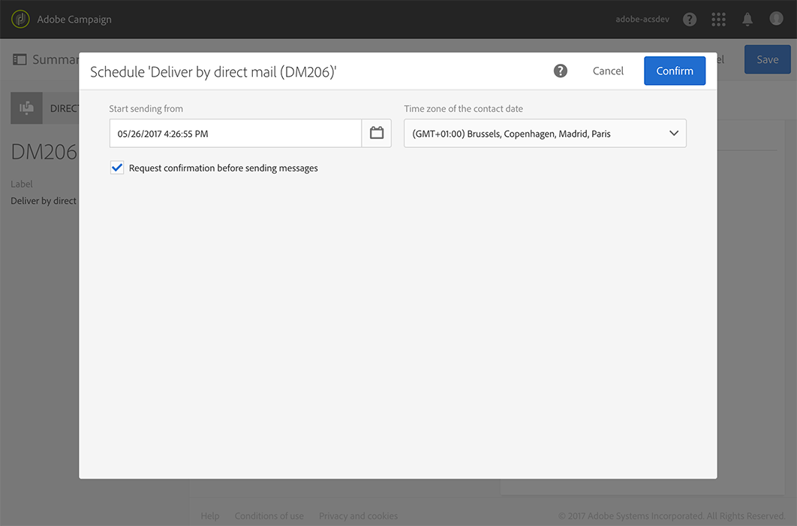

1. If you added test profiles (refer to [Adding test and trap profiles](../../channels/using/defining-the-direct-mail-audience.md#adding-test-and-trap-profiles)), you can test your delivery before preparing the final file. It allows you to create a sample file containing only the test profiles selected.

   Click on **Test** to generate the sample file. Click on **Summary**, in the top left corner, then select **Proofs**. On the left part of the screen, select the proof and click on **Download file**.

   >[!NOTE]
   >
   >The **Export** role is required to allow Adobe Campaign to export the file and make it available for download. Please contact your administrator.

   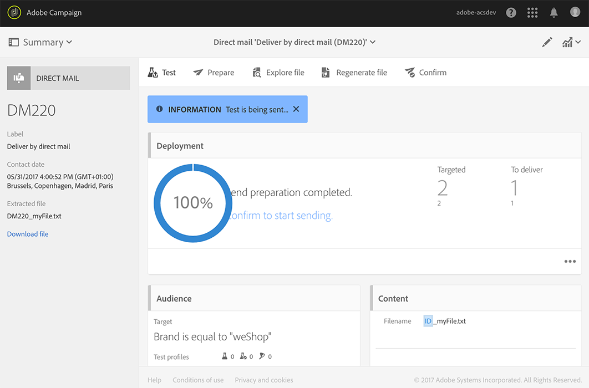

1. Once you have defined your delivery content, audience and contact date, click on the **Prepare** button, on the delivery dashboard.

   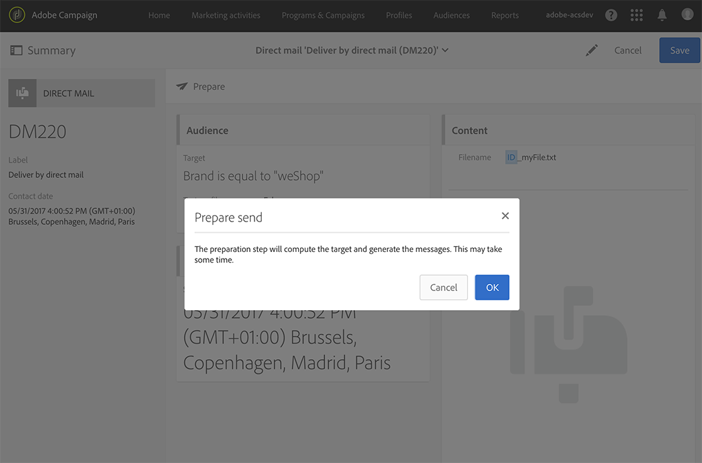

   Typology rules are applied. For example, all unspecified postal addresses are excluded from the target. This is why you need to make sure you have checked the **Address specified** box in your profiles' information (see [Recommendations](../../channels/using/about-direct-mail.md#recommendations)). If you have defined a **Maximum volume of message** in the direct mail properties or at the template level, it will also be applied here.

   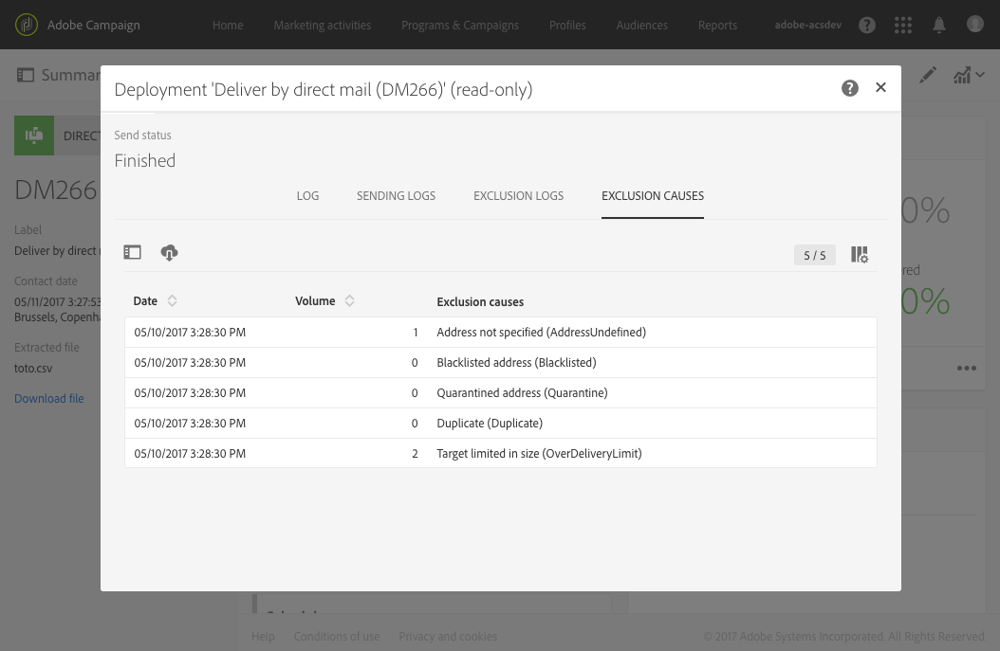

   >[!NOTE]
   >
   >You can set global cross-channel fatigue rules that will automatically exclude oversollicited profiles from campaigns. See [Fatigue rules](../../administration/using/fatigue-rules.md).

1. Click on **Explore file** to preview the first 100 lines of the file. 

   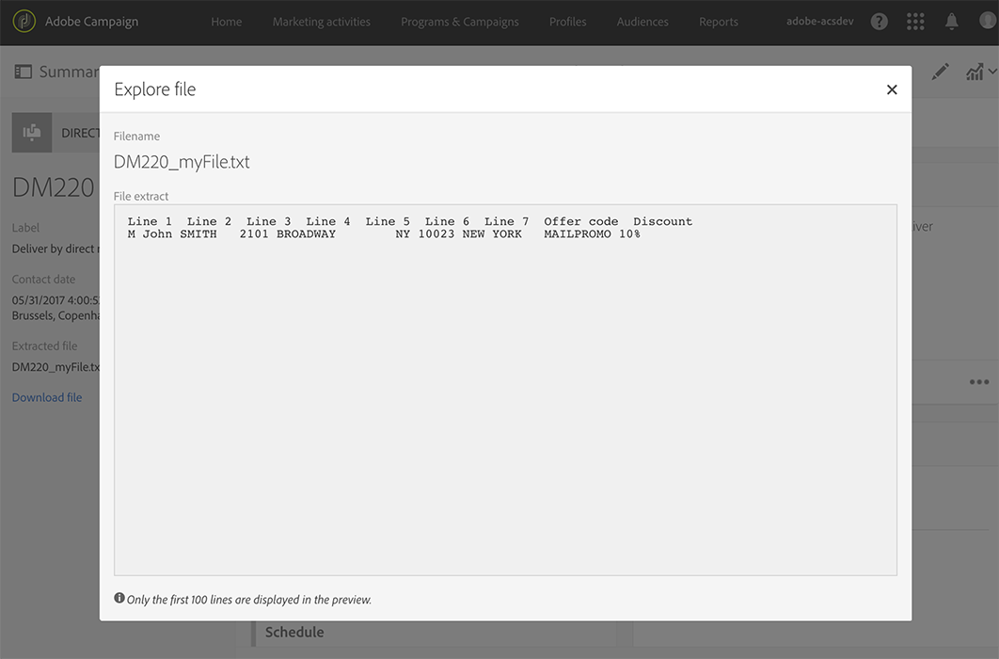

   The complete file is accessible for local download in the left part of the screen. Downloading the file generates a log entry in the **Export audits** menu. For more information on export audits, refer to the [Auditing exports](../../administration/using/auditing-export-logs.md) section.

   >[!NOTE]
   >
   >The **Export** role is required to allow Adobe Campaign to export the file and make it available for download. Please contact your administrator.

   If you need to change the delivery content, you only have to click on the **Regenerate file** button to take the change into account. No need to go through the preparation again. 

   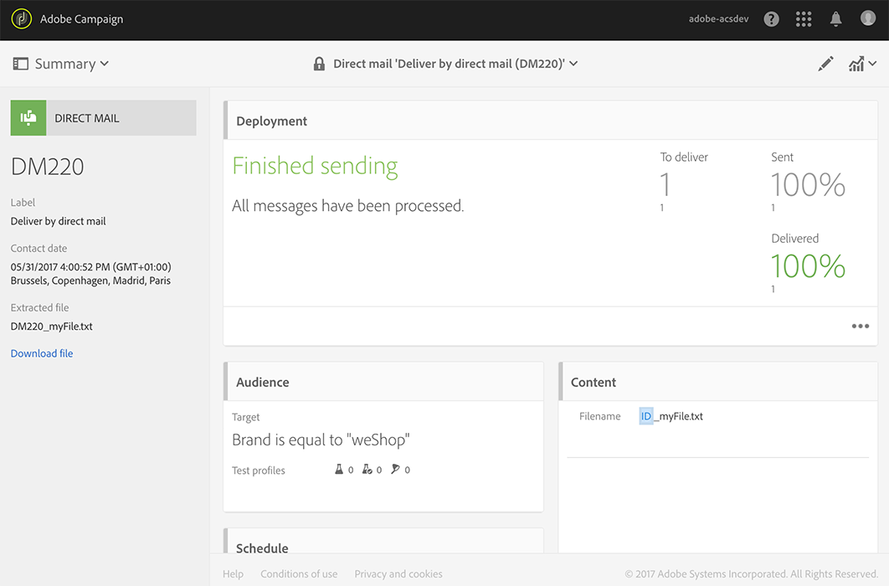

1. To confirm that the file is final, click on **Confirm** in the delivery dashboard.

   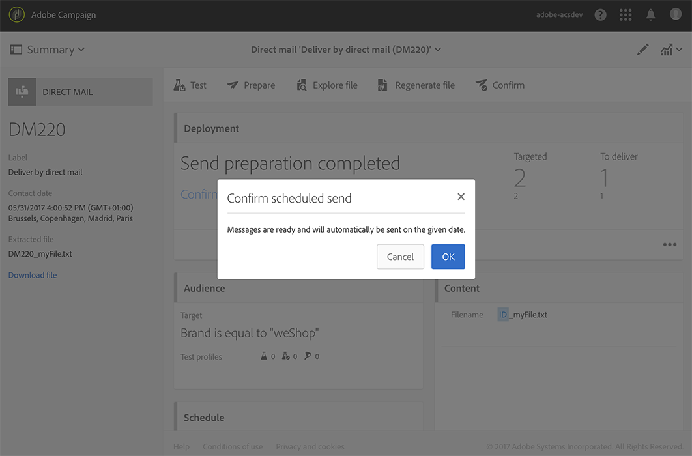

You are now ready to send the extraction file to your direct mail provider. For this, you have several options:

* Send it via a regular email, with the file attached
* Send it via Campaign: perform your direct mail within a campaign [workflow](../../automating/using/direct-mail-delivery.md) and add a **Transfer file** to send the file via FTP for example. See [Transfer file](../../automating/using/transfer-file.md).

The provider retrieves the list of erroneous addresses and sends this information to Adobe Campaign which automatically blacklists the erroneous addresses. See [Return to sender](../../channels/using/return-to-sender.md).
