# Customizing a push notification{#customizing-a-push-notification}

To fine-tune your push notification, Adobe Campaign allows you to access a set of advanced options while designing a push notification.

As an expert user, to configure mobile applications in Adobe Campaign, refer to the following technote [Understanding Campaign Standard Push Notifications Payload Structure](https://helpx.adobe.com/campaign/kb/understanding-campaign-standard-push-notifications-payload-struc.html).

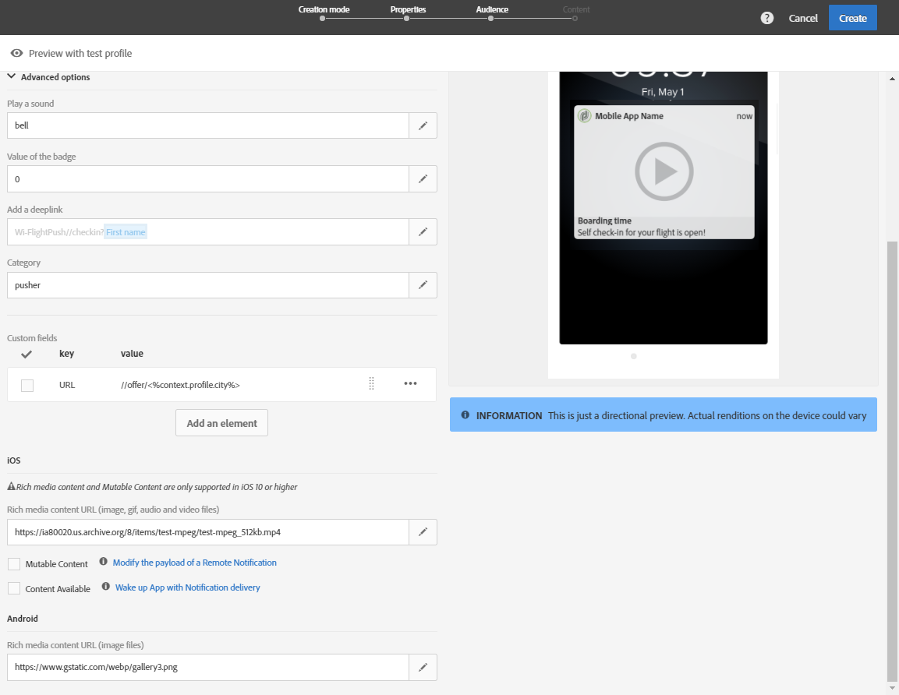

**Related content:**

* [Push notification report](../../reporting/using/push-notification-report.md)
* [Sending a push notification within a workflow](../../automating/using/push-notification-delivery.md)

## Play a sound {#play-a-sound}

The function **[!UICONTROL Play a sound]** gives the application the ability to play sounds on your device with the delivery of a push notification, when the app isn't running.

A sound will alert users of a push notification, giving it more visibility. To include a sound in your mobile app:

1. Open the push notification and access the **[!UICONTROL Advanced options]** section.
1. In the **[!UICONTROL Play a sound]** field, enter the filename of the sound file, without the extension, to be played by the mobile device when the notification is received.

   For more information on supported media formats, refer to [Apple](https://support.apple.com/kb/PH16864?locale=en_US) and [Android](https://developer.android.com/guide/topics/media/media-formats) documentations.

   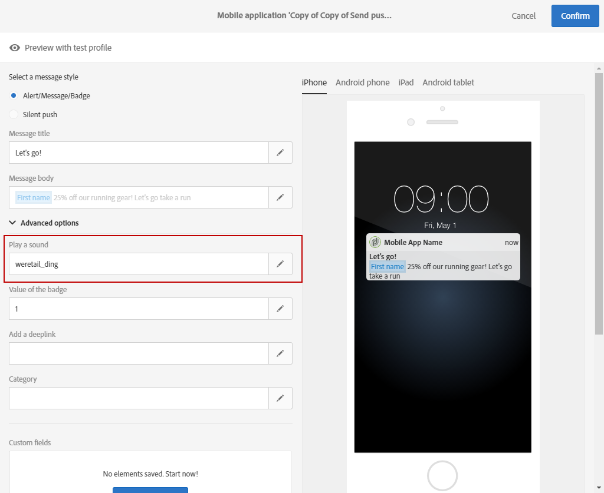

1. The sound file plays when delivering the notification if the file is defined in the mobile application's package. You can set it to **default** to play the device's default sound. 

   If the **[!UICONTROL Play a sound]** field is left empty, no sound will be played.

The user will then receive the push notification and the sound only if his phone is not muted.

## Refresh the badge value {#refresh-the-badge-value}

A badge is used to display directly on the application icon the number of new unread information. The badge value will disappear as soon as the user opens or reads the new content from the application.

When a notification is received on a device, it can refresh or add a badge value for the related app. To send a badge value from Server side:

1. Open the push notification and access the **[!UICONTROL Advanced options]** section.
1. The badge value must be an integer and can be updated different ways:

    * To refresh the badge, enter 0 in the **[!UICONTROL Value of the badge]** field. This will remove the badge from the application icon.
    * To add a badge value, enter any number in the **[!UICONTROL Value of the badge]** field. This number will automatically appear in the badge as soon as the user received the push notification.
    * If the field is empty or does not contain an integer, the badge value will not change.

   Here, we entered 1 in the **[!UICONTROL Value of the badge]** field to let the users know that they have a new information in their application. 

   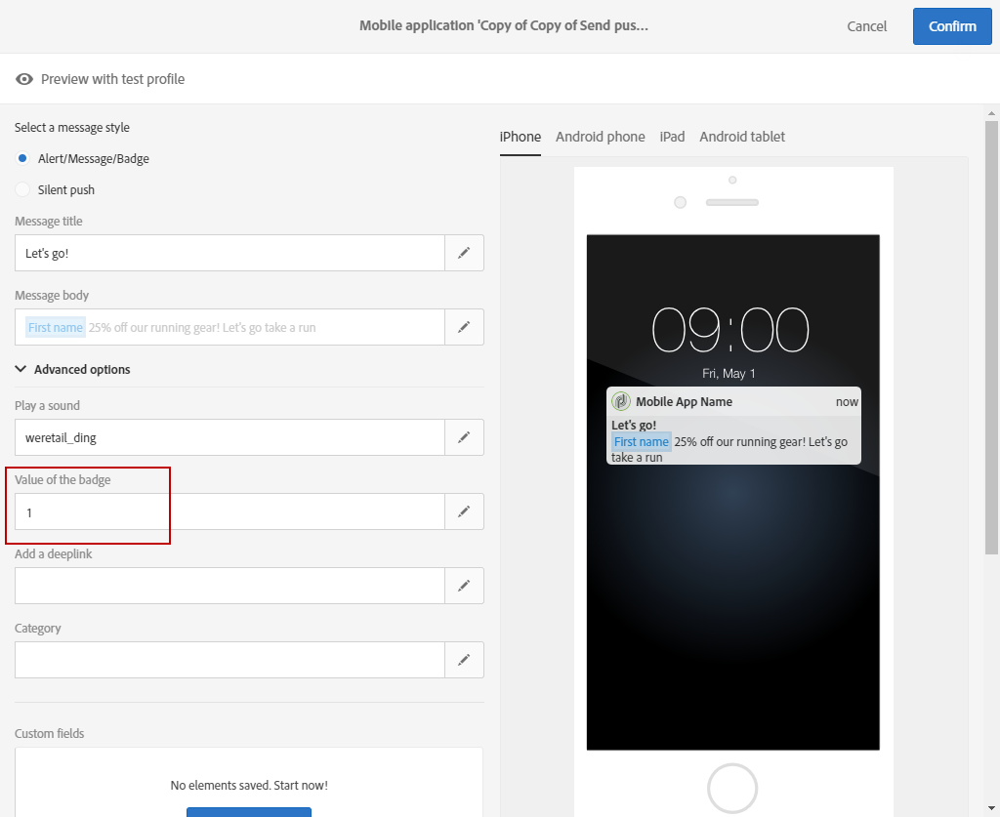

1. After sending your message, users will receive the push notification and their application will automatically display the new badge value.

   

## Add a deeplink {#add-a-deeplink}

A deeplink enables you to bring the users directly to content located inside the application (instead of opening a web browser page).

A deeplink can include personalization data for a custom in-app experience. For example, recipients' first names are automatically filled in on the page that the application directs them to.

To add a deeplink in a push notification:

1. Open the push notification and access the **[!UICONTROL Advanced options]** section.
1. Enter the link in the **[!UICONTROL Add a deeplink]** field.

   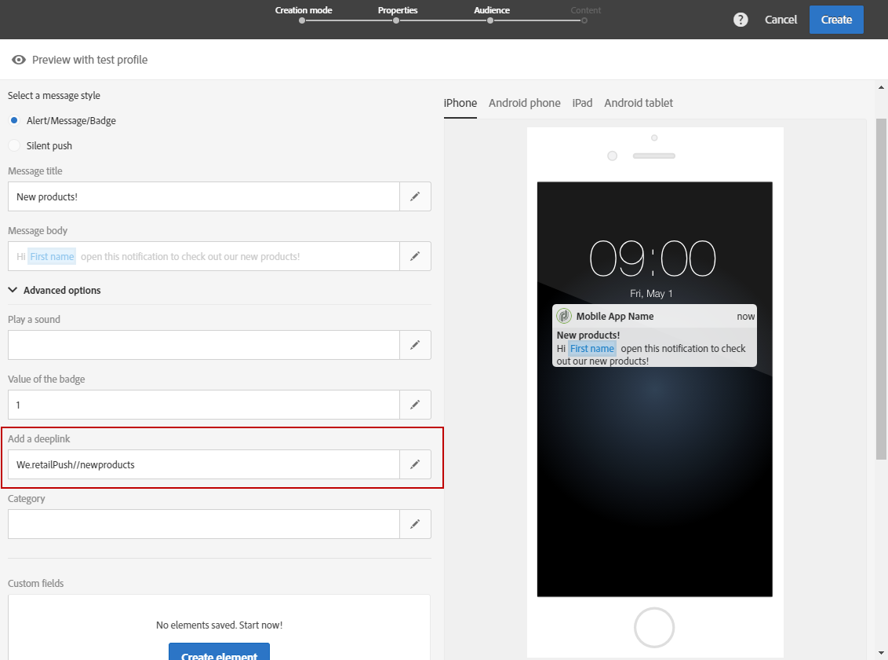

1. After sending your message, the users will receive the push notification and access the specific page in the app by interacting with the notification e.g. tapping or clicking the call to action button.

   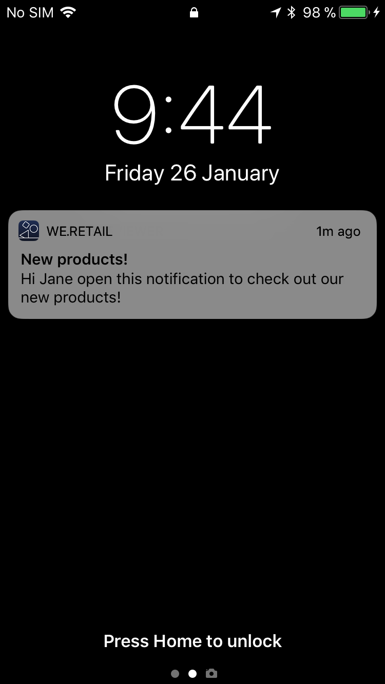

## Define an action {#define-an-action}

You can add a category ID if available in the mobile application, and then display action buttons. These notifications give the user a faster way to perform different tasks in response to a notification without opening or navigating in the application.

The dialog which appears on the user's phone requires a decision to proceed. When the user selects one of the actions, the system notifies the application so that it can perform any associated tasks.

To add a category in a push notification:

1. Open the push notification and access the **[!UICONTROL Advanced options]** section.
1. Enter a predefined category name in the **[!UICONTROL Category]** field to display actionable buttons when the push notification is received.

   The mobile application developer must define the category ID and the buttons' expected behavior in the application. For more on this, refer to the [Apple Developer documentation](https://developer.apple.com/library/content/documentation/NetworkingInternet/Conceptual/RemoteNotificationsPG/SupportingNotificationsinYourApp.html) (**Configuring Categories and Actionable Notifications** section) or the [Android Developer documentation](https://developer.android.com/guide/topics/ui/notifiers/notifications.html).

   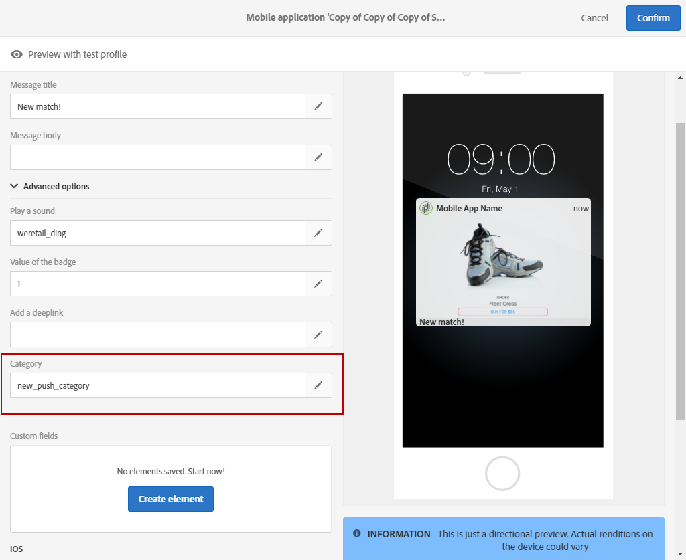

1. After sending your push notification, users receive it and have to take action with the previously configured actionable buttons.

   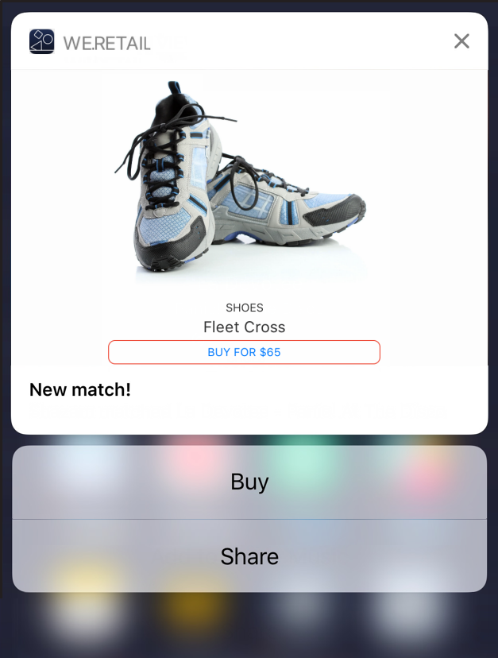

Depending on the user's action, the application will be notified so that it can perform any associated tasks.

## Add an expiration date {#add-expiration-date}

Setting an expiration date to your push notification allows you to set a specific expiration date where the message will no longer be sent by Apple ([APNS](https://developer.apple.com/documentation/usernotifications/setting_up_a_remote_notification_server/sending_notification_requests_to_apns)) or Android ([FCM](https://firebase.google.com/docs/cloud-messaging/concept-options)).

To add an expiration date to your push notification:

1. Check the **[!UICONTROL Expire message]** option: by selecting the **[!UICONTROL Expire message]** option, the duration is automatically set to 0. If you do not change the value, both APNS and FCM will try to send the message immediately. If it fails, the message will not be resent.

1. In the **[!UICONTROL Duration]** field, select the validity of your push notification.

   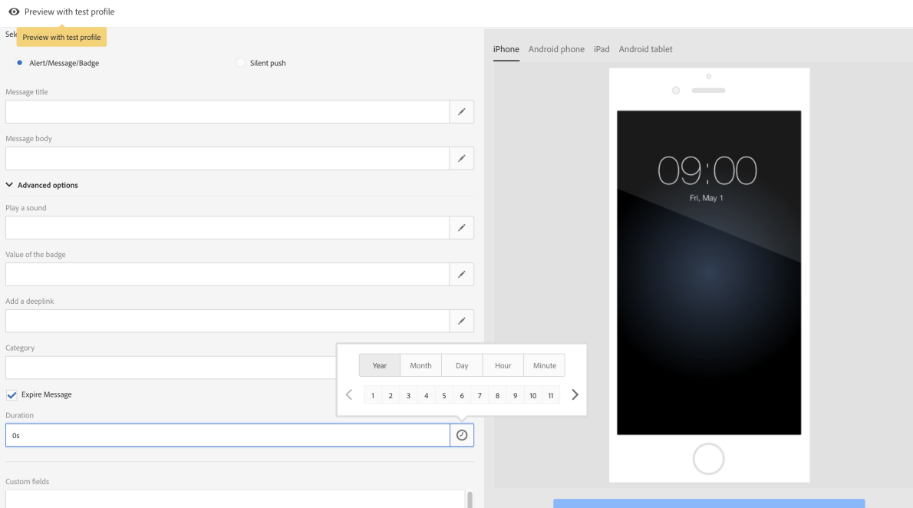

1. After sending your push notification, if the user didn't receive it right away due to the phone not being on or not having a signal, the push will still be sent within the expiration date time slot.

Note that if the push notification has not been sent before the expiration date, it will be discarded.

## Add custom fields {#add-custom-fields}

Custom fields allow you to pass custom data in the payload in the form of a key value pair. This option can be used to pass additional data to the application beyond the pre-defined keys.

To do so:

1. Open the push notification and access the **[!UICONTROL Advanced options]** section.
1. In the **[!UICONTROL Custom fields]** category, click the **[!UICONTROL Add an element]** button.
1. Enter your **[!UICONTROL Keys]** then the **[!UICONTROL Values]** associated with each key.

   

1. The handling and purpose of custom fields is entirely up to the mobile app. In the below push notification, custom fields have been used by the app to display button labels for the push notification.

   

## Add rich media content {#add-rich-media-content}

Rich media content allows you to have a better user engagement meaning that your user will be more inclined to open your push notification.

You can include an image, gif, audio or video file that will be played or displayed in the notification itself. Your app users will not have to open the application to see it.

To include rich media in the push notification:

1. Open the push notification and access the **[!UICONTROL Advanced options]** section.
1. Enter the URL of your file in the **[!UICONTROL Rich media content URL]** field for each format: iOS and Android.

   For iOS 10 or higher, you can insert image, gif, audio and video files. For earlier iOS versions, the push notification will be displayed without rich content. For detailed steps on how to display an image from an Adobe Campaign push notification on an iOS device, refer to this [page](https://helpx.adobe.com/campaign/kb/display-image-push.html).

   For Android, you can only include images.

   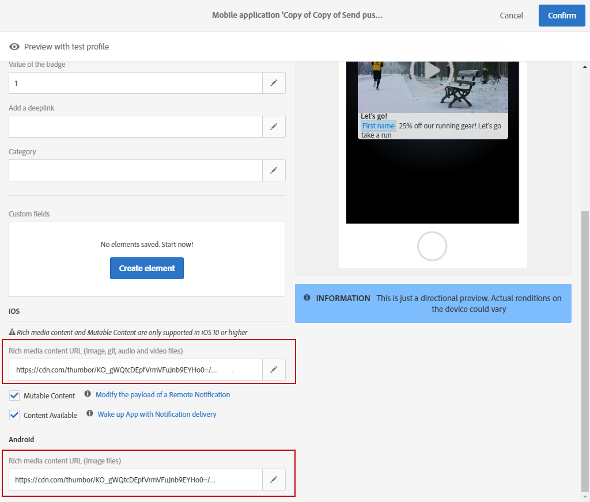

1. After sending your message, the user will receive your push notification and can view the rich media content.

   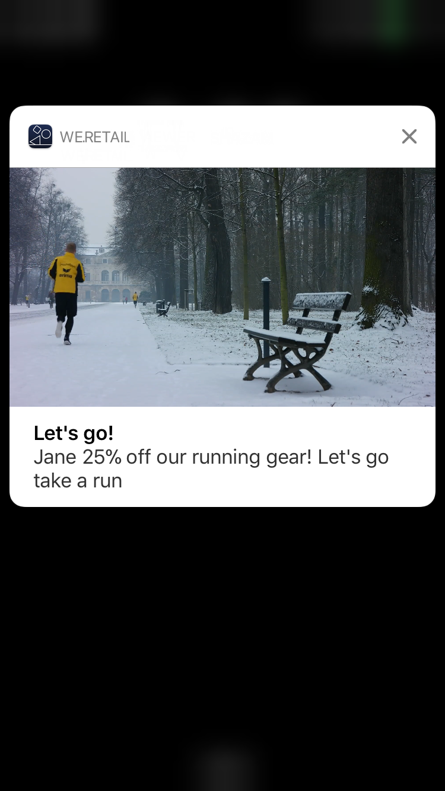

## Change the notification behavior for iOS {#change-the-notification-behavior-for-ios}

For iOS 10 or higher, two additional options are available in the **[!UICONTROL Advanced options]** section of push notifications: **[!UICONTROL Mutable content]** and **[!UICONTROL Content available]**.

When the **[!UICONTROL Mutable content]** option is checked and/or a Rich media content URL is added, the mutable-content flag will be sent in the push payload and will allow the push notification content to be modified by a notification service application extension provided in iOS SDK. For more on this, refer to [Apple developer documentation](https://developer.apple.com/library/content/documentation/NetworkingInternet/Conceptual/RemoteNotificationsPG/ModifyingNotifications.html).

You can then leverage your mobile app extensions to further modify the content or presentation of arriving push notifications sent from Adobe Campaign. For example, users can leverage this option to:

* Decrypt data that was delivered in an encrypted format
* Download images or other media files and add them as attachments to a notification
* Change the body or title text of a notification 
* Add a thread identifier to a notification

When **[!UICONTROL Content available]** is checked, the content available flag will be sent in the push payload to ensure that the app is woken up as soon as it receives the push notification, meaning that the app will be able to access the payload data. This works even if the app is running in the background and without needing any user interaction (e.g. tapping on Push notification), however, this does not apply if the app is not running. For more on this, refer to the [Apple developer documentation](https://developer.apple.com/library/content/documentation/NetworkingInternet/Conceptual/RemoteNotificationsPG/CreatingtheNotificationPayload.html).

## Change the notification behavior for Android {#change-the-notification-behavior-for-android}

For Android, you can enter the URL of your file in the **Rich media content URL** field. Whereas with iOS version, for Android, you can only include images and not gif, audio or video files.

The **[!UICONTROL High priority]** checkbox allows you to set up a high or normal priority for your push notifications. For more information on message priority, refer to the [Google developer documentation](https://firebase.google.com/docs/cloud-messaging/concept-options#setting-the-priority-of-a-message).

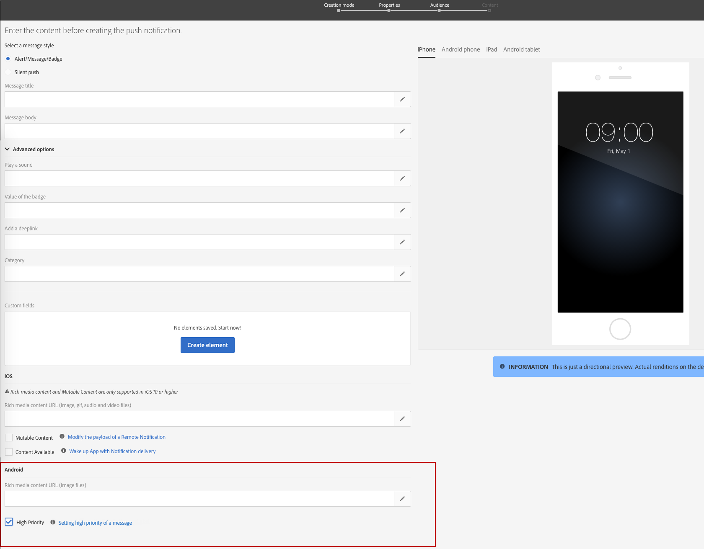
