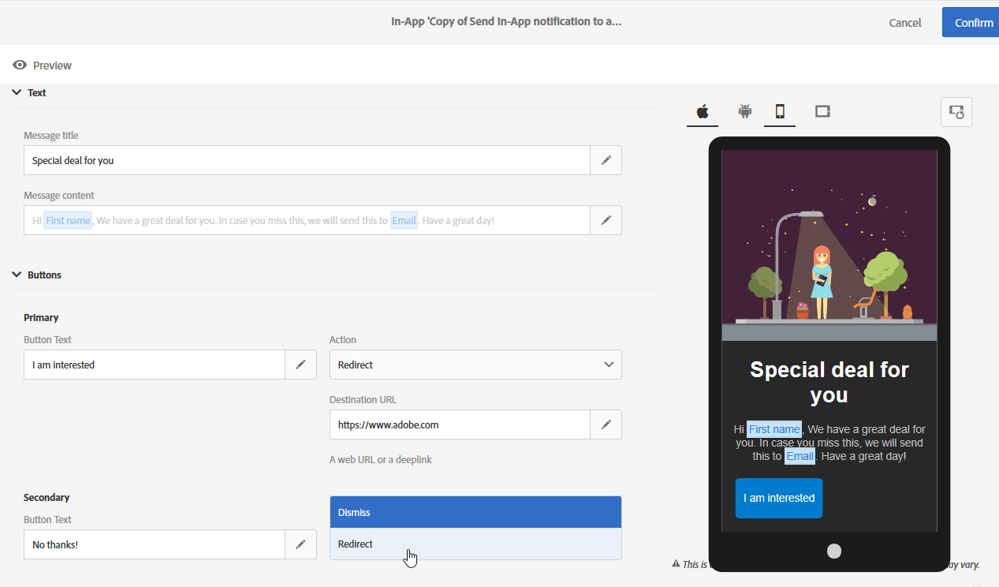
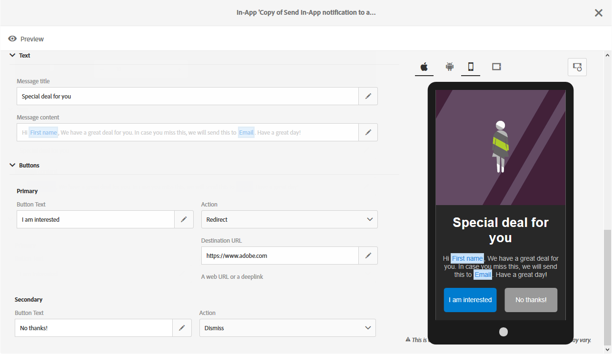

# Customizing an In-App message{#customizing-an-in-app-message}

Customizing an In-App message

To fine-tune your In-App message, Adobe Campaign allows you to access a set of advanced options while designing an In-App.

The In-App content editor lets you choose between two In-app message modes:

* [Message Template](../../channels/using/customizing-an-in-app-message.md#customizing-with-a-message-template): this template allows you to fully customize your In-App with images or videos and action buttons.
* [Custom Message](../../channels/using/customizing-an-in-app-message.md#customizing-with-a-custom-message): this template lets you import custom HTML.


## Customizing with a message template {#customizing-with-a-message-template}

### Layout {#layout}

The **Layout** drop-down provides you with four different options to choose from depending on your messaging needs:

* **Full page**: This type of layout covers the entire screen of your audience devices.

  It supports media (image, video), text and button components.

* **Large modal**: This layout appears in a large alert-style window, your application is still visible in the background.

  It supports media (image, video), text and button components.

* **Small modal**: This layout appears as a small alert type window, your application is still visible in the background.

  It supports media (image, video), text and button components.

* **Alert**: This type of layout appears as a native OS alert message.

  It can only support text and button components.

Each type of layouts can be previewed on different devices such as phone, tablet, platform e.g. Android or iOS and orientation e.g. landscape or portrait in the right-window of the content editor.


### Display {#display}

The Display drop-down allows you to add media to your In-App message which will draw your audience attention.

1. In the **Media** category, select your **Media Type** between image and video.
1. For the **Image** media type, enter your URL in the **Media URL** field based on the supported formats.

   If needed, you can also enter the path to a **Bundled image** which can be used if the device is offline.

   

1. For the **Video** media type, enter your URL in the **Media URL** field.

   Then, enter your **Video poster** to be used while the video is downloading on the audience devices or until users tap the play button.

   

1. In the **Settings** category, select your background color between light and dark.
1. Choose to display or not a close button with the **Show close button** option to provide users a way to dismiss the In-App message.
1. Select if your button alignment will be horizontal or vertical with the **Button alignment** option.
1. Choose if your In-App message can be auto-dismissed or not after a few seconds.

   

### Text {#text}

If needed, you can also add a message title and content to your In-App message. To better personalize your In-App message, you can add different personalization fields, content blocks and dynamic text to your content.

1. In the **Text** drop-down, add a title in the **Message title** field.

   

1. Add your content in the **Message content** field.
1. To further personalize your text, click the  

   icon to add personalization fields.

   

1. Type in your message content and add your personalization fields if needed.

   For more information on personalization field, refer to this [section](../../designing/using/inserting-a-personalization-field.md).

   

1. Check your message content in the preview window.

   

### Buttons {#buttons}

In-App message buttons prompt your audience to choose between one or two buttons associated with an action.

1. In the **Buttons** drop-down, enter the text of your first button in the **Primary** category.

   

1. Choose which of the two actions **Dismiss** and** Redirect** will be assigned to your primary button.
1. If you chose the **Redirect** action, enter your web URL or deeplink in the **Destination URL** field.

   

1. In the **Secondary** category, add a second button to your In-App if needed by entering your text.
1. Select the action associated to your second button.

   

1. Enter your web URL or deeplink in the **Destination URL** field, if you chose the **Redirect** action, 
1. Check your message content in the preview window or by clicking the Preview button.

   Refer to the [Previewing the In-App message](../../channels/using/sending-an-in-app-message.md#previewing-the-in-app-message) page.

   

## Customizing with a custom message {#customizing-with-a-custom-message}

>[!NOTE]
>
>Custom message does not support content personalization.

The **Custom message** mode allows you to directly import one of your pre-configured HTML message.

To do so, you just have to drag and drop or select your file from computer.

Your file must have a specific layout which can be found by clicking the **Download the sample file** option.


The following must be added to your HTML to better track the user's interaction with your In-app buttons:

* For the **Close** button:

  ```
  adbinapp://cancel?id={{{broadlogId}}},{{{deliveryId}}},5
  ```

* For the **Button 1**:

  ```
  adbinapp://confirm/?id={{{broadlogId}}},{{{deliveryId}}},3
  ```

* For the **Button 2**:

  ```
  adbinapp://confirm/?id={{{broadlogId}}},{{{deliveryId}}},4
  ```

You can also find a list of custom HTML requirements for a successful import in Adobe Campaign.


Once your HTML has been imported, you can find a preview of your file on different devices in the preview window.
