# Customizing an In-App message{#customizing-an-in-app-message}

To fine-tune your In-App message, Adobe Campaign allows you to access a set of advanced options while designing an In-App.

The In-App content editor lets you choose between two In-App message modes:

* [Message Template](../../channels/using/customizing-an-in-app-message.md#customizing-with-a-message-template): this template allows you to fully customize your In-App with images or videos and action buttons.
* [Custom Message](../../channels/using/customizing-an-in-app-message.md#customizing-with-a-custom-html-message): this template lets you import custom HTML.

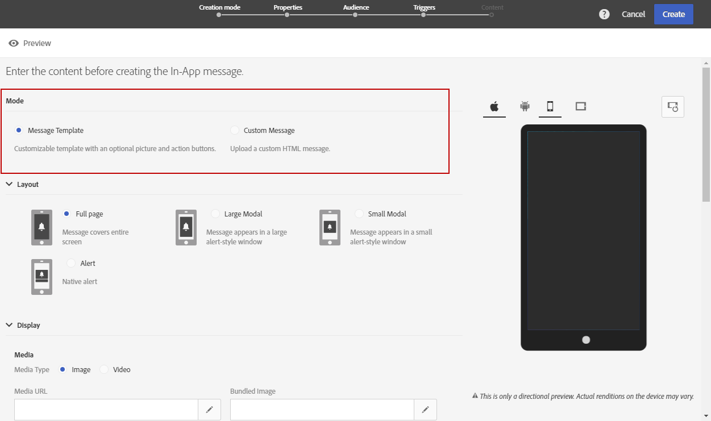

**Related content:**

* [Sending your In-App message](../../channels/using/preparing-and-sending-an-in-app-message.md#sending-your-in-app-message)
* [In-App reporting](../../reporting/using/in-app-report.md)

## Customizing with a message template {#customizing-with-a-message-template}

### Layout {#layout}

The **[!UICONTROL Layout]** drop-down provides you with four different options to choose from depending on your messaging needs:

* **[!UICONTROL Full page]** : This type of layout covers the entire screen of your audience devices.

  It supports media (image, video), text and button components.

* **[!UICONTROL Large modal]** : This layout appears in a large alert-style window, your application is still visible in the background.

  It supports media (image, video), text and button components.

* **[!UICONTROL Small modal]** : This layout appears as a small alert type window, your application is still visible in the background.

  It supports media (image, video), text and button components.

* **[!UICONTROL Alert]** : This type of layout appears as a native OS alert message.

  It can only support text and button components.

Each type of layouts can be previewed on different devices such as phone, tablet, platform e.g. Android or iOS and orientation e.g. landscape or portrait in the right-window of the content editor.

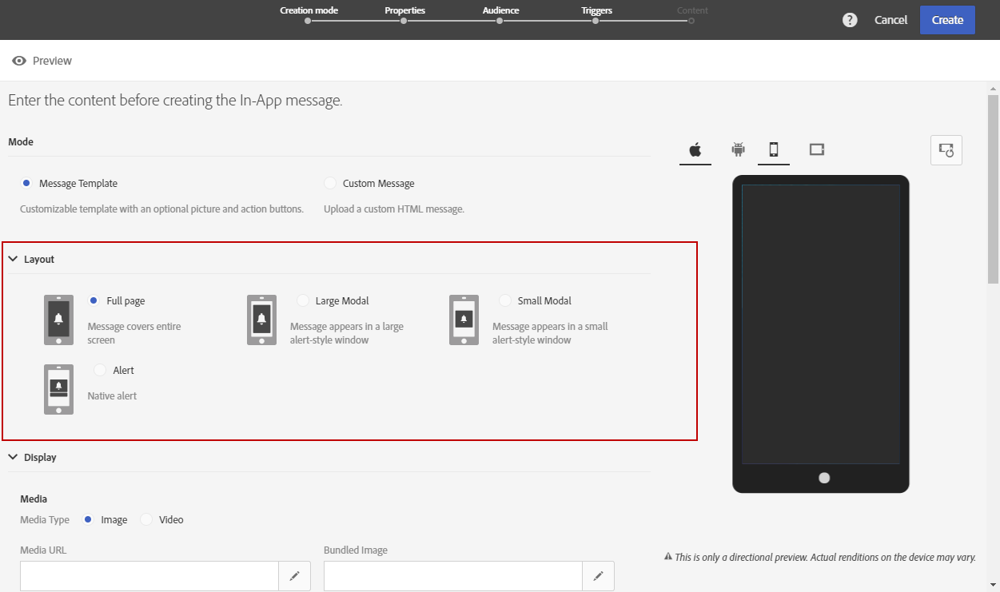

### Media {#media}

The **[!UICONTROL Media]** drop-down allows you to add media to your In-App message to create a compelling experience for end user.

1. Select your **[!UICONTROL Media Type]** between image and video.
1. For the **[!UICONTROL Image]** media type, enter your URL in the **[!UICONTROL Media URL]** field based on the supported formats.

   If needed, you can also enter the path to a **[!UICONTROL Bundled image]** which can be used if the device is offline.

   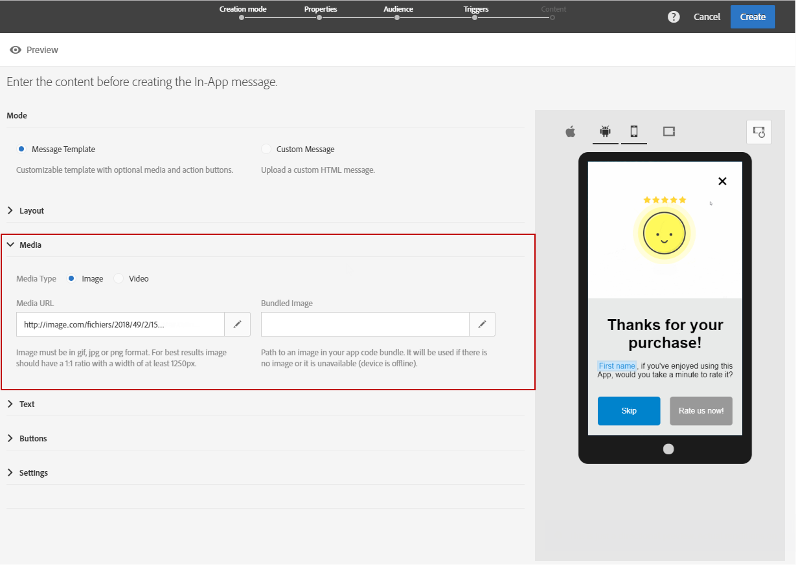

1. For the **[!UICONTROL Video]** media type, enter your URL in the **[!UICONTROL Media URL]** field.

   Then, enter your **[!UICONTROL Video poster]** to be used while the video is downloading on the audience devices or until users tap the play button.

   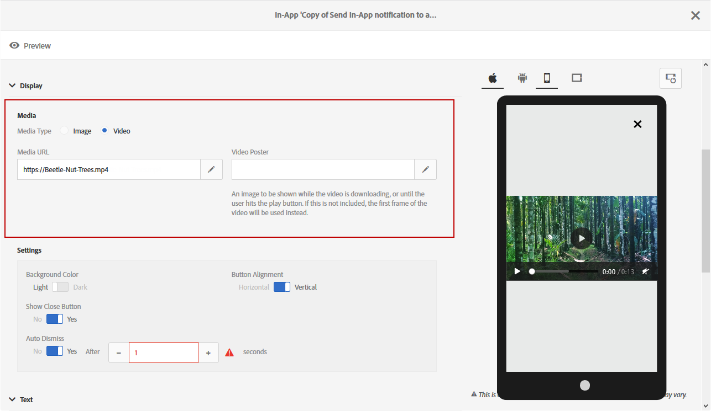

### Text {#text}

If needed, you can also add a message title and content to your In-App message. To better personalize your In-App message, you can add different personalization fields, content blocks and dynamic text to your content.

1. In the **[!UICONTROL Text]** drop-down, add a title in the **[!UICONTROL Message title]** field.

   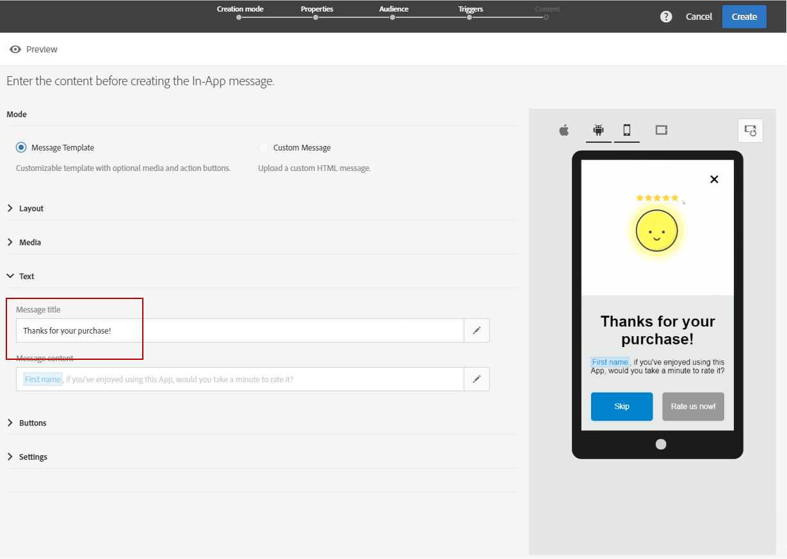

1. Add your content in the **[!UICONTROL Message content]** field.
1. To further personalize your text, click the  icon to add personalization fields.

   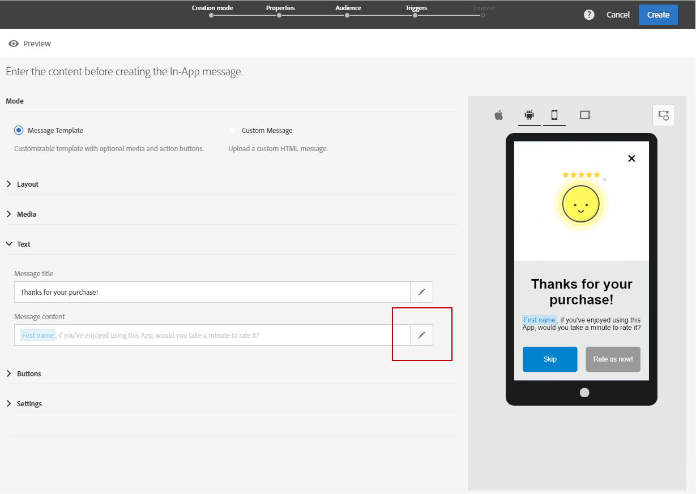

1. Type in your message content and add your personalization fields if needed.

   For more information on personalization field, refer to this [section](../../designing/using/inserting-a-personalization-field.md).

   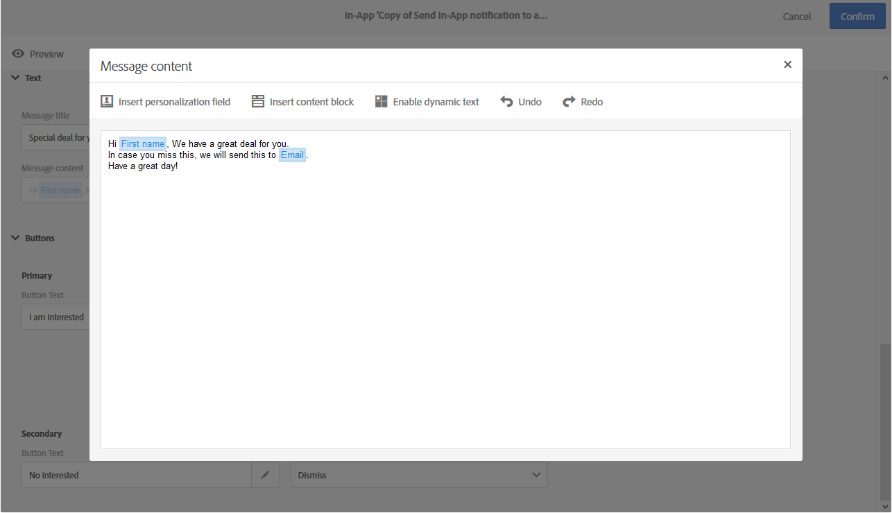

1. Check your message content in the preview window.

   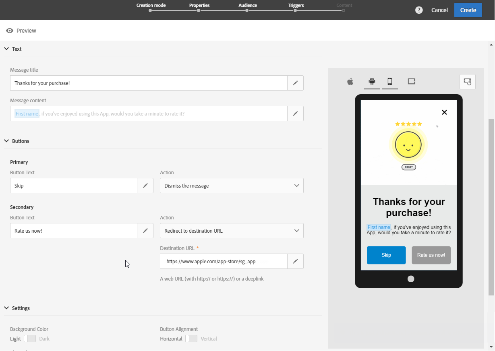

### Buttons {#buttons}

Your can add up to two buttons to your In-App message.

1. In the **[!UICONTROL Buttons]** drop-down, enter the text of your first button in the **[!UICONTROL Primary]** category.

   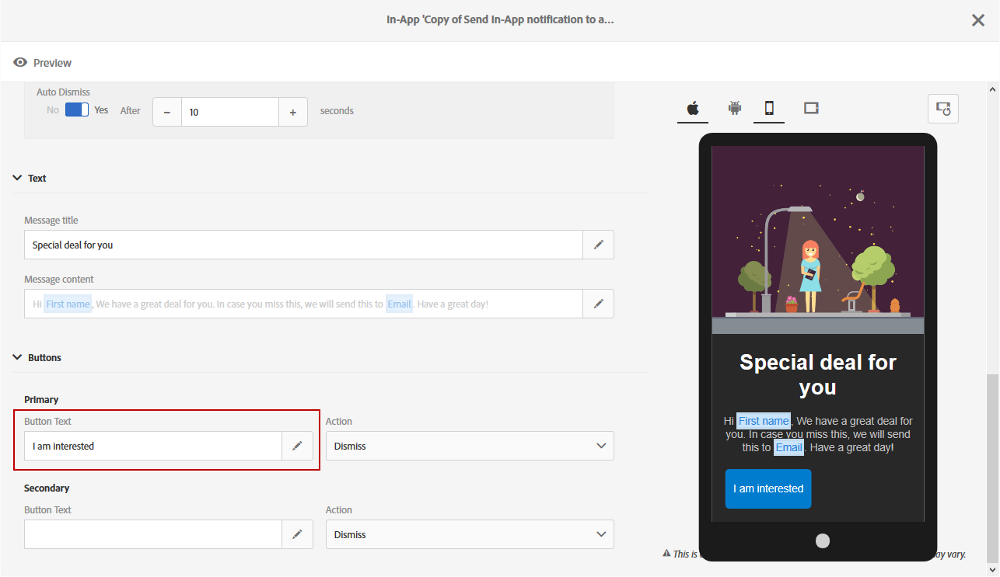

1. Choose which of the two actions **[!UICONTROL Dismiss]** and **[!UICONTROL Redirect]** will be assigned to your primary button.
1. In the **[!UICONTROL Secondary]** category, add a second button to your In-App if needed by entering your text.
1. Select the action associated to your second button.
1. If you chose the **[!UICONTROL Redirect]** action, enter your web URL or deeplink in the **[!UICONTROL Destination URL]** field.

   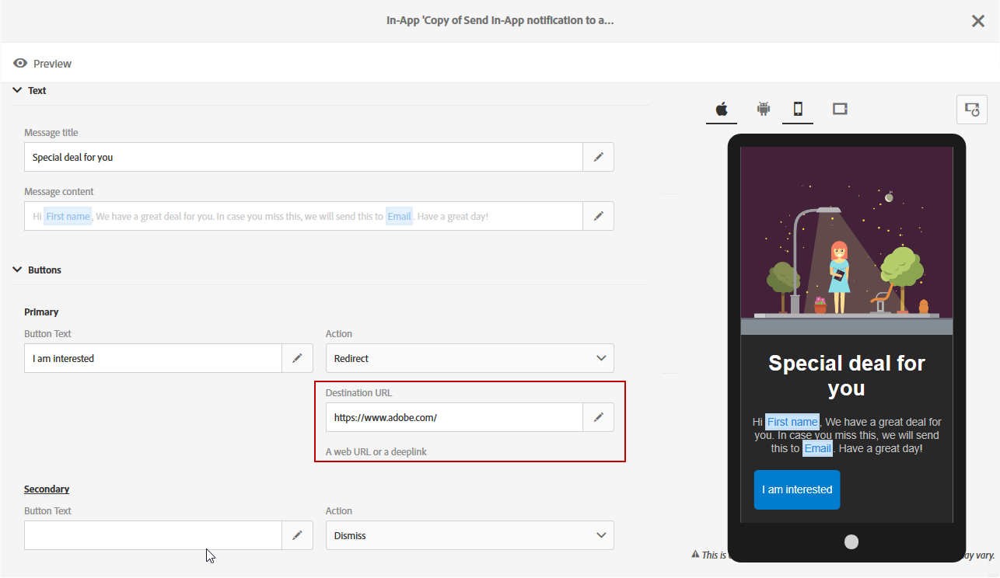

1. Enter your web URL or deeplink in the **[!UICONTROL Destination URL]** field, if you chose the **[!UICONTROL Redirect]** action, 
1. Check your message content in the preview window or by clicking the Preview button.

   Refer to the [Previewing the In-App message](../../channels/using/customizing-an-in-app-message.md#previewing-the-in-app-message) page.

   

### Settings {#settings}

1. In the **[!UICONTROL Settings]** category, select your background color between light and dark.
1. Choose to display or not a close button with the **[!UICONTROL Show close button]** option to provide users a way to dismiss the In-App message.
1. Select if your button alignment will be horizontal or vertical with the **[!UICONTROL Button alignment]** option.
1. Choose if your In-App message can be auto-dismissed or not after a few seconds.

   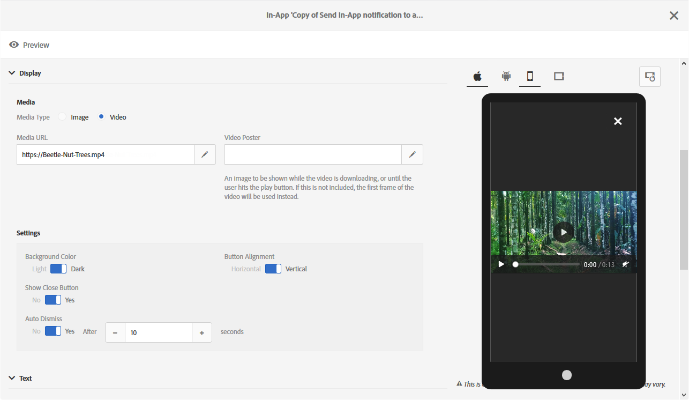

## Customizing with a custom HTML message {#customizing-with-a-custom-html-message}

>[!NOTE]
>
>Custom HTML message does not support content personalization.

The **[!UICONTROL Custom message]** mode allows you to directly import one of your pre-configured HTML message.

To do so, you just have to drag and drop or select your file from computer.

Your file must have a specific layout which can be found by clicking the **Download the sample file** option.

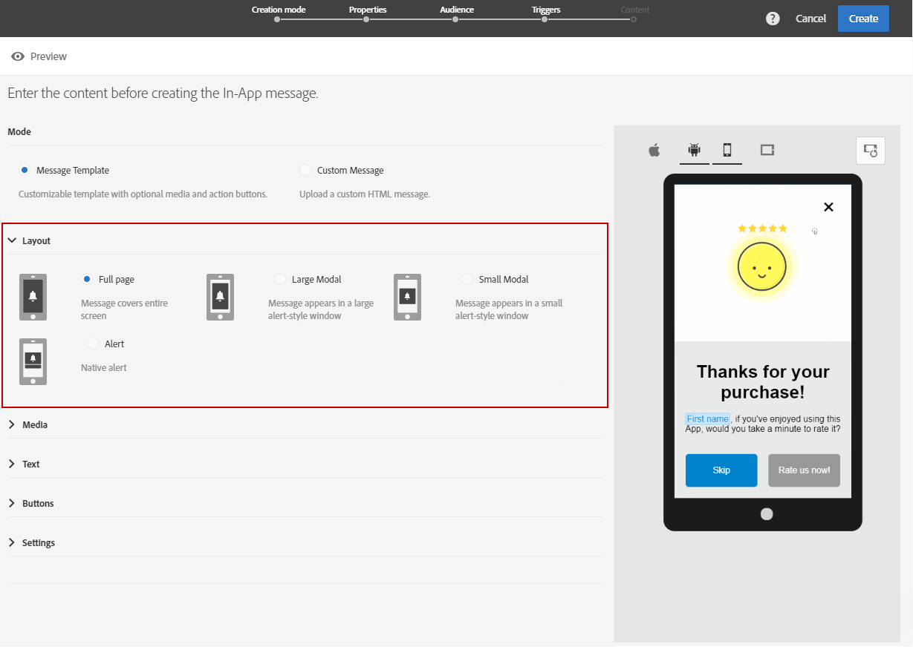

You can also find a list of custom HTML requirements for a successful import in Adobe Campaign.

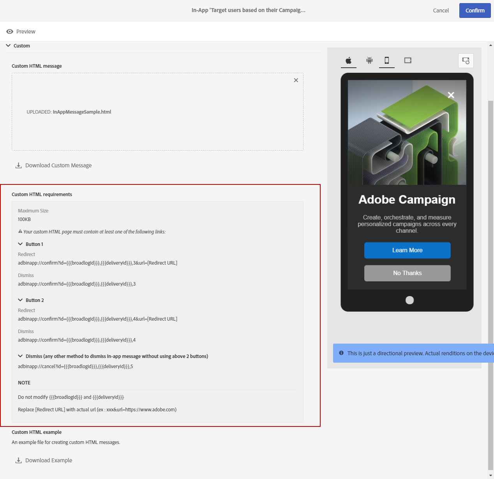

Once your HTML has been imported, you can find a preview of your file on different devices in the preview window.

## Previewing the In-App message {#previewing-the-in-app-message}

Before sending your In-App message, you can test with your test profiles to check what your targeted audience will see when they receive your delivery.

1. Click the **[!UICONTROL Preview]** button.

   

1. Click the **[!UICONTROL Select a test profile]** button and select one of your test profiles to start previewing your delivery. For more information on test profiles, refer to this [section](../../sending/using/managing-test-profiles-and-sending-proofs.md).
1. Check your message on different devices such as Android, iPhone phones or even tablets. You can also check if your personalization fields are retrieving the right data.

   

1. You can now send your message and measure its impact with delivery reports. For more on reporting, refer to [this section](../../reporting/using/in-app-report.md).

