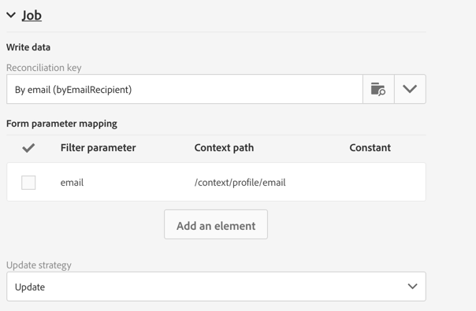

# Data storage and reconciliation{#data-storage-and-reconciliation}

Data storage and reconciliation

Data reconciliation parameters allow you to define how the data entered in the landing page is managed once it has been submitted by a user.

To do this:

1. Edit the landing page properties accessed via the   icon in the landing page dashboard, and display the **Job** parameters.

   

1. Select the **Reconciliation key**: these database fields (for example: email, first name, last name) are used to determine whether the visitor has a profile that is already known in the Adobe Campaign database. This allows you to update or create a profile, according to the update strategy parameters defined.
1. Define the **Form parameter mapping**: this section allows you to map the landing page field parameters and those used in the reconciliation key.
1. Select the **Update strategy**: if the reconciliation key recovers an existing database profile, you can choose for this profile to be updated with the data entered in the form or instead prevent this update.

