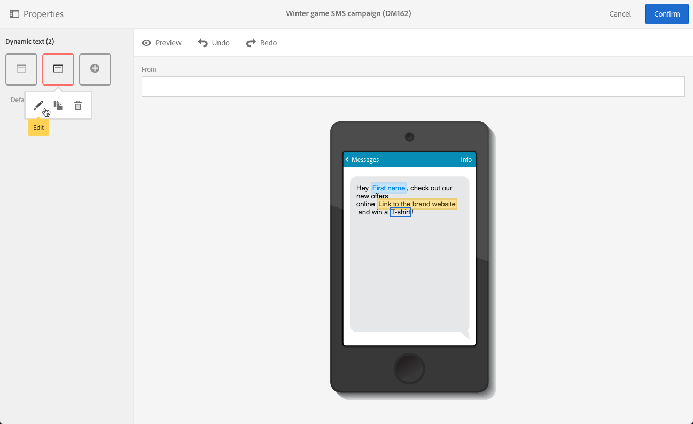
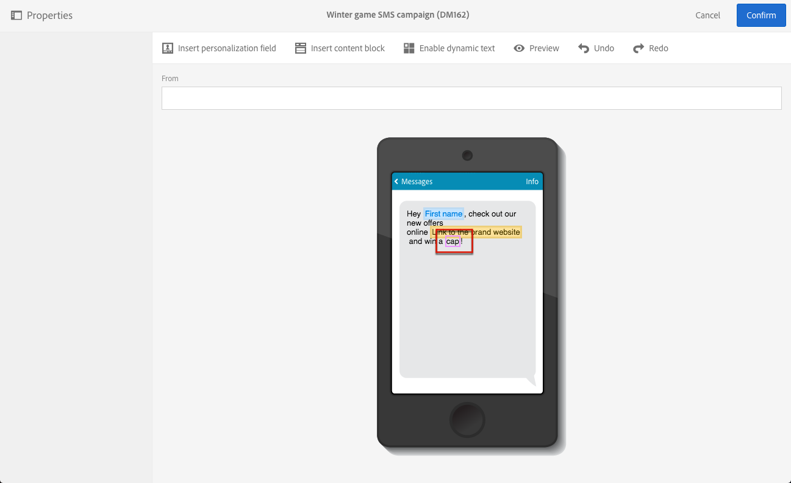

# Defining dynamic text{#defining-dynamic-text}

Dynamic text is defined in the same way as dynamic content. Refer to the [Defining dynamic content](../../designing/using/personalization.md#defining-dynamic-content-in-an-email) section.

>[!NOTE]
>
>For SMS and push, you can only define dynamic text. You can define both dynamic content and text in a landing page. If you want to define dynamic text with the [Email Designer](../../designing/using/designing-content-in-adobe-campaign.md), see [Defining dynamic content in an email](../../designing/using/personalization.md#defining-dynamic-content-in-an-email).

Note that surrogate pairs, characters not included in the Basic Multilingual Plane of the Unicode character set, cannot be stored in 2 bytes (16bits) and need to get encoded into 2 UTF-16 characters. These characters include some CJK ideographs, most emojis and some languages.
 These characters can cause some incompatibility issues in dynamic text. You need to perform strong tests before sending your messages.

The example below shows how to define dynamic text in an SMS message.

1. Select text in the body of your message or landing page.
1. Click **[!UICONTROL Enable dynamic text]**.

   

   The **[!UICONTROL Dynamic text]** option displays in the palette. It is configured in the same way as dynamic content.

1. Select a variant.

   

1. Define a condition for this variant.

   

Once a condition is defined for at least one variant, a purple frame is displayed around the dynamic text.

