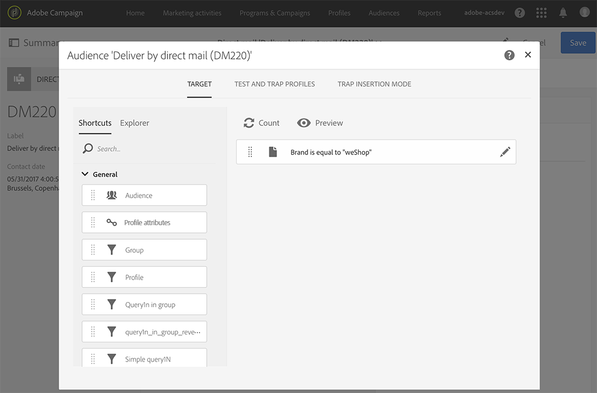

# Defining the direct mail audience{#defining-the-direct-mail-audience}

You can either define the audience in the creation wizard or by clicking on the **Audience** section of the delivery dashboard.

## Defining the main target {#defining-the-main-target}

For direct mail, the targeted profiles are the ones that will be included in the extraction file that you will send to your direct mail provider.

For each targeted profile a new line is added in the extraction file. The amount of profile information that will be included for each recipient is defined in the [Defining the extraction](../../channels/using/defining-the-direct-mail-content.md#defining-the-extraction) screen.

>[!CAUTION]
>
>Make sure that your profiles include a postal address as this information is essential to the direct mail provider. Also make sure you have checked the **[!UICONTROL Address specified]** box in your profiles' information. See [Recommendations](../../channels/using/about-direct-mail.md#recommendations).

## Adding test and trap profiles {#adding-test-and-trap-profiles}

Add test profiles so that you can test your file with a small number of profiles. It allows you to quickly create a file sample to test and validate the structure before preparing the actual file. Refer to [Managing test profiles and sending proofs](../../sending/using/managing-test-profiles-and-sending-proofs.md).

The use of traps is essential to direct mail deliveries. For instance, they allow you to verify that your direct mail provider is really sending the communication and that they are not sending your client list to another provider.

For direct mail deliveries, traps are added during extraction and mixed in the output document. By default, they are inserted in the sorting order of the output file, but you can choose to insert them at the end or the beginning of the file ( **[!UICONTROL Trap insertion mode]** tab).
