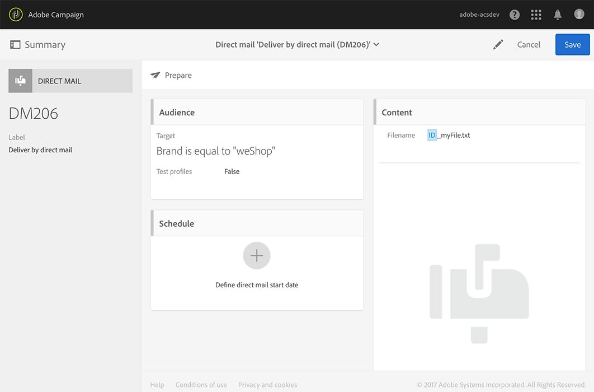
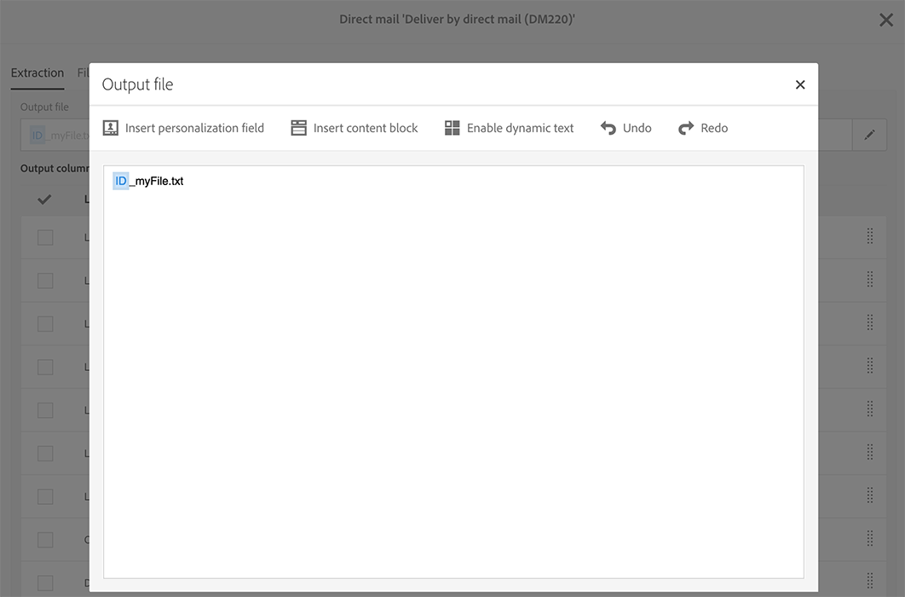
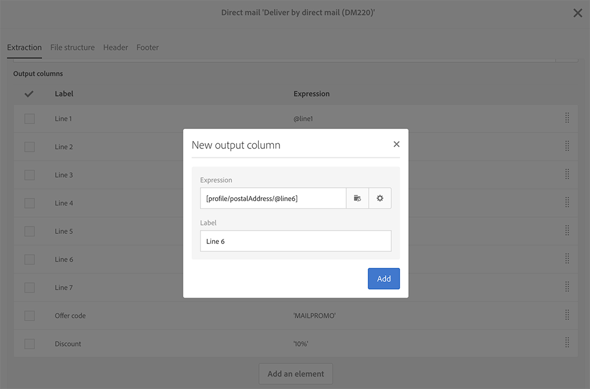
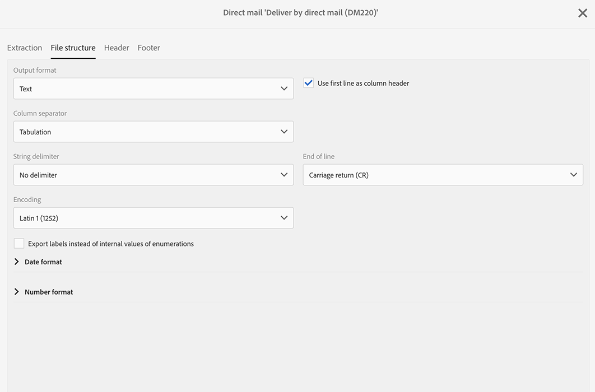
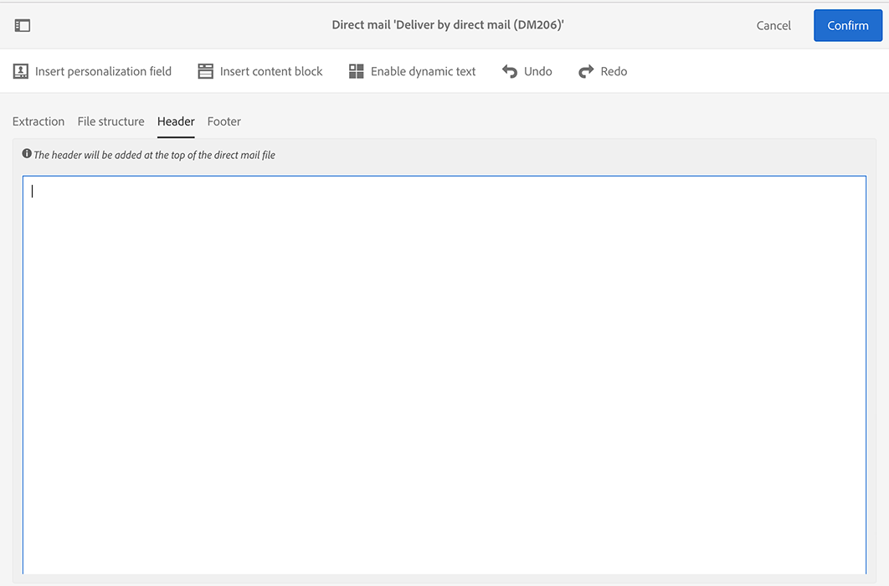
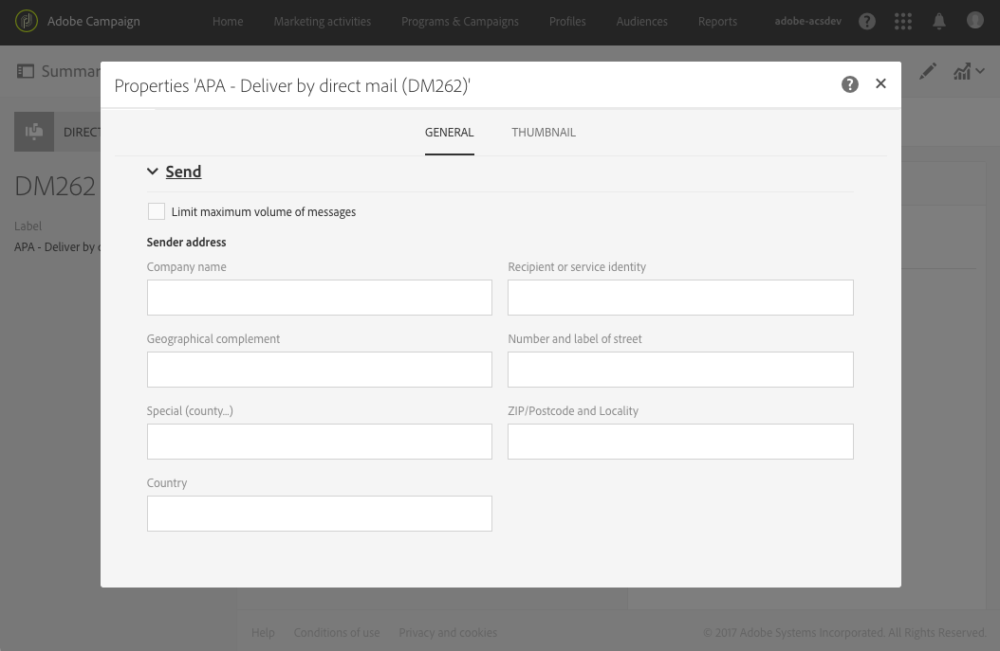

# Defining the direct mail content{#defining-the-direct-mail-content}

You can either define the content in the last screen of the creation wizard or by clicking on the **Content** section of the delivery dashboard.

The **[!UICONTROL Content]** definition screen is specific to the direct mail channel. It is divided into four tabs: **[!UICONTROL Extraction]**, **[!UICONTROL File structure]**, **[!UICONTROL Header]** and **[!UICONTROL Footer]**.

## Defining the extraction {#defining-the-extraction}

1. Start by defining the name of the extraction file. Click on the button to the right of the **[!UICONTROL Output file]** field and enter the desired label. You can use personalization fields, content blocks and dynamic text (see [Defining content](../../designing/using/personalization.md#example-email-personalization)). For example, you can complete the label with the delivery ID or the extraction date. 

   

1. Click the **[!UICONTROL +]** or **[!UICONTROL Add an element]** button to add an output column. The **[!UICONTROL Output columns]** let you define the profile information (columns) to be exported into the output file.

   >[!IMPORTANT]
   >
   >Make sure that your profiles include a postal address as this information is essential to the direct mail provider. Also make sure you have checked the **[!UICONTROL Address specified]** box in your profiles' information. See [Recommendations](../../channels/using/about-direct-mail.md#recommendations).

   

1. Create as many columns as you need. You can edit columns by clicking their expressions and labels.

>[!NOTE]
>
>For more information on output column definition, refer to the [Extract file](../../automating/using/extract-file.md) workflow activity section.

## Defining the file structure {#defining-the-file-structure}

The **File structure** tab allows you to configure the output, date, and number formats for the file that will be exported.

>[!NOTE]
>
>The available options are detailed in the [Extract file](../../automating/using/extract-file.md) workflow activity sections.

## Defining the header and footer {#defining-the-header-and-footer}

Sometimes you may need to add information at the beginning or at the end of the extraction file. For this, use the **[!UICONTROL Header]** and **[!UICONTROL Footer]** tabs of the **[!UICONTROL Content]** configuration screen. 

For example, you might want to include, for the direct mail provider, the sender information in the header of the file. It is possible to personalize the footer and header with information available in the context of the delivery. See [Defining content](../../designing/using/personalization.md#example-email-personalization).

The sender address is defined in the **[!UICONTROL Send]** section of the direct mail properties or at the template level.

