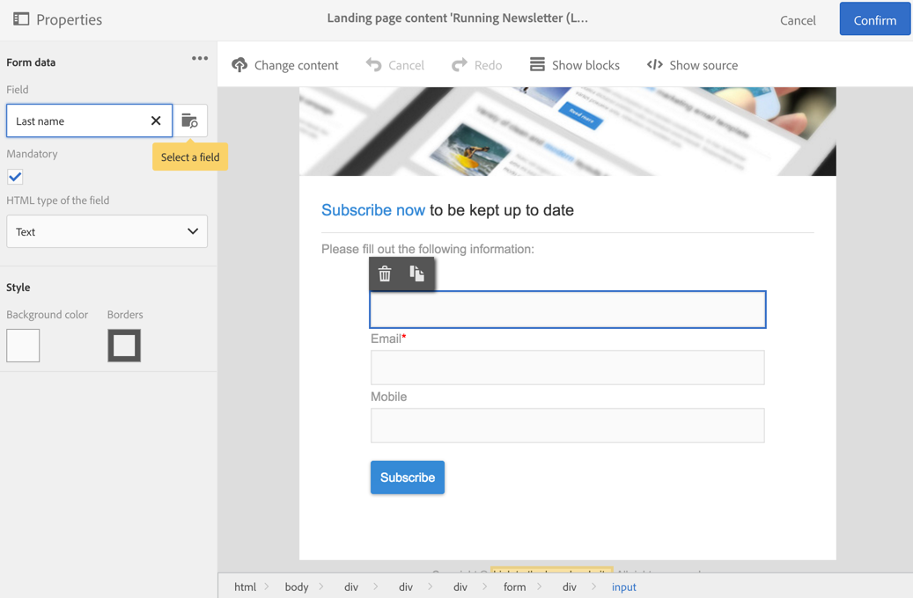
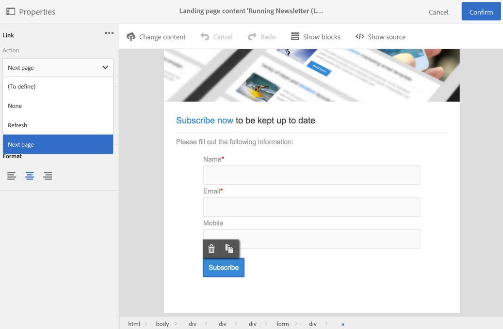
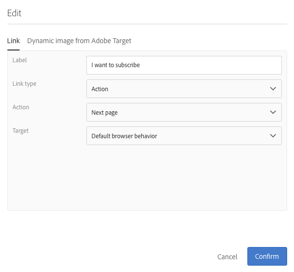
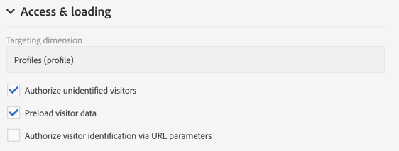
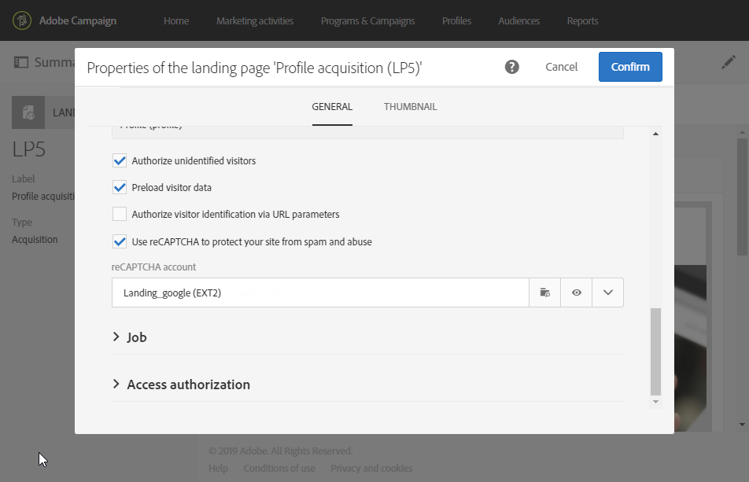

# Designing a landing page{#designing-a-landing-page}

## About content design {#about-content-design}

Landing pages are created as any [marketing activity](../../start/using/marketing-activities.md#about-marketing-activities).

When designing a landing page, you need to define the content of:

* the page itself,
* the confirmation page,
* the error page.

Use the switcher under the action bar to display and configure each of these pages.

The content of these pages is designed through Campaign content editor. Refer to [Design content](../../designing/using/about-landing-page-content-design.md).

## Mapping form fields {#mapping-form-fields}

Input fields are used to store or update data in Campaign database. For this, you need to link database fields with input zone, radio button, or checkbox type blocks. To do this:

1. Select a block in the landing page.
1. Complete the **[!UICONTROL Form data]** part in the palette.

   

1. Choose a database field to link with the form field in the **[!UICONTROL Field]** selection zone.

   When the **[!UICONTROL Mandatory]** option is checked, the page can only be submitted if the user has completed this field. If a mandatory field is not completed, an error message will appear when the user validates the page.

   >[!NOTE]
   >
   >Landing pages can only be mapped with **Profiles**.

1. Define the field type by choosing, for example **[!UICONTROL Text]** , **[!UICONTROL Number]** , or **[!UICONTROL Date]** in the **[!UICONTROL HTML type of the field]** selection area.

>[!NOTE]
>
>The default fields of the built-in landing pages are preconfigured. You can modify them as needed.

## Submitting the form {#submitting-the-form}

You can select the action to perform when the visitor clicks the submit button. To do this:

1. Select the submit button of the landing page.
1. Select the action in the drop-down list in the left panel. Possible actions are: **[!UICONTROL Refresh]** (to refresh the page) and **[!UICONTROL Next page]** (to display the confirmation page).

   

In addition, you can change the label of the button or configure a specific link. To do this:

1. Select the submit button.
1. Click on the  button in the left panel.
1. Enter the label of the button, select the type of link, its properties, and the target.

   

## Linking a form to a service {#linking-a-form-to-a-service}

You can link a form to a service so that profiles can subscribe to a specific service when validating the landing pages.

The parameters for linking a landing page allow you to specify the performed action type and whether the landing page is specifically linked to a single service or whether it is generic.

In order to select the service to link, you need to:

1. Edit the landing page properties accessed via the  icon in the landing page dashboard, and display the **[!UICONTROL Job]** parameters.

   

1. Choose **[!UICONTROL Subscription]** in the **[!UICONTROL Specific actions]** drop-down list.

   

1. Select **[!UICONTROL Specific service]** to link the landing page to a single service. Do not select this option if you would like to use several services with the landing page.

   Use the **[!UICONTROL Specified service in the URL]** option to allow the landing page to be used for several services. You therefore must reference the landing page when configuring the service.

### Confirm a landing page submission {#confirm-a-landing-page-submission}

When a landing page is submitted by a visitor, you can configure the actions triggered. To do this:

1. Edit the landing page properties accessed via the  icon in the landing page dashboard, and display the **[!UICONTROL Job]** parameters.

   

1. Under the **[!UICONTROL Specific actions]** section, select **[!UICONTROL Start sending message]** to determine the sending of an automatic message, for example to confirm subscription to a service. You need then to select an email delivery template.

   Note that if a confirmation message is already configured at the service level, you should not select one in this screen to avoid sending multiple confirmation messages. Refer to [Configure a service](../../audiences/using/creating-a-service.md). 

1. Create **[!UICONTROL Additional data]** to enable storing additional data when the landing page is being submitted. This data is not visible to people who visit the page. Only constant values are taken into account.

   

## Setting permissions and pre-loading data {#setting-permissions-and-pre-loading-data}

Access to a landing page can be restricted to identified visitors, who come from a link in a message sent by Campaign for example. In this case, you can preload their data in the landing page. To do this:

1. Edit the landing page properties accessed via the  icon in the landing page dashboard, and display the **[!UICONTROL Access & loading]** parameters. 

   

1. Select **[!UICONTROL Preload visitor data]** .

   If a visitor to the page corresponds to a profile in the database, their data is displayed in the form's fields that are mapped with the database data and the landing page's personalization elements are taken into account.

   

You can also:

* Use the URL parameters to identify the visitors, using the **[!UICONTROL Authorize visitor identification via URL parameters]** option: then you must choose the loading key and map the filter parameters with the parameters of the corresponding URL.
* Authorize any visitor to access the landing page, using the **[!UICONTROL Authorize unidentified visitors]** option.

## Setting Google reCAPTCHA {#setting-google-recaptcha}

You can set up Google reCAPTCHA V3 with your landing page to protect it from spam and abuse caused by bots. To be able to use it with your landing page, you first need to create an external account. For more information on how to configure it, refer to this [section](../../administration/using/external-accounts.md#google-recaptcha-external-account).

Once your Google reCAPTCHA V3 external account has been set up, you can add it to your landing page:

1. Before publishing your landing page, access the page properties accessed via the  icon from you landing page dashboard.

   

1. Unfold the **[!UICONTROL Access & loading]** menu.
1. Check the **[!UICONTROL Use reCAPTCHA to protect your site from spam and abuse]** option.
1. Select your previously created Google reCAPTCHA external account.

   

1. Click **[!UICONTROL Confirm]** .

Your landing page is now set up with Google reCAPTCHA which can be seen at the bottom of your page.

Google reCAPTCHA will then return a score based on users' interactions with your page. To check your score, connect to your [Google admin console](https://g.co/recaptcha/admin).
