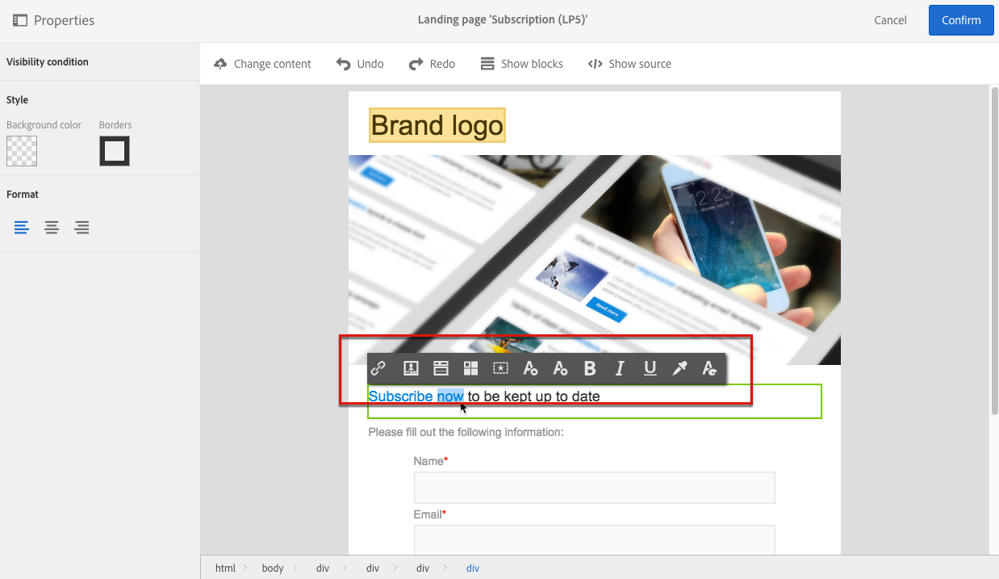
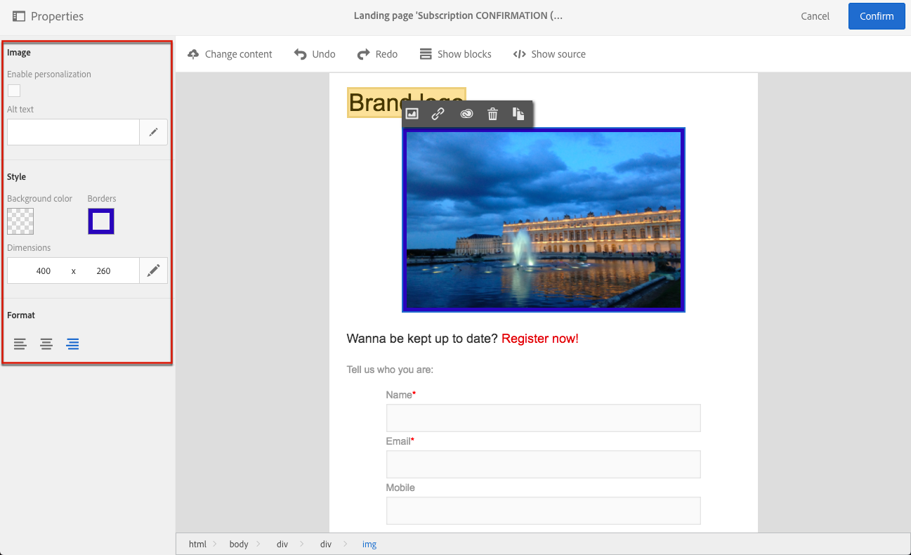

# Designing a landing page{#designing-a-landing-page}

## About landing page content design content design {#about-content-design}

Landing pages are created as any [marketing activity](../../start/using/marketing-activities.md#about-marketing-activities).

When designing a landing page, you need to define the content of the page itself, the confirmation page, and the error page. Use the switcher under the action bar to display and configure each of these pages.

The content of landing pages is designed through Campaign content editor.

>[!NOTE]
>
>If your instance was installed before the Adobe Campaign Standard 19.0 release, you still have access to the legacy email content editor. The interface, principles of use and configuration are mostly the same as described below for landing pages. However, all features may not be available or maintained in the legacy email content editor, which is deprecated starting 19.0 release. To quickly edit your email content through a drag and drop interface with extended functionalities, use the [Email Designer](../../designing/using/designing-content-in-adobe-campaign.md).

This page describes the specificities of the landing page content editor. For more on the actions that are common to one or more marketing activities, refer to these sections form the **Designing email content** guide:

* [Inserting a personalization field](../../designing/using/personalization.md#inserting-a-personalization-field)
* [Adding a content block](../../designing/using/personalization.md#adding-a-content-block).
* [Inserting a link](../../designing/using/links.md#inserting-a-link).
* [Inserting images](../../designing/using/images.md).
* [General best practices for content design](../../designing/using/designing-content-in-adobe-campaign.md#content-design-best-practices).

>[!NOTE]
>If you have a landing page that is already predefined in HTML format, you can import it directly using the **[!UICONTROL Change content]** button.
>
>Before importing an HTML page in Adobe Campaign, make sure it opens and displays correctly in the various browsers. If the HTML page contains JavaScript scripts, they need to execute without errors outside of the editor. In general, avoid using scripts in message content to make sure it is correctly processed by email clients.

## Landing page content editor interface{#landing-page-content-editor-interface}

The landing page content editor allows you to easily define, modify, and personalize content in Adobe Campaign. To access it, click the **[!UICONTROL Content]** block in a landing page dashboard.

The content editor is organized into three different sections. These sections allow you to view and edit the content.

1. The **palette** on the left-hand side of the screen allows you to modify the general options linked to a selected block. The options that can be modified are: background color, border, text alignment, visibility condition, etc. See [Inserting a personalization field](../../designing/using/personalization.md#inserting-a-personalization-field).
1. The **action bar** contains the general options for the page. You can select a template and change the display mode.
1. The main **editing zone** allows you to directly interact with the content using the contextual toolbar: insert a link into an image, change the font, delete a field, etc.

The **action bar** contains different buttons that allow you to interact with the content that is being created.

<table> 
 <thead> 
  <tr> 
   <th> Icon  </th> 
   <th> Button name  </th> 
   <th> Channel  </th> 
   <th> Description  </th> 
  </tr> 
 </thead> 
 <tbody> 
  <tr> 
   <td>    </td> 
   <td> Change content   </td> 
   <td> Landing page and email  </td> 
   <td> Allows you to select out-of-the-box content or import your own HTML content. Refer to <a href="../../designing/using/using-existing-content.md">Loading an existing content</a>.  </td> 
  </tr> 
  <tr> 
   <td>    </td> 
   <td> Undo   </td> 
   <td> All  </td> 
   <td> Cancels the last action carried out.  </td> 
  </tr> 
  <tr> 
   <td>    </td> 
   <td> Redo   </td> 
   <td> All  </td> 
   <td> Redoes the last action that you canceled.  </td> 
  </tr> 
  <tr> 
   <td>    </td> 
   <td> Show blocks   </td> 
   <td> Landing page and email  </td> 
   <td> Allows you to show the boxes around the content blocks (corresponds to the <strong>&lt;div&gt;</strong> HTML tag).  </td> 
  </tr> 
  <tr> 
   <td>    </td> 
   <td> Show source   </td> 
   <td> Landing page and email  </td> 
   <td> Allows you to show the HTML source code of the page.  </td> 
  </tr> 
 </tbody> 
</table>

The **toolbar** is a contextual element of the editor interface that offers various functionalities depending on the zone selected. It contains action buttons and buttons that allow you to change the style of the text. The modifications carried out always apply to the zone selected. Once you select a block, you can delete or duplicate it for example. After selecting the text inside a block, you can turn it into a link or make it bold.

>[!CAUTION]
>
>Certain toolbar functions let you format the HTML content. However, if the page contains a CSS style sheet, the **instructions** from the style sheet may prove to take **priority** over the instructions specified via the toolbar.

<table> 
 <thead> 
  <tr> 
   <th> Icon  </th> 
   <th> Button name  </th> 
   <th> Context  </th> 
   <th> Description  </th> 
  </tr> 
 </thead> 
 <tbody> 
  <tr> 
   <td>    </td> 
   <td> Link to an external URL   </td> 
   <td> Any element  </td> 
   <td> Allows you to add a link to a URL. Details of how to configure a link are presented in the <a href="../../designing/using/links.md#inserting-a-link">Inserting a link</a> section.  </td> 
  </tr> 
  <tr> 
   <td>    </td> 
   <td> Link to a landing page   </td> 
   <td> Any element  </td> 
   <td> Allows access to an Adobe Campaign landing page. Details of how to configure a link are presented in the <a href="../../designing/using/links.md#inserting-a-link">Inserting a link</a> section.  </td> 
  </tr> 
  <tr> 
   <td>    </td> 
   <td> Subscription link   </td> 
   <td> Any element  </td> 
   <td> Allows you to insert a service subscription link. Details of how to configure a link are presented in the <a href="../../designing/using/links.md#inserting-a-link">Inserting a link</a> section.  </td> 
  </tr> 
  <tr> 
   <td>    </td> 
   <td> Unsubscription link   </td> 
   <td> Any element  </td> 
   <td> Allows you to insert a service unsubscription link. Details of how to configure a link are presented in the <a href="../../designing/using/links.md#inserting-a-link">Inserting a link</a> section.  </td> 
  </tr> 
  <tr> 
   <td>    </td> 
   <td> Remove link   </td> 
   <td> Link  </td> 
   <td> Allows you to delete the link, as well as all the configurations linked to it, after confirming.  </td> 
  </tr> 
  <tr> 
   <td>    </td> 
   <td> Insert a personalization field   </td> 
   <td> Text element  </td> 
   <td> Allows you to add a field from the database to the content. Refer to <a href="../../designing/using/personalization.md#inserting-a-personalization-field">Inserting a personalization field</a>.  </td> 
  </tr> 
  <tr> 
   <td>    </td> 
   <td> Insert a content block   </td> 
   <td> Text element  </td> 
   <td> Allows you to add a personalization block to the content. Refer to <a href="../../designing/using/personalization.md#adding-a-content-block">Adding a content block</a>.  </td> 
  </tr> 
  <tr> 
   <td>    </td> 
   <td> Enable dynamic content   </td> 
   <td> Text element  </td> 
   <td> Allows you to insert dynamic content in the content. Refer to <a href="../../channels/using/designing-a-landing-page.md#defining-dynamic-content-in-a-landing-page">Defining dynamic content</a>.  </td> 
  </tr> 
  <tr> 
   <td>    </td> 
   <td> Disable dynamic content   </td> 
   <td> Text element  </td> 
   <td> Allows you to delete dynamic content.  </td> 
  </tr> 
  <tr> 
   <td>    </td> 
   <td> Enlarge font   </td> 
   <td> Text element  </td> 
   <td> Increases the size of the selected text (adds <strong>&lt;span style="font-size:"&gt;</strong>).  </td> 
  </tr> 
  <tr> 
   <td>    </td> 
   <td> Reduce font   </td> 
   <td> Text element  </td> 
   <td> Reduces the size of the selected text (adds <strong>&lt;span style="font-size:"&gt;</strong>).  </td> 
  </tr> 
  <tr> 
   <td>    </td> 
   <td> Bold   </td> 
   <td> Text element  </td> 
   <td> Adds the bold style to the selected text (wraps the text with the <strong>&lt;strong&gt;</strong><strong>&lt;/strong&gt;</strong> tags).  </td> 
  </tr> 
  <tr> 
   <td>    </td> 
   <td> Italic   </td> 
   <td> Text element  </td> 
   <td> Adds the italic style to the selected text (wraps the text with the <strong>&lt;em&gt;</strong><strong>&lt;/em&gt;</strong> tags).  </td> 
  </tr> 
  <tr> 
   <td>    </td> 
   <td> Underline   </td> 
   <td> Text element  </td> 
   <td> Underlines the selected text (wraps the selected text with the <strong>&lt;span style="text-decoration: underline;"&gt;</strong> tag).  </td> 
  </tr> 
  <tr> 
   <td>    </td> 
   <td> Change background color   </td> 
   <td> Text element  </td> 
   <td> Allows you to change the background color of the block selected (adds style="background-color: rgba(170, 86, 255, 0.87)).  </td> 
  </tr> 
  <tr> 
   <td>    </td> 
   <td> Change font color   </td> 
   <td> Text element  </td> 
   <td> Allows you to change the color of all the text in the block or just the text selected in the block (<strong>&lt;span style="color: #56ff56;"&gt;</strong>).  </td> 
  </tr> 
  <tr> 
   <td>    </td> 
   <td> Image   </td> 
   <td> Block containing an image  </td> 
   <td> Allows you to insert an image from a file saved locally.  </td> 
  </tr> 
  <tr> 
   <td>    </td> 
   <td> Delete   </td> 
   <td> Any block  </td> 
   <td> Deletes the block and its content.  </td> 
  </tr> 
  <tr> 
   <td>    </td> 
   <td> Duplicate   </td> 
   <td> Any block  </td> 
   <td> Duplicates the block including any styles linked to it.  </td> 
  </tr> 
 </tbody> 
</table>

## Managing landing page structure and style{#managing-landing-page-structure-and-style}

### Managing blocks in the content editor {#managing-blocks-in-the-content-editor}

The different HTML content elements are displayed in the landing page as blocks, corresponding to the **&lt;div&gt;** **&lt;/div&gt;** tag. Select a block to interact with it. It will then be surrounded by a blue box.

If a block is selected, the parent objects of the corresponding HTML element will show in a breadcrumb located at the bottom of the editing zone.

When the mouse hovers over one of the breadcrumb elements, the element concerned is highlighted. You can therefore navigate easily between the different blocks and select exactly the HTML element you would like to modify.

Use the options from the palette and the contextual toolbar to modify, delete, or duplicate the block. 

For the blocks containing text, click again in the block to enable text editing mode. The frame around the block turns green. You can then select or enter text. Use the options from the palette and the contextual toolbar to add a link or modify the text formatting.

The parameters defined for an element in a block (links, personalization fields, content blocks, etc.) can be modified at any time from the palette.

### Adding a border and a background in the content editor {#adding-a-border-and-a-background-in-the-content-editor}

You can also define a **background color** by selecting a color from the chart. This color is applied to the selected block.

You can add a **border** to the selected block.

### Changing the text style in the content editor {#changing-the-text-style-in-the-content-editor}

To change the style of the text, you have to click inside a text block.

To change the text alignment, select one of the following three icons in the palette on the left:

* **Align left**: aligns the text to the left of the selected block (adds style="text-align: left;"). 
* **Center**: centers the text in the block selected (adds style="text-align: center;"). 
* **Align right**: aligns the text to the right of the selected block (adds style="text-align: right;").

You can also use the toolbar to change the font attributes: adapt the font size, make the text bold or italic, underline or change the color of the text. Refer to [this section](../../channels/using/designing-a-landing-page.md#landing-page-content-editor-interface).

### Inserting images in a landing page {#inserting-images-in-a-landing-page}

1. In a landing page content, select a block containing an image.
1. Select the **[!UICONTROL Insert]** button.

   

1. Choose **[!UICONTROL Local image]** from the contextual toolbar.

   

1. Select a file.

   

1. Adjust the image properties as needed.

   

## Defining dynamic content in a landing page{#defining-dynamic-content-in-a-landing-page}

To define dynamic content in a landing page, select a block using the breadcrumb or by directly clicking an element.

Certain blocks, such as images, cannot be directly selected. In this case, select the parent block using the breadcrumb. You can then modify all of the elements included in this parent element, including images. The condition will be applied to all child elements within the parent block.

The breadcrumb is presented in the [Managing blocks](../../channels/using/designing-a-landing-page.md#managing-landing-page-structure-and-style) section.

The next steps for defining dynamic content in a landing page are similar to the steps to follow for an email. See [this section](../../designing/using/personalization.md#defining-dynamic-content-in-an-email).

>[!NOTE]
>
>If a variant element is outlined in red, this means that an expression has not yet been defined.

You can navigate between the different dynamic contents of a block. To do this:

1. Select the block.

   Arrows appear on the right- and left-hand sides of the image.

1. Click the right arrow to browse through the available dynamic contents.

   

   The arrows on each side dim according to whether you have reached the last or first available dynamic contents.

   

1. To delete all the conditions applied to a block, select that block and click the **[!UICONTROL Disable dynamic content]** icon.
1. Select the dynamic content that you would like to keep.

   

In the palette:

* The contents which have an expression entered are no longer outlined in red, they are shown in gray.
* The content that is currently selected appears in blue.

