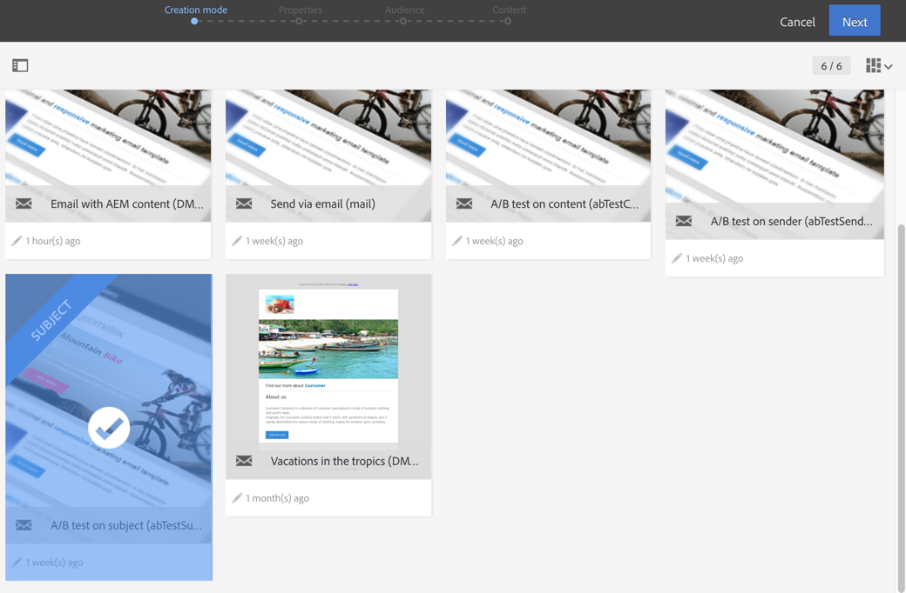
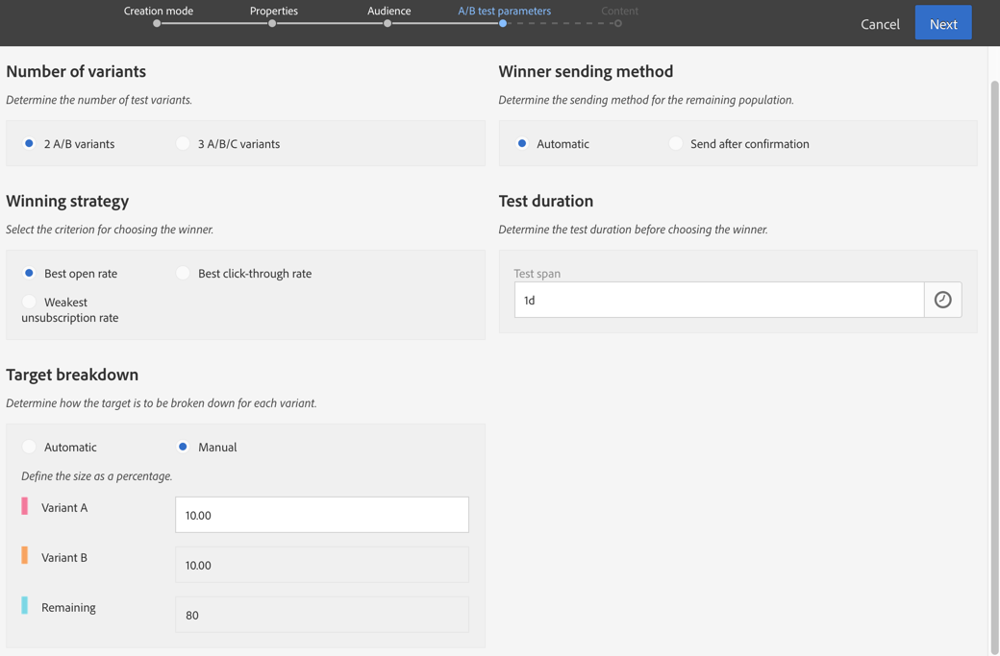
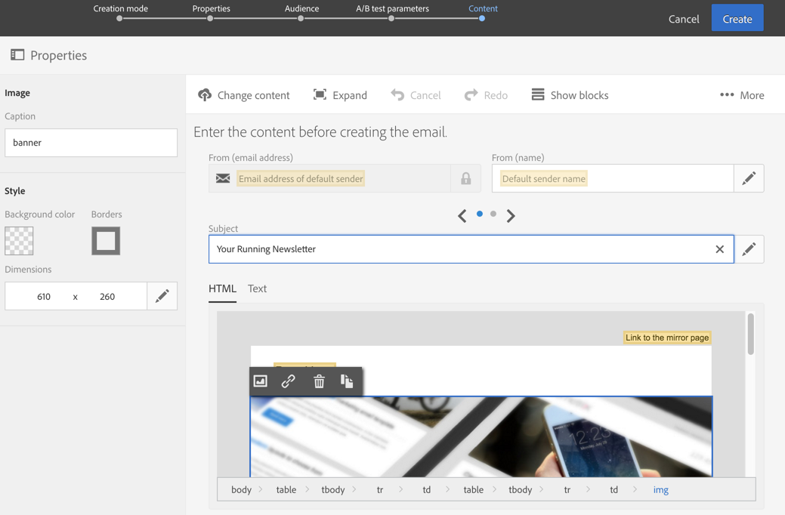
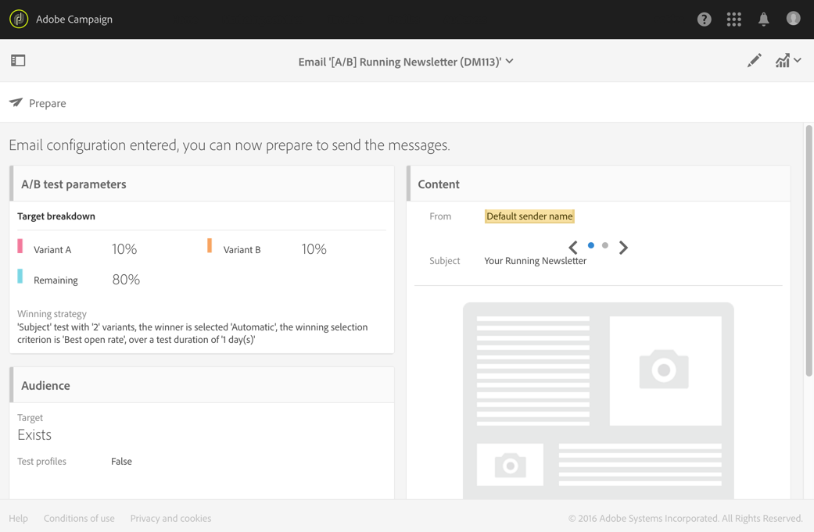

# Designing an A/B test email{#designing-an-a-b-test-email}

The A/B test functionality in Adobe Campaign allows you to define two to three email variants. Each variant is sent to population samples in order to determine which has the best result. Once determined, the winning variant is then sent to the remaining population.

You can choose to vary the email's content, subject, or sender.

>[!NOTE]
>
>A/B tests on emails created in Adobe Experience Manager not possible.

## Creating an A/B test email {#creating-an-a-b-test-email}

An A/B test can be created using the standard email creation wizard, to which an A/B test configuration step is added. Creating a standard email is detailed in the [Creating an email](../../channels/using/creating-an-email.md) section.

In the specific context of an A/B test:

1. Create a new email from one of the three A/B testing specific templates, according to the element that you want to vary:

    * A/B test on sender
    * A/B test on content
    * A/B test on subject

   

   >[!NOTE]
   >
   >Follow-up and A/B test templates are hidden by default. Check the A/B test box on the left side (**[!UICONTROL Filter]** lateral panel) to display them.

1. Define the general properties and the target audience of the email, just as for a standard email. Refer to the [Creating audiences](../../audiences/using/creating-audiences.md) section.
1. At the fourth step in the creation wizard, define the A/B test parameters:

    * **[!UICONTROL Number of variants]**: You can choose to use two or three variants. If you choose three variants, this choice cannot be modified after this step has been confirmed in the wizard.
    * **[!UICONTROL Winning strategy]**: Select the criterion to be used to determine the winning variant.
    * **[!UICONTROL Target breakdown]**: Choose which percentage of the target will receive each variant. The remaining percentage will receive the winning variant once it has been determined. The targeted profiles are selected randomly.
    * **[!UICONTROL Winner sending method]**: Choose whether you would like the winning variant to be automatically sent once it has been determined or whether you would like to manually confirm sending to the remaining population.
    * **[!UICONTROL Test duration]**: Specify the duration of the test. The winning variant is determined automatically after this duration. You can manually choose the winning variant before the end of the test from the email dashboard.

      The test must be at least one hour in order for all of the tracking data to be collected and correctly taken into account to select the winning variant.

   

1. Once the A/B test parameters have been defined, pass to the next step in the wizard and define the email content. Depending on the template that you have chosen, you can define several subjects, several sender names, or several different contents. Use the carousel to navigate between the different variants of the element. For more information, consult the [content editor](../../designing/using/designing-content-in-adobe-campaign.md) section.

   

1. Confirm creating the email. The email dashboard will then be displayed.
1. Schedule the send. The date defined indicates the start of the A/B test.
1. Check the A/B test parameters displayed in the **[!UICONTROL A/B test parameters]** block. You can modify them up until you confirm sending the test (step 9) by selecting the block.

   

1. Prepare the email send to analyze the target and the number of messages to send. Consult the [Preparing the send](../../sending/using/preparing-the-send.md) section.
1. Before sending the A/B test, check your email by sending proofs.
1. Once preparation has finished, confirm sending the test. Once confirmed, the A/B test parameters cannot be modified.

   The A/B test starts on the date defined in the **[!UICONTROL Schedule]**. You can track its progress using the **[!UICONTROL A/B test]** and **[!UICONTROL Deployment]** blocks.

   You can manually select the winning variant at any time if you would like to cut the test duration short.

   Once testing has finished, a summary table is displayed in the **[!UICONTROL A/B Test]** block and this allows you to view the various indicators for the different variants that were tested.

1. If you have selected **[!UICONTROL Send after confirmation]** as the sending method, you have to manually select the winning variant to start sending it to the remaining population. If you have selected **[!UICONTROL Automatic]**, the winning variant is automatically sent to the remaining population as soon as it has been determined by the system.

   >[!NOTE]
   >
   >If there is a tie, the winning variant must be manually selected. You can notify the email creator and modifier(s) that a variant has been chosen or needs to be selected. See [Adobe Campaign notifications](../../administration/using/sending-internal-notifications.md).

Your email is now defined and sent. You can access its logs and reports to measure the success of your campaign.

## About A/B test indicators {#about-a-b-test-indicators}

In the email dashboard, several indicators are available to help you measure your A/B test: number of clicks, opens, bounces, and so on.

Note that the **[!UICONTROL Estimated recipient reactivity]** indicator is a rate comparing the number of recipients who clicked against the number of recipients who opened the email. For example, if 10 recipients opened the email and 5 recipients clicked on it. The reactivity rate is 50%.
