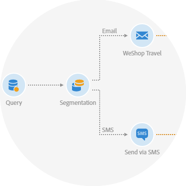

# Get started with communication channels {#discovering-communication-channels}

Adobe Campaign allows you to launch, measure, and automate campaigns across every channel.
Harmonizing all of your marketing channels is not an impossible task. With the help of Adobe Campaign, you can bring customer data from different systems, devices, and channels into a single profile. Then, deliver timely and relevant campaigns that meet your customers in the right places and right ways along their customer journey.

<table>
<tr><td></td><td></td><td></td><td></td></tr>
<tr><td><a href="#segmenting-targeting">Global concepts</a></td><td><a href="#permission">Available communication channels</a></td><td><a href="#privacy">Transactional messages</a></td><td><a href="#privacy">Landing pages</a></td></tr>
</table>

## Global concepts {#global-concepts}

**Leverage Campaign message dashboard** to configure and send your messages from one single location, as well as access various functionalities like scheduling, multilingual messaging...

**Manage templates** to configure messages properties and allow you to gain time and consistency across your messaging strategy. As an example, for emails, the functional administrator in charge of configuring the templates can define:

* The standard parameters of an email, such as the audience, schedule, or content.
* The advanced parameters related to sending, validity, tracking, etc.
* The pre-configuration parameters concerning targeting and personalization (targeting context).

Read more:

* [Key steps to send a message](../..)
* [Accessing messages](../..)
* [Message dashboard](../..)
* [Multilingual messages templates](../..)
* [Marketing activity templates](../../start/using/marketing-activity-templates.md)

## Available communication channels {available-communication-channels}

Five communication channels are available in Adobe Campaign: Email, SMS message, Push notification, In-App message and Direct mail delivery.

For each channel, specific functionalities are available. For example, the email channel allows you to perform A/B testing in order to test up to 3 versions of an email message. With the SMS channel, manage STOP SMS messages and store incoming SMS from the recipients into your database.

Additionally, leverage Campaign Standard personalization and dynamic content capabilities to capture your audience's interest.

Read more:

* [Creating emails](../../channels/using/about-emails.md)
* [Creating SMS message](../../channels/using/about-sms-messages.md)
* [Creating Push notifications](../../channels/using/about-push-notifications.md)
* [Creating In-App messages](../../channels/using/about-in-app-messaging.md)
* [Creating Direct mail deliveries](../../channels/using/about-direct-mail.md)

## Transactional messages {transactional-messages}

Send individual and unique messages to your customers in real-time: welcome messages, order shipping confirmations, password modification, etc.

Transactional messages are available for the email, SMS and push notification channels, depending on your options. There are two types of messages: event transactional messages targeting events without profile information, and profile transactional messages targeting profiles from your database.

Read more:

* [About transactional messaging](../..)
* [Event transactional emssages](../..)
* [Profile tyrnasactional messages](../..)
* [Transactional push notifications](../..)
* [Follow-up messages](../..) 

## Landing pages {landing-pages}

Campaign comes with landing pages which are web forms that can be used to capture information on your audiences, offer subscriptions to a service, display data and grow your database.

Landing pages can also be used for acquiring or updating existing profiles, and to set up a double opt-in mechanism, allowing you to to protect the platform from wrong or invalid email addresses, or spambots.

Read more:

* [Getting started with landing pages](../..)
* [Landing page templates](../..)
* [Managing landing page form data](../..)
* [Setting up a double opt-in process](../..)

## Related topics

| Useful pages | Additional resources |
|---|---|
| [Creating templates](../../start/using/marketing-activity-templates.md) | [Optimizing your deliverability](../../sending/using/about-deliverability.md) |
| [Designing an email content](../../designing/using/designing-content-in-adobe-campaign.md) | [Delivery best practices](https://helpx.adobe.com/campaign/kb/delivery-best-practices.html) |
| [Creating a multilingual push  notification](../../channels/using/creating-a-multilingual-push-notification.md) |  [Designing landing pages](../../channels/using/getting-started-with-landing-pages.md) |
| [Transactional messaging](../../channels/using/about-transactional-messaging.md) | [Importing an AEM content](../../integrating/using/creating-email-experience-manager.md) |
| [Get started with emails](https://helpx.adobe.com/campaign/kb/acs-get-started-with-emails.html) | [Sending messages with workflows](../../automating/using/about-channel-activities.md) |
