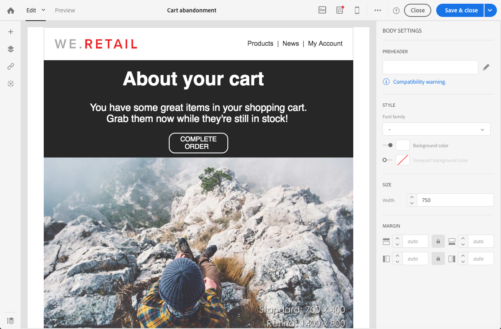
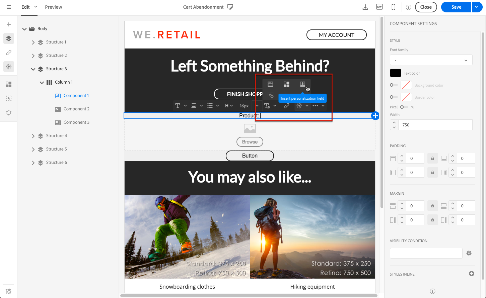

# Editing a transactional message {#editing-transactional-message}

Once you have created and published an event<!--(the cart abandonment example as explained in [this section](../../channels/using/getting-started-with-transactional-msg.md#transactional-messaging-operating-principle))-->, the corresponding transactional message is automatically created. The steps to configure and publish the event are presented in the [Configuring a transactional event](../../channels/using/configuring-transactional-event.md) and [Publishing a transactional event](../../channels/using/publishing-transactional-event.md) section.

The steps to access, edit and personalize this message are described below.

<!--Event transactional messages do not contain profile information, therefore they are not compatible with fatigue rules (even in the case of an enrichment with profiles). See [Fatigue rules](../../sending/using/fatigue-rules.md#choosing-the-channel).-->

Once your message is ready, it can be tested and published. See [Transactional message lifecylce](../../channels/using/publishing-transactional-message.md).

## Accessing transactional messages {#accessing-transactional-messages}

To access the transactional message that you created:

1. Click the **[!UICONTROL Adobe Campaign]** logo, in the top left corner.
1. Select **[!UICONTROL Marketing plans]** > **[!UICONTROL Transactional messages]** > **[!UICONTROL Transactional messages]**.

   

1. Click the message of your choice to edit it.

>[!IMPORTANT]
>
>To access transactional messages, you must be part of the **[!UICONTROL Administrators (all units)]** security group. For more on this, see [Users management](../../administration/using/users-management.md#functional-administrators).

## Personalizing a transactional message {#personalizing-a-transactional-message}

To set up personalization in a transactional message, follow the steps below.

>[!NOTE]
>
>This section describes how to personalize an **event-based** transactional message.  The configuration steps to create an event-based transactional message are presented in [this section](../../channels/using/configuring-transactional-event.md#event-based-transactional-messages).
>
>The **profile-based** transactional message specificities are detailed [below](#profile-transactional-message-specificities).

For example, you want to send a notification to your website users who have added products to their cart and leave the site without going through with their purchases. This example is presented in the [Transactional messaging operating principle](../../channels/using/getting-started-with-transactional-msg.md#transactional-messaging-operating-principle) section.

1. Click the **[!UICONTROL Content]** block to modify your message's subject and content. For this example, select any template containing images and text. For more on email content templates, see [Designing emails using templates](../../designing/using/using-reusable-content.md#designing-templates).

   

1. Add a subject and edit your message content to suit your needs.

    >[!NOTE]
    >
    >The link to the abandoned cart is a link to an external URL that will redirect the person to their cart. This parameter is not managed in Adobe Campaign.

1. In this example, you want to add three fields that you defined when you [created your event](../../channels/using/configuring-transactional-event.md): first name, last product consulted, total cart amount. To do this, [insert a personalization field](../../designing/using/personalization.md#inserting-a-personalization-field) in the message content.
    
1. Browse to those fields through **[!UICONTROL Context]** > **[!UICONTROL Real-time event]** > **[!UICONTROL Event context]**.

   

1. To enrich the content of your message, add fields by selecting them from the table with which you linked your event. In this example, select the **[!UICONTROL Title (salutation)]** field in the **[!UICONTROL Profile]** table through **[!UICONTROL Context]** > **[!UICONTROL Real-time event]** > **[!UICONTROL Event context]**.

   

1. Insert all the fields needed.

   

1. Preview your message by selecting the profile that you defined for this event.

   The steps for previewing a message are detailed in the [Previewing messages](../../sending/using/previewing-messages.md) section.

   

   You can check that the personalization fields match the information entered in the test profile. For more on this, see [Defining a specific test profile](../../channels/using/publishing-transactional-message.md#defining-specific-test-profile).

## Using product listings in a transactional message {#using-product-listings-in-a-transactional-message}

You can create product listings referencing one or more data collections in the content of a transactional email. For example, in a cart abandonment email you can include a list of all products that were in the users' carts when they left your website, with an image, the price, and a link to each product.

>[!IMPORTANT]
>
>Product listings are only available when editing transactional email messages through the [Email Designer](../../designing/using/designing-content-in-adobe-campaign.md#email-designer-interface) interface.

To add a list of abandoned products in a transactional message, follow the steps below.

You can also watch [this set of videos](https://experienceleague.adobe.com/docs/campaign-standard-learn/tutorials/designing-content/product-listings-in-transactional-email.html?lang=en#configure-product-listings-in-transactional-emails) explaining the steps that are required to configure product listings in a transactional email.

>[!NOTE]
>
>Adobe Campaign does not support nested product listings, meaning that you cannot include a product listing inside another one.

### Defining a product listing {#defining-a-product-listing}

Before being able to use a product listing in a transactional message, you need to define at the event level the list of products and the fields for each product of the list you want to display. For more on this, see [Defining data collections](../../channels/using/configuring-transactional-event.md#defining-data-collections).

1. In the transactional message, click the **[!UICONTROL Content]** block to modify the email content.
1. Drag and drop a structure component to the workspace. For more on this, see [Defining the email structure](../../designing/using/designing-from-scratch.md#defining-the-email-structure).

   For example, select a one-column structure component and add a text component, an image component and a button component. For more on this, see [Using content components](../../designing/using/designing-from-scratch.md#about-content-components).

1. Select the structure component you just created and click the **[!UICONTROL Enable product listing]** icon from the contextual toolbar.

   

   The structure component is highlighted with an orange frame and the **[!UICONTROL Product listing]** settings are displayed in the left palette.

   

1. Select how the elements of the collection will be displayed:

    * **[!UICONTROL Row]**: horizontally, meaning each element on one row under the other.
    * **[!UICONTROL Column]**: vertically, meaning each element next to the other on the same row.

   >[!NOTE]
   >
   >The **[!UICONTROL Column]** option is only available when using a multicolumn structure component ( **[!UICONTROL 2:2 column]**, **[!UICONTROL 3:3 column]** and **[!UICONTROL 4:4 column]** ). When editing the product listing, only fill in the first column: the other columns will not be taken into account. For more on selecting structure components, see [Defining the email structure](../../designing/using/designing-from-scratch.md#defining-the-email-structure).

1. Select the data collection you created when configuring the event related to the transactional message. You can find it under the **[!UICONTROL Context]** > **[!UICONTROL Real-time event]** > **[!UICONTROL Event context]** node.

   

   For more on configuring the event, see [Defining data collections](../../channels/using/configuring-transactional-event.md#defining-data-collections).

1. Use the **[!UICONTROL First item]** drop-down list to select which element will start the list displayed in the email.

   For example, if you select 2, the first item of the collection will not be displayed in the email. The product listing will start on the second item.

1. Select the maximum number of items to display in the list.

   >[!NOTE]
   >
   >If you want the elements of your list to be displayed vertically ( **[!UICONTROL Column]** ), the maximum number of items is limited according to the selected structure component (2, 3 or 4 columns). For more on selecting structure components, see [Editing the email structure](../../designing/using/designing-from-scratch.md#defining-the-email-structure).

### Populating the product listing {#populating-the-product-listing}

To display a list of products coming from the event linked to the transactional email, follow the steps below.

For more on creating a collection and related fields when configuring the event, see [Defining data collections](../../channels/using/configuring-transactional-event.md#defining-data-collections).

1. Select the image component you inserted, select **[!UICONTROL Enable personalization]** and click the pencil in the Settings pane.

   

1. Select **[!UICONTROL Add personalization field]** in the **[!UICONTROL Image source URL]** window that opens.

   From the **[!UICONTROL Context]** > **[!UICONTROL Real-time event]** > **[!UICONTROL Event context]** node, open the node corresponding to the collection that you created (here **[!UICONTROL Product list]** ) and select the image field that you defined (here **[!UICONTROL Product image]** ). Click **[!UICONTROL Save]**.

   

   The personalization field that you selected is now displayed in the Settings pane.

1. At the desired position, select **[!UICONTROL Insert personalization field]** from the contextual toolbar.

   

1. From the **[!UICONTROL Context]** > **[!UICONTROL Real-time event]** > **[!UICONTROL Event context]** node, open the node corresponding to the collection that you created (here **[!UICONTROL Product list]** ) and select the field that you created (here **[!UICONTROL Product name]** ). Click **[!UICONTROL Confirm]**.

   

   The personalization field that you selected is now displayed at the desired position in the email content.

1. Proceed similarly to insert the price.
1. Select some text and select **[!UICONTROL Insert link]** from the contextual toolbar.

   

1. Select **[!UICONTROL Add personalization field]** in the **[!UICONTROL Insert link]** window that opens.

   From the **[!UICONTROL Context]** > **[!UICONTROL Real-time event]** > **[!UICONTROL Event context]** node, open the node corresponding to the collection that you created (here **[!UICONTROL Product list]** ) and select the URL field that you created (here **[!UICONTROL Product URL]** ). Click **[!UICONTROL Save]**.

   >[!IMPORTANT]
   >
   >For security reasons, make sure you insert the personalization field inside a link starting with a proper static domain name.

   

   The personalization field that you selected is now displayed in the Settings pane.

1. Select the structure component on which the product listing is applied and select **[!UICONTROL Show fallback]** to define a default content.

   

1. Drag one or more content components and edit them as needed.

   

   The fallback content will be displayed if the collection is empty when the event is triggered, for example if a customer has nothing in his cart.

1. From the Settings pane, edit the styles for the product listing. For more on this, see [Managing email styles](../../designing/using/styles.md).
1. Preview the email using a test profile linked to the relevant transactional event and for which you defined collection data. For example, add the following information in the **[!UICONTROL Event data]** section for the test profile you want to use:

   

   For more on defining a test profile in a transactional message, see [this section](../../channels/using/publishing-transactional-message.md#defining-specific-test-profile).

## Profile-based transactional message specificities {#profile-transactional-message-specificities}

You can send transactional messages based on customer marketing profiles, which allows you to leverage all profile information to personalize the message content, use the unsubscription link, and apply marketing typology rules such as [fatigue rules](../../sending/using/fatigue-rules.md).

* For more on the differences between event-based and profile-based transactional messages, see [this section](../../channels/using/getting-started-with-transactional-msg.md#transactional-message-types).

* The configuration steps to create a profile-based transactional message are detailed in [this section](../../channels/using/configuring-transactional-event.md#profile-based-transactional-messages).

### Editing a profile transactional message {#editing-profile-transactional-message}

The steps for creating, personalizing and publishing a profile transactional message are mostly the same as for an event transactional message.

The differences are listed below.

1. [Go the transactional message](#accessing-transactional-messages) that was created to edit it.
1. In the transactional message, click the **[!UICONTROL Content]** section. In addition to the transactional email templates, you can also choose any email template targeting the **[!UICONTROL Profile]** resource.

   

1. Select the default email template. Similar to all marketing emails, it includes an **unsubscription link**.

   

   For more on templates, see [this section](../../designing/using/using-reusable-content.md#content-templates).

1. Also, as opposed to configurations based on real-time events, you have **direct access to all profile information** to personalize your message. You can add [personalization fields](../../designing/using/personalization.md#inserting-a-personalization-field) as you would do for any other standard marketing email.

1. Save your changes before publishing the message. For more on this, see [Publishing a transactional message](../../channels/using/publishing-transactional-message.md#publishing-a-transactional-message).

### Monitoring a profile transactional message delivery {#monitoring-a-profile-transactional-message-delivery}

Once the message is published and your site integration is done, you can monitor the delivery.

1. To view the message delivery log, click the icon at the bottom right of the **[!UICONTROL Deployment]** block.

   For more information on accessing the logs, see [Monitoring a delivery](../../sending/using/monitoring-a-delivery.md).

1. Select the **[!UICONTROL Sending logs]** tab. In the **[!UICONTROL Status]** column, **[!UICONTROL Sent]** indicates that a profile has opted in.

   

1. Select the **[!UICONTROL Exclusions logs]** tab to view recipients who have been excluded from the message target, such as addresses on denylist.

   

For any profile that has opted out, the **[!UICONTROL Address on denylist]** typology rule excluded the corresponding recipient.

This rule is part of a specific typology that applies to all transactional messages based on the **[!UICONTROL Profile]** table.

**Related topics**:

* [Transactional event triggering](../../channels/using/transactional-event-triggering.md)
* [About typologies and typology rules](../../sending/using/about-typology-rules.md)
