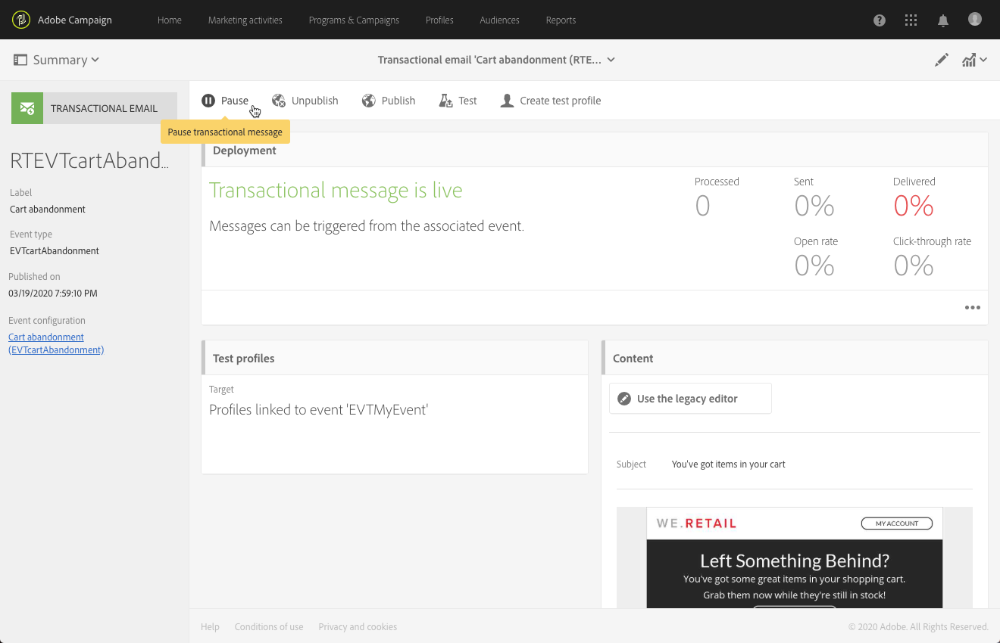

# Event transactional messages{#event-transactional-messages}

You can send event transactional messages targeting an event. This type of transactional messages does not contain profile information: the delivery target is defined by the data contained in the event itself.

Once you have created and published an event (the cart abandonment as explained in [this section](../../channels/using/about-transactional-messaging.md#transactional-messaging-operating-principle)), the corresponding transactional message is created automatically.

The configuration steps are presented in the [Configuring an event to send an transactional message](../../administration/using/configuring-transactional-messaging.md#use-case--configuring-an-event-to-send-a-transactional-message) section.

In order for the event to trigger sending a transactional message, you have to personalize the message, then test it and publish it.

>[!NOTE]
>
>To access the transactional messages, you must have administration rights or appear in the **[!UICONTROL Message Center agents]** (mcExec) security group. Event transactional messages do not contain profile information, therefore they are not compatible with fatigue rules (even in the case of an enrichment with profiles). See [Fatigue rules](../../administration/using/fatigue-rules.md#choosing-the-channel).

## Defining a test profile in a transactional message {#defining-a-test-profile-in-a-transactional-message}

Define an adapted test profile, which will allow you to preview your message and send a proof to check it.

### Creating a test profile within the transactional message {#creating-a-test-profile-within-the-transactional-----------message}

1. To access the message that you created, click the **[!UICONTROL Adobe Campaign]** logo, in the top left corner, then select **[!UICONTROL Marketing plans]** > **[!UICONTROL Transactional messages]** > **[!UICONTROL Transactional messages]**.

   

1. Create a test profile that will be linked to your event.

   

1. Specify the information to send in JSON format in the **[!UICONTROL Event data used for personalization]** section. This is the content that will be used when previewing the message and when the test profile receives the proof.

   

   >[!NOTE]
   >
   >You can also enter the information relating to the profile table. See [Enriching the transactional message content](../../administration/using/configuring-transactional-messaging.md#enriching-the-transactional-message-content).

1. After having been created, the test profile will be pre-specified in the transactional message. Click the **[!UICONTROL Test profiles]** block of the message to check the target of your proof.

   

### Creating a test profile outside the transactional message {#creating-a-test-profile-outside-the-transactional-----------message}

You can also create a new test profile or use one that already exists in the **[!UICONTROL Test profiles]** menu.

1. Click the **[!UICONTROL Adobe Campaign]** logo, in the top left corner, then select **[!UICONTROL Profiles & audiences]** > **[!UICONTROL Test profiles]**.
1. In the **[!UICONTROL Event]** section of the page of the test profile that you have chosen, select the event that you have just created. In this example, select "Cart abandonment (EVTcartAbandonment)".
1. Specify the information to send in JSON format in the **[!UICONTROL Event data]** text box.

   

1. Save your changes.

You can now access the message that you created and select the updated test profile.

**Related topics:**

* [Managing test profiles](../../sending/using/managing-test-profiles-and-sending-proofs.md)
* [Defining audiences](../../audiences/using/creating-audiences.md)

## Personalizing a transactional message {#personalizing-a-transactional-message}

To set up personalization in a transactional message, follow the steps below:

1. Click the **[!UICONTROL Content]** block to modify your message's subject and content. For this example, import an HTML template containing images, the style sheet, and an HTML file. Importing HTML templates is presented in the [Loading an existing content](../../designing/using/selecting-an-existing-content.md) section.

   

1. Enter your message content. In this example, we have added three personalization fields: last name, last product consulted, total cart amount. The link to the abandoned cart is a link to an external URL that will redirect the person to their cart. This parameter is not managed in Adobe Campaign.

   To add fields that you defined when you created your event (see [Configuring an event](../../administration/using/configuring-transactional-messaging.md#use-case--configuring-an-event-to-send-a-transactional-message)), insert a personalization field in the message content. You can find the fields by selecting **[!UICONTROL Transactional event]** > **[!UICONTROL Event context]**.

   

1. To enrich the content of your message, add fields by selecting them from the table with which you linked your event. In our example, select the **[!UICONTROL Title (salutation)]** field in the **[!UICONTROL Profile]** table.

   

   The steps for inserting a personalization field are detailed in the [Inserting a personalization field](../../designing/using/inserting-a-personalization-field.md) section.

   

1. Preview your message by selecting the profile that you defined for this event.

   The steps for previewing a message are detailed in the [Previewing messages](../../sending/using/preparing-the-send.md) section.

   

   You can check that the personalization fields match the information entered in the test profile. For more on this, see [Defining a test profile in a transactional message](../../channels/using/event-transactional-messages.md#defining-a-test-profile-in-a-transactional-message).

## Using product listings in a transactional message {#using-product-listings-in-a-transactional-message}

You can create product listings referencing one or more data collections in the content of a transactional email. For example, in a cart abandonment email you can include a list of all products that were in the users' carts when they left your website, with an image, the price, and a link to each product.

>[!CAUTION]
>
>Product listings are only available when editing transactional email messages through the [Email Designer](../../designing/using/about-email-content-design.md#about-the-email-designer) interface.

To add a list of abandoned products in a transactional message, follow the steps below.

You can also watch a set of videos explaining the steps that are required to configure product listings in a transactional email. For more on this, see [this page](https://helpx.adobe.com/campaign/kt/acs/using/acs-product-listings-in-transactional-emails-feature-video-setup.html).

>[!NOTE]
>
>Adobe Campaign does not support nested product listings, meaning that you cannot include a product listing inside another one.

### Defining a product listing {#defining-a-product-listing}

Before being able to use a product listing in a transactional message, you need to define at the event level the list of products and the fields for each product of the list you want to display. For more on this, see [Defining data collections](../../administration/using/configuring-transactional-messaging.md#defining-data-collections).

1. In the transactional message, click the **[!UICONTROL Content]** block to modify the email content.
1. Drag and drop a structure component to the workspace. For more on this, see [Editing the email structure](../../designing/using/defining-the-email-structure.md#editing-the-email-structure).

   For example, select a one-column structure component and add a text component, an image component and a button component. For more on this, see [Adding fragments and components](../../designing/using/designing-from-scratch.md#editing-the-email-structure).

1. Select the structure component you just created and click the **[!UICONTROL Enable product listing]** icon from the contextual toolbar.

   

   The structure component is highlighted with an orange frame and the **[!UICONTROL Product listing]** settings are displayed in the left palette.

   

1. Select how the elements of the collection will be displayed:

    * **[!UICONTROL Row]**: horizontally, meaning each element on one row under the other.
    * **[!UICONTROL Column]**: vertically, meaning each element next to the other on the same row.

   >[!NOTE]
   >
   >The **[!UICONTROL Column]** option is only available when using a multicolumn structure component ( **[!UICONTROL 2:2 column]**, **[!UICONTROL 3:3 column]** and **[!UICONTROL 4:4 column]** ). When editing the product listing, only fill in the first column: the other columns will not be taken into account. For more on selecting structure components, see [Editing the email structure](../../designing/using/defining-the-email-structure.md#editing-the-email-structure).

1. Select the data collection you created when configuring the event related to the transactional message. You can find it under the **[!UICONTROL Context]** > **[!UICONTROL Real-time event]** > **[!UICONTROL Event context]** node.

   

   For more on configuring the event, see [Defining data collections](../../administration/using/configuring-transactional-messaging.md#defining-data-collections).

1. Use the **[!UICONTROL First item]** drop-down list to select which element will start the list displayed in the email.

   For example, if you select 2, the first item of the collection will not be displayed in the email. The product listing will start on the second item.

1. Select the maximum number of items to display in the list.

   >[!NOTE]
   >
   >If you want the elements of your list to be displayed vertically ( **[!UICONTROL Column]** ), the maximum number of items is limited according to the selected structure component (2, 3 or 4 columns). For more on selecting structure components, see [Editing the email structure](../../designing/using/defining-the-email-structure.md#editing-the-email-structure).

### Populating the product listing {#populating-the-product-listing}

To display a list of products coming from the event linked to the transactional email, follow the steps below.

For more on creating a collection and related fields when configuring the event, see [Defining data collections](../../administration/using/configuring-transactional-messaging.md#defining-data-collections).

1. Select the image component you inserted, select **[!UICONTROL Enable personalization]** and click the pencil in the Settings pane.

   

1. Select **[!UICONTROL Add personalization field]** in the **[!UICONTROL Image source URL]** window that opens.

   From the **[!UICONTROL Context]** > **[!UICONTROL Real-time event]** > **[!UICONTROL Event context]** node, open the node corresponding to the collection that you created (here **[!UICONTROL Product list]** ) and select the image field that you defined (here **[!UICONTROL Product image]** ). Click **[!UICONTROL Save]**.

   

   The personalization field that you selected is now displayed in the Settings pane.

1. At the desired position, select **[!UICONTROL Insert personalization field]** from the contextual toolbar.

   

1. From the **[!UICONTROL Context]** > **[!UICONTROL Real-time event]** > **[!UICONTROL Event context]** node, open the node corresponding to the collection that you created (here **[!UICONTROL Product list]** ) and select the field that you created (here **[!UICONTROL Product name]** ). Click **[!UICONTROL Confirm]**.

   

   The personalization field that you selected is now displayed at the desired position in the email content.

1. Proceed similarly to insert the price.
1. Select some text and select **[!UICONTROL Insert link]** from the contextual toolbar.

   

1. Select **[!UICONTROL Add personalization field]** in the **[!UICONTROL Insert link]** window that opens.

   From the **[!UICONTROL Context]** > **[!UICONTROL Real-time event]** > **[!UICONTROL Event context]** node, open the node corresponding to the collection that you created (here **[!UICONTROL Product list]** ) and select the URL field that you created (here **[!UICONTROL Product URL]** ). Click **[!UICONTROL Save]**.

   >[!CAUTION]
   >
   >For security reasons, make sure you insert the personalization field inside a link starting with a proper static domain name.

   

   The personalization field that you selected is now displayed in the Settings pane.

1. Select the structure component on which the product listing is applied and select **[!UICONTROL Show fallback]** to define a default content.

   

1. Drag one or more content components and edit them as needed.

   

   The fallback content will be displayed if the collection is empty when the event is triggered, for example if a customer has nothing in his cart.

1. From the Settings pane, edit the styles for the product listing. For more on this, see [Editing email styles](../../designing/using/editing-email-styles.md).
1. Preview the email using a test profile linked to the relevant transactional event and for which you defined collection data. For example, add the following information in the **[!UICONTROL Event data]** section for the test profile you want to use:

   

   For more on defining a test profile in a transactional message, see [this section](../../channels/using/event-transactional-messages.md#defining-a-test-profile-in-a-transactional-message).

## Testing a transactional message {#testing-a-transactional-message}

Once you have saved your transactional message, you can now send a proof to test it.

The steps for sending a proof are detailed in the [Sending a proof](../../sending/using/managing-test-profiles-and-sending-proofs.md#sending-proofs) section.

## Publishing a transactional message {#publishing-a-transactional-message}

Once you have checked your transactional message, you can publish it.

Now, as soon as the "Cart abandonment" event is triggered, it automatically prompts a message containing the recipient's title and last name, the cart URL, the last product consulted or a list of products if you defined a product listing, and the total cart amount to be sent.

To access reports concerning your transactional message, use the **[!UICONTROL Reports]** button. See [Reports](../../reporting/using/about-dynamic-reports.md).

## Suspending a transactional message publication {#suspending-a-transactional-message-publication}

You can suspend publishing your transactional message by using the **[!UICONTROL Pause]** button, for example, to modify the data contained in the message. The events are therefore no longer processed, but instead kept in a queue in the Adobe Campaign database.

The queued events are kept during a period of time that is defined in the REST API (see [REST API documentation](https://docs.campaign.adobe.com/doc/standard/en/api/ACS_API.html)) or in the trigger event if you are using the Triggers core service (see [Working with Campaign and Experience Cloud Triggers](../../integrating/using/about-adobe-experience-cloud-triggers.md)).

When clicking **[!UICONTROL Resume]**, all of the queued events (provided that they are not expired) are processed. They now contain all of the modifications carried out while the template publication was suspended.

## Unpublishing a transactional message {#unpublishing-a-transactional-message}

Clicking **[!UICONTROL Unpublish]** allows you to cancel the transactional message publication, but also the publication of the corresponding event, which deletes from the REST API the resource corresponding to the event that you previously created. Now, even if the event is triggered through your website, the corresponding messages are not sent anymore and they are not stored in the database.

>[!NOTE]
>
>To publish the message again, you need to go back to the corresponding event configuration, publish it, and then publish the message. For more on this, see [Publishing a transactional message](../../channels/using/event-transactional-messages.md#publishing-a-transactional-message).

If you unpublish a paused transactional message, you may have to wait up to 24 hours before you can publish it again. This is to let the **[!UICONTROL Database cleanup]** workflow clean all the events that were sent to the queue. The steps for pausing a message are detailed in the [Suspending a transactional message publication](../../channels/using/event-transactional-messages.md#suspending-a-transactional-message-publication) section.

The **[!UICONTROL Database cleanup]** workflow, which runs every day at 4am, is accessible through **[!UICONTROL Administration]** > **[!UICONTROL Application settings]** > **[!UICONTROL Workflows]**.

## Deleting a transactional message {#deleting-a-transactional-message}

By selecting a transactional message, you can delete it with the **[!UICONTROL Delete element]** button even if it has already been published. However, deleting a transactional message can only be done under certain conditions:

* **Transactional messages**: To delete a transactional message, the message should be unpublished and not paused.

  If the transactional message is unpublished, the event configuration also needs to be unpublished to successfully delete your transactional message, unless another transactional message is linked to the corresponding event. For more information on how to unpublish a transactional message, refer to this [section](../../channels/using/event-transactional-messages.md#unpublishing-a-transactional-message).

  >[!CAUTION]
  >
  >Deleting a transactional message that has already sent notifications will also delete its sending and tracking logs.

* **Transactional messages from an out-of-the-box event template (internal transactional messages)**: To delete an internal transactional message, the message should be unpublished and not paused.

  It also shouldn't be the only transactional message in the event, other messages have to be linked to the corresponding event.

## Transactional message retry process {#transactional-message-retry-process}

A temporarily undelivered transactional message is subject to automatic retries that are performed until the delivery expires. For more on the delivery duration, see [Validity period parameters](../../administration/using/configuring-email-channel.md#validity-period-parameters).

When a transactional message fails to be sent, there are two retry systems:

* At the transactional messaging level, a transactional message can fail before the event is assigned to an execution delivery, meaning between the event reception and the delivery preparation. See [Event processing retry process](../../channels/using/event-transactional-messages.md#event-processing-retry-process).
* At the sending process level, once the event has been assigned to an execution delivery, the transactional message can fail due to a temporary error. See [Message sending retry process](../../channels/using/event-transactional-messages.md#message-sending-retry-process).

### Event processing retry process {#event-processing-retry-process}

If the event cannot be assigned to an execution delivery, the event processing is postponed. Retries are then performed until it is assigned to a new execution delivery.

>[!NOTE]
>
>A postponed event does not appear in the transactional message sending logs, because it is not assigned to an execution delivery yet.

For example, the event could not be assigned to an execution delivery because its content was not correct, there was an issue with access rights or branding, an error was detected on applying typology rules, etc. In this case, you can pause the message, edit it to fix the problem and publish it again. The retry system will then assign it to a new execution delivery.

### Message sending retry process {#message-sending-retry-process}

Once the event has been assigned to an execution delivery, the transactional message can fail due to a temporary error, if the recipient's mailbox is full for example. For more on this, see [Retries after a delivery temporary failure](../../sending/using/understanding-delivery-failures.md#retries-after-a-delivery-temporary-failure).

>[!NOTE]
>
>When an event is assigned to an execution delivery, it appears in the sending logs of this execution delivery, and only at this time. The failed deliveries are displayed in the **[!UICONTROL Execution list]** tab of the transactional message.

### Limitations {#limitations}

**Sending logs update**

In the retry process, the sending logs of the new execution delivery are not immediately updated (the update is performed through a scheduled workflow). It means that the message could be in **[!UICONTROL Pending]** status even if the transactional event has been processed by the new execution delivery.

**Failed execution delivery**

You cannot stop an execution delivery. However, if the current execution delivery fails, a new one is created as soon as a new event is received, and all new events are processed by this new execution delivery. No new events are processed by the failed execution delivery.

If some events already assigned to an execution delivery have been postponed and if that execution delivery fails, the retry system does not assign the postponed events to the new execution delivery, which means that these events are lost.
