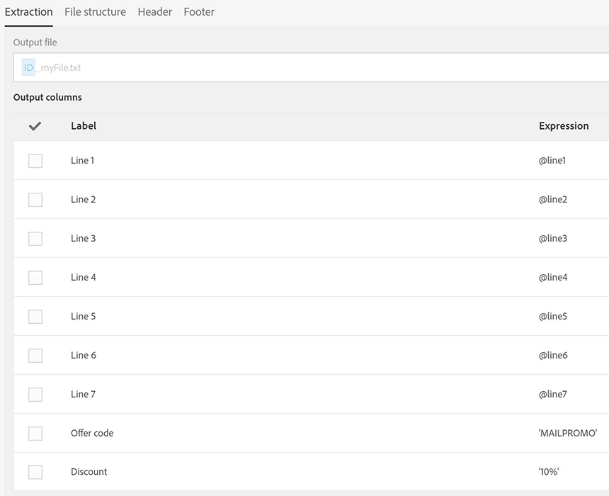

# Example of direct mail in a workflow{#example-of-direct-mail-in-a-workflow}

Example of direct mail in a workflow

As a marketer, you may want to send out catalogs via direct mail. In the paper catalog, certain pages offer a 10% discount using a promotion code and link to buy the product on the website.

The coupling between offline and online is interesting because some clients would rather order online, but prefer to view product offerings on paper.

Here is an example of direct mail template that could be used.

Here is an example of workflow that mixes direct mail and email channels.

