# Follow-up messages{#follow-up-messages}

You can send a follow-up message to the customers who received a specific transactional message. To do this, you need to set up a workflow targeting the corresponding event.

Let's reuse the example described in the [Transactional messaging operating principle](../../channels/using/getting-started-with-transactional-msg.md#transactional-messaging-operating-principle) section: a cart abandonment email is sent to your website users who added products to their cart, but left the site without going through with their purchases.

You want to send a friendly reminder to all of the customers who received the cart abandonment notification but who did not open it after three days.

Each concerned customer will then receive a follow-up message based on the same data that was used in the first email that was sent.

## Accessing the follow-up messages {#accessing-the-follow-up-messages}

Once you have created and published an event (the cart abandonment as per the [example](../../channels/using/getting-started-with-transactional-msg.md#transactional-messaging-operating-principle) above), the corresponding transactional message and follow-up message are created automatically.

The configuration steps are presented in the [Configuring an event to send a follow-up message](../../administration/using/configuring-transactional-messaging.md#configuring-an-event-to-send-a-follow-up-message) section.

To handle an event in a workflow, a delivery template is required. However, when publishing the event, the [transactional message](../../channels/using/event-transactional-messages.md) that is created cannot be used as a template. Therefore, you need to create a specific follow-up delivery template designed to support this event type and to be used as a template in a workflow.

To access this template:

1. Click the **[!UICONTROL Adobe Campaign]** logo, in the top left corner.
1. Select **[!UICONTROL Resources]** > **[!UICONTROL Templates]** > **[!UICONTROL Delivery templates]**.
1. Check the **[!UICONTROL Follow-up messages]** box in the left pane.

   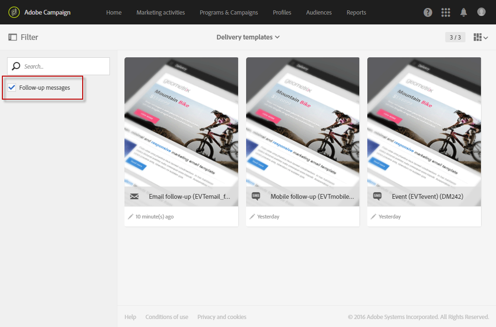

Only the follow-up messages are displayed.

>[!NOTE]
>
>To access transactional messages, you must be part of the **[!UICONTROL Administrators (all units)]** security group.

## Sending a follow-up message {#sending-a-follow-up-message}

Once you created the follow-up delivery template, you can use it in a workflow to send a follow-up message.

1. Access the marketing activity list and create a new workflow.

   See [Creating a workflow](../../automating/using/building-a-workflow.md#creating-a-workflow).

1. Drag and drop a **[!UICONTROL Scheduler]** activity into your workflow and open it. Set the execution frequency to once a day.

   The Scheduler activity is presented in the [Scheduler](../../automating/using/scheduler.md) section.

1. Drag and drop a **[!UICONTROL Query]** activity into your workflow and open it.

   The Query activity is presented in the [Query](../../automating/using/query.md) section.

1. To run the query on a resource other than the profile resource, go to the activity's **[!UICONTROL Properties]** tab and click the **[!UICONTROL Resource]** drop-down list.

   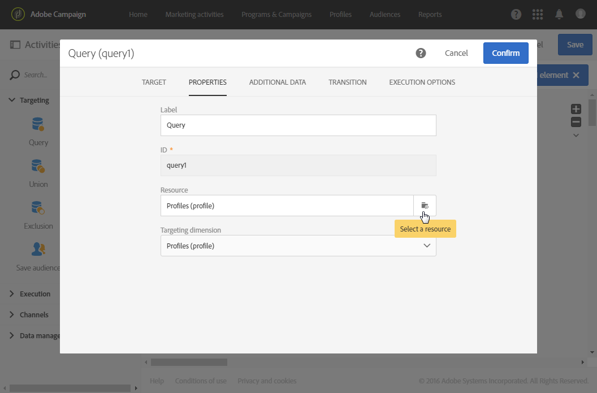

   >[!NOTE]
   >
   >By default, the activity is pre-configured to search for profiles.

1. Select the event that you want to target so that you only access data from this event.

   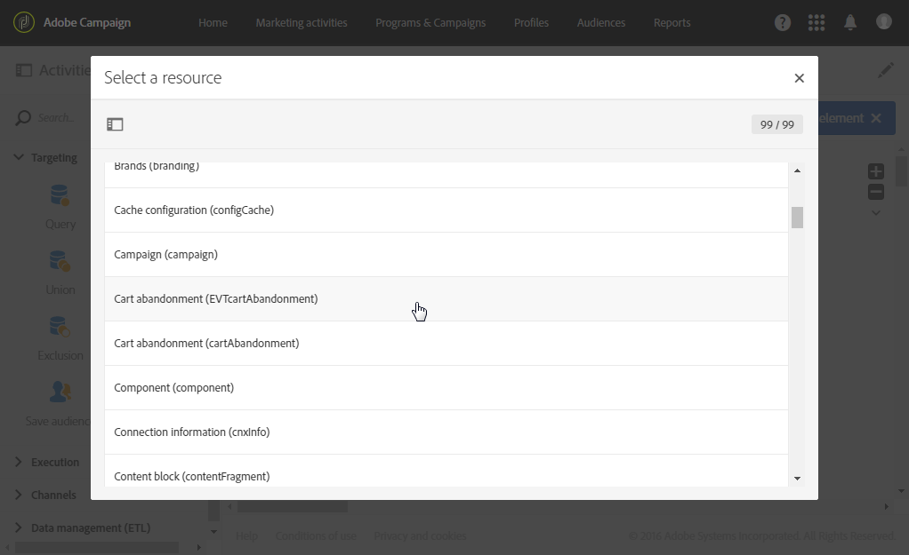

1. Go to the activity's **[!UICONTROL Target]** tab and drag and drop the **[!UICONTROL Delivery logs (logs)]** element from the palette into the workspace.

   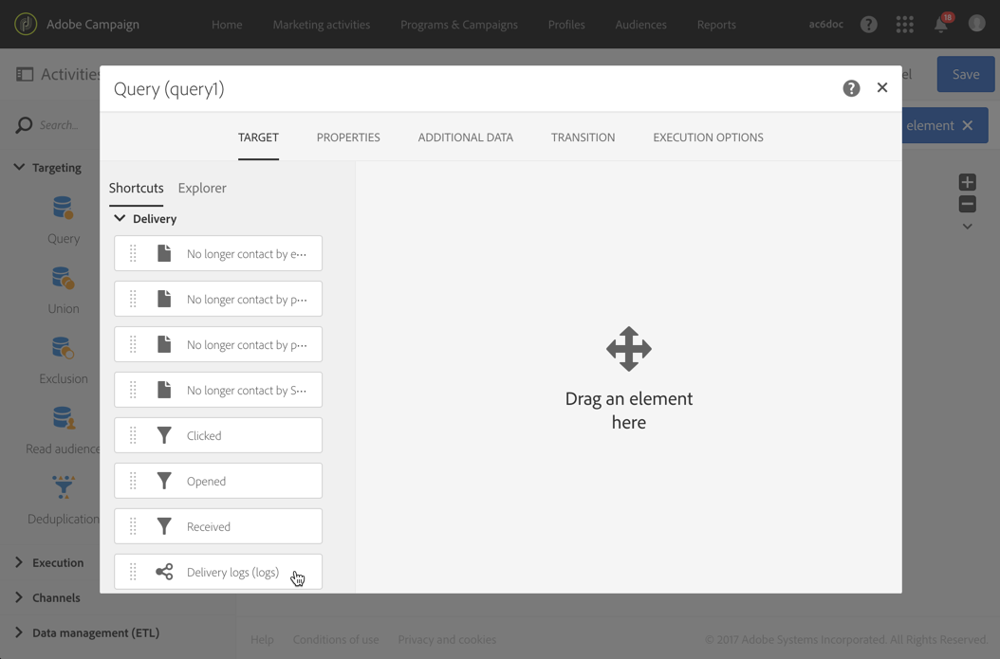

   Select **[!UICONTROL Exists]** to target all of the customers who received the email.

   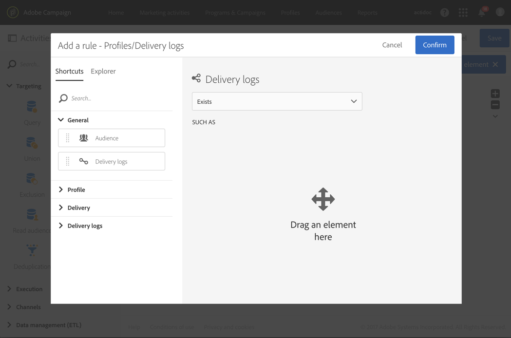

1. Move the **[!UICONTROL Tracking logs (tracking)]** element from the palette to the workspace and select **[!UICONTROL Does not exist]** to target all of the customers who did not open the email.

   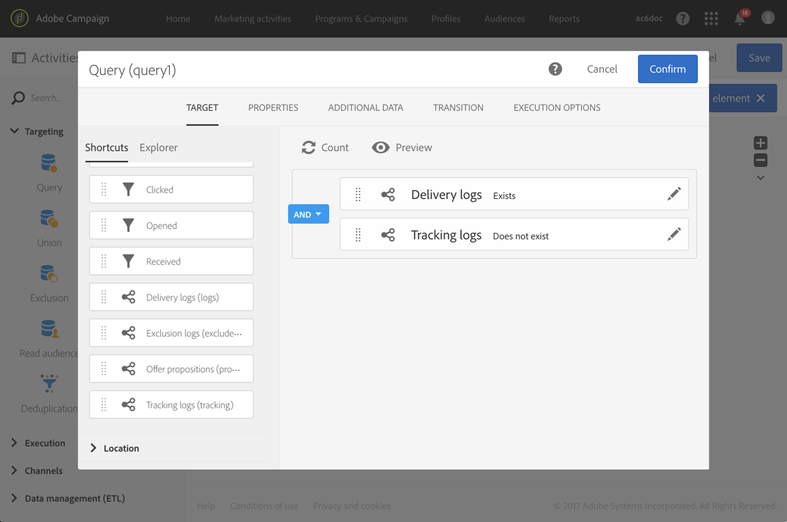

1. Drag and drop the event that you are targeting (**Cart abandonment** in this example) from the palette into the workspace. Then define a rule to target all messages sent three days ago.

   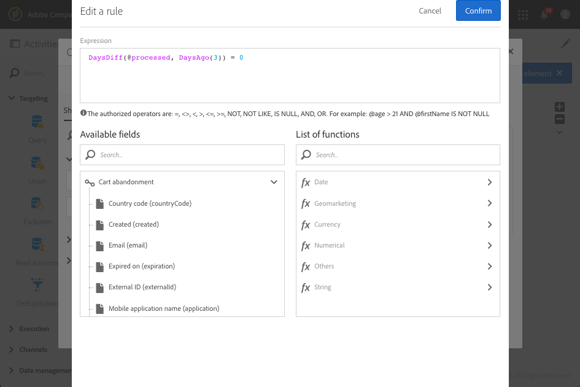

   This means that all recipients who received the transactional message three days before the execution of the workflow and still have not opened it are targeted.

   Click **[!UICONTROL Confirm]** to save the query.

1. Drag and drop an **Email delivery** activity into your workflow.

   The Email delivery activity is presented in the [Email delivery](../../automating/using/email-delivery.md) section.

   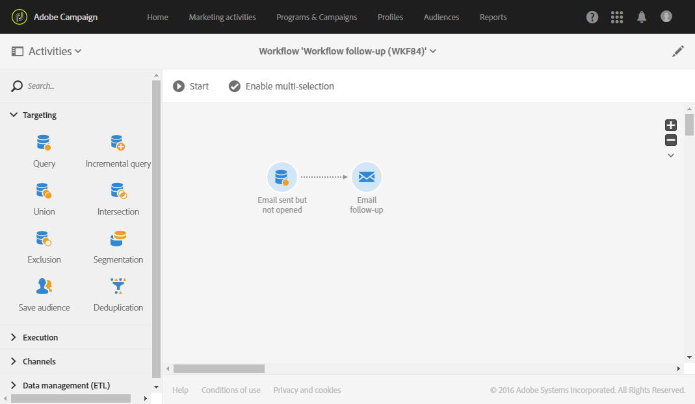

   You can also use an [SMS delivery](../../automating/using/sms-delivery.md) or a [Mobile app delivery](../../automating/using/push-notification-delivery.md) activity. In this case, make sure you select the **[!UICONTROL Mobile (SMS)]** or **[!UICONTROL Mobile application]** channel when creating your event configuration. See [Creating an event](../../administration/using/configuring-transactional-messaging.md#creating-an-event).

1. Open the **Email delivery** activity. In the creation wizard, check the **[!UICONTROL Follow-up messages]** box and select the follow-up delivery template that was created after publishing the event.

   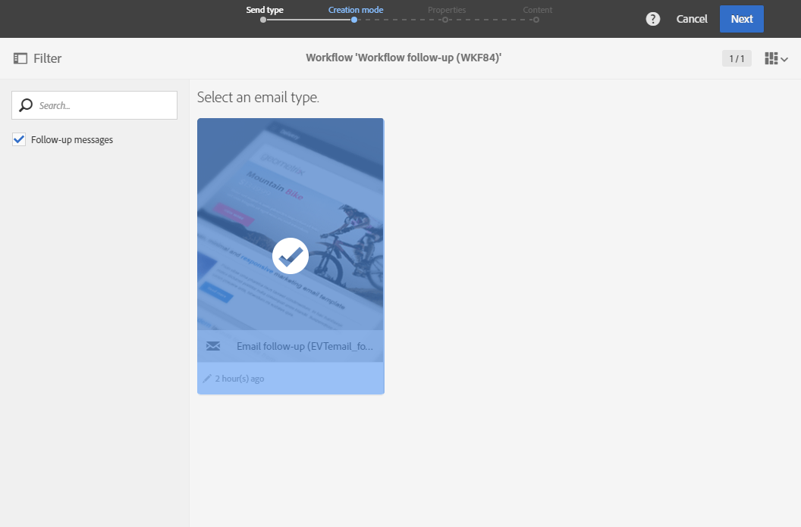

1. In the follow-up message content, you can leverage the content of your event by adding personalization fields.

   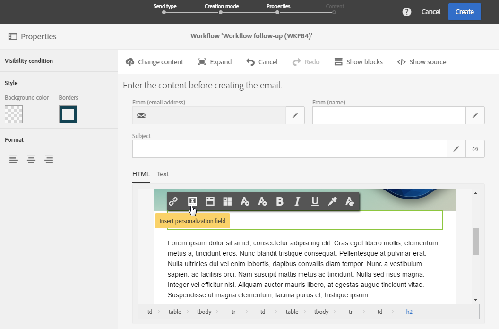

1. Find the fields that you defined when creating your event by selecting **[!UICONTROL Context]** > **[!UICONTROL Real-time event]** > **[!UICONTROL Event context]**. See [Personalizing a transactional message](../../channels/using/event-transactional-messages.md#personalizing-a-transactional-message).

   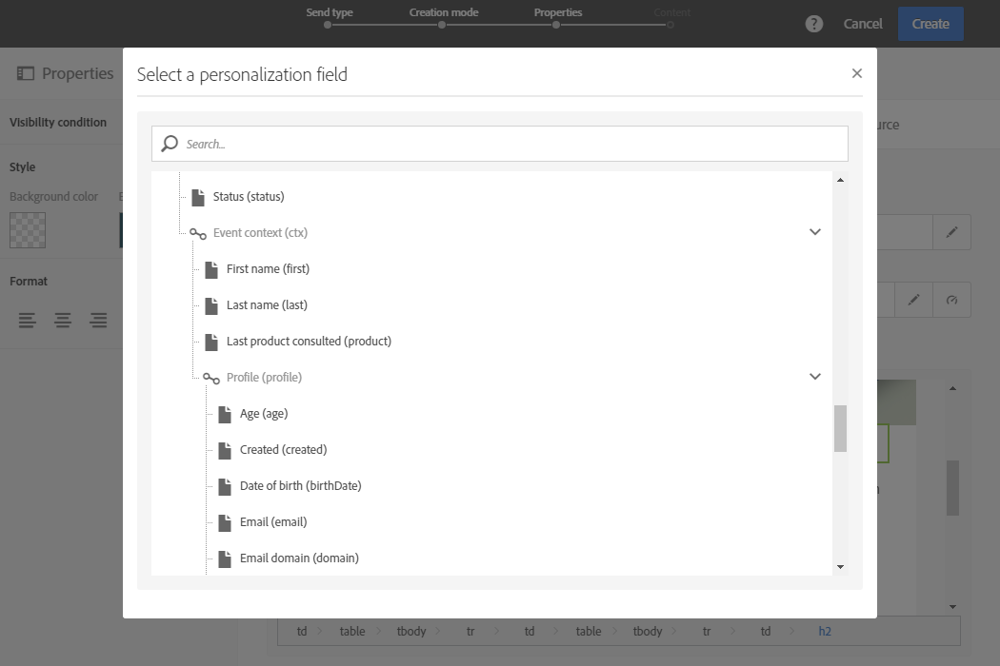

   This means that you can leverage the same content, including enriched data, that was used the first time the event was sent, to create a personalized friendly reminder.

1. Save the activity and start the workflow.

Once the workflow is started, every customer that received your cart abandonment notification three days ago but did not open it will receive a follow-up message based on the same data.

>[!NOTE]
>
>If you selected the **[!UICONTROL Profile]** targeting dimension when creating the event configuration, the follow-up message will also leverage the Adobe Campaign marketing database. See [Profile transactional messages](../../channels/using/profile-transactional-messages.md).

