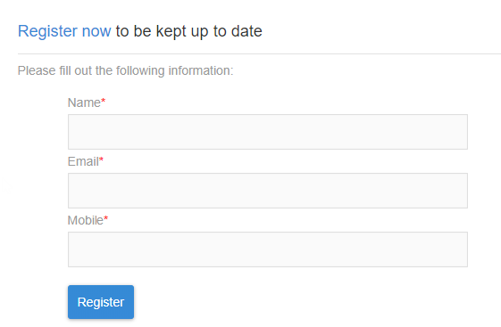
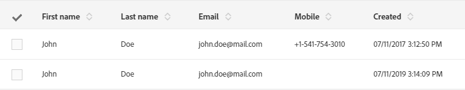
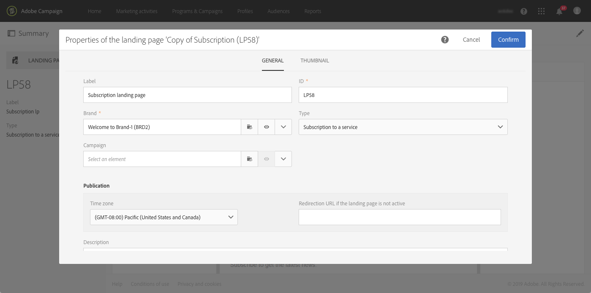
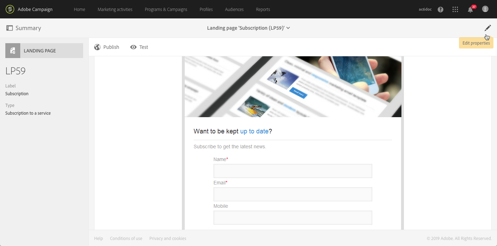
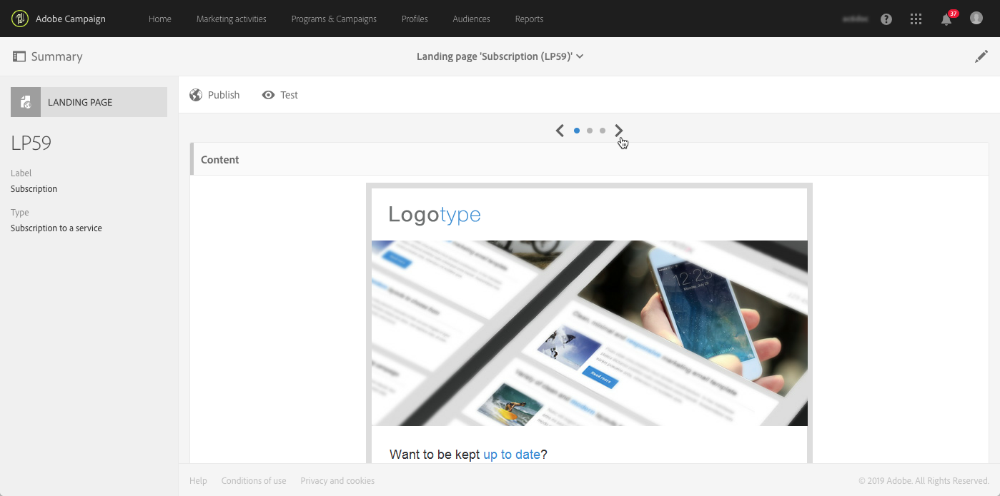
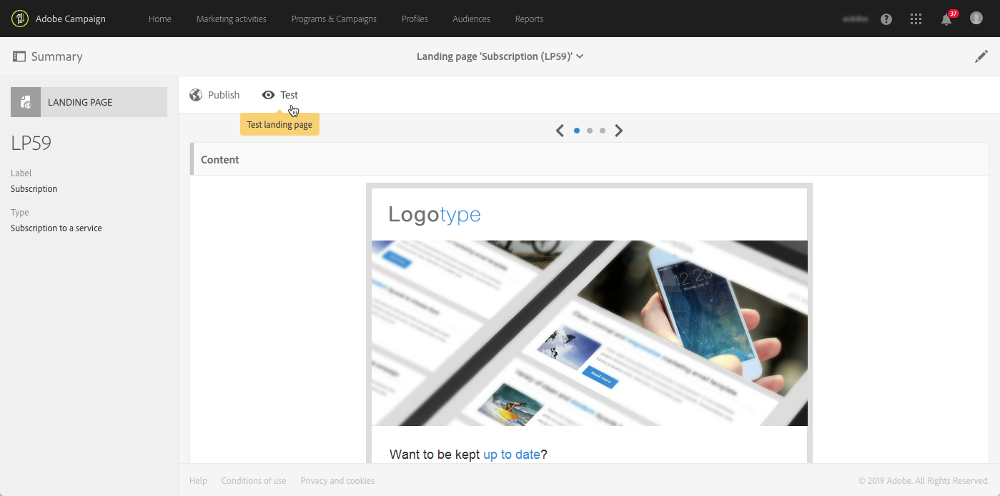
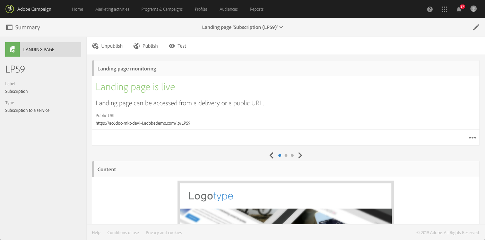

# Getting started with landing pages {#getting-started-with-landing-pages}

## About landing pages {#about-landing-pages}

Campaign comes with landing pages which are web forms that can be used to capture information on your audiences, offer subscriptions to a service, display data and grow your database. Landing pages can also be used for acquiring or updating existing profiles.

Landing pages can also be used to set up a double opt-in mechanism, allowing you to to protect the platform from wrong or invalid email addresses, or spambots. For more on this, refer to the [dedicated use case](../../channels/using/setting-up-a-double-opt-in-process.md).

The main steps when setting up landing pages are as follows:

In this page, you will find information on each of these steps, as well as references to the dedicated documentations for more details.

**Related topics:**

* [Creating a landing page tutorial video](https://docs.adobe.com/content/help/en/campaign-learn/campaign-standard-tutorials/communication-channels/landing-pages/landing-page-create-and-edit.html) video
* [Creating a service](../../audiences/using/creating-a-service.md)
* [Setting up a double opt-in process](setting-up-a-double-opt-in-process.md)

## Landing page limitations{#landing-page-limitations}

The section below lists the limitations you should be aware of, before starting setting up landing pages.

**Writing and updating data**

* Landing pages are limited to **[!UICONTROL Profile]** and **[!UICONTROL Subscription]** resources only. Record can be saved and updated from **[!UICONTROL Profile]** and a subscription/unsubscription to a **[!UICONTROL Service]**.
To learn more on resources configuration, see [Configuring the resource's data structure](../../developing/using/configuring-the-resource-s-data-structure.md).

>[!CAUTION]
>
>A landing page cannot display or update data from any other resource than **[!UICONTROL Profile]** and **[!UICONTROL Subscription]**.

**Preloading**

* Landing page cannot display a list of records automatically, it cannot list services that profiles already subscribed to. For more information on services, refer to this [page](../../audiences/using/creating-a-service.md).

* Landing page with a pre-filled form (data is preloaded with the page) can only be accessed from a Adobe Campaign email. It is not possible to access such a form from a website page.

**Reconciliation**

* The reconciliation behavior is the following: as soon as a match is found, the reconciliation process stops. This means that reconciliation can only be done on one profile record and not on multiple records when there are duplicates.

For example, you want to send the following acquisition landing page to your profiles to update your Campaign database with your profiles' mobile numbers.

If one of your profile fills in your landing page with new information but has already a duplicated profile, the matching profile with the earliest creation date will be updated since profiles are prioritized depending on their creation date only.

Here only the first profile was updated since it was the oldest entry.

**Testing landing pages**

* Landing pages work only on profiles and not test profiles meaning that landing pages cannot be tested as part of an email proof.

## Step 1 - Configure the landing page template {#configure-the-landing-page-template}

Before setting up a landing page, the first step is to configure a landing page template that corresponds to your needs. Once the template ready, all the landing pages based on it will be pre-configured with the desired parameters.

1. From the advanced menu, via the Adobe Campaign logo, select **[!UICONTROL Resources]** / **[!UICONTROL Templates]** / **[!UICONTROL Landing page templates]**, then duplicate the template that you want to use.
1. In the template properties, specify all of the parameters that your landing pages must have in common. For example: the targeting dimension, the page access parameters for identified or non-identified visitors, actions that are specific to form validation by a visitor, the brand/logo to use in the content, etc. For more on landing pages' properties, refer to [this section](../../channels/using/configuring-landing-page.md)
1. Save your modifications.

For more on landing page templates, refer to [this section](../../channels/using/getting-started-with-landing-pages.md).

## Step 2 - Create and configure the landing page {#create-and-configure-the-landing-page}

From the template defined in the previous step, create a new landing page in a program or campaign.

1. Create the landing page based on the desired template.
1. Enter the general parameters of the landing page (label, description, etc.).
1. You will then access the landing page dashboard. Edit the landing page properties, if necessary (see [Configuring a landing page](../../channels/using/configuring-landing-page.md)). By default, the properties are those configured in the landing page template.
    For security reasons and platform performances, we highly recommend that you set an expiration date in the landing page properties. Once done, the landing page will be automatically unpublished on the selected date. For more on validity parameters, refer to [this section](../../channels/using/testing-publishing-landing-page.md#setting-up-validity-parameters).

    

    >[!NOTE]
    >
    >Your modifications are only effective for the landing page that is being edited. If you want to apply these modifications to other landing pages, you can carry them out in a dedicated template and then create other landing pages from that template.

## Step 3 - Design the landing page {#design-the-landing-page}

You can now define the content of the landing page. By default, the landing page contains three pages that can be accessed via scrolling arrows: the main content page, a confirmation page, and an error page.

Several fields are configured by default on each page. If necessary, you can edit their properties and mapping.

You can also configure the way the confirmation button will behave once a profile clicks on it, and personalize the content according to your needs (image, personalization fields, etc.). For example, you can insert a profile's first name on the confirmation page of the landing page, to thank them for registering.

For more on landing page design, refer to [this section](../../channels/using/designing-a-landing-page.md).

## Step 4 - Test the landing page {#test-the-landing-page}

Once the landing page is defined, you can simulate the way it will execute and behave when it is available online.

>[!CAUTION]
>
>The landing page tests can only be carried out with profiles, and not with test profiles. When the form is being submitted, the selected profile's data will be updated for real. To avoid modifying real profiles, use a fake customer profile.

If you are satisfied with the way the landing page behaves, you can publish it to make it available online.

For more on how to test a landing page, refer to [this section](../../channels/using/testing-publishing-landing-page.md#testing-the-landing-page-).

## Step 5 - Publish the landing page {#publish-the-landing-page}

Once the tests are successful, you can publish the landing page using the **[!UICONTROL Publish]** button from the action bar in the dashboard. A monitoring block shows the progression and status of the publication.

Publishing the landing page makes it accessible online. Once published, you can always update it: to do this, you have to republish it after each modification. You can also unpublish a landing page at any time so that it is no longer available.

Once published, your landing page is ready to be used. You can then put different mechanisms in place that allow you to access it to acquire new profiles in your database or to obtain additional information on existing profiles.

For more on landing page publishing, refer to [this section](../../channels/using/testing-publishing-landing-page.md#publishing-a-landing-page).
