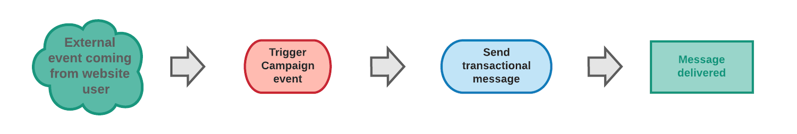

# Getting started with transactional messaging {#getting-started-with-transactional-messaging}

## Overview {#overview}

A transactional message is an individual and unique communication, sent in real-time by a provider such as a website. It is particularly expected, because it contains important information that the recipient wants to check or confirm.

* **When is it due?** Because this message contains important information, the user expects it to be sent in real time. Consequently, the delay between the event being triggered and the message arriving has to be very short.

* **Why is it important?** Generally, a transactional message has high open rates. It should therefore be carefully designed, because it can have a strong impact on the customers' behavior as it defines the client relation.

* **For example?** It could be a welcome message after creating an account, a confirmation that an order has shipped, an invoice, a message confirming a password change, or a notification after a customer browsed your website...

Adobe Campaign allows you to integrate this functionality with an information system which sends events that are to be transformed into custom transactional messages.

Transactional messages can be sent by email, SMS or push notification, depending on your options. Please check your license agreement.

>[!NOTE]
>
>Adobe Campaign prioritizes processing transactional messages over any other delivery.

<!--Guidelines to implement transactional messaging capabilities in your website are detailed in [this section](../../api/using/managing-transactional-messages.md).-->

<!--All transactional messages are now sent with the Adobe Campaign Enhanced MTA for improved deliverability, throughput, and bounce handling. All impacts are the same as for standard marketing messages. For more on this, see [this section](../../administration/using/configuring-email-channel.md).-->

Before starting with transactional messaging, make sure you read the corresponding [best practices and limitations](../../channels/using/transactional-messaging-limitations.md).

## Transactional messaging operating principle {#transactional-messaging-operating-principle}

The transactional messaging overall process can be described as follows:

For example, let's say you are a company with a website where your customers can buy products.

Adobe Campaign allows you to send a notification email to customers who have added products to their cart: when one of them leaves your website without going through with their purchases (external event which triggers a Campaign event), a cart abandonment email is automatically sent to them (transactional message delivery).

The steps for putting this into place are detailed in [this section](#key-steps).

## Transactional message types {#transactional-message-types}

Two types of transactional messages are available in Adobe Campaign:

**Event transactional messages** target data contained in the event itself. This type of message is useful when you do no want the fatigue rules to be applied, for example when you are sending a message to retrieve a password. It can also be used when you do not want to include an unsubscription link in your message, for example when you are sending an order confirmation.
* They do not contain profile information.
* They are not compatible with fatigue rules (even in the case of an enrichment with profiles).
* The delivery target is defined by the data contained in the event itself.

**Profile transactional messages** target profiles from the Campaign marketing database. You can therefore leverage data contained in the Adobe Campaign database and personalize your message with profile information when adding an [enrichment](../../channels/using/configuring-transactional-event.md#enriching-the-transactional-message-content) to the event configuration. You can for example use this type of message when contacting your customers after a cart abandonment and add this message to the customer journey by applying fatigue rules and add it to the global delivery reporting. 

* You can apply [marketing typology rules](../../sending/using/managing-typology-rules.md) or [fatigue rules](../../sending/using/fatigue-rules.md).
* The unsubscription link is included within the messages.
* The transactional message is added to the global delivery reporting.
* You can leverage the transactional messages in the customer journey.

The message type is defined when configuring the event that will be transformed into a transactional message. See [event-based transactional messages](../../channels/using/configuring-transactional-event.md#event-based-transactional-messages) and [profile-based transactional messages](../../channels/using/configuring-transactional-event.md#profile-based-transactional-messages) configuration.

>[!IMPORTANT]
>
>To access all transactional messages, you must be part of the **[!UICONTROL Administrators (all units)]** security group.

## Key steps {#key-steps}

The main steps when creating and managing personalized transactional messages in Adobe Campaign are summarized in the chart below.

Each of these steps is further detailed below.

### Step 1 - Create and publish the event configuration {#create-event-configuration}

| User | Action | Result |
|--- |--- |--- |
| This step must be performed by a user with [administration rights](../../administration/using/users-management.md#functional-administrators). | Configure an event that will be named "Cart abandonment" and publish this event configuration. | The API that will be used by your website developer is deployed and a transactional message is automatically created. |

Creating and publishing an event are presented in the [Configuring a transactional event](../../channels/using/configuring-transactional-event.md) and [Publishing a transactional event](../../channels/using/publishing-transactional-event.md) sections.

### Step 2 - Edit and publish the transactional message {#create-transactional-message}

| User | Action | Result |
|--- |--- |--- |
| This step can be performed by any marketing user with [standard user access rights](../../administration/using/users-management.md#basic-users). | Edit and personalize the transactional message, test it, and then publish it. | The transactional message is then be ready to be sent. |

For more on editing and publishing a transactional message, see [Editing transactional messages](../../channels/using/editing-transactional-message.md) and [Transactional message lifecycle](../../channels/using/publishing-transactional-message.md).

### Step 3 - Integrate the event triggering {#integrate-event-trigger}

<!--**Event triggering integration**-->

| User | Action | Result |
|--- |--- |--- |
| This step is performed by the developer of your website. | Use the REST Transactional Messages API to integrate the event into your website. | The event will be triggered when a client abandons their cart. |

Once you have created an event, you need to integrate the triggering of this event into your website.<!--In this example, you want a "Cart abandonment" event to be triggered whenever one of your clients leaves your website before purchasing the products in their cart.--> To do this, your website web developer must use the **Adobe Campaign Standard REST API**.

For more on using the Campaign REST API to manage transactional messages, see the [REST API documentation](../../api/using/managing-transactional-messages.md).

### Step 4 - Message delivery {#message-delivery}

Once all of these steps have been carried out, the message can be delivered.

As soon as a user leaves the site without ordering the products in their cart, the corresponding Campaign event is triggered. The user automatically receives a notification email.

## Related topics

* [Key steps to send a message](../../channels/using/key-steps-to-send-a-message.md)
* [Get started with communication channels](../../channels/using/get-started-communication-channels.md)
* [Transactional push notifications](../../channels/using/transactional-push-notifications.md)
* [Follow-up messages](../../channels/using/follow-up-messages.md)
