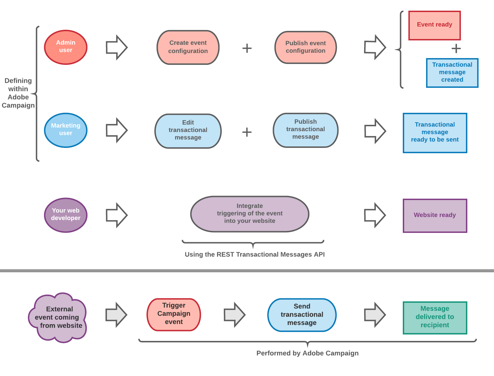
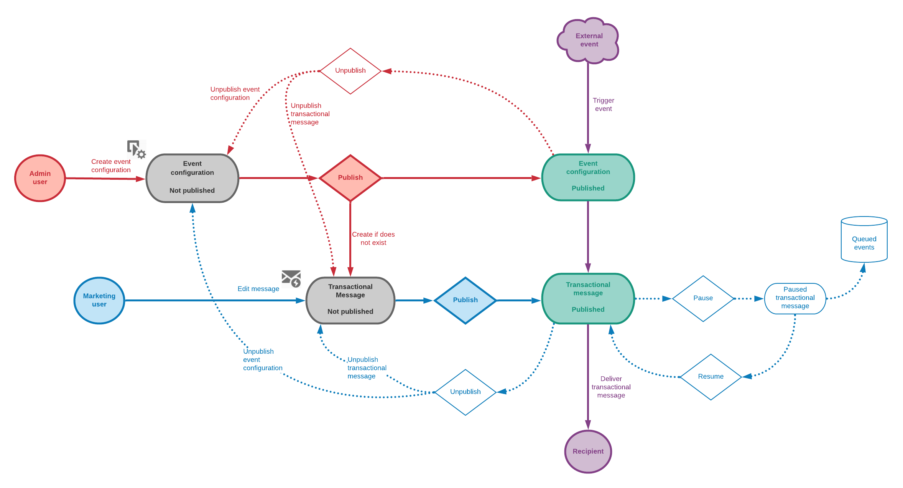

# Getting started with transactional messaging {#getting-started-with-transactional-messaging}

## Overview

Introducing the concept of **transactional messaging**

Transactional messaging enables you to send individual and unique messages to your customers in real-time.

They can be welcome messages, order shipping confirmations, password updates, etc.
Adobe Campaign allows you to integrate this functionality with an information system which sends events that are to be transformed into custom transactional messages.

Transactional messages can be sent by email, SMS or push notification, depending on your options. Please check your license agreement.

Adobe Campaign prioritizes processing transactional messages over any other delivery.

Transactional messaging is also available from the Adobe Campaign Standard API. For more on this, refer to the [dedicated documentation](../../api/using/managing-transactional-messages.md).

>[!NOTE]
>
>All transactional messages are now sent with the Adobe Campaign Enhanced MTA for improved deliverability, throughput, and bounce handling. All impacts are the same as for standard marketing messages. For more on this, see this [section](../../administration/using/configuring-email-channel.md).

## Transactional messaging definition {#transactional-messaging-definition}

<table>
<tr>
<td align="center"> 
<b>What is a transactional message?</b>
</td>
<td>
It is an individual and unique communication, sent by a provider such as a website.
</td>
<td>
It is particularly expected, because it contains important information that the recipient wants to check or confirm.
</td>
</tr>
<tr>
<td align="center"> 
<b>When is it due?</b>
</td>
<td>
 Because this message contains important information, the user expects it to be sent in real time.
</td>
<td>
Consequently, the delay between the event being triggered and the message arriving has to be very short.
</td>
</tr>
<tr>
<td align="center"> 
<b>Why is it important?</b>
</td>
<td>
Generally, a transactional message has high open rates. It should therefore be carefully designed.
</td>
<td>
Indeed, it can have a strong impact on the customers' behavior as it defines the client relation.
</td>
</tr>
<tr>
<td align="center"> 
<b>For example?</b>
</td>
<td>
It could be a welcome message after creating an account, a confirmation that an order has shipped, an invoice...
</td>
<td>
It can also be a message confirming a password change, or a notification after a customer browsed your website...
</td>
</tr>
</table>

## Transactional message types

Two types of transactional messages are available in Adobe Campaign:

[Event transactional messages](../../channels/using/event-transactional-messages.md) targeting an event.

* Event transactional messages do not contain profile information.

* They are not compatible with [fatigue rules](../../sending/using/fatigue-rules.md) (even in the case of an enrichment with profiles).

* The delivery target is defined by the data contained in the event itself.

[Profile transactional messages](../../channels/using/profile-transactional-messages.md) targeting profiles from the Campaign marketing database.

With profiles transactional messages, you can:

* Apply [marketing typology rules](../../sending/using/managing-typology-rules.md) or [fatigue rules](../../sending/using/fatigue-rules.md)

* Include the unsubscription link within the messages.

* Add the transactional messages to the global delivery reporting.

* Leverage the transactional messages in the customer journey.

The message type is defined when configuring the event that will be transformed into a transactional message. See [Transactional messaging configuration](../../administration/using/configuring-transactional-messaging.md).

>[!IMPORTANT]
>
>To access all transactional messages, you must be part of the **[!UICONTROL Administrators (all units)]** security group.

## Transactional messaging operating principle {#transactional-messaging-operating-principle}

Let's take the example of a company that has a website and on this website its customers can buy products.

Adobe Campaign allows you to send a notification email to site users who have added products to their cart: when one of them leaves the site without going through with their purchases, a cart abandonment email is automatically sent to them.

The steps for putting this into place are as follows.

### Step 1 - Create and publish the event configuration {#create-event-configuration}

**Transactional event configuration**:

* Configure an event that will be named "Cart abandonment" and publish this event configuration.

* The API that will be used by your website developer is deployed and a transactional message is automatically created.

* Note that this step must be performed by a user with [administration rights](../../administration/using/users-management.md#functional-administrators).

Creating and publishing an event are presented in the [Configuring an event to send an event transactional message](../../administration/using/configuring-transactional-messaging.md#use-case--configuring-an-event-to-send-a-transactional-message) section.

### Step 2 - Edit and publish the transactional message {#create-transactional-message}

**Transactional message edition**

* Edit and personalize the transactional message, test it, and then publish it.

* The transactional message will then be ready to be sent.

* This step can be performed by any marketing user with [standard user access rights](../../administration/using/users-management.md#basic-users).

For more on editing and publishing a transactional message, see [Event transactional messages](../../channels/using/event-transactional-messages.md).

### Step 3 - Integrate the event triggering {#integrate-event-trigger}

**Event triggering integration**

* Use the REST Transactional Messages API to integrate the event into your website.<

* The event will be triggered when a client abandons their cart.

* This step is performed by the developer of your website.

For more on integrating the event into your website, see [Site integration](../../administration/using/configuring-transactional-messaging.md#integrating-the-triggering-of-the-event-in-a-website).

### Step 4 - Message delivery {#message-delivery}

**External event coming from your website**

* Once all of these steps have been carried out, the message can be delivered.

* As soon as a user leaves the site without ordering the products in their cart, the corresponding Campaign event is triggered.

* The user then automatically receives a notification email.

## Key steps {#key-steps}

The main steps when creating and managing personalized transactional messages in Adobe Campaign are summarized in the chart below.

## Related topics

* [Key steps to send a message](../../channels/using/key-steps-to-send-a-message.md)
* [Get started with communication channels](../../channels/using/get-started-communication-channels.md)

<!--## Transactional messaging publication process {#transactional-messaging-pub-process}

The chart below illustrates the whole transactional messaging publication process.

For more on the event configuration steps, see [Transactional messaging configuration](../../administration/using/configuring-transactional-messaging.md).

Read more:

* [Event transactional messages](../../channels/using/event-transactional-messages.md)
* [Profile transactional messages](../../channels/using/profile-transactional-messages.md)
* [Transactional push notifications](../../channels/using/transactional-push-notifications.md)
* [Follow-up messages](../../channels/using/follow-up-messages.md)-->