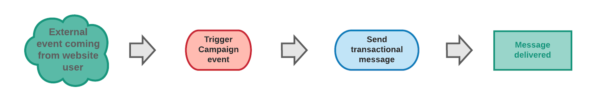
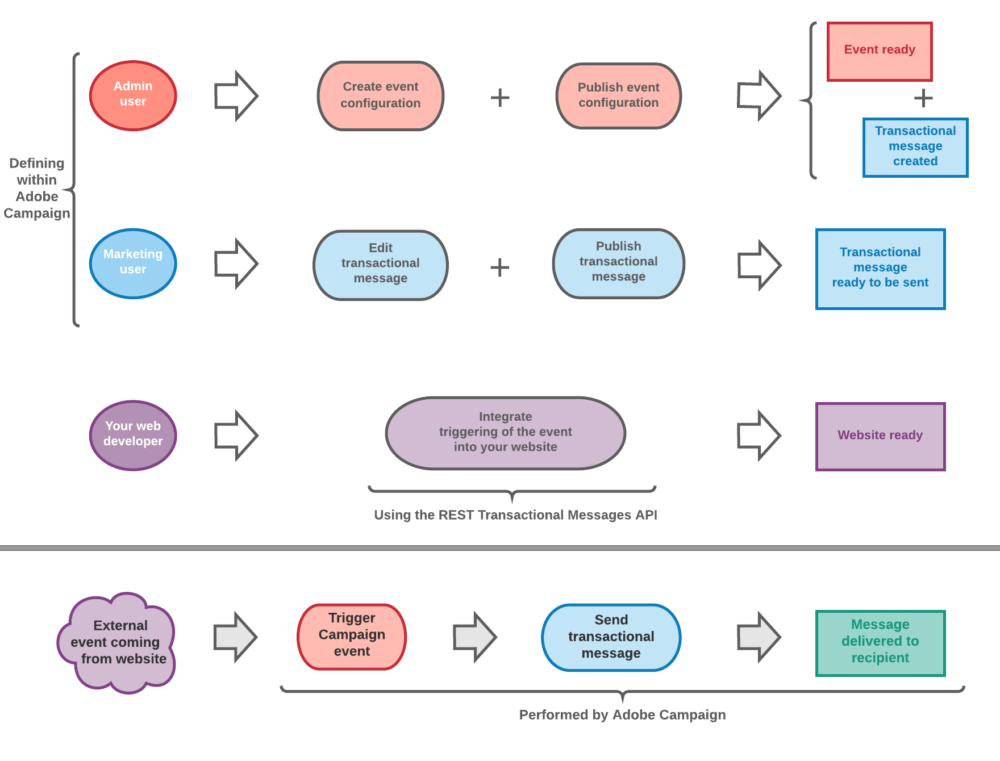

# Getting started with transactional messaging {#getting-started-with-transactional-messaging}

A transactional message is an individual and unique communication, sent in real-time by a provider such as a website. It is particularly expected, because it contains important information that the recipient wants to check or confirm.

* **When is it due?** Because this message contains important information, the user expects it to be sent in real time. Consequently, the delay between the event being triggered and the message arriving has to be very short.

* **Why is it important?** Generally, a transactional message has high open rates. It should therefore be carefully designed, because it can have a strong impact on the customers' behavior as it defines the client relation.

* **For example?** It could be a welcome message after creating an account, a confirmation that an order has shipped, an invoice, a message confirming a password change, or a notification after a customer browsed your website, etc.

Adobe Campaign allows you to integrate this functionality with an information system which sends events that are to be transformed into custom transactional messages.

Transactional messages can be sent by email, SMS or [push notification](../../channels/using/transactional-push-notifications.md), depending on your options. Please check your license agreement.

>[!NOTE]
>
>Adobe Campaign prioritizes processing transactional messages over any other delivery.

<!--Guidelines to implement transactional messaging capabilities in your website are detailed in [this section](../../api/using/managing-transactional-messages.md).-->

Before starting with transactional messaging, make sure you read the corresponding [best practices and limitations](../../channels/using/transactional-messaging-limitations.md).

## Transactional messaging operating principle {#transactional-messaging-operating-principle}

The transactional messaging overall process can be described as follows:

For example, imagine you are a company with a website where your customers can buy products.

Adobe Campaign allows you to send a notification email to customers who have added products to their cart. When one of them leaves your website without going through with their purchases (external event which triggers a Campaign event), a cart abandonment email is automatically sent to them (transactional message delivery).

The main steps for putting this into place are detailed below in [this section](#key-steps).

## Transactional message types {#transactional-message-types}

Two types of transactional messages are available in Adobe Campaign.

**Event transactional messages** target data contained in the event itself. These messages:
* Do not contain profile information, and therefore cannot include unsubscription links.
* Are not compatible with fatigue rules (even in the case of an enrichment with profiles).
* Have their delivery target defined by the data contained in the event itself.

You may want to send an event transactional message to a customer who needs to retrieve a forgotten password for example, or to confirm an order. Indeed, you do not want your recipient to unsubscribe from this type of communications, and this notification should not be added to the counter of marketing messages as part of a fatigue rule.

**Profile transactional messages** target profiles from the Campaign marketing database. With this type of messages, you can:
* Leverage data contained in the Adobe Campaign database.
* Personalize your message with profile information by adding an [enrichment](../../channels/using/configuring-transactional-event.md#enriching-the-transactional-message-content) to the event configuration.
* Apply [marketing typology rules](../../sending/using/managing-typology-rules.md) or [fatigue rules](../../sending/using/fatigue-rules.md).
* Include the unsubscription link within the messages.
* Add the transactional messages to the global delivery reporting.
* Leverage the transactional messages in the customer journey.

For example, you can use this type of messages when contacting your customers after they abandon their cart on your website, to encourage them to proceed with their purchase. Doing this, you can more easily personalize your message with direct access to all the information from your profile database, apply marketing rules and include this message to the global customer journey and reporting for a better view on your customer behavior.

The message type is defined when configuring the event that will be transformed into a transactional message. See the [Event-based transactional messages](../../channels/using/configuring-transactional-event.md#event-based-transactional-messages) and [Profile-based transactional messages](../../channels/using/configuring-transactional-event.md#profile-based-transactional-messages) configuration sections.

## Key steps {#key-steps}

The main steps when creating and managing personalized transactional messages in Adobe Campaign are summarized in the schema below.

Each of these steps is further detailed below.

>[!IMPORTANT]
>
>Only users with the [Administration](../../administration/using/users-management.md#functional-administrators) role can configure transactional events and access transactional messages.

### Step 1 - Create and publish the event configuration {#create-event-configuration}

<!---->

| Create an event | User | Action | Result |
| --- |--- |--- |--- |
|  | This step must be performed by an administrator holding [administration rights](../../administration/using/users-management.md#functional-administrators). | Configure an event that will be named "Cart abandonment" and publish this event configuration. | The API that will be used by your website developer is deployed and a transactional message is automatically created. |

Creating and publishing an event are presented in the [Configuring a transactional event](../../channels/using/configuring-transactional-event.md) and [Publishing a transactional event](../../channels/using/publishing-transactional-event.md) sections.

### Step 2 - Edit and publish the transactional message {#create-transactional-message}

<!---->

| Edit the message | User | Action | Result |
| --- |--- |--- |--- |
|  | This step can be performed by a marketing user holding [administration rights](../../administration/using/users-management.md#functional-administrators). | Edit and personalize the transactional message, test it, and then publish it. | The transactional message is then be ready to be sent. |

For more on editing and publishing a transactional message, see [Editing transactional messages](../../channels/using/editing-transactional-message.md) and [Transactional message lifecycle](../../channels/using/publishing-transactional-message.md).

### Step 3 - Integrate the event triggering {#integrate-event-trigger}

<!---->

Once you have created an event, you need to integrate the triggering of this event into your website.<!--In this example, you want a "Cart abandonment" event to be triggered whenever one of your clients leaves your website before purchasing the products in their cart.--> To do this, your website web developer must use the **Adobe Campaign Standard REST API**.

| Implement the trigger | User | Action | Result |
| --- |--- |--- |--- |
|  | This step is performed by the developer of your website. | Use the REST Transactional Messages API to integrate the event into your website. | The event will be triggered when a client abandons their cart. |

For more on using the Campaign REST API to manage transactional messages, see the [REST API documentation](../../api/using/managing-transactional-messages.md).

### Step 4 - Message delivery {#message-delivery}

<!---->

Once all of the steps above have been carried out, the message can be delivered. 

| Deliver the message | User | Action | Result |
| --- |--- |--- |--- |
|  | This step is performed by customers who visit your website. | As soon as a user leaves the site without ordering the products in their cart, the corresponding Campaign event is triggered. | The user automatically receives a notification email. |

## Related topics

* [Key steps to send a message](../../channels/using/key-steps-to-send-a-message.md)
* [Get started with communication channels](../../channels/using/get-started-communication-channels.md)
* [Transactional push notifications](../../channels/using/transactional-push-notifications.md)
* [Follow-up messages](../../channels/using/follow-up-messages.md)
