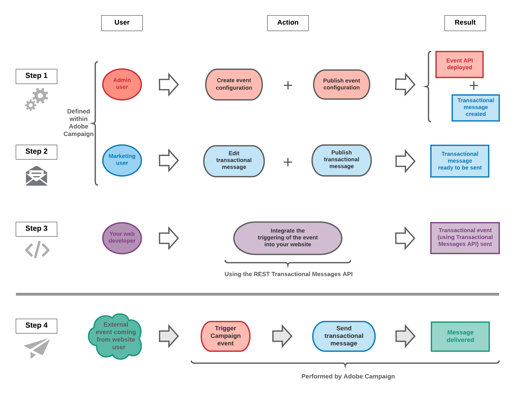

# Getting started with transactional messaging {#getting-started-with-transactional-messaging}

The main steps when creating and managing personalized transactional messages in Adobe Campaign are as follows:

In this page, you will find information on each of these steps, as well as references to the dedicated documentations for more details.

## Transactional messaging in four questions {#transactional-messaging-operating-principle}

 |  |  |  |
|--- |--- |--- | --- |
| What is a transactional message? | Why is it particularly expected? | Why is it important? | Why should it be carefully designed? |
| It is an individual and unique communication sent to a customer in real-time. | It contains information that the recipient wants to check or confirm. | It defines the client relation. The user expects it to be sent in real time. | Transactional messages generally have high open rates. |
| It is sent by a provider such as a website. | It could be a welcome message after creating an account for example, or a confirmation that an order has shipped, a bill, or a message confirming a password change. | Consequently, the delay between the event being triggered and the message arriving therefore has to be very short. | It is therefore important to design it carefully as it can have a strong impact on the customers behavior. |

## Overview

**Send individual and unique messages** to your customers in real-time: welcome messages, order shipping confirmations, password modification, etc.

Transactional messages are available for the email, SMS and push notification channels, depending on your options. There are two types of messages: **event transactional messages** targeting events without profile information, and **profile transactional messages** targeting profiles from your database.

Read more:

* [About transactional messaging](../../channels/using/about-transactional-messaging.md)
* [Event transactional messages](../../channels/using/event-transactional-messages.md)
* [Profile transactional messages](../../channels/using/profile-transactional-messages.md)
* [Transactional push notifications](../../channels/using/transactional-push-notifications.md)
* [Follow-up messages](../../channels/using/follow-up-messages.md)

Adobe Campaign allows you to integrate this functionality with an information system which sends it events that are to be transformed into custom transactional messages.

>[!NOTE]
>
>Transactional messages can be sent by email, SMS or push notification, depending on your options. Please check your license agreement.

>[!NOTE]
>
>Adobe Campaign prioritizes processing the transactional messages over any other delivery.

Transactional messaging is also available from the Adobe Campaign Standard API. For more on this, refer to the [dedicated documentation](../../api/using/managing-transactional-messages.md).

>[!NOTE]
>
>All transactional messages are now sent with the Adobe Campaign Enhanced MTA for improved deliverability, throughput, and bounce handling. All impacts are the same as for standard marketing messages. For more on this, see this [section](../../administration/using/configuring-email-channel.md).

## Two types of transactional messages

Two types of transactional messages are available in Adobe Campaign:

* [Event transactional messages](../../channels/using/event-transactional-messages.md) targeting an event. The data contained in the event itself is used to define the delivery target.
* [Profile transactional messages](../../channels/using/profile-transactional-messages.md) targeting profiles from the Adobe Campaign marketing database. You can use information from the Adobe Campaign database to send a transactional message based on customer marketing profiles.

The message type is defined when configuring the event that will be transformed into a transactional message. See [Transactional messaging configuration](../../administration/using/configuring-transactional-messaging.md).

### Event transactional messages {#event-transactional-messages}

You can send event transactional messages targeting an event. This type of transactional messages does not contain profile information: the delivery target is defined by the data contained in the event itself.

Once you have created and published an event (the cart abandonment as explained in [this section](../../channels/using/about-transactional-messaging.md#transactional-messaging-operating-principle)), the corresponding transactional message is created automatically.

The configuration steps are presented in the [Configuring an event to send an transactional message](../../administration/using/configuring-transactional-messaging.md#use-case--configuring-an-event-to-send-a-transactional-message) section.

In order for the event to trigger sending a transactional message, you have to personalize the message, then test it and publish it.

>[!NOTE]
>
>To access transactional messages, you must be part of the **[!UICONTROL Administrators (all units)]** security group.
>
>Event transactional messages do not contain profile information, therefore they are not compatible with fatigue rules (even in the case of an enrichment with profiles). See [Fatigue rules](../../sending/using/fatigue-rules.md#choosing-the-channel).

### Profile transactional messages {#profile-transactional-messages}

You can send transactional messages based on customer marketing profiles, which allows you to:

* Apply marketing typology rules such as **[!UICONTROL Address on block list]** or [fatigue rules](../../sending/using/fatigue-rules.md).
* Include the unsubscription link within the messages.
* Add the transactional messages to the global delivery reporting.
* Leverage the transactional messages in the customer journey.

Once you have created and published an event (the cart abandonment as per the [example](../../channels/using/about-transactional-messaging.md#transactional-messaging-operating-principle) above), the corresponding transactional message is created automatically.

The configuration steps are presented in the [Configuring an event to send a profile transactional message](../../administration/using/configuring-transactional-messaging.md#use-case--configuring-an-event-to-send-a-transactional-message) section.

In order for the event to trigger sending a transactional message, you have to personalize the message, then test it and publish it.

>[!NOTE]
>
>To access transactional messages, you must be part of the **[!UICONTROL Administrators (all units)]** security group.
>
>Fatigue rules are compatible with profile transactional messages. See [Fatigue rules](../../sending/using/fatigue-rules.md).

## Transactional messaging operating principle {#transactional-messaging-operating-principle}

Let's take the example of a company that has a website and on this website its users can buy products.

Adobe Campaign allows you to send a notification email to site users who have added products to their cart: when one of them leaves the site without going through with their purchases, a cart abandonment email is automatically sent to them.

The steps for putting this into place are:

### Step 1 - Create and publish the event configuration {#create-event-configuration}

Configure an event that will be named "Cart abandonment" and publishing this event configuration, which automatically creates a transactional message. Creating and publishing an event are presented in the [Configuring an event to send an event transactional message](../../administration/using/configuring-transactional-messaging.md#use-case--configuring-an-event-to-send-a-transactional-message) section.

### Step 2 - Edit and publish the transactional message {#create-transactional-message}

The transactional message has to be personalized, tested, then published. See [Event transactional messages](../../channels/using/event-transactional-messages.md).

### Step 3 - Integrate the event triggering {#xxx}

Furthermore, in order for the event to be triggered when a client abandons their cart, this event has to be sent from the company's website using the Adobe Campaign Standard REST API. See [Site integration](../../administration/using/configuring-transactional-messaging.md#integrating-the-triggering-of-the-event-in-a-website).

Once all of these steps have been carried out, as soon as a user leaves the site without ordering the products in their cart, they automatically receive a notification email.

## Transactional messaging publication process {#transactional-messaging-pub-process}

The chart below illustrates the transactional messaging publication process.

For more on the event configuration steps, see [Transactional messaging configuration](../../administration/using/configuring-transactional-messaging.md).

**Related topics:**

* [Key steps to send a message](../../channels/using/key-steps-to-send-a-message.md)
* [Get started with communication channels](../../channels/using/get-started-communication-channels.md)
* [About emails](../../channels/using/about-emails.md)
* [About SMS message](../../channels/using/about-sms-messages.md)
* [About Push notifications](../../channels/using/about-push-notifications.md)
* [About In-App messages](../../channels/using/about-in-app-messaging.md)
* [About Direct mail deliveries](../../channels/using/about-direct-mail.md)
