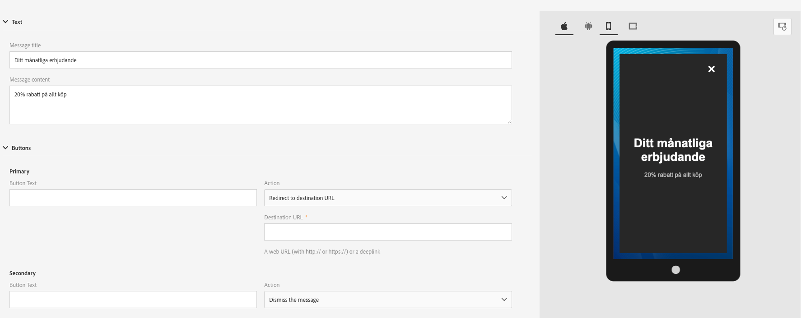
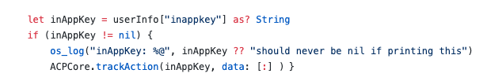

# In-App FAQ {#in-app-faq}

## What would be some useful resources recommendations to learn more about In-App channel in Adobe Campaign Standard? {#resources-inapp}

Check out the resources below:

* [Video Tutorials](https://experienceleague.adobe.com/docs/campaign-standard-learn/tutorials/communication-channels/mobile/in-app/in-app-message-overview.html)
* [Blog post](https://theblog.adobe.com/get-more-out-of-the-new-in-app-message-channel-from-adobe-campaign/)
* [Community Page](https://experienceleaguecommunities.adobe.com/t5/adobe-campaign-standard/ct-p/adobe-campaign-standard-community)

## What is the purpose of Campaign extensions APIs setLinkageField and resetLinkageField? {#extensions-apis}

Since In-App messages are pulled by the SDK from Campaign, we want to provide a secure mechanism to ensure that In-App Messages containing PII data do not fall into malicious hands. As such, we have following mechanism in place to ensure the secure delivery of messages to the device:

* Customers mark mobile profile fields (appSubscriberRcp table) fields as Personal and Sensitive if they want to ensure that this particular information gets delivered securely.
* Fields marked as such can only be used in Profile template (not in appSubscriber template or Broadcast template) which has additional security mechanism built in.
* Messages built using Profile template can only get served when the user has logged in the App. 
* In order to facilitate this secure handshake, mobile app developers should pass additional authentification details using the setLinkageField API. Please note that the linkage field are the ones that are identified as the link between Mobile Profile and CRM Profile while extending appSubscriberRcp table.
* They should flush the In-App messages stored on the device and resetLinkagefields when the user logs out of the App using resetLinkageField. This ensures that if a different user logs into the App, they do not see the messages meant for previous user.
* Refer to [Mobile SDK APIs](https://aep-sdks.gitbook.io/docs/using-mobile-extensions/adobe-campaign-standard/adobe-campaign-standard-api-reference) to implement this security mechanism client side.

## What do I have to do to enable In-App reporting in Campaign? {#enable-inapp-reporting}

You need to configure In-App tracking postback. Instructions can be found [here](https://helpx.adobe.com/campaign/kb/config-app-in-launch.html#InApptrackingpostback).

To implement local notification tracking, refer to this [page](../../administration/using/local-tracking.md).

## Which reports are available for In-App channel? {#report-inapp}

An out-of-the-box report is available in Adobe Campaign for In-App channel. Refer to this [documentation](../../reporting/using/in-app-report.md).

See this [page](../../reporting/using/indicator-calculation.md#in-app-delivery) to understand how each In-App metrics are calculated.

## Do you support multi-lingual content variants for In-App similar to Push? {#multilingual-inapp}

There are no multi-lingual templates available for In-App Messaging now.

However, if the objective is to send an In-App message in a language other than English, the content can be directly pasted in the available text boxes.

## Can Campaign personalization fields be added to Custom HTML? {#custom-html-inapp}

No, this is not yet supported.

## I have configured an alert message but it does not display on the device. {#alert-message}

For alert messages, at least one dismiss button (primary or secondary should have action dismiss) is required. Otherwise, it is possible to save the message but it will not be received.

## If Local notifications iOS custom sound does not play; will the default sound play instead? {#local-notification-sound}

For custom sound on iOS, you need to provide a file name with extension when creating a local notification (for example, sound.caf). If this extension is not provided, then the default sound is used.

## Are deeplinks supported in In-App messages? {#inapp-deeplinks}

Yes, deeplinks are supported in In-App messages. Deeplinks should include:

* language that states that delivery tracking needs to be disabled in order for the deeplinks to work.
* Appsflyer with Branch as partners that can do the deeplink tracking. For more information on Branch and Adobe Campaign Standard integration, refer to this [page](https://help.branch.io/using-branch/docs/adobe-campaign-standard-1).

## Can an In-App message be triggered when the user launches the app from a Push notification? {#inapp-push-trigger}

Yes, these messages are also referred as daisy chain messages. Follow the process below:

1. Create an In-App Message.

1. Define a custom event and select it as an event trigger for this IAM e.g. "Trigger from fall preview Push".

1. When authoring your Push message, define a custom variable whose value can be set as an event used to trigger IAM e.g. Key = "inappkey" and value = "Trigger from fall preview Push".

1. In the mobile app code, implement event trigger as follows:

    
