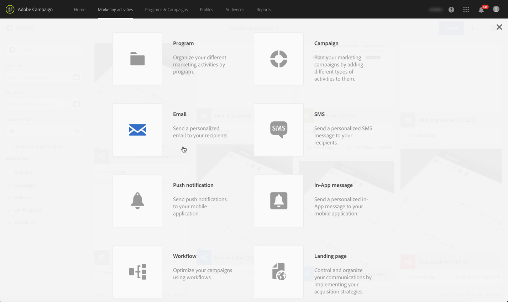
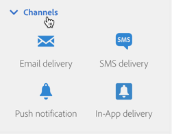
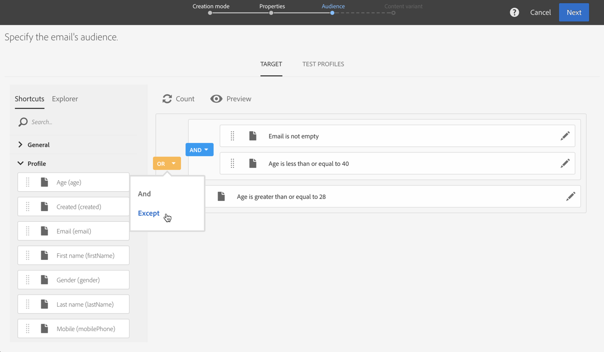
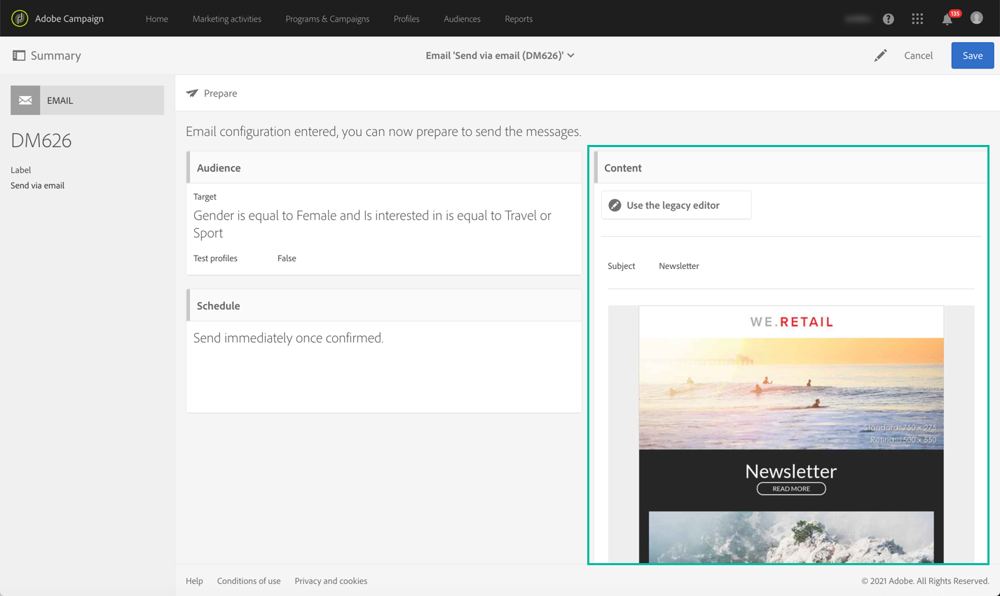
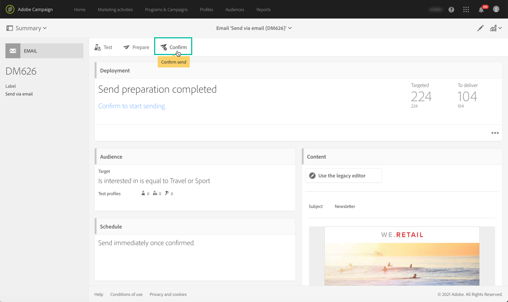
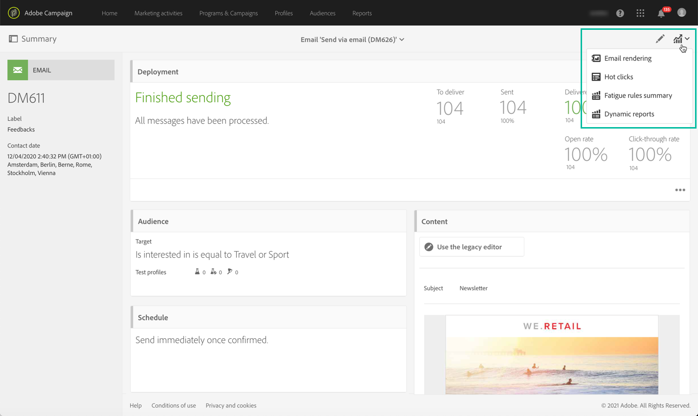

# Key steps to send a message{#key-steps-to-send-a-message}

In this section, you will learn how to create and send personalized messages to a targeted audience using Adobe Campaign Standard.

Specific information on how to create and configure each communication channel is available in these sections:

* [Creating an email](../../channels/using/creating-an-email.md)
* [Creating a SMS](../../channels/using/creating-an-sms-message.md)
* [Creating a direct mail delivery](../../channels/using/creating-the-direct-mail.md)
* [Creating a push notification](../../channels/using/preparing-and-sending-a-push-notification.md).
* [Preparing and sending an In-App message](../../channels/using/preparing-and-sending-an-in-app-message.md)

To learn the delivery best practices, consult the [Delivery best practices](../../sending/using/delivery-best-practices.md) section.

## Create your message

Leverage Campaign Standard [marketing activities](../../start/using/marketing-activities.md) to create an email, SMS, direct mail, push notification or In-App message.

Messages can be created either from the marketing activties list or from a workflow using [dedicated activities](../../automating/using/about-channel-activities.md).

## Define the audience

Define the recipients of your message. To do this, use the [query editor](../../automating/using/editing-queries.md) from the left pane to filter data contained in your database and build rules to target your audience.

There are several types of audiences available:

* **[!UICONTROL Target]** is the main target of your email,
* **[!UICONTROL Test profiles]** are the profiles used to test and validate your email (see [Managing test profiles](../../audiences/using/managing-test-profiles.md)).

## Design and personalize content

In the **[!UICONTROL Content]** block, design and personalize the content of your message using fields from your database. For more information on how to design content for a specific channel, refer to the sections listed at the top of this page.

## Prepare and test

[Prepare](../../sending/using/preparing-the-send.md) the message. This process calculates the target population and prepares the personalized message.

**Check and test your message** before sending it using Campaign Standard  capabilities: preview, email rendering, proofing, etc. For more on this, refer to [this section](../../sending/using/previewing-messages.md).

Use the **[!UICONTROL Schedule]** block to define when your messages will be sent (see [Scheduling messages](../../sending/using/about-scheduling-messages.md)).

## Send and track 

Once your message is ready, you can confirm the send. The **[!UICONTROL Deployment]** block displays the send progress and the result. 

Several logs are available to help you monitor the delivery of your messages (see [monitoring a delivery](../../sending/using/monitoring-a-delivery.md)). You can also track the behavior of your delivery recipients thanks to Campaign Standard's [tracking functionalities](../../sending/using/tracking-messages.md).

Measure the effectiveness of your messages and the evolution of your sends and campaigns through various indicators and charts (see [Accessing reports](../../reporting/using/about-dynamic-reports.md)).

