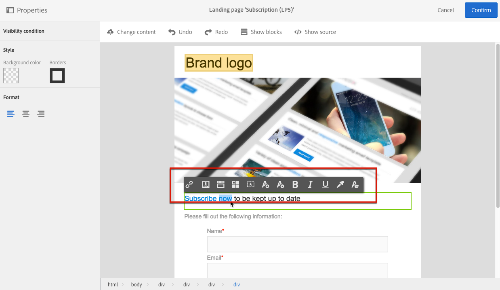

# Landing page content editor interface{#landing-page-content-editor-interface}

The landing page content editor allows you to easily define, modify, and personalize content in Adobe Campaign. To access it, click the **[!UICONTROL Content]** block in a landing page dashboard.

The content editor is organized into three different sections. These sections allow you to view and edit the content.

1. The **palette** on the left-hand side of the screen allows you to modify the general options linked to a selected block. The options that can be modified are: background color, border, text alignment, visibility condition, etc. See [Inserting a personalization field](../../designing/using/inserting-a-personalization-field.md).
1. The **action bar** contains the general options for the page. You can select a template and change the display mode. See [Landing page editor action bar](../../channels/using/landing-page-content-editor-interface.md#landing-page-editor-action-bar).
1. The main **editing zone** allows you to directly interact with the content using the contextual toolbar: insert a link into an image, change the font, delete a field, etc. See [Landing page editor toolbar](../../channels/using/landing-page-content-editor-interface.md#landing-page-editor-toolbar).

## Landing page editor action bar {#landing-page-editor-action-bar}

The action bar contains different buttons that allow you to interact with the content that is being created.

<table> 
 <thead> 
  <tr> 
   <th> Icon  </th> 
   <th> Button name  </th> 
   <th> Channel  </th> 
   <th> Description  </th> 
  </tr> 
 </thead> 
 <tbody> 
  <tr> 
   <td>    </td> 
   <td> Change content   </td> 
   <td> Landing page and email  </td> 
   <td> Allows you to select out-of-the-box content or import your own HTML content. Refer to <a href="../../designing/using/selecting-an-existing-content.md">Loading an existing content</a>.  </td> 
  </tr> 
  <tr> 
   <td>    </td> 
   <td> Undo   </td> 
   <td> All  </td> 
   <td> Cancels the last action carried out.  </td> 
  </tr> 
  <tr> 
   <td>    </td> 
   <td> Redo   </td> 
   <td> All  </td> 
   <td> Redoes the last action that you canceled.  </td> 
  </tr> 
  <tr> 
   <td>    </td> 
   <td> Show blocks   </td> 
   <td> Landing page and email  </td> 
   <td> Allows you to show the boxes around the content blocks (corresponds to the <strong>&lt;div&gt;</strong> HTML tag).  </td> 
  </tr> 
  <tr> 
   <td>    </td> 
   <td> Show source   </td> 
   <td> Landing page and email  </td> 
   <td> Allows you to show the HTML source code of the page.  </td> 
  </tr> 
 </tbody> 
</table>

## Landing page editor toolbar {#landing-page-editor-toolbar}

The toolbar is a **contextual element** of the editor interface that offers various functionalities depending on the zone selected. It contains action buttons and buttons that allow you to change the style of the text. The modifications carried out always apply to the zone selected. Once you select a block, you can delete or duplicate it for example. After selecting the text inside a block, you can turn it into a link or make it bold.

>[!CAUTION]
>
>Certain toolbar functions let you format the HTML content. However, if the page contains a CSS style sheet, the **instructions** from the style sheet may prove to take **priority** over the instructions specified via the toolbar.

<table> 
 <thead> 
  <tr> 
   <th> Icon  </th> 
   <th> Button name  </th> 
   <th> Context  </th> 
   <th> Description  </th> 
  </tr> 
 </thead> 
 <tbody> 
  <tr> 
   <td>    </td> 
   <td> Link to an external URL   </td> 
   <td> Any element  </td> 
   <td> Allows you to add a link to a URL. Details of how to configure a link are presented in the <a href="../../designing/using/inserting-a-link.md">Inserting a link</a> section.  </td> 
  </tr> 
  <tr> 
   <td>    </td> 
   <td> Link to a landing page   </td> 
   <td> Any element  </td> 
   <td> Allows access to an Adobe Campaign landing page. Details of how to configure a link are presented in the <a href="../../designing/using/inserting-a-link.md">Inserting a link</a> section.  </td> 
  </tr> 
  <tr> 
   <td>    </td> 
   <td> Subscription link   </td> 
   <td> Any element  </td> 
   <td> Allows you to insert a service subscription link. Details of how to configure a link are presented in the <a href="../../designing/using/inserting-a-link.md">Inserting a link</a> section.  </td> 
  </tr> 
  <tr> 
   <td>    </td> 
   <td> Unsubscription link   </td> 
   <td> Any element  </td> 
   <td> Allows you to insert a service unsubscription link. Details of how to configure a link are presented in the <a href="../../designing/using/inserting-a-link.md">Inserting a link</a> section.  </td> 
  </tr> 
  <tr> 
   <td>    </td> 
   <td> Remove link   </td> 
   <td> Link  </td> 
   <td> Allows you to delete the link, as well as all the configurations linked to it, after confirming.  </td> 
  </tr> 
  <tr> 
   <td>    </td> 
   <td> Insert a personalization field   </td> 
   <td> Text element  </td> 
   <td> Allows you to add a field from the database to the content. Refer to <a href="../../designing/using/inserting-a-personalization-field.md">Inserting a personalization field</a>.  </td> 
  </tr> 
  <tr> 
   <td>    </td> 
   <td> Insert a content block   </td> 
   <td> Text element  </td> 
   <td> Allows you to add a personalization block to the content. Refer to <a href="../../designing/using/adding-a-content-block.md">Adding a content block</a>.  </td> 
  </tr> 
  <tr> 
   <td>    </td> 
   <td> Enable dynamic content   </td> 
   <td> Text element  </td> 
   <td> Allows you to insert dynamic content in the content. Refer to <a href="../../channels/using/defining-dynamic-content-in-a-landing-page.md">Defining dynamic content</a>.  </td> 
  </tr> 
  <tr> 
   <td>    </td> 
   <td> Disable dynamic content   </td> 
   <td> Text element  </td> 
   <td> Allows you to delete dynamic content.  </td> 
  </tr> 
  <tr> 
   <td>    </td> 
   <td> Enlarge font   </td> 
   <td> Text element  </td> 
   <td> Increases the size of the selected text (adds <strong>&lt;span style="font-size:"&gt;</strong>).  </td> 
  </tr> 
  <tr> 
   <td>    </td> 
   <td> Reduce font   </td> 
   <td> Text element  </td> 
   <td> Reduces the size of the selected text (adds <strong>&lt;span style="font-size:"&gt;</strong>).  </td> 
  </tr> 
  <tr> 
   <td>    </td> 
   <td> Bold   </td> 
   <td> Text element  </td> 
   <td> Adds the bold style to the selected text (wraps the text with the <strong>&lt;strong&gt;</strong><strong>&lt;/strong&gt;</strong> tags).  </td> 
  </tr> 
  <tr> 
   <td>    </td> 
   <td> Italic   </td> 
   <td> Text element  </td> 
   <td> Adds the italic style to the selected text (wraps the text with the <strong>&lt;em&gt;</strong><strong>&lt;/em&gt;</strong> tags).  </td> 
  </tr> 
  <tr> 
   <td>    </td> 
   <td> Underline   </td> 
   <td> Text element  </td> 
   <td> Underlines the selected text (wraps the selected text with the <strong>&lt;span style="text-decoration: underline;"&gt;</strong> tag).  </td> 
  </tr> 
  <tr> 
   <td>    </td> 
   <td> Change background color   </td> 
   <td> Text element  </td> 
   <td> Allows you to change the background color of the block selected (adds style="background-color: rgba(170, 86, 255, 0.87)).  </td> 
  </tr> 
  <tr> 
   <td>    </td> 
   <td> Change font color   </td> 
   <td> Text element  </td> 
   <td> Allows you to change the color of all the text in the block or just the text selected in the block (<strong>&lt;span style="color: #56ff56;"&gt;</strong>).  </td> 
  </tr> 
  <tr> 
   <td>    </td> 
   <td> Image   </td> 
   <td> Block containing an image  </td> 
   <td> Allows you to insert an image from a file saved locally.  </td> 
  </tr> 
  <tr> 
   <td>    </td> 
   <td> Delete   </td> 
   <td> Any block  </td> 
   <td> Deletes the block and its content.  </td> 
  </tr> 
  <tr> 
   <td>    </td> 
   <td> Duplicate   </td> 
   <td> Any block  </td> 
   <td> Duplicates the block including any styles linked to it.  </td> 
  </tr> 
 </tbody> 
</table>

