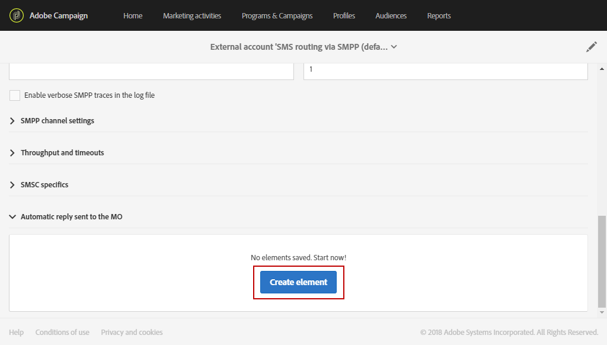
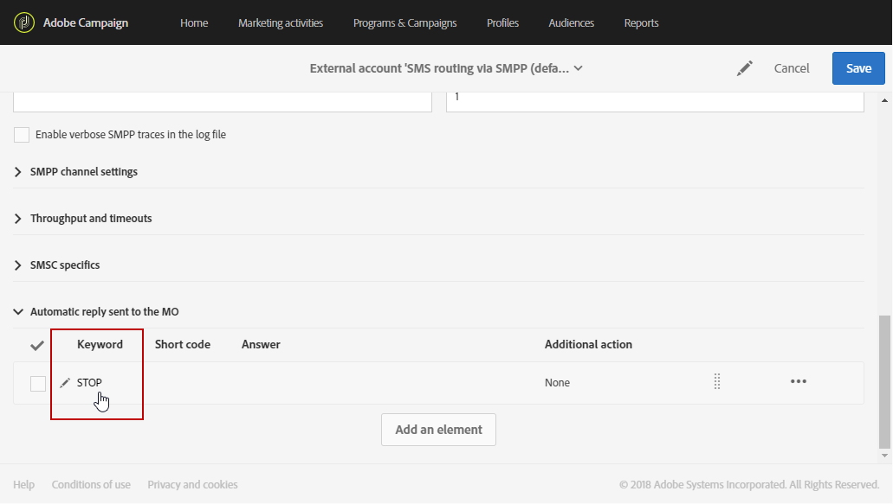
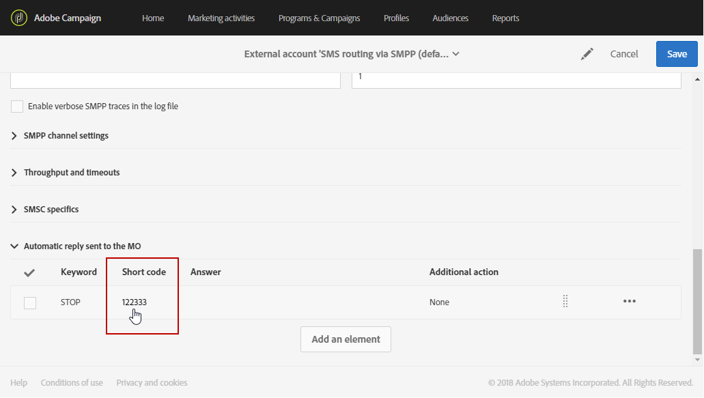
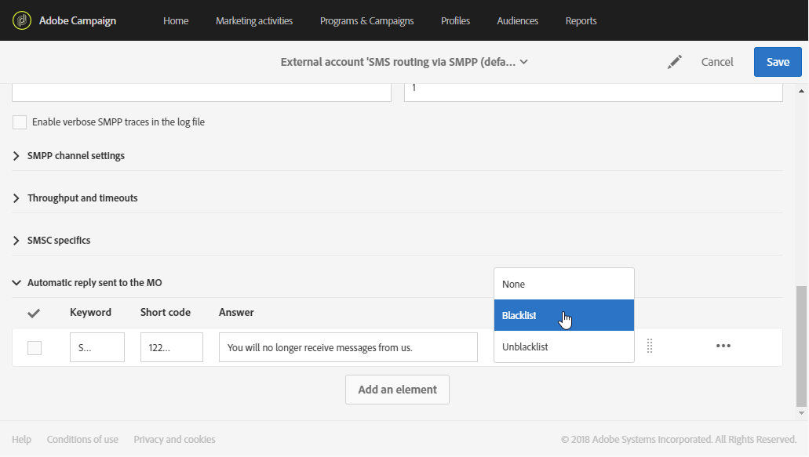
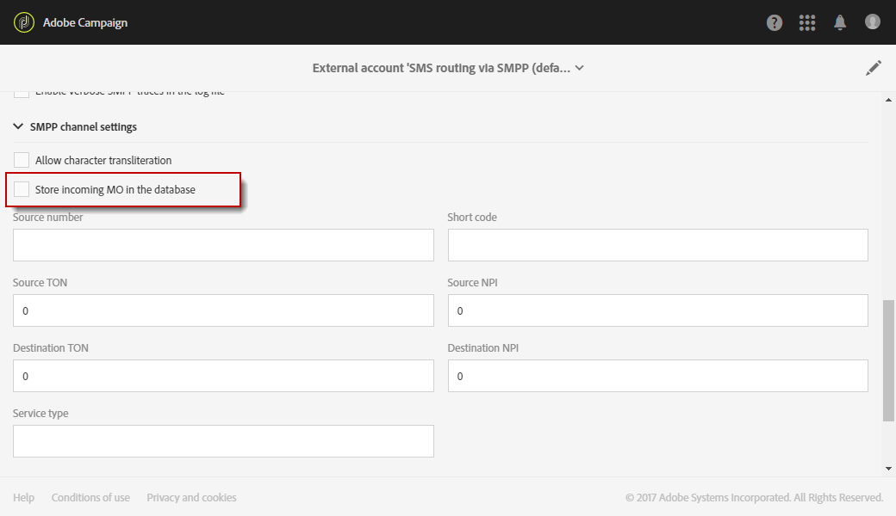
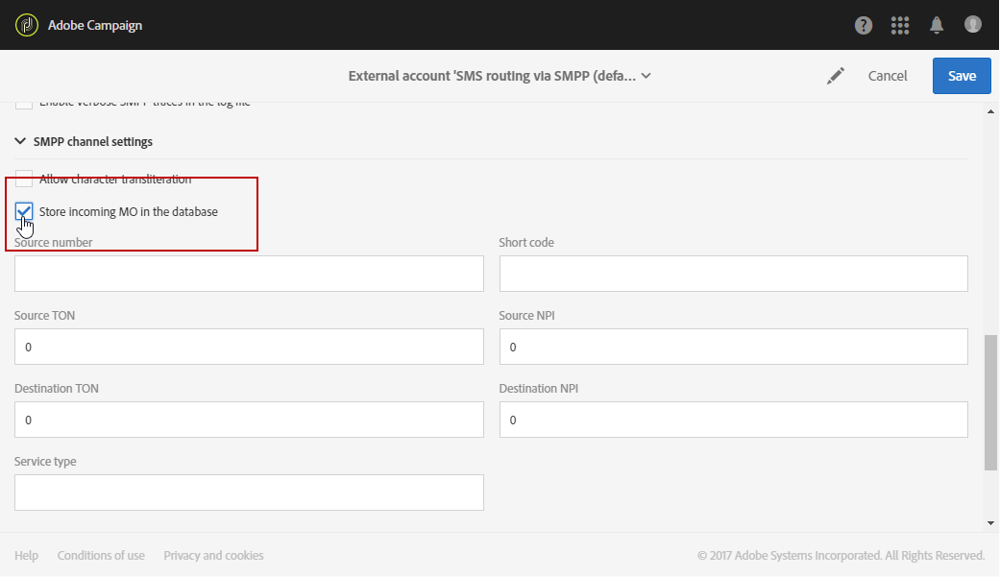
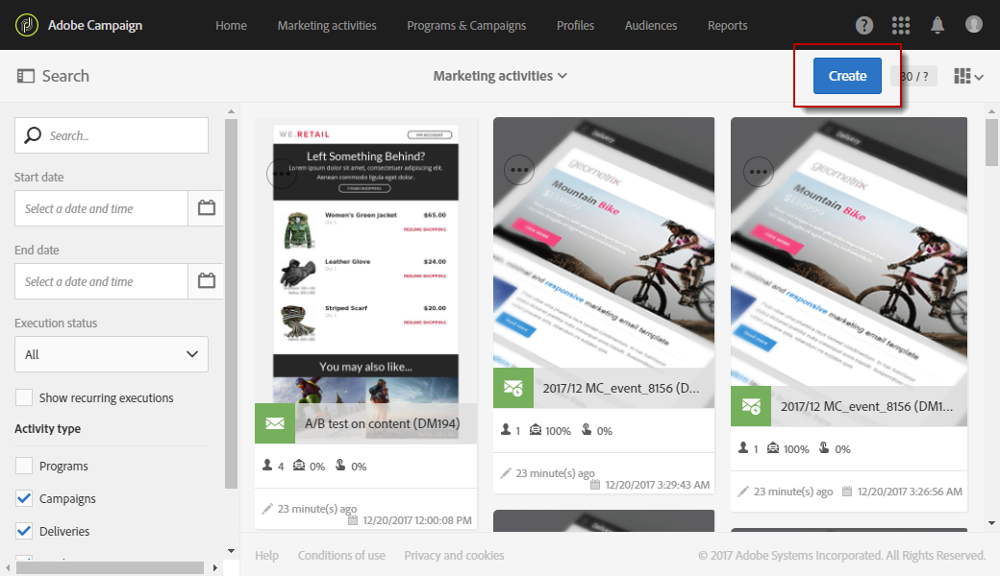
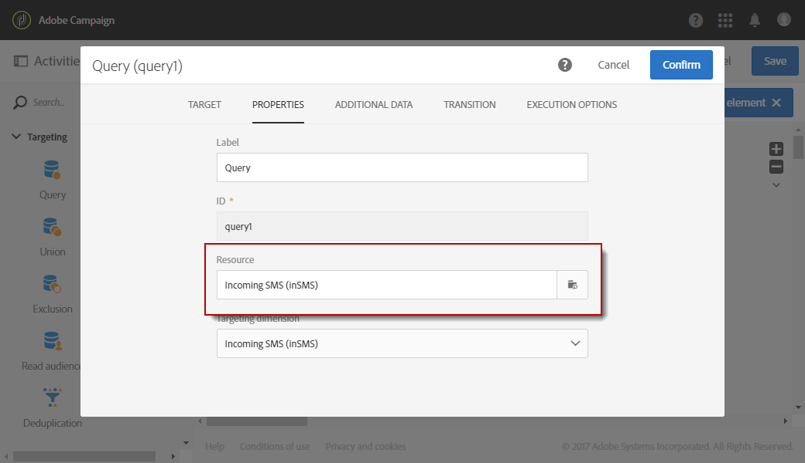
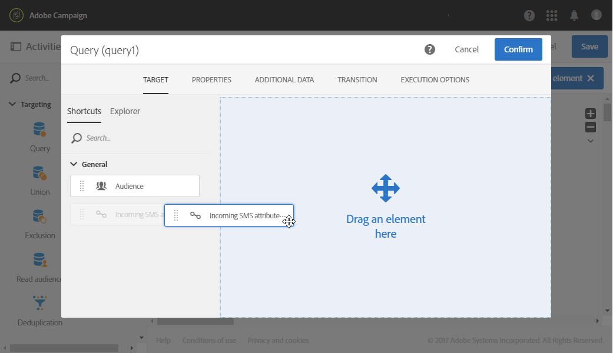
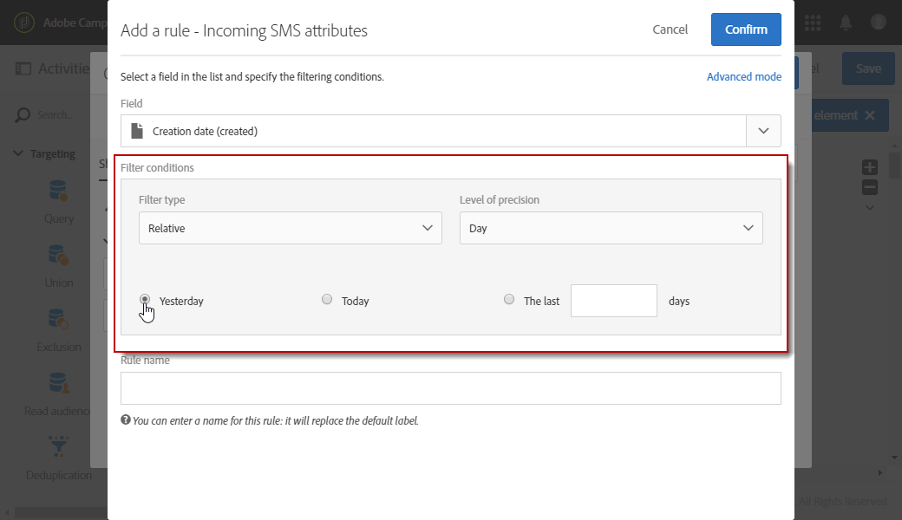

# Managing incoming SMS{#managing-incoming-sms}

## Managing STOP SMS {#managing-stop-sms}

When a profile replies to an SMS message which was sent via Campaign, you can configure messages which are automatically sent back to him as well as the action to perform.

This configuration is defined in the **[!UICONTROL Automatic reply sent to the MO]** section of the [SMS Routing external account](../../administration/using/configuring-sms-channel.md#defining-an-sms-routing). MO stands for 'Mobile Originated', which means that you can configure an auto-reply to the mobile who sent the SMS.

To do so:

1. From the advanced menu, via the Adobe Campaign logo, select **[!UICONTROL Administration > Application settings > External accounts]** then the **[!UICONTROL SMS routing via SMPP]** external account.
1. Under the **[!UICONTROL Automatic reply sent to the MO]** category, click **[!UICONTROL Create element]** to start configuring your automatic reply.

   

1. Choose the keyword that will trigger this automatic reply. The keywords are not case-sensitive. For example, here, if recipients send the keyword "STOP", they will receive the automatic reply.

   Leave this column empty if you want to send the same reply no matter what the keyword is.

   

1. In the **[!UICONTROL Short code]** field, specify a number that is usually used to send deliveries and will serve as a sender name. You can also decide to leave the **[!UICONTROL Short code]** column empty, to send the same reply no matter what the short code.

   

1. Type in the answer you want to send to your recipients in the field **[!UICONTROL Reply]**.

   To carry out an action without sending a reply, leave the **[!UICONTROL Reply]** column empty. For example, this allows you to remove from quarantine the phone number of a user who replies with a message other than "STOP".

   

1. In the **[!UICONTROL Additional action]** field, link an action to your automatic reply:

    * The **[!UICONTROL Send to quarantine]** action automatically quarantines the profile phone number.
    * The **[!UICONTROL Remove from quarantine]** action removes the profile phone number from quarantine.
    * The **[!UICONTROL None]** action allows you to only send the message to your recipients without carrying an action.

   For example, in the configuration below, if recipients send the keyword "STOP", they will automatically receive an unsubscription confirmation and their phone number will be sent to quarantine with the **[!UICONTROL On denylist]** status. This status refers to the phone number only, the profile is  so that the user continues receiving email messages.

   

1. Click **[!UICONTROL Save]**. 

1. From the **[!UICONTROL Advanced parameters]** of your SMS delivery **[!UICONTROL Properties]**, you can set a specific **[!UICONTROL Short code]** to automatically exclude recipients who opted-out. For more information on this, refer to [this section](../../administration/using/configuring-sms-channel.md#configuring-sms-properties).

Your recipients can now be automatically unsubscribed to your messages and sent to quarantine with this automatic reply. The quarantined recipients are listed in the **[!UICONTROL Addresses]** table available through the **[!UICONTROL Administration]** > **[!UICONTROL Channels]** > **[!UICONTROL Quarantines]** menu. For more information on quarantines, refer to this [section](../../sending/using/understanding-quarantine-management.md).

These incoming SMS can be stored if needed. For more information on this, refer to this [section](#storing-incoming-sms).

## Storing incoming SMS {#storing-incoming-sms}

In the **[!UICONTROL SMS routing via SMPP]** external account, you can choose to store incoming messages for example when a subscriber replies "STOP" to an SMS message in order to be removed from your recipient lists.

By checking **[!UICONTROL Store incoming MO in the database]** in the **[!UICONTROL SMPP channel settings]** category, all SMS will be stored in the inSMS table and can be retrieved via a query activity in a workflow.

To do so:

1. In the **[!UICONTROL SMPP channel settings]** field, check **[!UICONTROL Store incoming MO in the database]**.

   

1. In the **[!UICONTROL Marketing activities]** tab, click **[!UICONTROL Create]** then select **[!UICONTROL Workflow]**.

   

1. Select your workflow type.
1. Edit the properties of your workflow, then click **[!UICONTROL Create]**. For more on workflows creation, refer to this [section](../../automating/using/building-a-workflow.md).
1. Drag and drop a **[!UICONTROL Query]** activity and double-click the activity.
1. In the **[!UICONTROL Properties]** tab of the query, choose **[!UICONTROL Incoming SMS (inSMS)]** in the **[!UICONTROL Resource]** field.

   

1. Then, in the **[!UICONTROL Target]** tab, drag and drop the **[!UICONTROL Incoming SMS attributes]** rule.

   

1. Here, we want to target every incoming message from the day before. In the **[!UICONTROL Field]** category, select **[!UICONTROL Creation date (created)]**.
1. In **[!UICONTROL Filter type]**, select **[!UICONTROL Relative]** then in **[!UICONTROL Level of precision]**, choose **[!UICONTROL Day]**.

   

1. You can then choose to retrieve data from today, the day before or the last few days. Click **[!UICONTROL Confirm]** when your query is configured.

This query will retrieve every STOP message received depending on the chosen time range.

The activity allows you for example to build a population and better personalize your deliveries.
