# Managing landing page form data{#managing-landing-page-form-data}

In the landing page content, input fields are used to store or update data from the Campaign database.

To do this, these fields must be mapped to database fields.

You can define and manage their mapping through the **[!UICONTROL Form data]** section on the left palette.

## Mapping form fields {#mapping-form-fields}

To update the Campaign database according to your needs, link relevant database fields to input zone, radio button or checkbox type blocks of your landing page.

To do this, follow the steps below:

1. Select a block in the landing page content.

   >[!NOTE]
   >
   >The default fields of the built-in landing pages are preconfigured. You can modify them as needed.

1. Access the **[!UICONTROL Form data]** section on the left palette.

1. To change the field type, select a value from the **[!UICONTROL HTML type of the field]** drop-down list.

   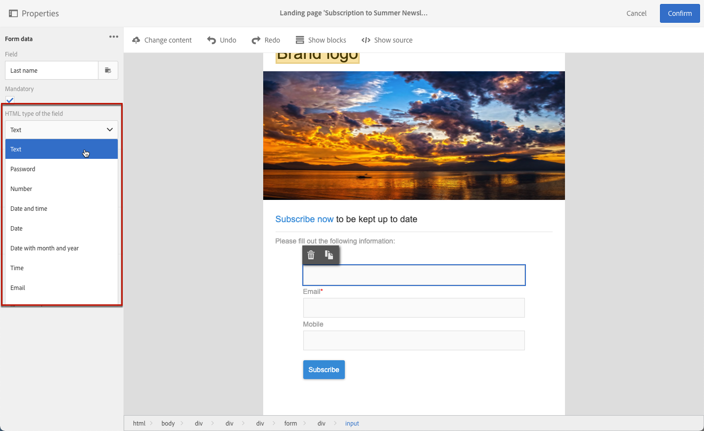

   >[!NOTE]
   >
   >For more on using the checkbox type in a landing page, see the [Update multiple service subscriptions](#multiple-subscriptions) and [Agreement checkbox](#agreement-checkbox) sections.

1. If you select a field type that is not compatible with the database field currently selected in the **[!UICONTROL Field]** zone, a warning message will display. For optimal mapping, select an appropriate value.

   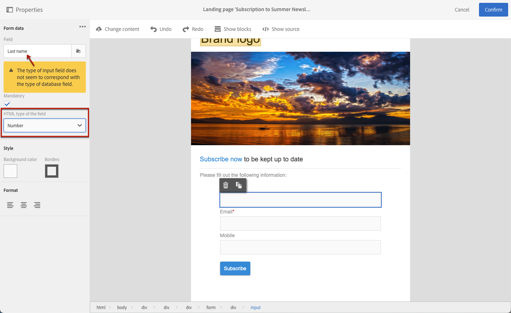

1. Use the **[!UICONTROL Field]** zone to select a database field that will be linked to the form field.

   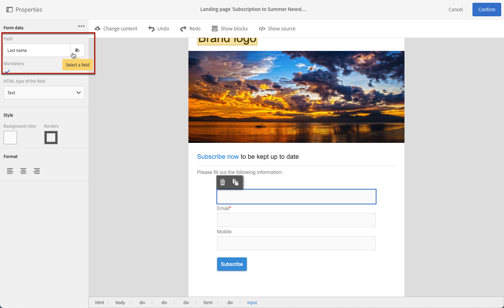

   >[!NOTE]
   >
   >Landing pages can only be mapped with the **[!UICONTROL Profiles]** or **[!UICONTROL Service]** resources.

   In this example, map the **Name** field of your landing page to the **[!UICONTROL Last name]** field of the **[!UICONTROL Profiles]** resource.

   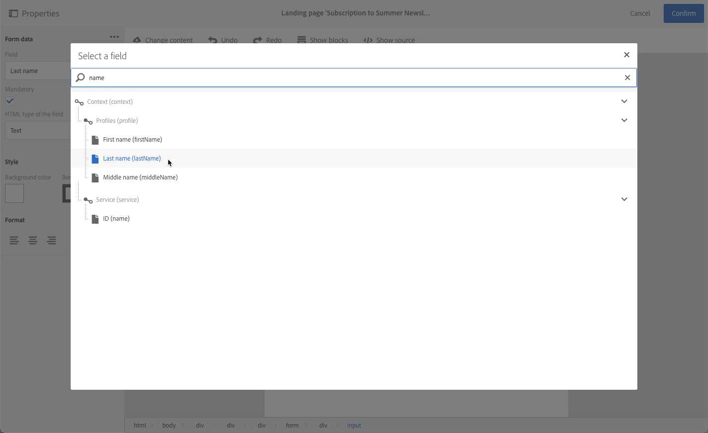

1. Check the **[!UICONTROL Mandatory]** option if needed. In that case, the landing page can only be submitted if the user has filled in this field.

   

   If a mandatory field is not filled in, an error message will display when the user submits the page.

1. Click **[!UICONTROL Confirm]** to save your changes.

<!--If you choose a mandatory **[!UICONTROL Checkbox]**, make sure that it is of **[!UICONTROL Field]** type.-->

## Data storage and reconciliation{#data-storage-and-reconciliation}

Data reconciliation parameters allow you to define how the data entered in the landing page is managed once it has been submitted by a user.
 
To do this:

1. Edit the landing page properties accessed via the  icon in the landing page dashboard, and display the **[!UICONTROL Job]** parameters.

   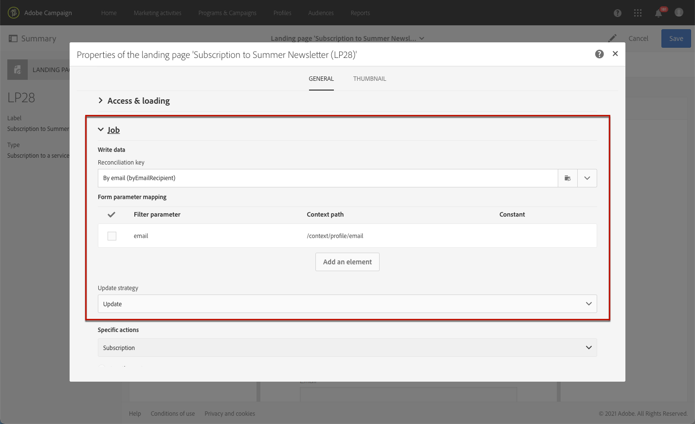

1. Select the **[!UICONTROL Reconciliation key]**: this database field is used to determine whether the visitor has a profile that is already known in the Adobe Campaign database. It can be for example email, first name, last name. The reconciliation key allows you to update or create a profile, according to the **[!UICONTROL Update strategy]** parameter defined below.

1. Define the **[!UICONTROL Form parameter mapping]**: this section allows you to map the landing page field parameters and those used in the reconciliation key.

1. Select the **[!UICONTROL Update strategy]**: if the reconciliation key recovers an existing database profile, you can choose for this profile to be updated with the data entered in the form, or instead prevent this update.

   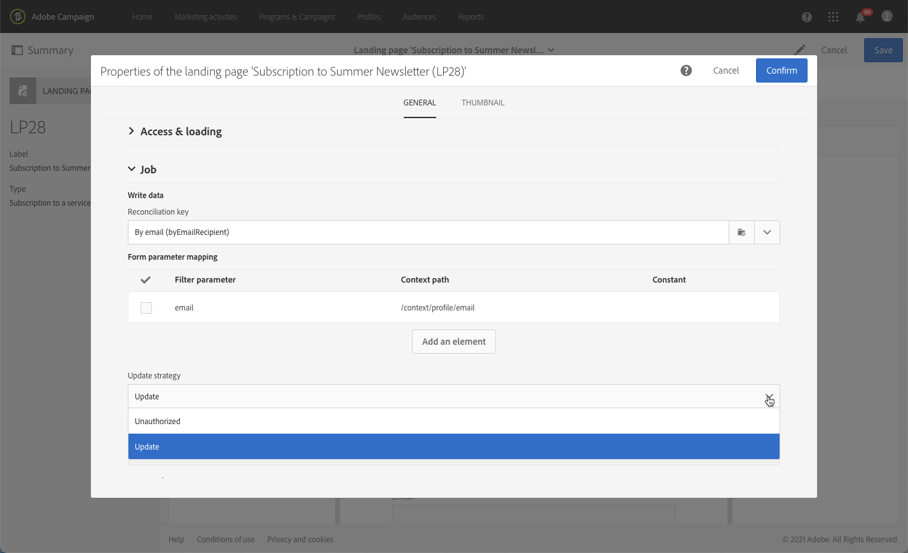

## Multiple service subscriptions {#multiple-subscriptions}

You can use several checkboxes on a single landing page to allow users to subscribe or unsubscribe from multiple services.

To do this, follow the steps below:

1. When designing the landing page:

   * Select a block, and from the **[!UICONTROL Form data]** section, choose **[!UICONTROL Checkbox]** as the field type.

      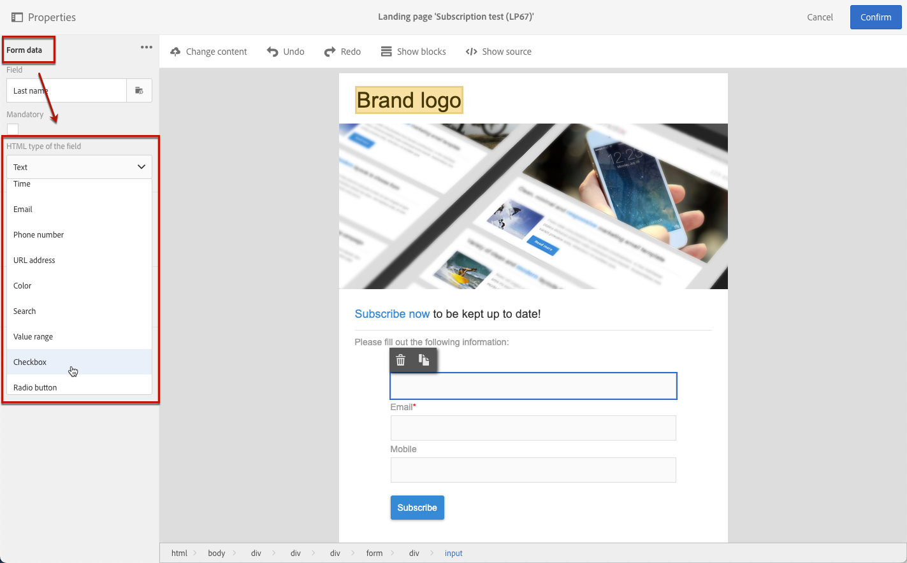

   * If you are familiar with HTML, you can also manually insert a checkbox using the **[!UICONTROL Show source]** button.

      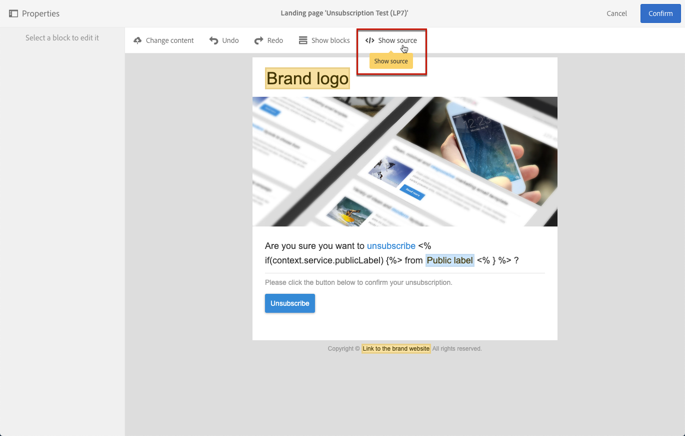

      This allows you to insert the checkbox wherever convenient on the page.

      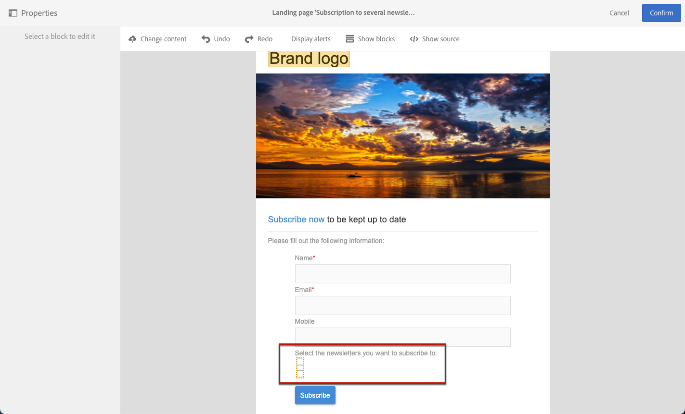

1. Make sure the checkbox is selected in your content. The **[!UICONTROL Type]** drop-down list is displayed in the **[!UICONTROL Form data]** section of the left palette. Select **[!UICONTROL Service and subscription]** from the list.

   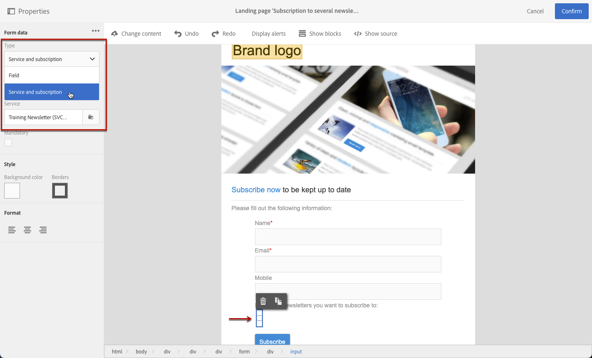

1. Choose an option from the **[!UICONTROL Behavior]** drop-down list.

   

1. Select a [service](../../audiences/using/creating-a-service.md) from the corresponding list.

   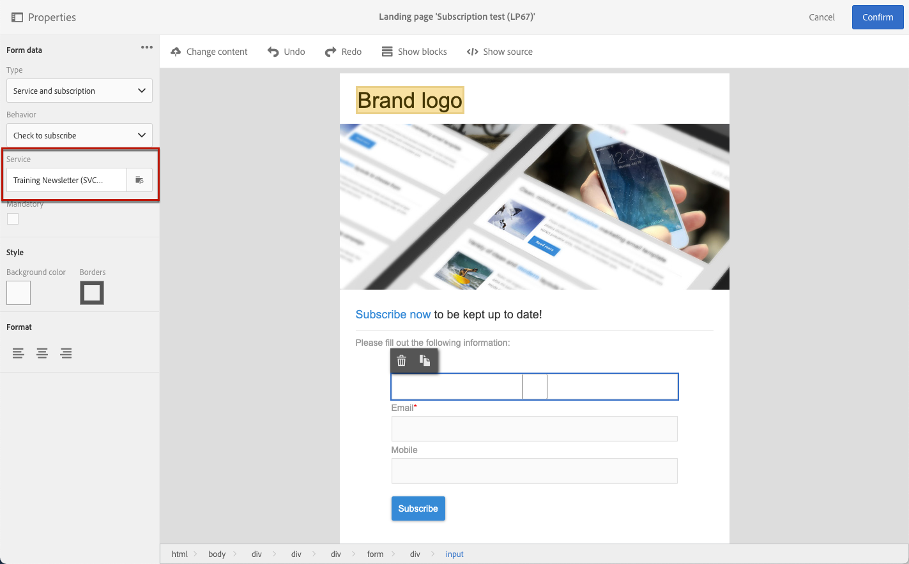

1. Make sure the **[!UICONTROL Mandatory]** option is unchecked. Otherwise, your users will not have a choice.

   

1. To add more checkboxes enabling to subscribe to other services, repeat the steps above as many times as needed.

   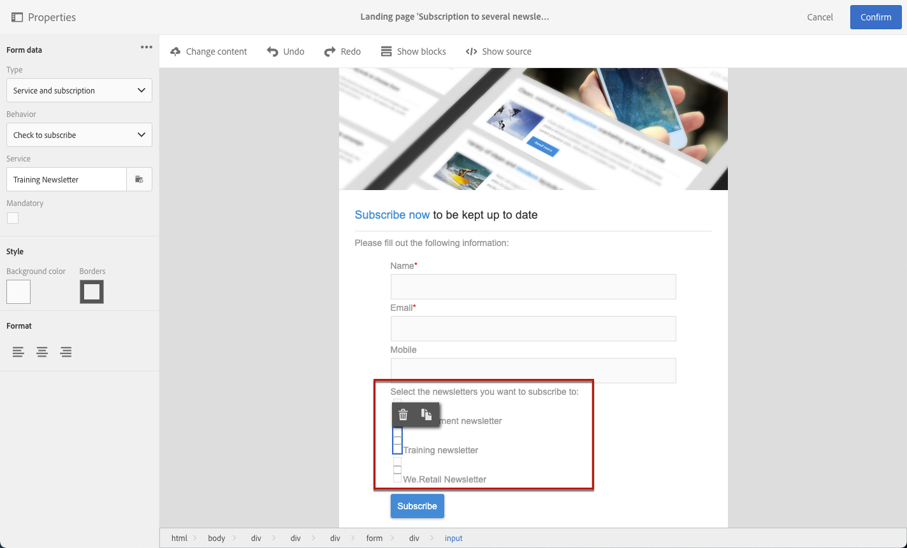

Once the landing page is published, the users can select multiple checkboxes to subscribe to several newsletters from the same page.

## Agreement checkbox {#agreement-checkbox}

You can add a checkbox that the profile is required to check before submitting the landing page.

For example, this allows you to request users' consent for privacy policy, or to make them accept your terms and conditions, before they submit the form.

>[!IMPORTANT]
>
>Selecting this checkbox is mandatory for your users. If not selected, they will not be able to submit the landing page.

To insert and configure this checkbox, do the following:

1. When designing the landing page:

   * Select a block, and from the **[!UICONTROL Form data]** section, choose **[!UICONTROL Checkbox]** as the field type.

      

   * If you are familiar with HTML, you can also manually insert a checkbox using the **[!UICONTROL Show source]** button.

      

      <!--Manually insert a checkbox, such as in the example below:

      <!--Click **[!UICONTROL Hide source]**.-->

1. Make sure the checkbox is selected.

   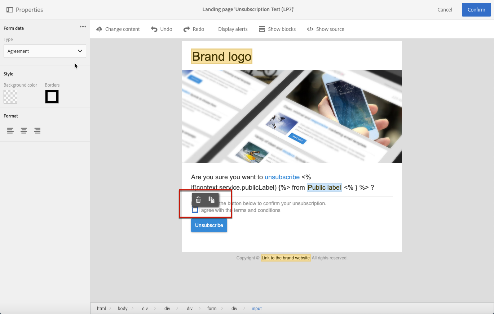

1. The **[!UICONTROL Type]** drop-down list is displayed in the **[!UICONTROL Form data]** section of the left palette. Select **[!UICONTROL Agreement]** from the list.

   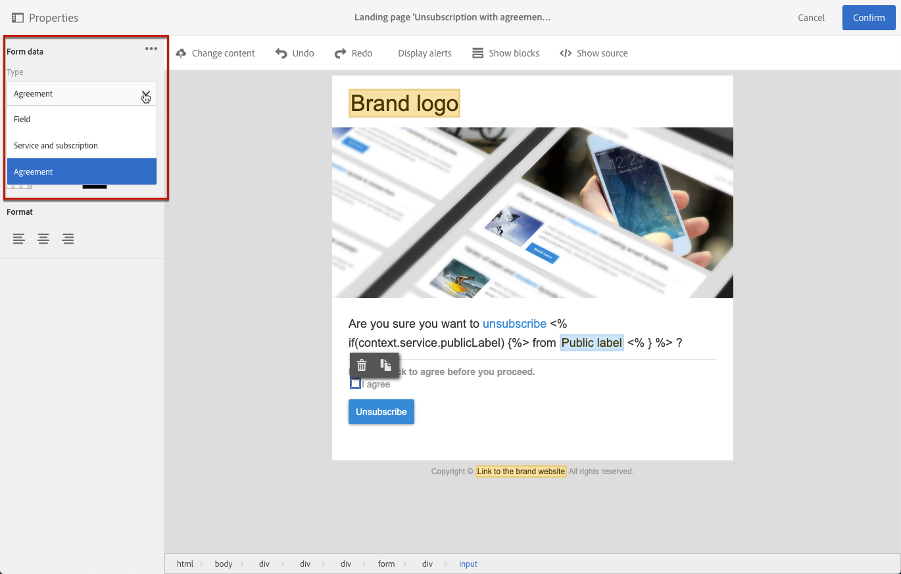

   >[!NOTE]
   >
   >The **[!UICONTROL Agreement]** element is not mapped to a field of the Campaign database.

1. Click the  icon next to **[!UICONTROL Form data]** to access the checkbox advanced properties.

1. You can edit the message if needed.

   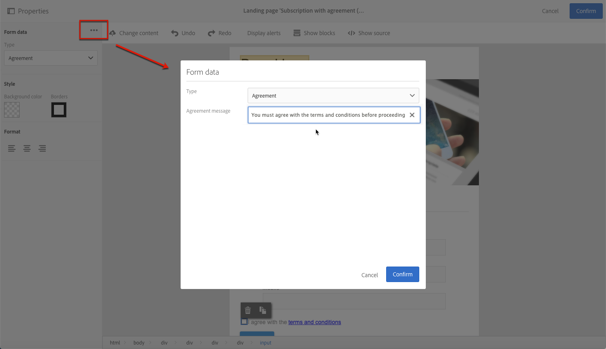

   This text will display as a warning if the user does not select the checkbox before submitting the form.

   >[!NOTE]
   >
   >This action is mandatory by default and cannot be changed.

1. Click **[!UICONTROL Confirm]**.

Now, each time the landing page is displayed, the user will have to select this checkbox before submitting the form. If not, the warning will display and the user will not be able to submit the form until the checkbox is activated.