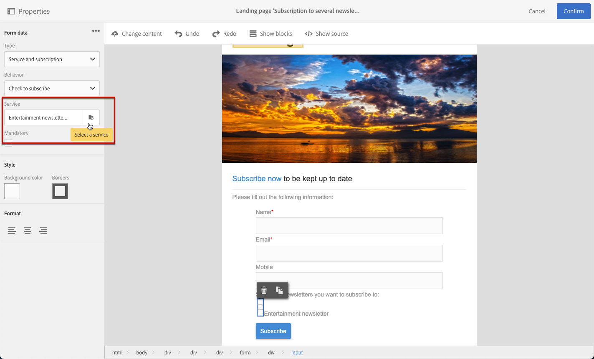

# Managing landing page form data{#managing-landing-page-form-data}

## Changing a landing page form data properties{#changing-a-landing-page-form-data-properties}

You can link database fields to input zone, radio button or checkbox type blocks. To do this, select the block and access the **[!UICONTROL Form data]** in the palette.

* The **Field** input zone lets you select a database field to link with the form field.
* The **Mandatory** option lets you only authorize the page's submission if the user has filled in the field. If a mandatory field is not filled in, an error message will appear.

>[!NOTE]
>
>For more on using checkboxes in a landing page, see the [Update multiple service subscriptions](#multiple-subscriptions) and [Agreement checkbox](#agreement-checkbox) sections.

## Mapping form fields {#mapping-form-fields}

Input fields are used to store or update data in the Campaign database. For this, you need to link database fields with input zone, radio button, or checkbox type blocks. To do this:

1. Select a block in the landing page.
1. Complete the **[!UICONTROL Form data]** part in the palette.

   

1. Choose a database field to link with the form field in the **[!UICONTROL Field]** selection zone.

   >[!NOTE]
   >
   >Landing pages can only be mapped with **Profiles**.

1. Check the **[!UICONTROL Mandatory]** option if needed. The page can only be submitted if the user has completed this field. If a mandatory field is not completed, an error message will appear when the user validates the page.

1. Define the field type by choosing, for example **[!UICONTROL Text]**, **[!UICONTROL Number]**, or **[!UICONTROL Date]** in the **[!UICONTROL HTML type of the field]** selection area.
   If you choose a mandatory **[!UICONTROL Checkbox]**, make sure that it is of **[!UICONTROL Field]** type.

>[!NOTE]
>
>The default fields of the built-in landing pages are preconfigured. You can modify them as needed.

## Data storage and reconciliation{#data-storage-and-reconciliation}

Data reconciliation parameters allow you to define how the data entered in the landing page is managed once it has been submitted by a user.

To do this:

1. Edit the landing page properties accessed via the  icon in the landing page dashboard, and display the **[!UICONTROL Job]** parameters.

   

1. Select the **[!UICONTROL Reconciliation key]**: these database fields (for example: email, first name, last name) are used to determine whether the visitor has a profile that is already known in the Adobe Campaign database. This allows you to update or create a profile, according to the update strategy parameters defined.
1. Define the **[!UICONTROL Form parameter mapping]**: this section allows you to map the landing page field parameters and those used in the reconciliation key.
1. Select the **[!UICONTROL Update strategy]**: if the reconciliation key recovers an existing database profile, you can choose for this profile to be updated with the data entered in the form or instead prevent this update.

## Update multiple service subscriptions {#multiple-subscriptions}

You can use several checkboxes on a single landing page to allow users to subscribe or unsubscribe from multiple services.

To do this, follow the steps below:

1. When designing the landing page:

   * Select a block, and from the **[!UICONTROL Form data]** palette, choose **[!UICONTROL Checkbox]** as the field type.

      

   * If you are familiar with HTML, you can also manually insert a checkbox using the **[!UICONTROL Show source]** button.

      

      This will allow you to insert the checkbox where convenient.

      

1. Make sure the checkbox is selected. From the **[!UICONTROL Type]** drop-down list, select **[!UICONTROL Service and subscription]**.

   

1. Choose an option from the **[!UICONTROL Behavior]** drop-down list.

   

1. Select a service from the corresponding list.

   

1. Make sure the **[!UICONTROL Mandatory]** option is unchecked.

   

1. To add more checkboxes enabling to subscribe to other services, repeat the steps above as many times as needed.

   

Once the landing page is published, the user can select multiple checkboxes to subscribe to several newsletters from the same page.

## Agreement checkbox {#agreement-checkbox}

You can add a checkbox that the profile is required to check before submitting the landing page.

For example, this allows you to request users' consent for privacy policy, or to make them accept your terms and conditions, before they submit the form.

>[!IMPORTANT]
>
>Selecting this checkbox is mandatory for your users. If not selected, they will not be able to submit the landing page.

To insert and configure this checkbox, do the following:

1. When designing the landing page:

   * Select a block, and from the **[!UICONTROL Form data]** palette, choose **[!UICONTROL Checkbox]** as the field type.

   * If you are familiar with HTML, you can also manually insert a checkbox using the **[!UICONTROL Show source]** button.

      

      Manually insert a checkbox, such as in the example below:

      

      <!--Click **[!UICONTROL Hide source]**.-->

1. Make sure the checkbox is selected.

   

1. The corresponding drop-down list is displayed in the **[!UICONTROL Form data]** section of the palette. Select **[!UICONTROL Agreement]** from the list.

   

   >[!NOTE]
   >
   >The **[!UICONTROL Agreement]** element is not mapped to a field of the Campaign database.

1. Click the  icon next to **[!UICONTROL Form data]** to access the checkbox advanced properties.

1. You can edit the message if needed.

   

   This text will display as a warning if the user does not select the checkbox before submitting the form.

   >[!NOTE]
   >
   >This action is mandatory by default and cannot be changed.

1. Click **[!UICONTROL Confirm]**.

Now, each time the landing page is displayed, the user will have to select this checkbox before submitting the form. If not, the warning will display and the user will not be able to submit the form until the checkbox is activated.