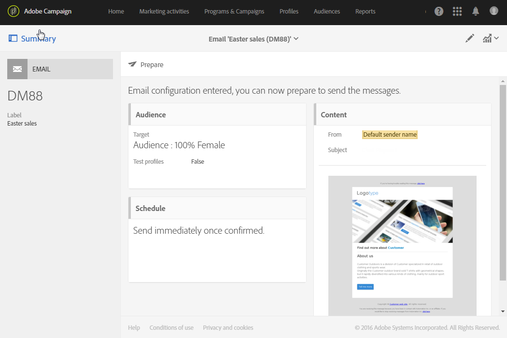
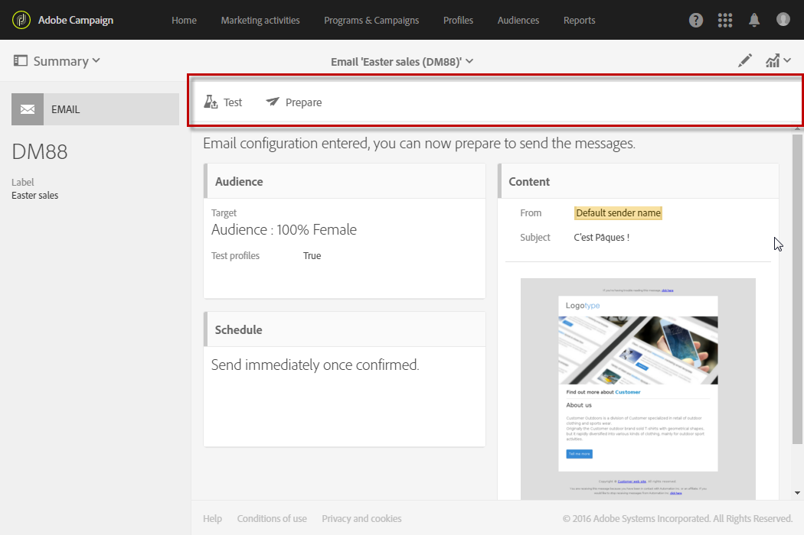
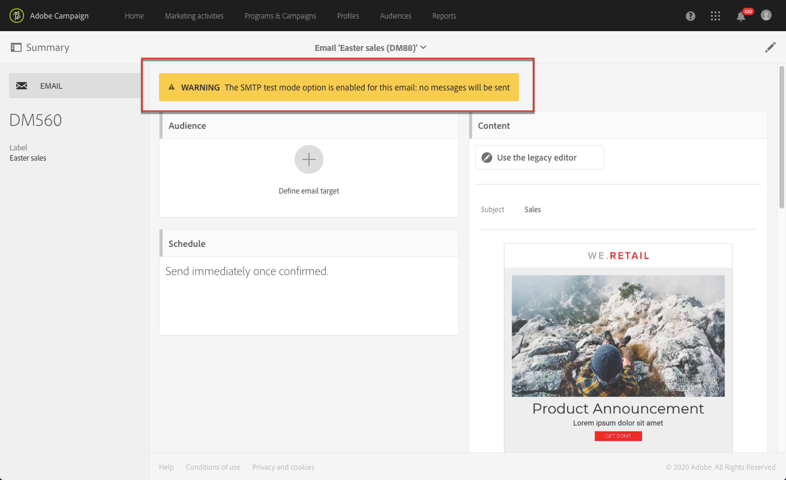

# Message dashboard{#message-dashboard}

The message dashboard is a workspace made up of different icons - regrouped into an action bar - and various functional blocks that allow you to establish your message's parameters and send it. These elements are presented hereafter.

## Gray bar {#gray-bar}

The gray bar regroups various icons linked to your message.

* **[!UICONTROL Summary]**: shows/hides the main information regarding the message.
* **[!UICONTROL Edit properties]**: lets you edit the message's [advanced parameters](../../administration/using/configuring-email-channel.md#list-of-email-properties).
* **[!UICONTROL Reports]**: gives you access to the reports relating to the message.

**Related topics:**

* [Configuring channels](../../administration/using/about-channel-configuration.md)
* [Accessing reports](../../reporting/using/about-dynamic-reports.md)

## Action bar {#action-bar}

The action bar has different icons that allow you to interact with your message.

Depending on the parameters that have been set up and the progress made, certain icons may not be available.

* **[!UICONTROL Show proofs]**: shows/hides the list of proofs that have been sent, if they exist. This button is only enabled once you have sent proofs.

  For more on proofs, see [Sending proofs](../../sending/using/sending-proofs.md).

* **[!UICONTROL Send a test]**: lets you select the approval mode to use: **[!UICONTROL Email rendering]** (email only), **[!UICONTROL Proof]** or both. For more on test profiles, see [Sending proofs](../../sending/using/sending-proofs.md). This button is only enabled once you have created test profiles.

* **[!UICONTROL Prepare send]**: starts to prepare the send. The **[!UICONTROL Deployment]** block appears and displays the result of the preparation. This button only appears once the target has been entered. You can stop preparation at any time using the corresponding button. For more on message preparation, refer to [Preparing the send](../../sending/using/preparing-the-send.md).

* **[!UICONTROL Confirm send]**: confirms sending the message. The sending statistics appear in the **[!UICONTROL Deployment]** block. This button only appears after the send has been prepared. You can stop or pause the send at any time using the **Stop send** and **[!UICONTROL Pause]** buttons. For more on confirming sending, refer to [Sending messages](../../sending/using/confirming-the-send.md).

## Blocks {#blocks}

The main screen is made up of different blocks. Click inside a block to access the corresponding parameter screen:

* **[!UICONTROL Deployment]**: allows you to track the progress of the message preparation or send. Click the button found in the lower right section of this block to access the send and analysis logs. This block only appears once the send has been prepared. For more on this. See [Confirming send](../../sending/using/confirming-the-send.md).
* **[!UICONTROL Audience]**: allows you to establish the message's main target as well as the test profiles. See [Creating audiences](../../audiences/using/creating-audiences.md).
* **[!UICONTROL Schedule]**: allows you to specify the date on which your message will be sent. See [Scheduling](../../sending/using/about-scheduling-messages.md).
* **[!UICONTROL Content]**: allows you to define the message's content and preview it. See [Key steps to send a message](../../channels/using/key-steps-to-send-a-message.md).

## Warnings {#warnings}

In some cases, a warning may appear in a yellow banner on top of the message dashboard.

Below is a list of the messages that can be displayed:

* *"The SMTP test mode option is enabled for this email: no messages will be sent."*

    For more on this, see [this section](../../administration/using/configuring-email-channel.md#smtp-test-mode).

* *"Routing external account has been disabled."*

    For more on this, see [External accounts](../../administration/using/external-accounts.md).

* *"Messages cannot be sent because the current IP affinity is not handled by any sending process."*

    If you see this message, there is an issue at the IP affinity definition level or at the sending process level. Contact your Adobe administrator.

* *"This is an out-of-the-box transactional message template. If you want to modify it, you must duplicate it and work on your copy."*

    Some of these out-of-the-box transactional message templates are built-in landing page templates. For more on this, see [this section](../../channels/using/landing-page-templates.md).

* *"This message is a technical transactional message template. You cannot modify or publish it."*

    This warning is displayed in empty transactional message templates that are not editable. For more on transactional messages, see [this section](../../channels/using/getting-started-with-transactional-msg.md).
