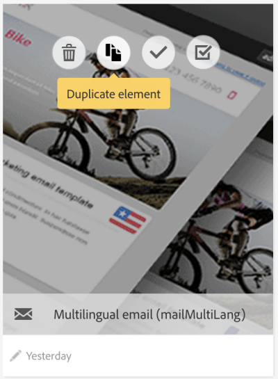

# Multilingual messages templates {#multilingual-messages-template}

A multilingual template is a specific template to manage multilingual messages. This kind of template is available for **Email** and **SMS messages**  and useable in standalone mode, within a workflow or in a recurring delivery.

In the multilingual feature templates, the language management is based on variants. **Each variant represents one language**. Adobe Campaign Standard is able to set up a maximum of 40 variants.

Adobe Campaign comes with a default language which is set to **EN**. The default language could be changed to another variant but should be never deleted.

During the template creation, you can add the number of variants corresponding to the number of needed languages in the message.

To perform the creation of SMS or email template, follow these steps:

1. Duplicate an existing multilingual template (SMS or Email).

   

   >[!NOTE]
   >
   >You can also modify an existing standard template in a multilingual template by clicking on the **[!UICONTROL Initialize content variant]** button in the template properties.

1. Modify the properties to customize label, tracking, etc.

1. Modify the number of desired variants by clicking on the variants tile. The variants window is displayed

   

   You can add or remove variants. To add a variant, complete the **[!UICONTROL New content variant]** window.

   

   >[!NOTE]
   >
   >Do not delete the "default" variant as it is the variant sent to profiles without a completed preferred language parameter.

1. Customize label variant if needed and click **[!UICONTROL Confirm]**.

1. You can also directly add the content for each variant.

You are now ready to create an email or an SMS message based on this multilingual template.

**Related topics:**

* [Creating a multilingual email](../../channels/using/creating-a-multilingual-email.md)
* [Creating profiles](../../audiences/using/creating-profiles.md)
