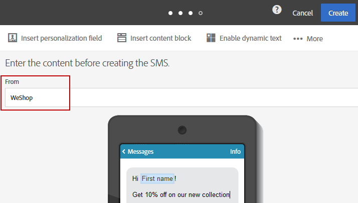

# Personalizing SMS messages{#personalizing-sms-messages}

The principles for personalizing SMS messages are the same as those for [emails](../../designing/using/personalization.md#inserting-a-personalization-field). You must nevertheless be aware of the transliteration options as these can impact the encoding and therefore the number of SMS messages to send. For more on this, refer to the [Transliteration and SMS length](../../administration/using/configuring-sms-channel.md#sms-encoding--length-and-transliteration) section.

Here we take a sample SMS message containing personalization fields which, depending on whether or not transliteration has been selected, will not generate the same number of sends:

**Hey < FirstName > < LastName >, new products now available. Come and check them out in store!**

* For a recipient named 'John Smith', as it contains no special characters, Adobe Campaign will choose GSM encoding which will authorize up to 160 characters per SMS message. The message will therefore be sent in a single part.
* For a recipient named 'Raphaël Forêt', the characters 'ë' and 'ê' cannot be encoded in GSM. Depending on whether transliteration has been enabled or not, Adobe Campaign can select between two behaviors:

    * If transliteration is authorized 'ë' and 'ê' will be replaced by 'e', which means GSM encoding can be used and so up to 160 characters can be used in the SMS. This message will be sent as a single SMS message, but it will be slightly altered.
    * If transliteration is not authorized, Adobe Campaign will choose to send the message in binary format (Unicode): all of the characters will therefore be sent as such. As the SMS messages in Unicode are limited to 70 characters Adobe Campaign will have to send the message in two parts.

>[!NOTE]
>
>The algorithm which automatically chooses the best encoding is executed independently for each message, case by case. This way, only the personalized messages that require Unicode encoding will be sent in Unicode; all the others will use GSM encoding.

## SMS sender {#sms-sender}

>[!IMPORTANT]
>
>Please check the legislation in your country regarding modifying the sender address. You should also check with your SMS service provider to see whether they offer this functionality.

The **[!UICONTROL From]** option allows you to personalize the name of the SMS message sender using a string of characters. This is the name that will appear as the sender name of the SMS message on the recipient's mobile telephone.

If this field is empty, then it will be the source number provided in the external account that will be used. If no source number is provided, it will be the short code that will be used. The external account specific to SMS delivery is presented in the [Defining an SMS routing](../../administration/using/configuring-sms-channel.md#defining-an-sms-routing) section.

  

