# Preparing and sending a push notification{#preparing-and-sending-a-push-notification}

## Preparing the notification {#preparing-the-notification}

The steps for creating a push notification with Adobe Campaign are:

1. From the **[!UICONTROL Marketing activities]** window, [create a new marketing activity](../../start/using/marketing-activities.md#creating-a-marketing-activity).

   Note that a single push notification can also be created from a [campaign](../../start/using/marketing-activities.md#creating-a-marketing-activity) or from the Adobe Campaign [home page](../../start/using/interface-description.md#home-page).

   You can also use a push notification delivery activity in a workflow. This activity is presented in the [Push notification delivery](../../automating/using/push-notification-delivery.md) section.

1. Select **[!UICONTROL Push notification]**.
1. Select a template. 

   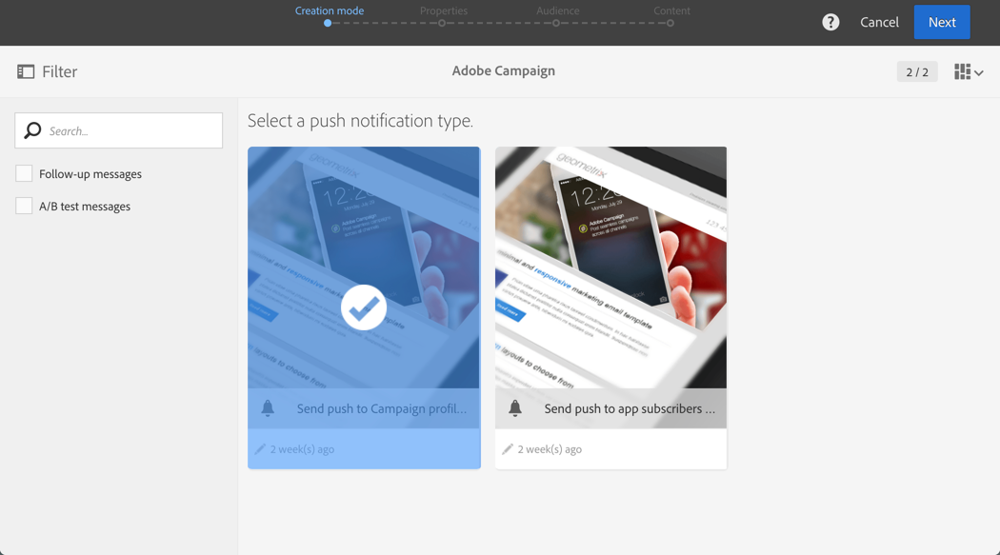

   By default, you can select one of the following two templates:

    * **[!UICONTROL Send push to Campaign profiles]**: use this template to target the Adobe Campaign CRM profiles who have subscribed to your mobile application and have opted in to receive push notifications. You can insert [personalization](../../designing/using/personalization.md#inserting-a-personalization-field) fields into your push notification, such as the recipient's first name.
    * **[!UICONTROL Send push to app subscribers]**: use this template to send a push notification to all known and anonymous mobile application users who have opted in to receive notifications from your application. You can personalize these messages with data collected from your mobile application.

   You can also select multilingual templates. For more information, refer to [Creating a multilingual push notification](../../channels/using/creating-a-multilingual-push-notification.md).

   For more on templates, refer to the [Managing templates](../../start/using/about-templates.md) section.

1. Enter your push notification properties and select your mobile app in the **[!UICONTROL Associate a Mobile App to a delivery]** field.

   Please note that the dropdown will display both SDK V4 and Experience Platform SDK applications.

   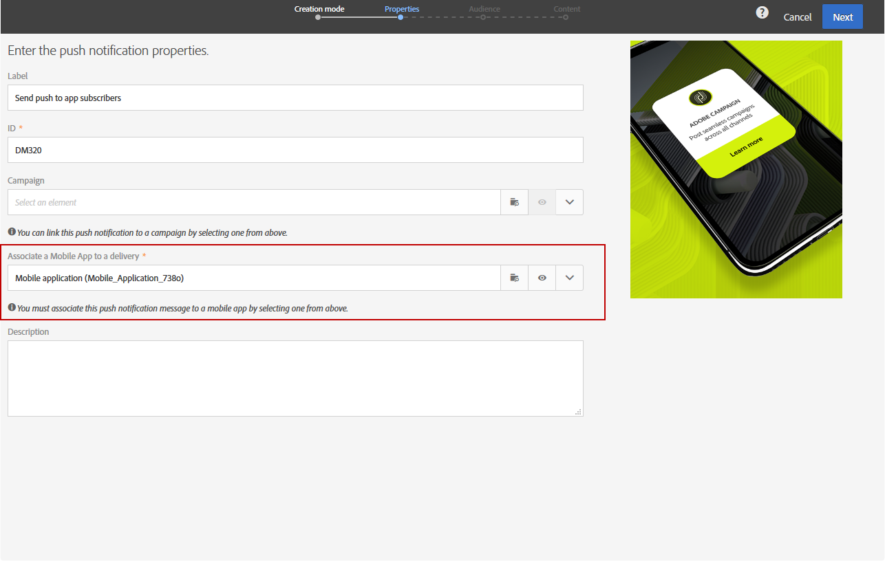

   You can link the push notification to a campaign. To do this, select it from the campaigns that have already been created.

1. In the following screen, you can specify an audience, for example all of your VIP customers who subscribed to a specific mobile application. For more on this, see [Creating audiences](../../audiences/using/creating-audiences.md).

   Your audience will be automatically filtered based on the mobile application selected in the previous step.

   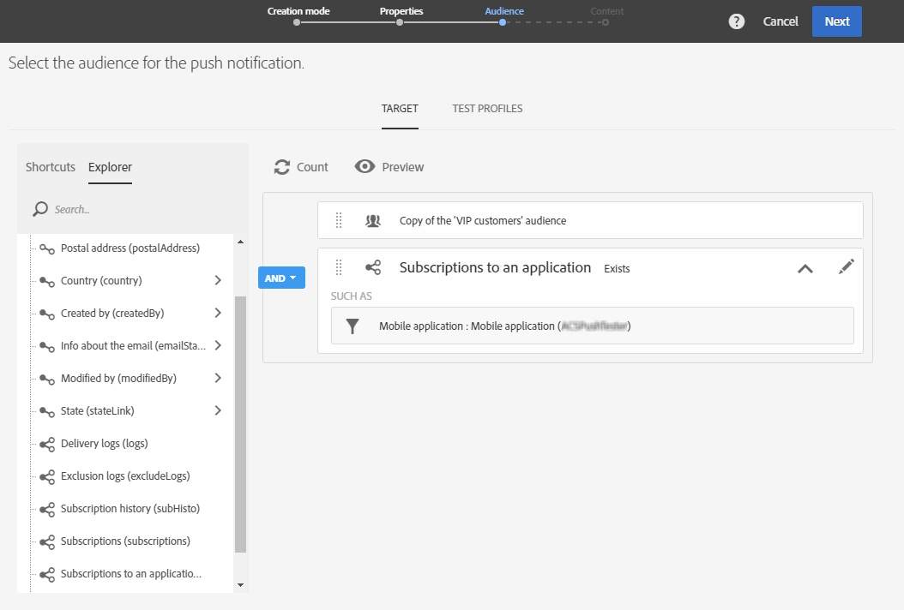

1. You can now customize your push notification. First, choose the message style: **[!UICONTROL Alert/Message/Badge]** or **[!UICONTROL Silent push]**. The push notification types are described in the [About push notifications](../../channels/using/about-push-notifications.md) section.

   Edit the content of your push notification and define the advanced options. See [Customizing a push notification](../../channels/using/customizing-a-push-notification.md).

   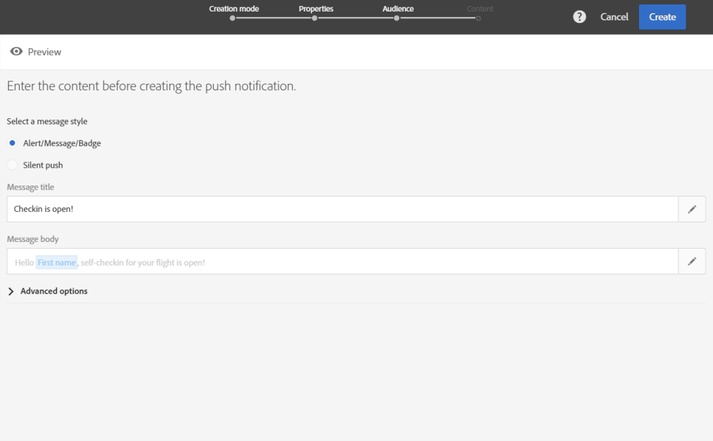

   The push notification content and options configured here are passed to your mobile app in the form of a payload. The detailed structure of the payload is described in the [Understanding ACS push notifications payload structure](https://helpx.adobe.com/campaign/kb/understanding-campaign-standard-push-notifications-payload-struc.html) technote. 

1. Click **[!UICONTROL Create]**. 

   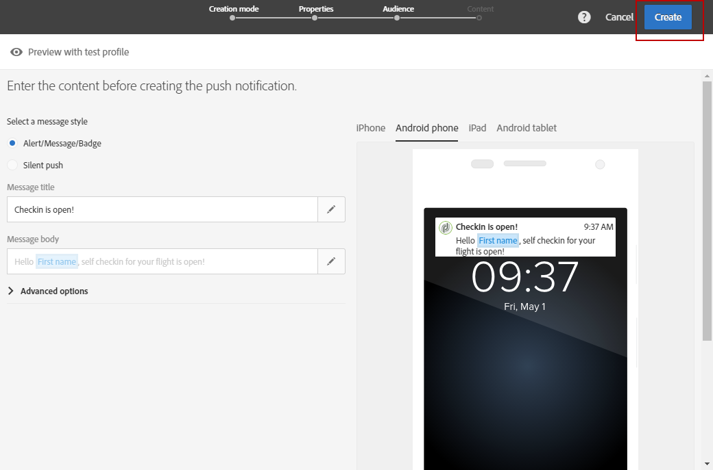

1. Before sending the notification, you can test it with test profiles and then see exactly what your recipients will see before sending the delivery. Select **[!UICONTROL Audiences]** from your delivery summary and click the **[!UICONTROL Test profiles]** tab.

   For more on sending tests, refer to [Test profiles](../../sending/using/managing-test-profiles-and-sending-proofs.md).

1. Select your test profiles and click **[!UICONTROL Preview]** to display the notification: content is personalized with the test profile data.
1. Check the push notification layout on different devices: select iPhone, Android phone, iPad or Android tablet to preview rendering.

   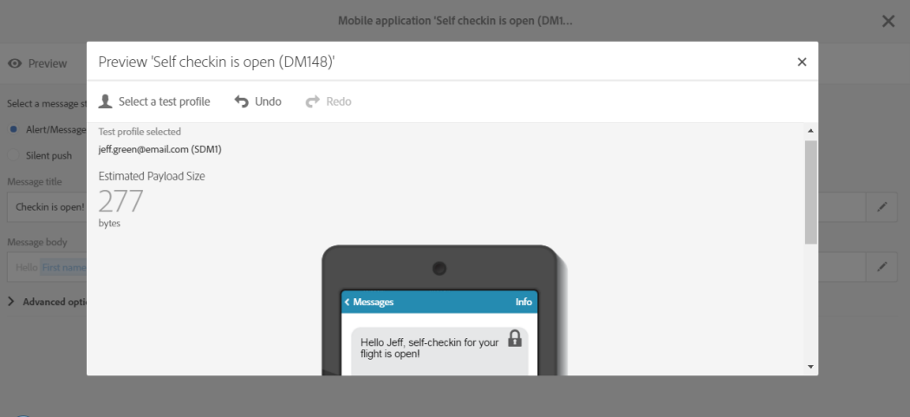

1. The **[!UICONTROL Estimated Payload Size]** is an estimate based on test profile data. Actual payload size may vary. The limit of the message is 4KB.

   >[!CAUTION]
   >
   >If the payload size exceeds 4KB limit, the message will not be delivered. Personalization data impacts the size of message.

## Sending the notification {#sending-the-notification}

Push notifications can be sent to a selected audience in Adobe Campaign by defining the audience criteria. For the example below, our selected audience consists of 4 targeted mobile app subscribers.

1. Click **[!UICONTROL Prepare]** to compute the target and generate the notifications.

   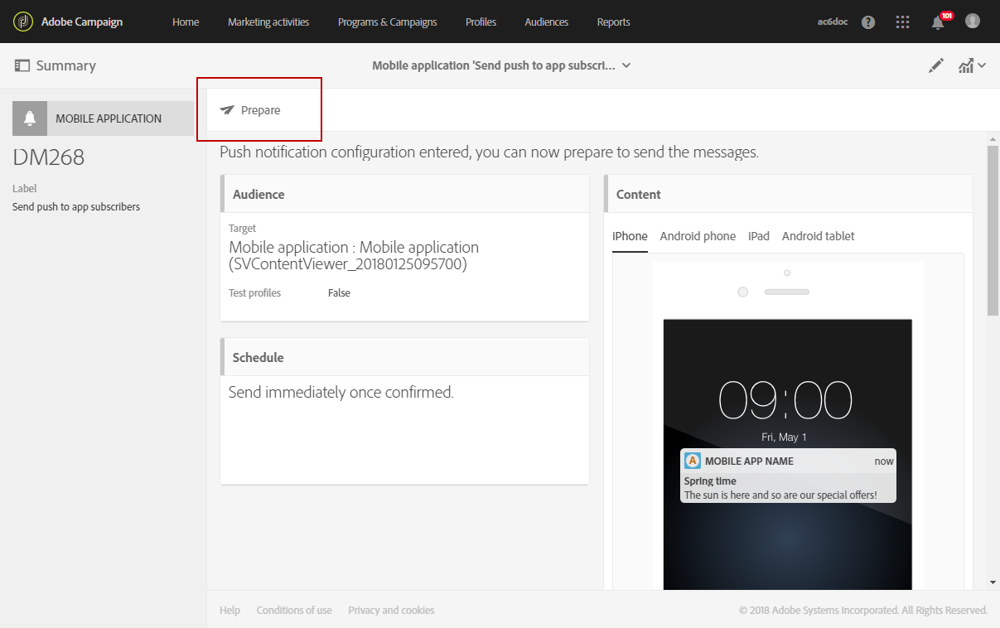

1. Once the preparation has finished successfully, the **[!UICONTROL Deployment]** window presents the following KPIs: **[!UICONTROL Target]** and **[!UICONTROL To deliver]**. Note that the **[!UICONTROL To deliver]** count is lower than the **[!UICONTROL Targeted]** one due to exclusions which can be viewed by clicking 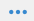 button at the bottom of the **[!UICONTROL Deployment]** window. 

   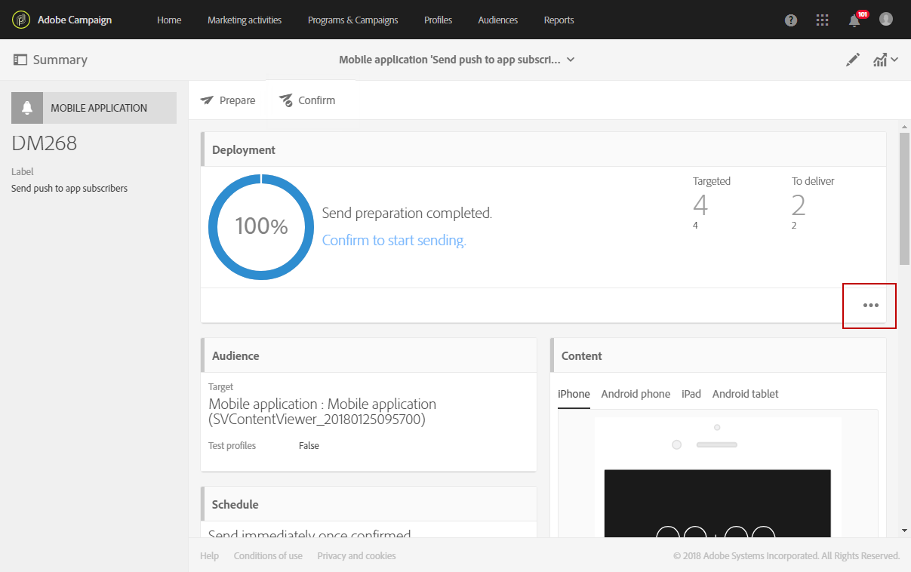

1. In the **[!UICONTROL Exclusion logs]** tab, you can find the list of all the messages excluded from the target sent and the reason behind this exclusion.

   Here, we can see that one of our mobile app subscribers was excluded because the address was blacklisted and the other subscribers because the profile was a duplicate.

   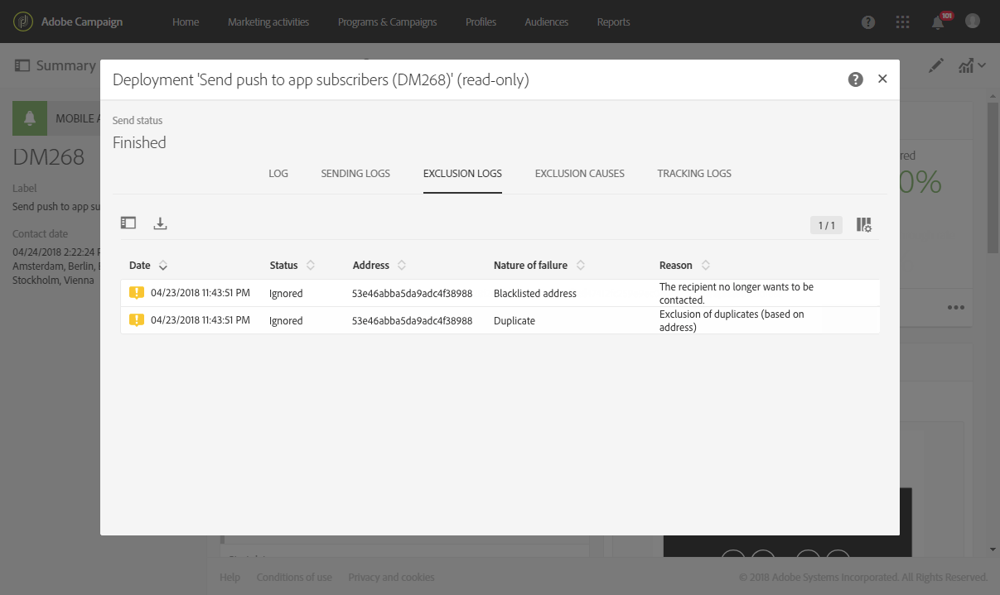

1. Click the **[!UICONTROL Exclusion causes]** tab to display the volume of excluded messages.

   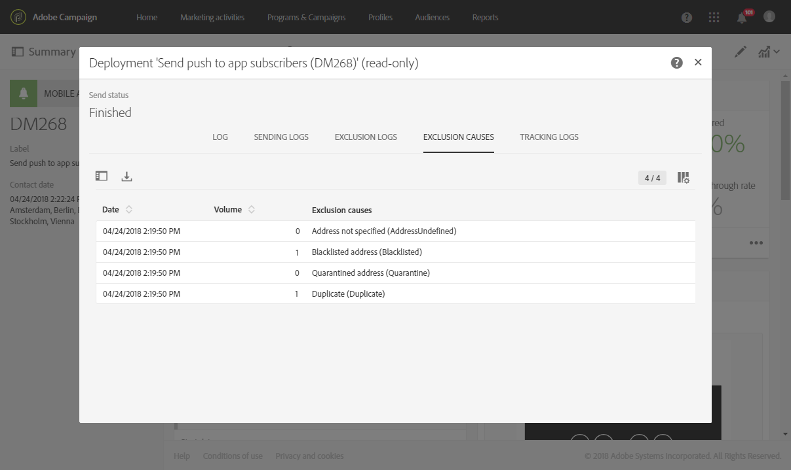

1. You can now click **[!UICONTROL Confirm]** to start sending push notifications.
1. Check the status of your delivery through the message dashboard and logs. For more on this, see [Sending messages](../../sending/using/confirming-the-send.md) and [Delivery logs](../../sending/using/monitoring-a-delivery.md#delivery-logs).

   In this example, the message dashboard displays that Adobe Campaign attempted to send two push notifications: one was delivered successfully to the device and another one failed. To know why the delivery has errors, click the  button at the bottom of the **[!UICONTROL Deployment]** window.

   

1. From the **[!UICONTROL Deployment]** window, click the **[!UICONTROL Sending logs]** tab to access the list of sent push notifications and their statuses. For this delivery, one push notification was successfully sent whereas the other failed due to a bad device token. This subscriber will then be blacklisted from further deliveries.

   >[!NOTE]
   >
   >Reasons can be any failure downstream to Adobe Campaign. In case of failures from providers like apns and fcm, the reason will reflect that as well. For more information on provider failures, you can refer to the [Apple](https://developer.apple.com/library/content/documentation/NetworkingInternet/Conceptual/RemoteNotificationsPG/CommunicatingwithAPNs.html) and [Android](https://firebase.google.com/docs/cloud-messaging/http-server-ref  ) documentation.

   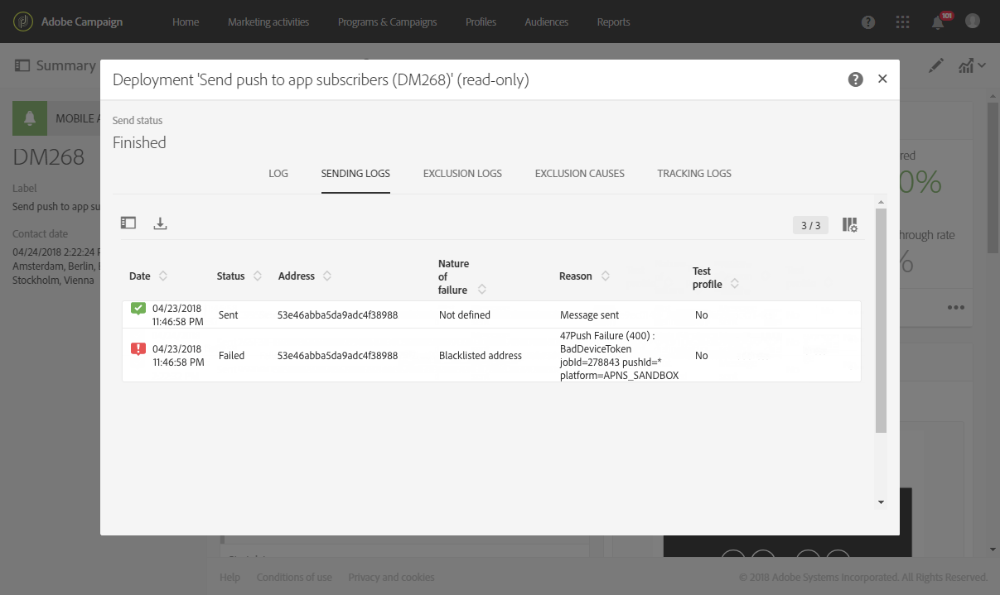

You can now measure the impact of your push notification delivery with dynamic reports.

**Related topics:**

* [Push notification report](../../reporting/using/push-notification-report.md)
* [Sending a push notification within a workflow](../../automating/using/push-notification-delivery.md)

