# Preparing and sending an In-App message{#preparing-and-sending-an-in-app-message}

>[!NOTE]
>
>In-App personalization relies on a linkage field which is typically a CRM ID and/or Mobile App Login ID. You are solely responsible for securing this linkage field when used in connection with Adobe Campaign. If you fail to keep your linkage field(s) secure, your personalized message may be vulnerable. Adobe will not be liable for damages arising out of unauthorized access or use of any profile data if you fail to follow secure linkage field composition, management, and protection practices.

Three types of In-App message are available in Adobe Campaign:

* **[!UICONTROL Target users based on their Campaign profile (inAppProfile)]**: This message type enables you to target Adobe Campaign profiles (CRM profiles) who have subscribed to your mobile application. This message type can be personalized with all available profile attributes in Adobe Campaign but requires a secure handshake between Mobile SDK and Campaign's In-App messaging service to ensure that messages with personal and sensitive information are used by authorized users only.

  To download this message type on users' devices, Mobile SDK has to send linkage fields used to connect a mobile profile to a CRM profile in Adobe Campaign. For more information on SDK APIs required to support In-App, refer to this [page](https://aep-sdks.gitbook.io/docs/using-mobile-extensions/adobe-campaign-standard/adobe-campaign-standard-api-reference).

* **[!UICONTROL Target all users of a Mobile app (inAppBroadcast)]**: This message type enables you to send messages to all users (current or future) of your mobile application even if they don't have an existing profile in Adobe Campaign. Personalization is thus not possible when customizing the messages as the user profile may not even exist in Adobe Campaign.
* **[!UICONTROL Target users based on their Mobile profile (inApp)]**: This message type enables you to target all known or anonymous users of a mobile app that have a mobile profile in Adobe Campaign. This messages type can be personalized using only non-personal and non-sensitive attributes and does not require secure handshake between Mobile SDK and Adobe Campaign's In-App messaging service.

  For more information on how to handle personal and sensitive data, refer to [Handling mobile profile fields with personal and sensitive data](#handling-mobile-profile-fields-with-personal-and-sensitive-data).

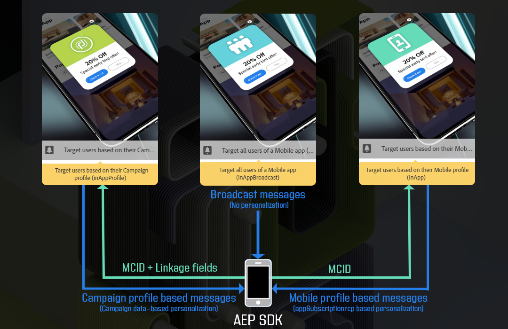

## Handling mobile profile fields with personal and sensitive data {#handling-mobile-profile-fields-with-personal-and-sensitive-data}

In Adobe Campaign, mobile profile attributes data sent from mobile device are stored in **[!UICONTROL Subscriptions to an application (appSubscriptionRcp)]** resource which allows you to define the data that you want to collect from your applications' subscribers.

This resource needs to be extended to collect data you intend to send from the mobile device to Adobe Campaign. To do so, refer to this [page](../../developing/using/extending-the-subscriptions-to-an-application-resource.md) for the detailed steps.

To enable personalization of your In-App messages more securely, mobile profile fields from this resource need to be configured accordingly. In your **[!UICONTROL Subscriptions to an application (appSubscriptionRcp)]**, when creating your new mobile profiles fields, check **[!UICONTROL Personal and Sensitive]** to make them unavailable during In-App messages personalization.

>[!NOTE]
>
>If you have an existing implementation with custom resource extension on this table, we advise you to label the fields appropriately before leveraging them for personalization of In-App messages.

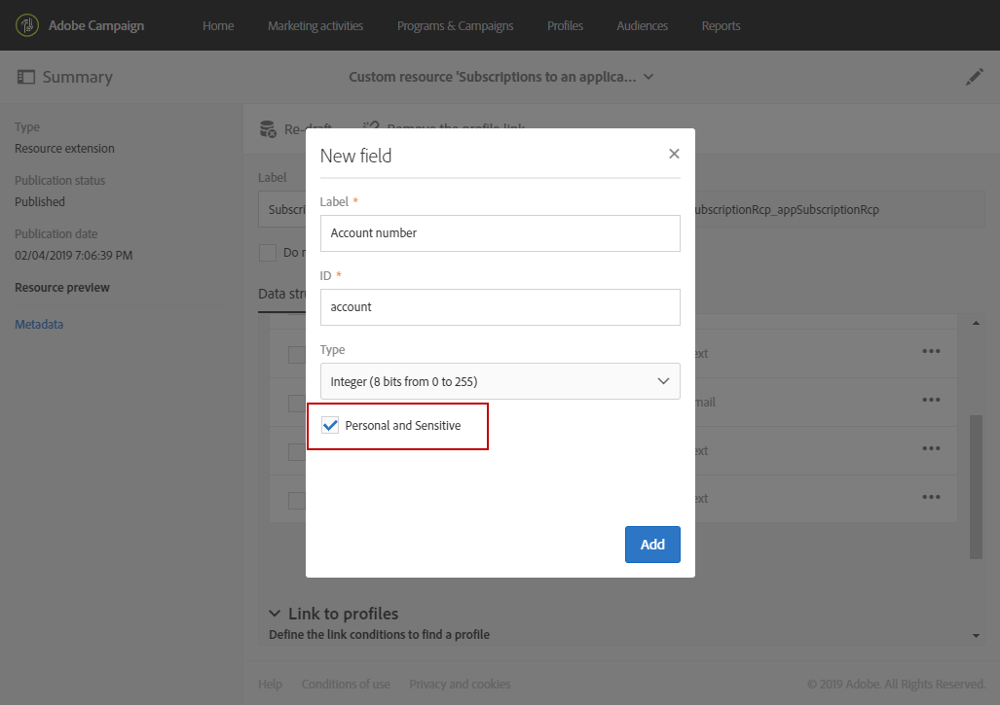

Once your **[!UICONTROL Subscriptions to an application]** custom resource is configured and published, you can start preparing your In-App delivery using the **[!UICONTROL Target users based on their Mobile profile (inApp)]** template. Only non-personal and non-sensitive fields will be available from **[!UICONTROL Subscriptions to an application (appSubscriptionRcp)]** resource for personalization.

If you require personalization with **Personal and Sensitive** fields, we recommend using the **[!UICONTROL Target users based on their Campaign profile (inAppProfile)]** template which has additional security mechanism to ensure that your users' PII data remains secure.

## Preparing your In-App message {#preparing-your-in-app-message}

The steps for creating a standalone In-App message with Adobe Campaign are:

1. From Adobe Campaign home page, click the **[!UICONTROL In-App messaging]** card.

   You can also create an In-App from the **Marketing activities** tab, by clicking the **[!UICONTROL Create]** button.

   Note that an In-App message can also be created from a campaign or from the Adobe Campaign home page or in a workflow.

1. Select **In-App message**.

   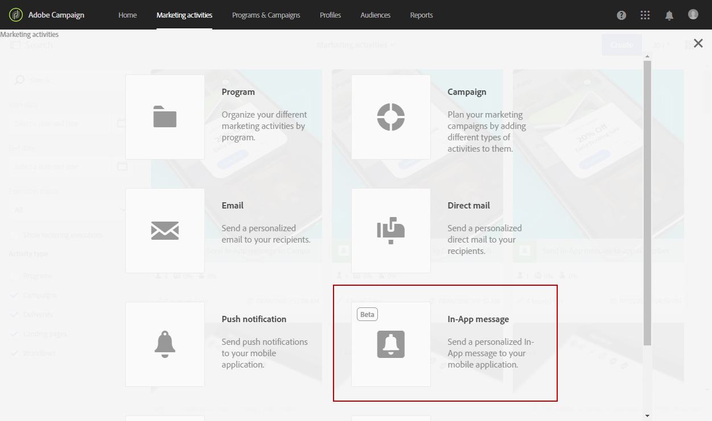

1. Select an appropriate template based on your audience targeting needs.

   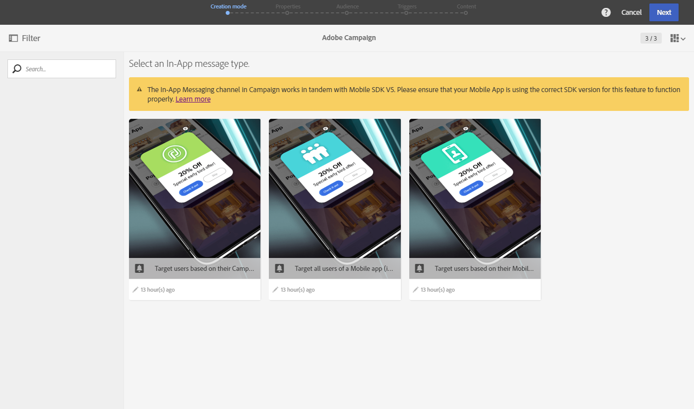

   By default, you can select one of the following three out-of-the-box templates:

    * **[!UICONTROL Target users based on their Campaign CRM profile (inAppProfile)]** 
    * **[!UICONTROL Target all users of a Mobile app (inAppBroadcast)]** 
    * **[!UICONTROL Target users based on their Mobile profile (inApp)]**

1. Enter the In-App message properties and select your mobile app in the **[!UICONTROL Associate a Mobile App to a delivery]** field. Please note that if you did not configure your mobile app with Adobe Campaign Standard, it will not appear in the list. For more information on mobile application configuration, refer to this [page](https://helpx.adobe.com/campaign/kb/configuring-app-sdk.html#ChannelspecificapplicationconfigurationinAdobeCampaign).

   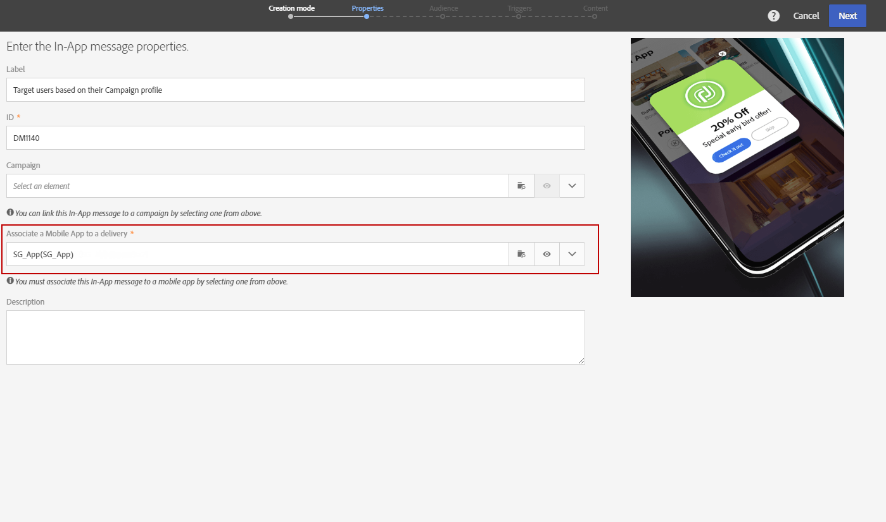

1. Select the audience you want to target for you In-App message. Your audience is prefiltered depending on the mobile application associated to this delivery.

   Note that this step is not needed with the **[!UICONTROL Broadcast an In-App message (inAppBroadcast)]** since it targets all users of a mobile application.

   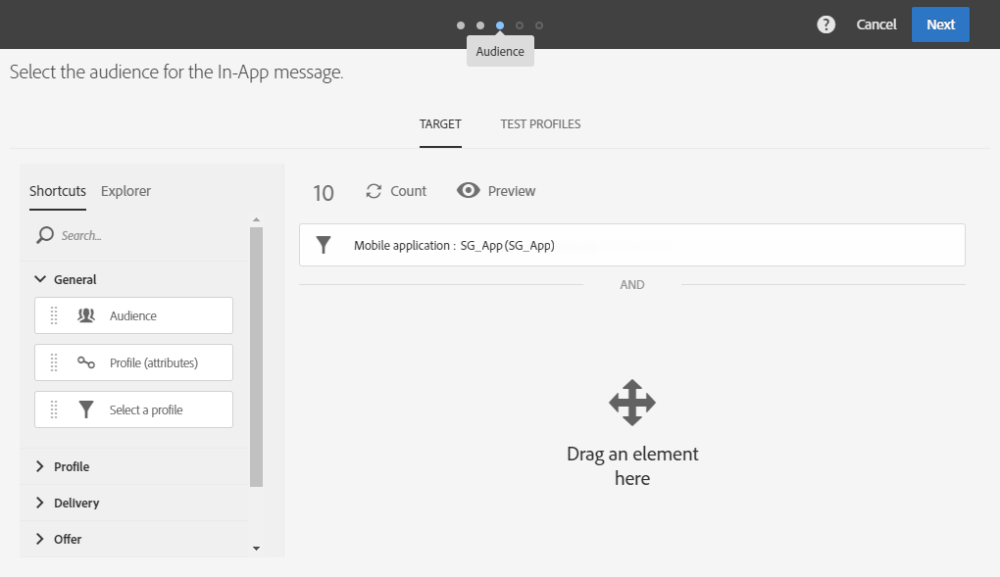

1. In the **[!UICONTROL Triggers]** tab, drag and drop the event that will trigger your message. By choosing a trigger, you choose an action done by users which will cause the In-App message to be displayed.

   Four categories of events are available:

    * **[!UICONTROL Mobile Application events]**: Custom events implemented in your mobile application.

      For more on events creations, refer to this [page](https://helpx.adobe.com/campaign/kb/configuring-app-sdk.html).
    
    * **[!UICONTROL Life Cycle events]**: Out-of-the-box life cycle events supported by Adobe Mobile SDK.

      For more on life cycle events, refer to this [page](https://docs.adobe.com/content/help/en/mobile-services/android/metrics.html).
    
    * **[!UICONTROL Analytics Events]**: The following three categories are supported depending on what is instrumented in your mobile app: Adobe Analytics, Context data or View state.

      Please note that these events are only available if you have an Adobe Analytics license.
    
    * **[!UICONTROL Places]**: The following three categories leverage real-time location data to deliver contextually relevant mobile experiences: Places context data, Places custom metadata or Places event type.

      For more information on Adobe Places, refer to the [Places documentation](https://placesdocs.com/).

   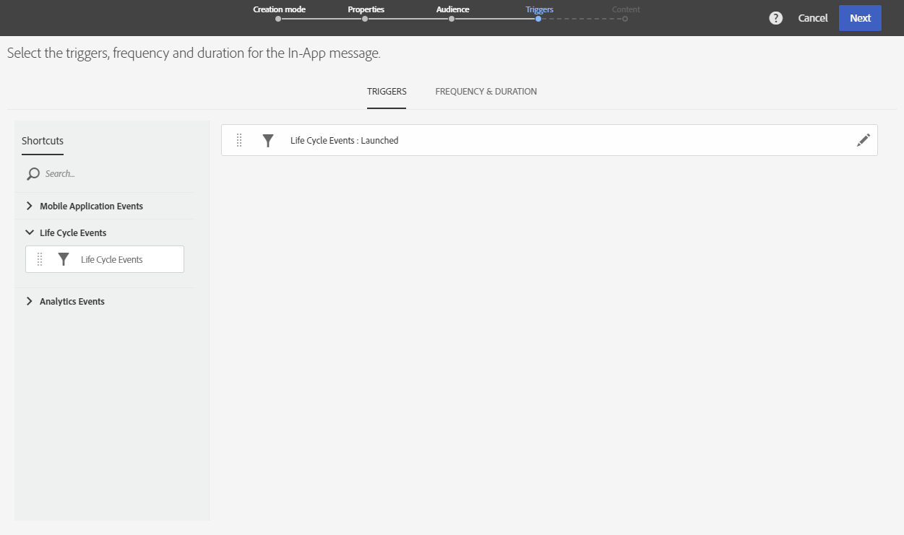

1. If you use an **[!UICONTROL Analytics Events]**, Adobe Analytics and View state events will be automatically populated based on the report suites configured in the Analytics extension in Adobe Experience Platform Launch whereas Context data events have to be manually added.

   Please note that these events are only available if you have an Adobe Analytics license.

   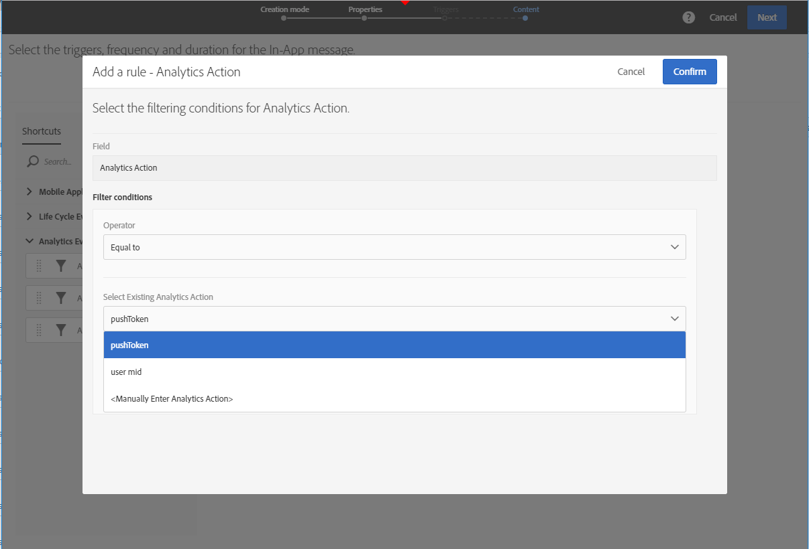

1. If you use a **[!UICONTROL Places]** trigger, Places context data, Places custom metadata or Places event type will be automatically populated based on all the Libraries and their Points of Interest created in Adobe Places.

   Please note that this trigger will be applied on the device only for the Points of Interest from the Libraries selected in the Places extension in Experience Platform Launch. For more information on the Places extension and how to install it, refer to this [documentation](https://docs.adobe.com/content/help/en/places/using/places-ext-aep-sdks/places-extension/places-extension.html).

1. In the **[!UICONTROL Frequency & duration]** tab, choose the frequency for your trigger, the start and end date, day of the week and time of the day when your In-App message will be active.

   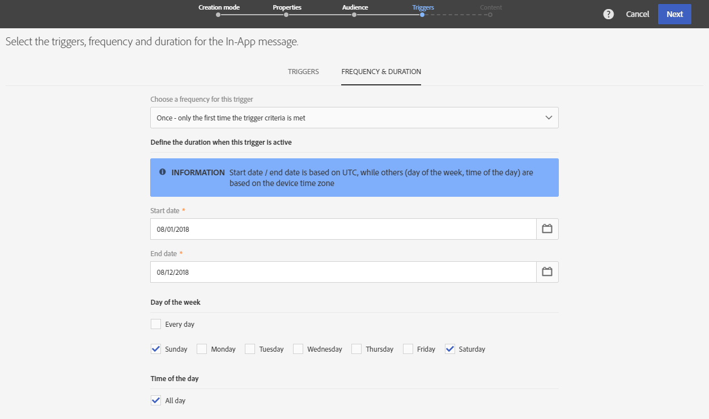

1. Edit the content of your message and define the advanced options. See [Customizing an In-App message](https://helpx.adobe.com/campaign/standard/channels/using/customizing-an-in-app-message.html).

   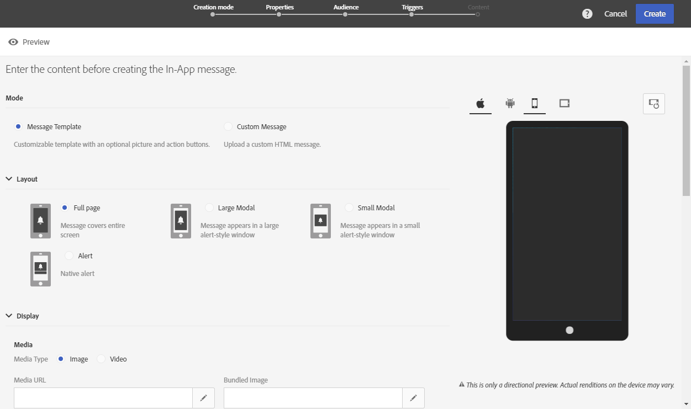

1. Click **[!UICONTROL Create]**.

Your In-App message is now ready to be sent to your targeted audience.

**Related topics:**

* [Customizing an In-App message](../../channels/using/customizing-an-in-app-message.md)
* [In-App report](../../reporting/using/in-app-report.md)
* [Sending an In-App message within a workflow](../../automating/using/in-app-delivery.md)

## Sending your In-App message {#sending-your-in-app-message}

Once you have finished preparing your delivery and the approval steps have been carried out, you can send your message.

1. Click **[!UICONTROL Prepare]** to compute the target and generate the messages.

   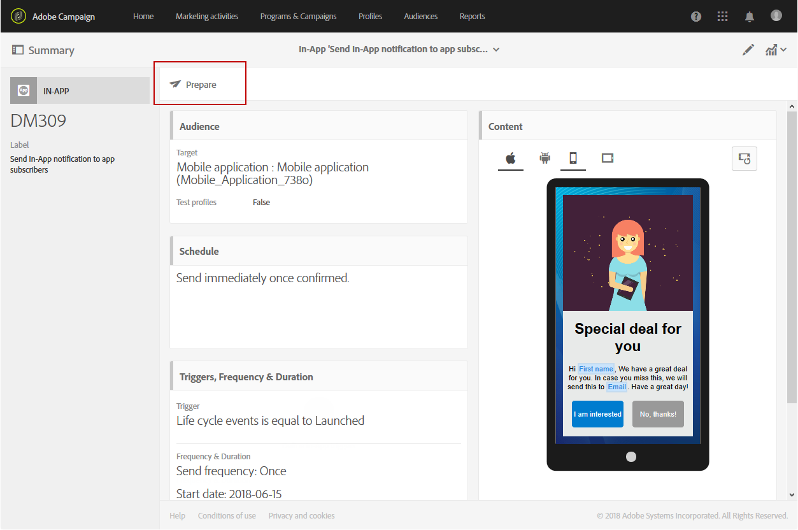

1. Once the preparation has finished successfully, the **Deployment** window presents the following KPIs: **Target** and **To deliver**.

   You can check the Deployment window by clicking the  button for potential exclusions or errors in your delivery.

   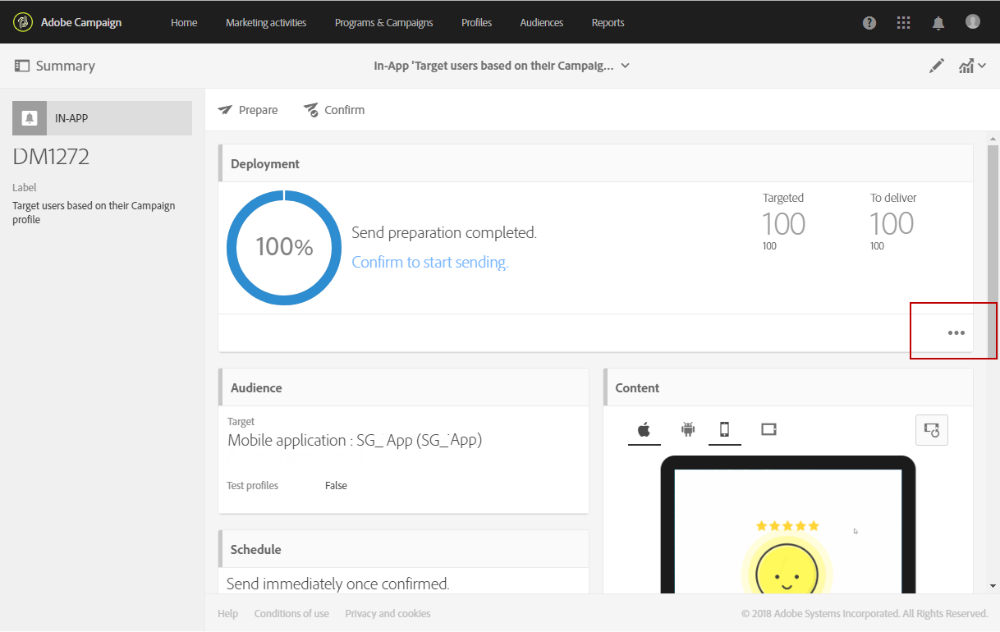

1. Click **[!UICONTROL Confirm]** to start sending your In-App message.

   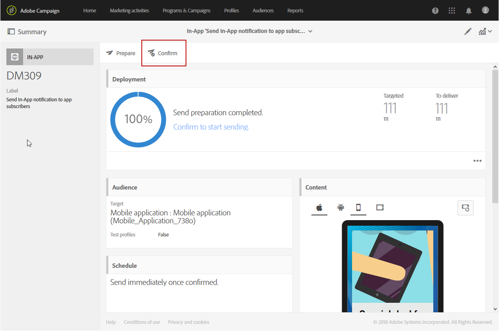

1. Check the status of your delivery through the message dashboard and logs. For more on this, refer to this [section](../../sending/using/monitoring-a-delivery.md).

   **[!UICONTROL Delivered]** and **[!UICONTROL Sent]** KPIs counts are based on what is successfully sent out from Campaign to Message delivery service. Please note that these KPIs are not an indication of the count of mobile devices that received or downloaded the message successfully from Message delivery service.

   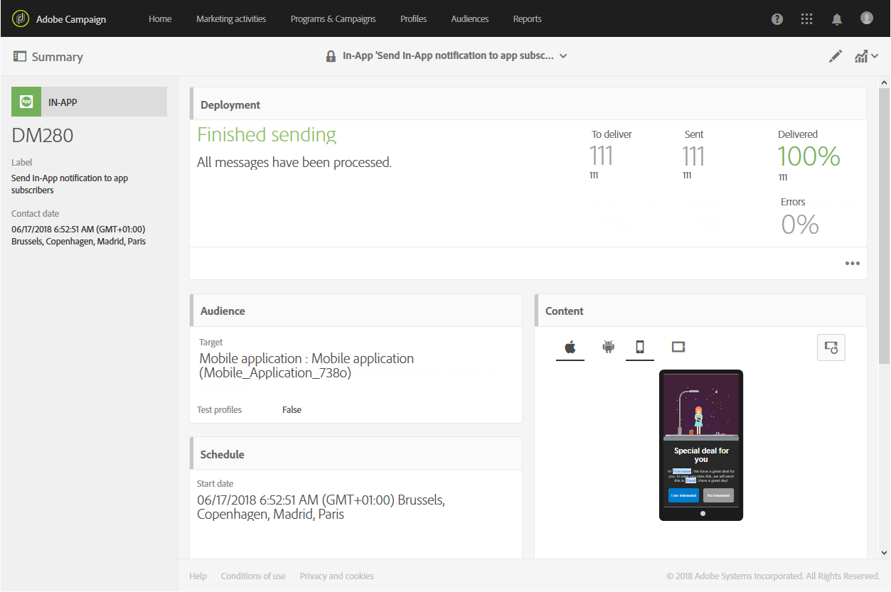

1. Measure the impact of your In-App messages with delivery reports. For more on reporting, refer to [this section](../../reporting/using/in-app-report.md).

**Related topics:**

* [In-App report](../../reporting/using/in-app-report.md)
* [Sending an In-App message within a workflow](../../automating/using/in-app-delivery.md)
