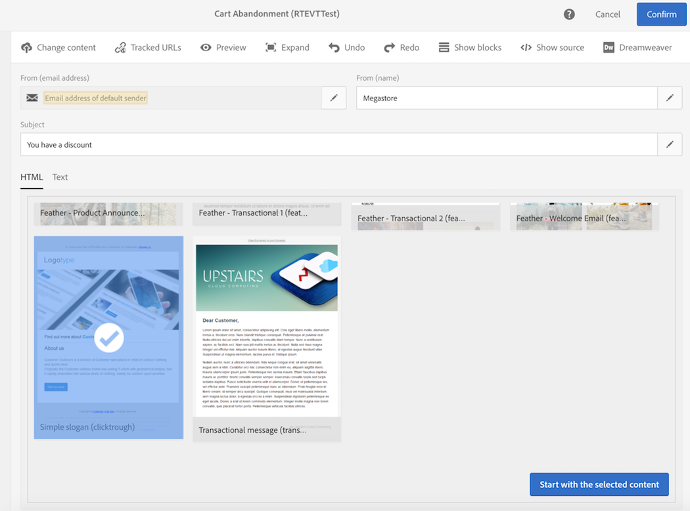
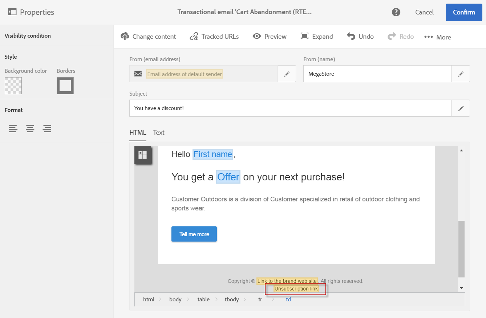
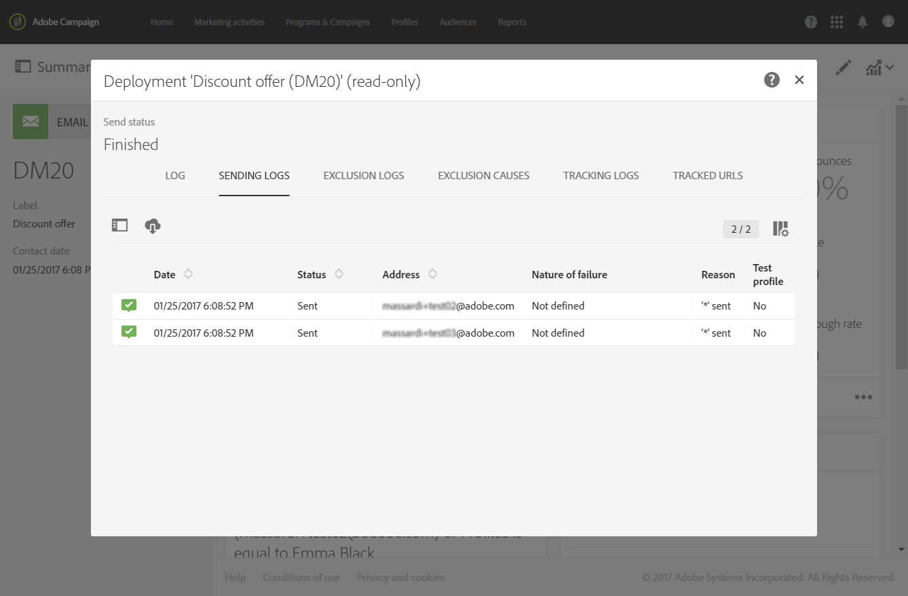
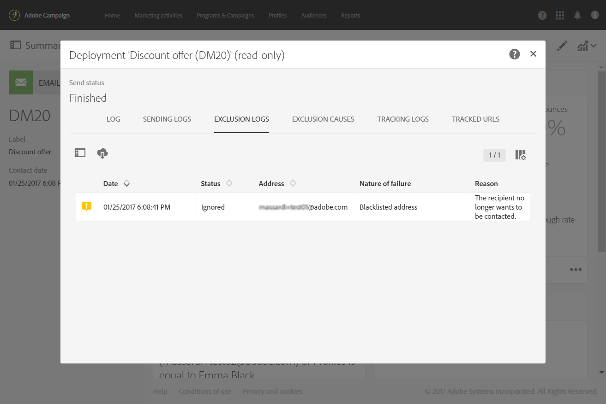
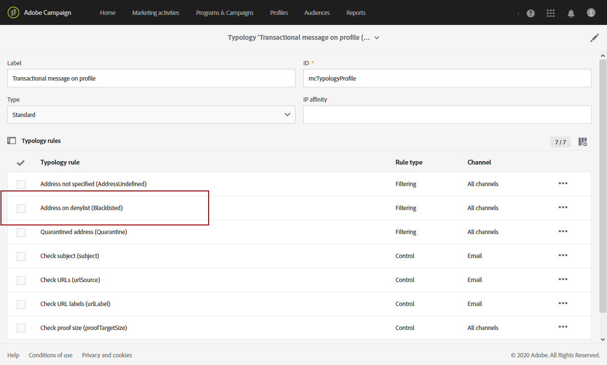

# Profile transactional messages{#profile-transactional-messages}

You can send transactional messages based on customer marketing profiles, which allows you to:

* Apply marketing typology rules such as **[!UICONTROL Blacklisted address]** or [fatigue rules](../../sending/using/fatigue-rules.md).
* Include the unsubscription link within the messages.
* Add the transactional messages to the global delivery reporting.
* Leverage the transactional messages in the customer journey.

Once you have created and published an event (the cart abandonment as per the [example](../../channels/using/about-transactional-messaging.md#transactional-messaging-operating-principle) above), the corresponding transactional message is created automatically.

The configuration steps are presented in the [Configuring an event to send a profile transactional message](../../administration/using/configuring-transactional-messaging.md#use-case--configuring-an-event-to-send-a-transactional-message) section.

In order for the event to trigger sending a transactional message, you have to personalize the message, then test it and publish it.

>[!NOTE]
>
>To access transactional messages, you must be part of the **[!UICONTROL Administrators (all units)]** security group.
>
>Fatigue rules are compatible with profile transactional messages. See [Fatigue rules](../../sending/using/fatigue-rules.md).

## Sending a profile transactional message {#sending-a-profile-transactional-message}

The steps for creating, personalizing and publishing a profile transactional message are the same as for an event transactional message. See [Event transactional messages](../../channels/using/event-transactional-messages.md).

The differences are listed below.

1. Go the transactional message that was created to edit it.
1. In the transactional message, click the **[!UICONTROL Content]** section. In addition to the transactional template, you can also choose any email template targeting **[!UICONTROL Profile]**.

   

1. Select the default email template.

   Similar to all marketing emails, it includes an unsubscription link.

   

   Also, as opposed to configurations based on real-time events, you have direct access to all profile information to personalize your message. See [Inserting a personalization field](../../designing/using/personalization.md#inserting-a-personalization-field).

1. Save your changes and publish the message. See [Publishing a transactional message](../../channels/using/event-transactional-messages.md#publishing-a-transactional-message).

## Monitoring a profile transactional message delivery {#monitoring-a-profile-transactional-message-delivery}

Once the message is published and your site integration is done, you can monitor the delivery.

1. To view the message delivery log, click the icon at the bottom right of the **[!UICONTROL Deployment]** block.

   For more information on accessing the logs, see [Monitoring the delivery](../../sending/using/monitoring-a-delivery.md).

1. Select the **[!UICONTROL Sending logs]** tab. In the **[!UICONTROL Status]** column, **[!UICONTROL Sent]** indicates that a profile has opted in.

   

1. Select the **[!UICONTROL Exclusions logs]** tab to view recipients who have been excluded from the message target, such as blacklisted addresses.

   

For any profile that has opted out, the **[!UICONTROL Blacklisted address]** typology rule excluded the corresponding recipient.

This rule is part of a specific typology that applies to all transactional messages based on the **[!UICONTROL Profile]** table.

**Related topics**:

* [Site integration](../../administration/using/configuring-transactional-messaging.md#integrating-the-triggering-of-the-event-in-a-website)
* [Typologies](../../sending/using/about-typology-rules.md)

