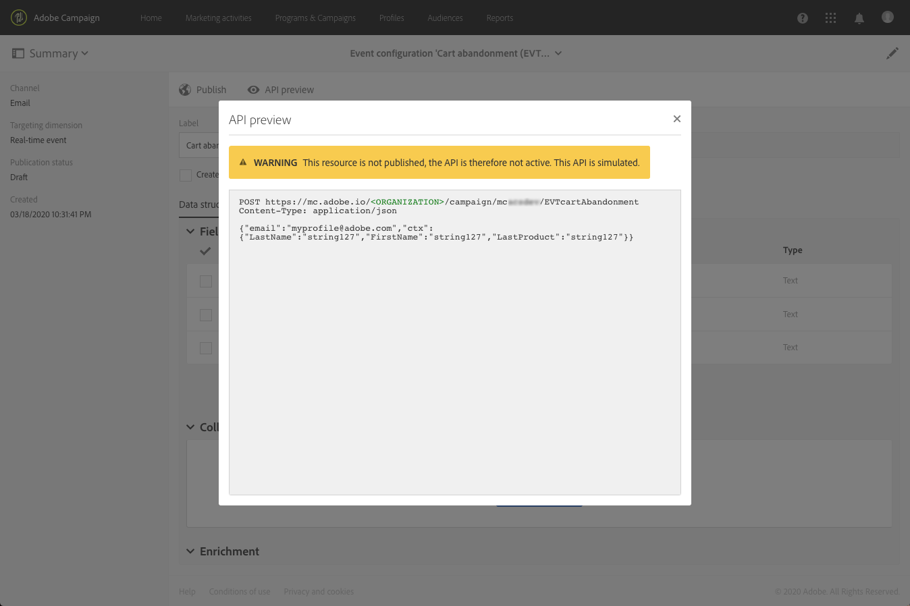
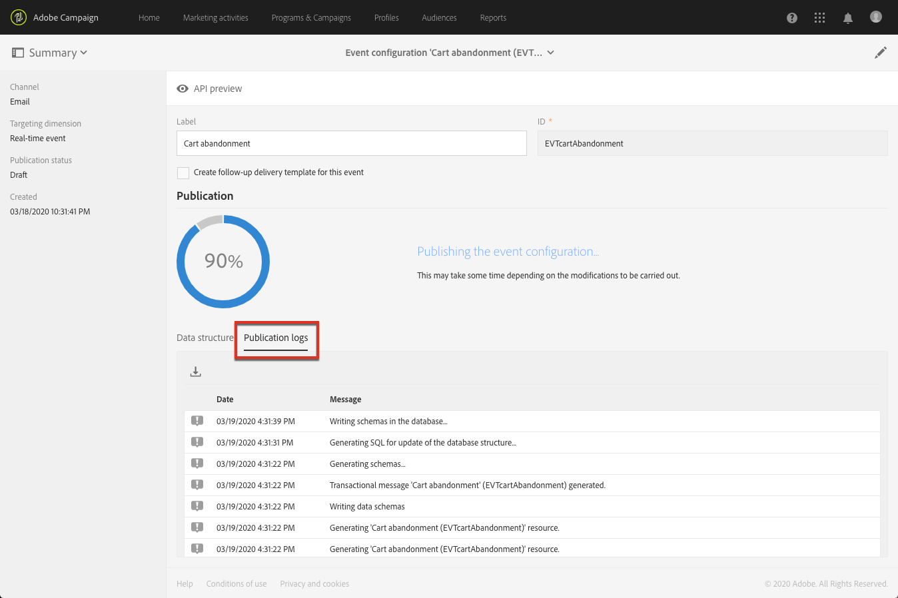
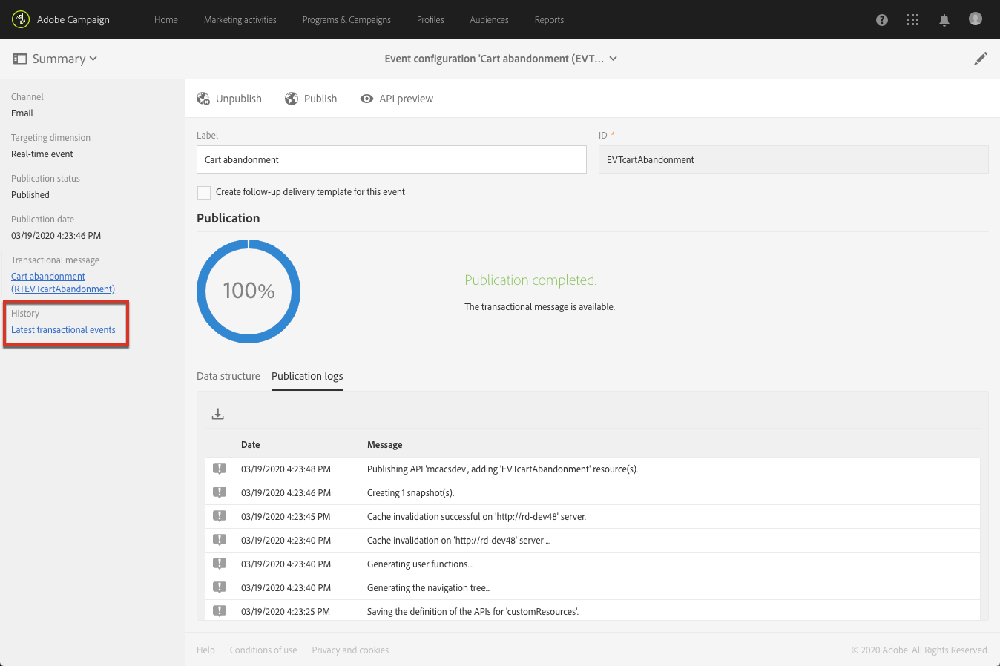
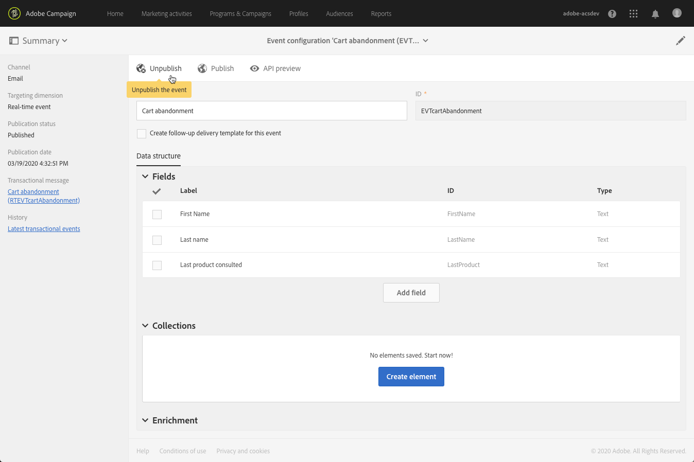
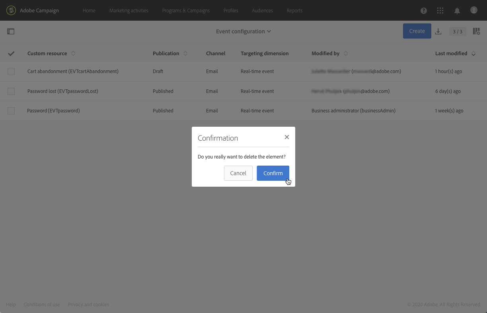

# Publishing transactional event{#publishing-transactional-event}

## Previewing and publishing the event {#previewing-and-publishing-the-event}

Before being able to use the event, you must preview and publish it.

1. Click the **[!UICONTROL API preview]** button to see a simulation of the REST API that will be used by your website developer before it is published. Once the event is published, this button also allows you to see a preview of the API in production. See [Integrating the triggering of the event in a website](#integrating-the-triggering-of-the-event-in-a-website).

   

   >[!NOTE]
   >
   >The REST API varies according to the selected channel and the selected targeting dimension. For more details on the various configurations, refer to [Transactional event specific configurations](#transactional-event-specific-configurations).

1. Click **[!UICONTROL Publish]** to start publication.

   

   The API that will be used by your website developer is deployed and the transactional events can now be sent.

1. You can view the publication logs in the corresponding tab.

   

   >[!IMPORTANT]
   >
   >Each time you modify the event, you must click **[!UICONTROL Publish]** again to generate the updated REST API that will be used by your website developer.
   
   Once the event has been published, a transactional message linked to the new event is automatically created.

1. You can directly access this transactional message through the link located in the left-hand side area.

   

In order for the event to trigger sending a transactional message, you must modify and publish the message that was just created. See [Event transactional messages](../../channels/using/event-transactional-messages.md).

You also have to integrate this trigger event into your website. See [Integrating the triggering of the event in a website](#integrating-the-triggering-of-the-event-in-a-website).

Once Adobe Campaign starts receiving events related to this event configuration, the **[!UICONTROL Latest transactional events]** link under the **[!UICONTROL History]** section enables you to access the latest events sent by your third-party service and processed by Adobe Campaign.

The events (in JSON format) are listed from the most recent to the oldest. This list allows you to check data such as the content or the status of an event, for control and debugging purpose.

## Unpublishing an event {#unpublishing-an-event}

The **[!UICONTROL Unpublish]** button lets you cancel the publication of the event, which deletes from the REST API the resource corresponding to the event that you previously created. Now, even if the event is triggered through your website, the corresponding messages are not sent anymore and they are not stored in the database.

>[!NOTE]
>
>If you have already published the corresponding transactional message, the transactional message publication is also canceled. See [Unpublishing a transactional message](../../channels/using/event-transactional-messages.md#unpublishing-a-transactional-message).

Click the **[!UICONTROL Publish]** button to generate a new REST API.

### Transactional messaging publication process {#transactional-messaging-pub-process}

The chart below illustrates the transactional messaging publication process.

For more on publishing, pausing and unpublishing a transactional message, see [this section](../../channels/using/event-transactional-messages.md#publishing-a-transactional-message).

## Deleting an event {#deleting-an-event}

Once an event has been unpublished, or if an event has  not been published yet, you can delete it from the event configuration list. To do this:

1. Click the **[!UICONTROL Adobe Campaign]** logo, in the top left corner, then select **[!UICONTROL Marketing plans]** > **[!UICONTROL Transactional messages]** > **[!UICONTROL Event configuration]**.
1. Hover the mouse over the event configuration of your choice and select the **[!UICONTROL Delete element]** button.

   

   >[!NOTE]
   >
   >Make sure the event configuration has the **[!UICONTROL Draft]** status, otherwise you will not be able to delete it. The **[!UICONTROL Draft]** status applies to an event that has not been published yet or that has been [unpublished](#unpublishing-an-event).

1. Click the **[!UICONTROL Confirm]** button.

   

>[!IMPORTANT]
>
>Deleting an event configuration that has been published and already used will also delete the corresponding transactional message(s) and its sending and tracking logs.

## Integrating the triggering of the event in a website {#integrating-the-triggering-of-the-event-in-a-website}

Once you have created an event, you will have to integrate the triggering of this event into your website.

In the example described in the [Transactional messaging operating principle](../../channels/using/getting-started-with-transactional-msg.md#transactional-messaging-operating-principle) section, you want a "Cart abandonment" event to be triggered whenever one of your clients leaves your website before purchasing the products in their cart. To do this, your website web developer must use the Adobe Campaign Standard REST API.

See the [REST API Documentation](../../api/using/managing-transactional-messages.md).