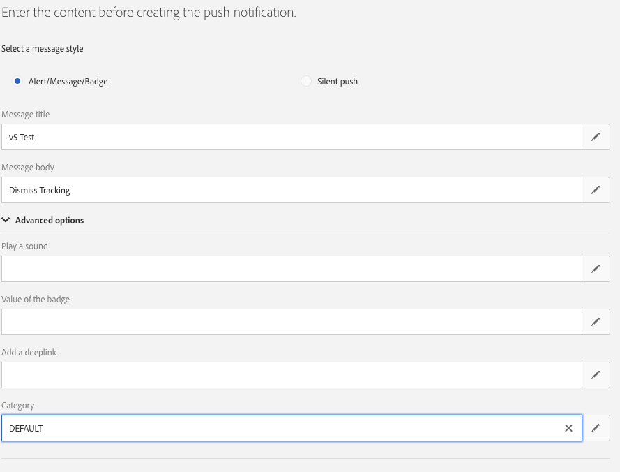

# Implementing Push tracking {#push-tracking}

## About push tracking {#about-push-tracking}

To ensure that the push notification has been fully developed you need to be sure that the tracking portion has been implemented correctly.

The following steps allow you to ensure that push tracking has been implemented correctly. This assumes that you have already implemented the first parts of Push Notification implementation: Registering the app user and handling a push notification message.

Push Tracking is separated into three types:

* **Push Impressions** - When a push notification has been delivered to the device and is sitting on the notification center but hasn't been touched at all.  This is considered an impression.  In most cases impressions numbers should be similar if not the same as the delivered number. It ensures that the device did get the message and relayed that information back to the server.

* **Push Click** - When a push notification has been delivered to the device and the user has clicked on the device.  The user either wanted to view the notification (which will in turn move to Push Open tracking) or dismiss the notification.

* **Push Open** - When a push notification has been delivered to the device and the user has clicked on the notification causing the app to open.  This is similar to the Push Click except a Push Open will not be triggered if the notification was dismissed.

To implement tracking for Campaign Standard, the mobile app needs to include Mobile SDK. These SDK are available on Adobe Mobile Services.

To send tracking information there are three variables that need to be sent. Two that are part of the data received from Campaign Standard and an action variable that dictates whether it is an **Impression**, **Click** or **Open**.

| Variable   |  Value |
|:-:|:-:|
| broadlogId  |  _mId from data |
| deliveryId | _dId from data  |
|  action |  1 for Open, 2 for Click and 7 for Impression |

## Implementation for Android {#implementation-android}

### How to implement push impression tracking {#push-impression-tracking-android}

For impression tracking, you will have to send value "7" for action when calling trackAction() function.

```

@Override
public void onMessageReceived(RemoteMessage remoteMessage) {
....{Handle push messages}....
  if (data.size() > 0) {
    String deliveryId = data.get("_dId");
    String messageId = data.get("_mId");
      
    HashMap<String, String> contextData = new HashMap<>();
    if (deliveryId != null && messageId != null) {
                contextData.put("deliveryId", deliveryId);
                contextData.put("broadlogId", messageId);
                contextData.put("action", "7");
                MobileCore.trackAction("tracking", contextData);
    }
  }
}
```

### How to implement click tracking {#push-click-tracking-android}

For click tracking, you will have to send value "2" for action when calling trackAction() function.

To track click, two scenarios need to be handled:

* The user see the notification but clears it.
* The user see the notification and clicks on it turning it into an open tracking.

To handle this, you need to use two Intents: one for clicking the notification and another one to dismiss the notification.

MyFirebaseMessagingService.java

```
private void sendNotification(Map<String, String> data) {
    Intent openIntent = new Intent(this, CollectPIIActivity.class);
    Intent dismissIntent = new Intent(this, NotificationDismissedReceiver.class);
    openIntent.addFlags(Intent.FLAG_ACTIVITY_CLEAR_TOP);
  
    //put the data map into the intent to track clickthroughs
    Bundle pushData = new Bundle();
    Set<String> keySet = data.keySet();
    for (String key : keySet) {
        pushData.putString(key, data.get(key));
    }
    openIntent.putExtras(pushData);
    dissmissIntent.putExtras(pushData);
  
  
    PendingIntent pendingIntent = PendingIntent.getActivity(this, 0, openIntent,
        PendingIntent.FLAG_UPDATE_CURRENT);
    PendingIntent onDismissPendingIntent = PendingIntent.getBroadcast(this.getApplicationContext(), 0, dismissIntent, 0);
  
    //<BUILD NOTIFICATION using notification builder>
    //Add both Intents to the notification
    notificationBuilder.setContentIntent(pendingIntent);
    notificationBuilder.setDeleteIntent(onDismissPendingIntent);
}
```

In order for the BroadcastReceiver to work you need to register it to the AndroidManifest.xml

```
<manifest>
    <application>
        <receiver android:name=".NotificationDismissedReceiver">
        </receiver>
    </application>
</manifest>
```

NotificationDismessedReceiver.java

```
public class NotificationDismissedReceiver extends BroadcastReceiver {
    private static final String TAG = NotificationDismissedReceiver.class.getSimpleName();
    @Override
    public void onReceive(Context context, Intent intent) {
        Bundle data = intent.getExtras();
        String deliveryId = data.getString("_dId");
        String messageId = data.getString("_mId");
  
        HashMap<String, Object> contextData = new HashMap<>();
  
        //We only send the click tracking since the user dismissed the notification
        if (deliveryId != null && messageId != null) {
            contextData.put("deliveryId", deliveryId);
            contextData.put("broadlogId", messageId);
            contextData.put("action", "1");
            MobileCore.trackAction("tracking", contextData);
        }
    }
}
```

### How to implement open tracking {#push-open-tracking-android}

You will need to send "1" and "2" since user must click notification to open app. If the app is not launched/opened through push notification, then no tracking events occur.

In order to track open, you need to create Intent. Intent objects allow Android OS to call your method when certain actions are done. In this case, clicking the notification to open the app.

This code is based of the implementation of the click impression tracking. With Intent set, you now need to send tracking info back to Campaign. In this case, your need to set the Open Intent to open to a certain view in your app, this will call the onResume method WITH the notification data in the Intent Object.

```
@Override
protected void onResume() {
    super.onResume();
    handleTracking();
}
  
  
private void handleTracking() {
    //Check to see if this view was opened based on a notification
    Intent intent = getIntent();
    Bundle data = intent.getExtras();
  
    if (data != null) {
        //Looks it was opened based on the notification, lets get the tracking we passed on.
        String deliveryId = data.getString("_dId");
        String messageId = data.getString("_mId");
  
        HashMap<String, Object> contextData = new HashMap<>();
  
        if (deliveryId != null && messageId != null) {
            contextData.put("deliveryId", deliveryId);
            contextData.put("broadlogId", messageId);
  
            //Send Click Tracking since the user did click on the notification
            contextData.put("action", "2");
            MobileCore.trackAction("tracking", contextData);
  
            //Send Open Tracking since the user opened the app
            contextData.put("action", "1");
            MobileCore.trackAction("tracking", contextData);
        }
    }
}
```

## Implementation for iOS {#implementation-iOS}

### How to implement push impression tracking {#push-impression-tracking-iOS}

For impression tracking, you will have to send value "7" for action when calling trackAction() function.

To understand how iOS notifications works, the three states of an app needs to be detailed:

* **Foreground**: when the app is currently active and is currently on screen (in the foreground).
* **Background**: when the is app is not on screen but the process is not closed. When you double-click the home button, it will usually showcase all the apps that are in the background.
* **Off/closed**: an app whose process has been killed.

If an app is closed, Apple will not call the app until the app has been relaunched. This means that you will not be able to know when the notification has been received on iOS.

In order to still have Impression tracking working while the app is in the background we need to send **Content-Available** to let the app know a tracking has to be done.

>[!CAUTION]
>
>iOS Impression Tracking is not accurate and should not be seen as reliable.

The following code targets backgroung app:

```
// In didReceiveRemoteNotification event handler in AppDelegate.m
  
//In order to handle push notification when only in background with content-available: 1
func application(_ application: UIApplication, didReceiveRemoteNotification userInfo: [AnyHashable : Any], fetchCompletionHandler completionHandler: @escaping (UIBackgroundFetchResult) -> Void) {
  
        //Check if the app is not in the foreground right now
        if(UIApplication.shared.applicationState != .active) {
            let deliveryId = userInfo["_dId"] as? String
            let broadlogId = userInfo["_mId"] as? String
            if (deliveryId != nil && broadlogId != nil) {
               ACPCore.trackAction("tracking", data: ["deliveryId": deliveryId!, "broadlogId": broadlogId!, "action":"7"])
            }
        }
        completionHandler(UIBackgroundFetchResult.noData)
    }
```

The following code targets foreground app:

```
// This will get called when the app is in the foreground
  
func userNotificationCenter(_ center: UNUserNotificationCenter, willPresent notification: UNNotification, withCompletionHandler completionHandler: @escaping (UNNotificationPresentationOptions) -> Void) {
  
  
        let userInfo = notification.request.content.userInfo
        let deliveryId = userInfo["_dId"] as? String
        let broadlogId = userInfo["_mId"] as? String
        if (deliveryId != nil && broadlogId != nil) {
             ACPCore.trackAction("tracking", data: ["deliveryId": deliveryId!, "broadlogId": broadlogId!, "action":"7"])
        }
        completionHandler([.alert,.sound])
    }
```

### How to implement click tracking {#push-click-tracking-iOS}

For click tracking, you will have to send value "2" for action when calling trackAction() function.

```
// AppDelegate.swift
...
import os.log
import UserNotifications
...
  
func registerForPushNotifications() {
        let center = UNUserNotificationCenter.current()
        center.delegate = notificationDelegate
        //Here we are creating a new Category that allows us to handle Dismiss Actions
        let defaultCategory = UNNotificationCategory(identifier: "DEFAULT", actions: [], intentIdentifiers: [], options: .customDismissAction)
        //Add it to our array of Category, in this case we only have one
        center.setNotificationCategories([defaultCategory])
        center.requestAuthorization(options: [.alert, .sound, .badge]) {
            (granted, error) in
            os_log("Permission granted: %{public}@", type:. debug, granted.description)
            if error != nil {
                return
            }
            if granted {
                os_log("Notifications allowed", type: .debug)
            }
            else {
                os_log("Notifications denied", type: .debug)
            }
  
            // 2. Attempt registration for remote notifications on the main thread
            DispatchQueue.main.async {
                UIApplication.shared.registerForRemoteNotifications()
            }
        }
    }
```

Now when you send Push Notifications you need to add a category. In this case, we called it "DEFAULT".



Then to handle the Dismiss and send a tracking info you need to add the following:

```
func userNotificationCenter(_ center: UNUserNotificationCenter, didReceive response: UNNotificationResponse, withCompletionHandler completionHandler: @escaping () -> Void) {
        let userInfo = response.notification.request.content.userInfo
        switch response.actionIdentifier {
        case UNNotificationDismissActionIdentifier:
            print("Dismiss Action")
            let deliveryId = userInfo["_dId"] as? String
            let broadlogId = userInfo["_mId"] as? String
            if (deliveryId != nil && broadlogId != nil) {
                ADBMobile.trackAction("tracking", data: ["deliveryId": deliveryId!, "broadlogId": broadlogId!, "action":"2"])
            }
        default:
            ////MORE CODE
        }
        completionHandler()
    }
```

### How to implement open tracking {#push-open-tracking-iOS}

You will need to send "1" and "2" since user must click notification to open app. If the app is not launched/opened through push notification, then no tracking events occur.

```
import Foundation
import UserNotifications
import UserNotificationsUI
  
class NotificationDelegate: NSObject, UNUserNotificationCenterDelegate {
  
    // Called when user clicks the push notification or also called from willPresent()
    func userNotificationCenter(_ center: UNUserNotificationCenter, didReceive response: UNNotificationResponse, withCompletionHandler completionHandler: @escaping () -> Void) {
  
        let userInfo = response.notification.request.content.userInfo
        os_log("App push data %{public}@, in userNotificationCenter:didReceive()", type: .debug, userInfo)
        switch response.actionIdentifier {
        case UNNotificationDismissActionIdentifier:
            //This is to handle the Dismiss Action
            let deliveryId = userInfo["_dId"] as? String
            let broadlogId = userInfo["_mId"] as? String
            if (deliveryId != nil && broadlogId != nil) {
                ACPCore.trackAction("tracking", data: ["deliveryId": deliveryId!, "broadlogId": broadlogId!, "action":"2"])
            }
        default:
            //This is to handle the tracking when the app opens
            let deliveryId = userInfo["_dId"] as? String
            let broadlogId = userInfo["_mId"] as? String
            if (deliveryId != nil && broadlogId != nil) {
                ACPCore.trackAction("tracking", data: ["deliveryId": deliveryId!, "broadlogId": broadlogId!, "action":"2"])
                ACPCore.trackAction("tracking", data: ["deliveryId": deliveryId!, "broadlogId": broadlogId!, "action":"1"])
            }
        }
        completionHandler()
    }
}
```
