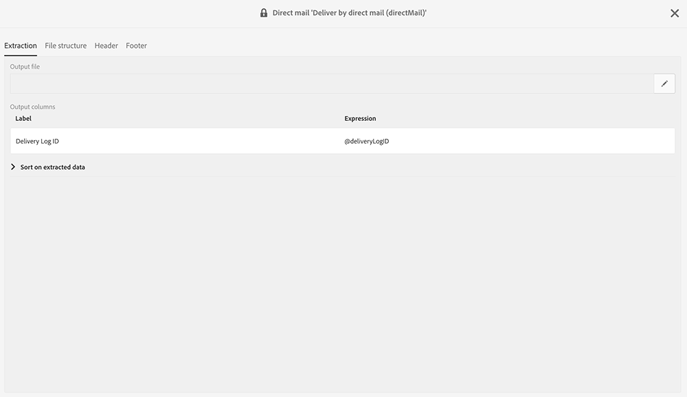
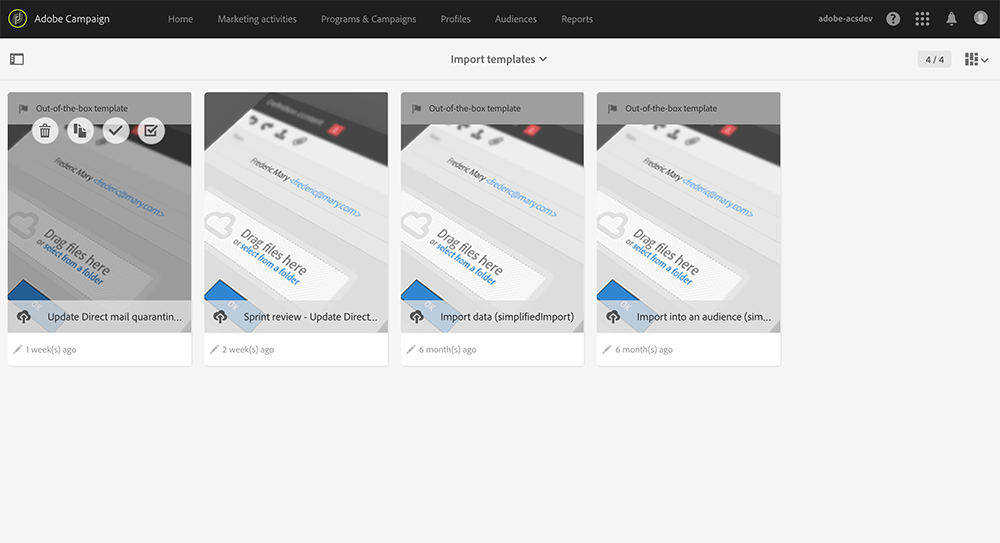

# Return to sender{#return-to-sender}

Flat file exchanges with Direct Mail providers incorporating Return to Sender information are supported. This allows corresponding postal addresses to be excluded from future communications. This also allows you to be notified of an incorrect address and engage with the customer through other channels or to encourage him to update his postal address.

For example, a contact has moved to a new place and did not provide you with his new postal address. The provider retrieves the list of erroneous addresses and sends this information to Adobe Campaign which automatically blacklists the erroneous addresses.

In order for this functionality to work, the direct mail default delivery template includes, in the content, the delivery log ID. Thus, Adobe Campaign will be able to synchronize the profile and delivery data with the information returned by the provider.

An import template is available under **[!UICONTROL Adobe Campaign > Resources > Templates > Import templates > Update Direct Mail quarantines and delivery logs]**. Duplicate this template to create your own. For more on using import templates, refer to [Using import templates](../../automating/using/defining-import-templates.md).

When the import is done, Adobe Campaign automatically performs the following actions:

* Incorrect addresses are blacklisted at the profile level
* The delivery main indicators (KPIs) are updated
* The delivery logs are updated

