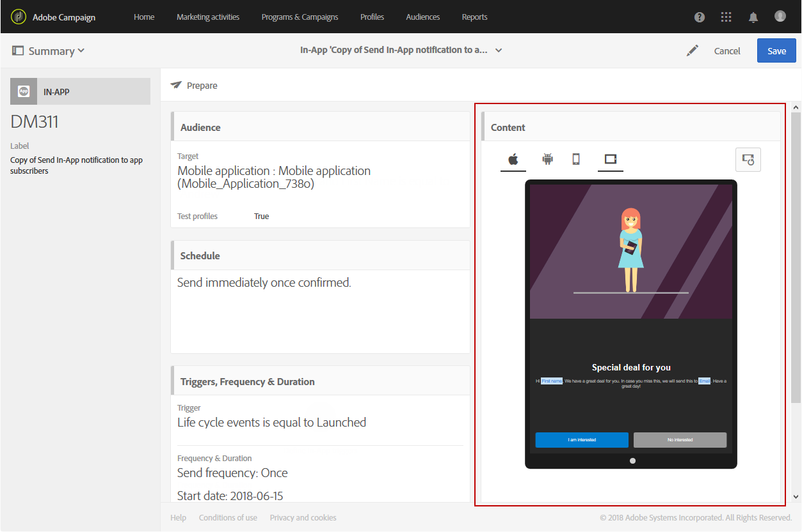
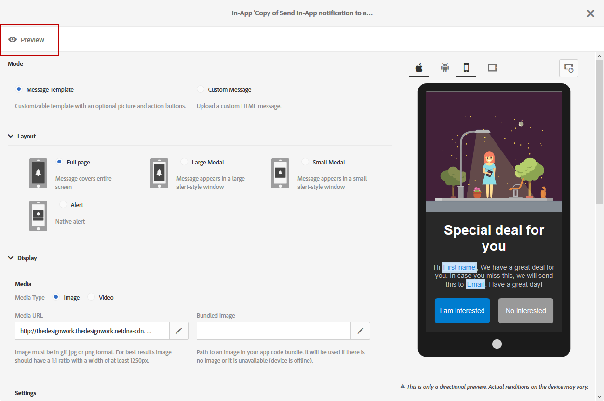
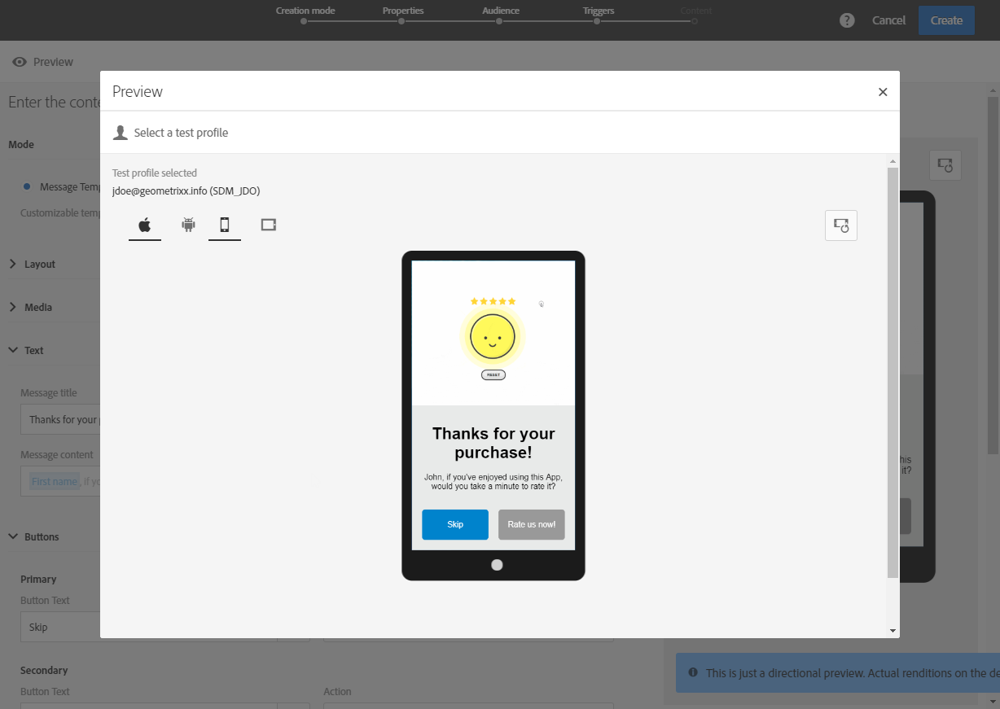

# Sending an In-App message

Sending an In-App message

Once your In-App message has been created and personalized, you can perform tests and send it to your targeted audience.

## Previewing the In-App message

Before sending your In-App message, you can test with your test profiles to check what your targeted audience will see when they receive your delivery.

1. From your delivery dashboard, click the** Content** block to come back to the content editor of the In-App message.

   

1. Click the **Preview** button.

   

1. Click the **Select a test profile** button and select one of your test profiles to start previewing your delivery. For more information on test profiles, refer to this [section](../../sending/using/managing-test-profiles-and-sending-proofs.md).
1. Check your message on different devices such as Android, iPhone phones or even tablets. You can also check if your personalization fields are retrieving the right data.

   

## Sending your In-App message

Once you have finished preparing your delivery and the approval steps have been carried out, you can send your message.

1. Click **Prepare** to compute the target and generate the messages.

   

1. Once the preparation has finished successfully, the **Deployment** window presents the following KPIs: **Target** and **To deliver**.

   You can check the Deployment window by clicking the  

   button for potential exclusions or errors in your delivery.

   

1. Click **Confirm** to start sending your In-App message.

   

1. Check the status of your delivery through the message dashboard and logs. For more on this, refer to this [section](../../sending/using/monitoring-a-delivery.md).

   

