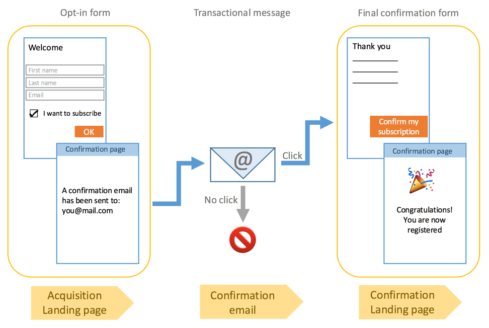
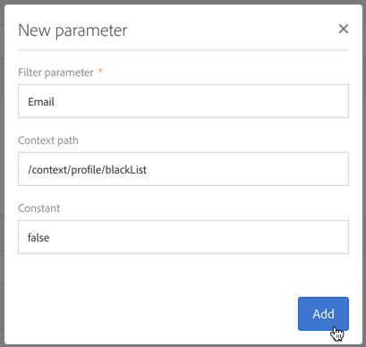
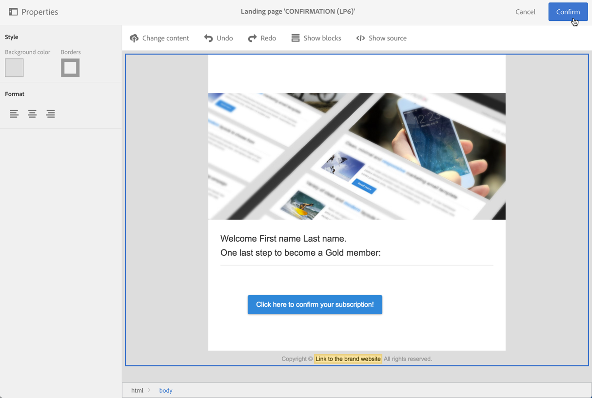
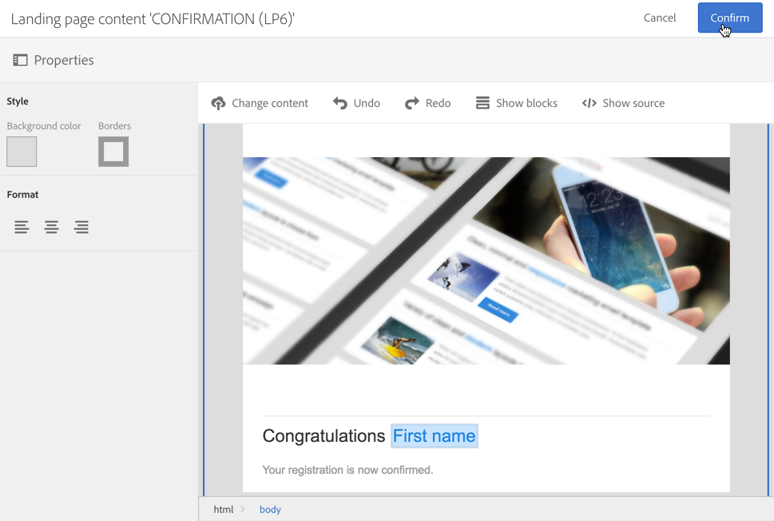
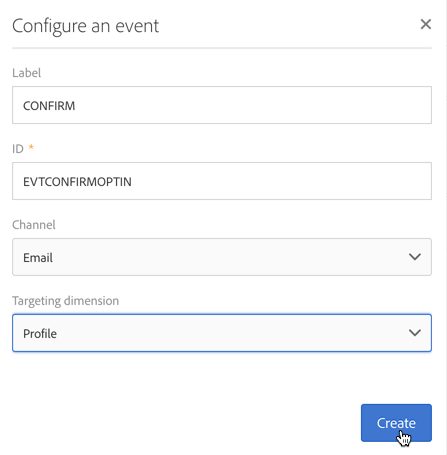
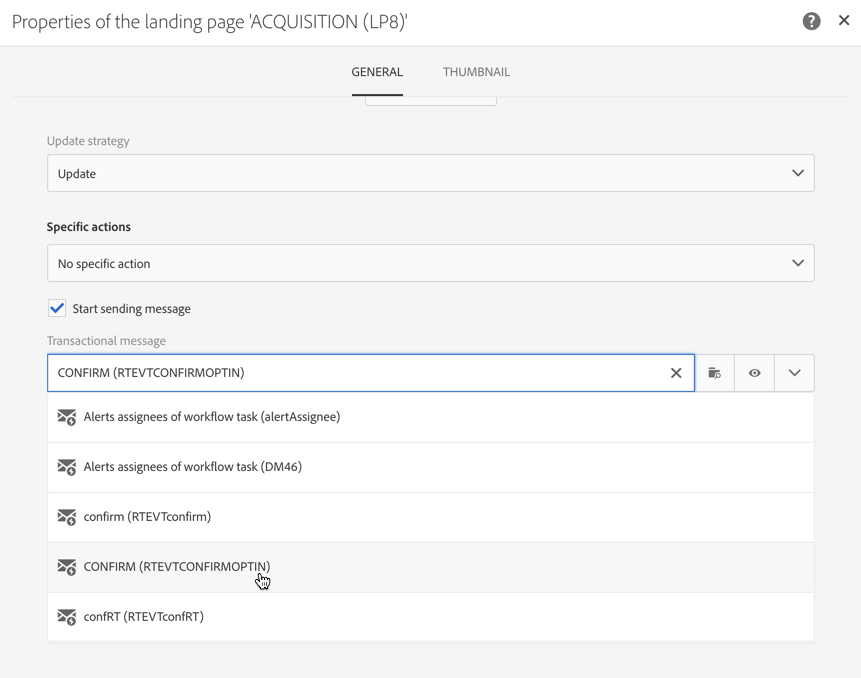
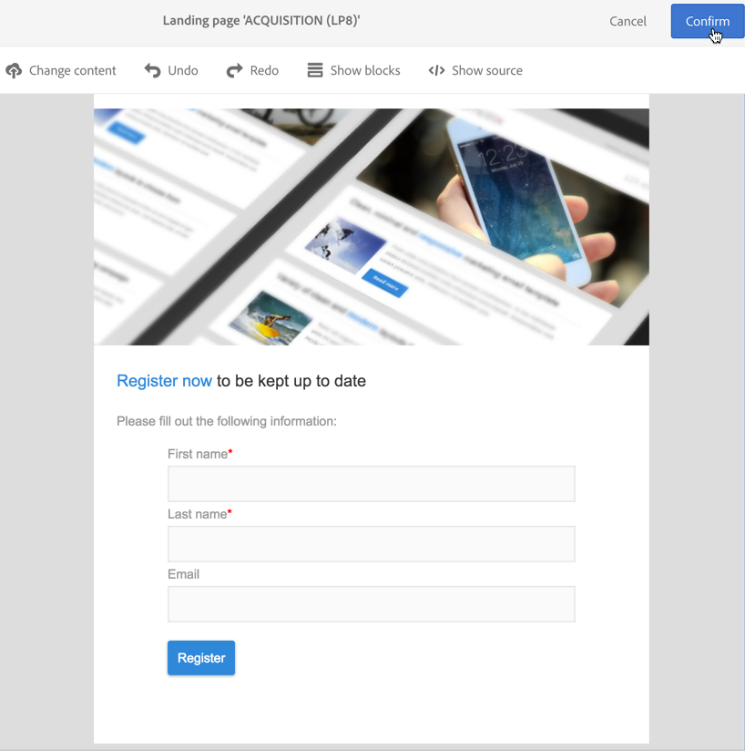
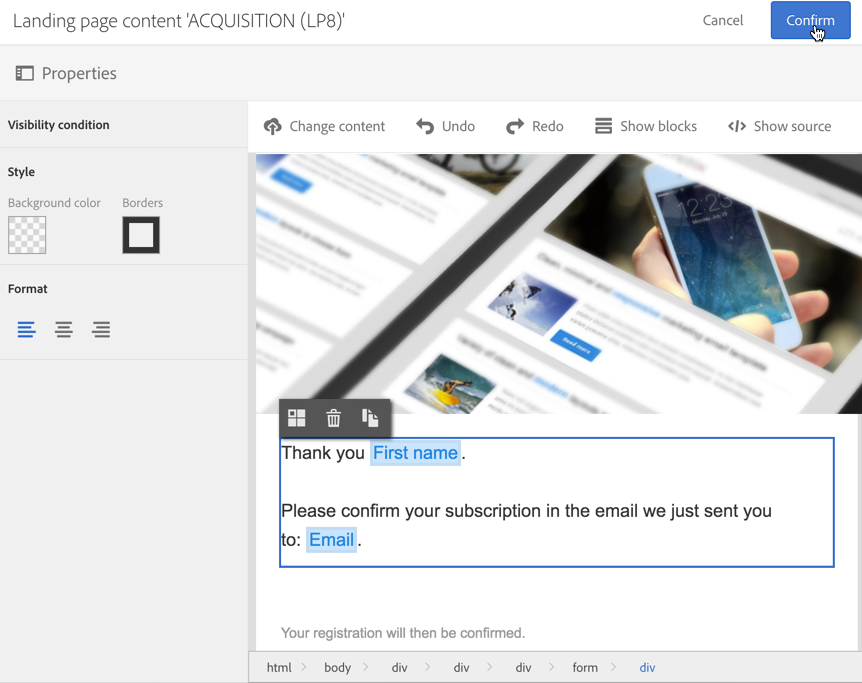

# Setting up a double opt-in process{#setting-up-a-double-opt-in-process}

Setting up a double opt-in process

## About double opt-in {#about-double-opt-in}

Double opt-in mechanism is a best practice when sending emails. It protects the platform from wrong or invalid email addresses, spambots, and prevents possible spam complaints.

The principle is to send an email to confirm the visitor's agreement before storing them as ‘profiles' into your Campaign database: the visitor fills out an online landing page, then receives an email and has to click in the confirmation link to finalize its subscription.

To set this up, you need to:

1. Create and publish a landing page so that the visitors can register and subscribe. This landing page will be available from a website. Visitors who fill in and submit this landing page will be stored in the database but ‘blacklisted', in order not to receive any communication before the final validation (see [Managing blacklisting in Campaign](../../audiences/using/about-opt-in-and-opt-out-in-campaign.md)). 
1. Create and send automatically the opt-in email, with a confirmation link. This email will target population who submitted the landing page. It will be based on an email template which allows to target ‘opt-out’ profiles. 
1. Redirect to a confirmation landing page. This final landing page will propose a confirmation button: the visitors has to click it. You can design a welcome email to be sent as confirmation is done, and for example add a special offer in the email for new recipients.

These steps have to be set up in Adobe Campaign in a specific order to have all parameters enabled properly.

## Step 1: Create the confirmation landing page {#step-create-the-confirmation-landing-page}

The process to setup double opt-in mechanism starts with the creation of the confirmation landing page: this page will be displayed when the visitors clicked on the confirmation email in order to register.

To create and configure this landing page, you need to:

1. Design a [new landing page](../../channels/using/about-landing-pages.md) based on the **Profile acquisition (acquisition)** template. Enter the label '**CONFIRMATION**'.

   If you need to use [services](../../audiences/using/about-subscriptions.md), you can also use the **Subscription (sub)** template.

1. Edit the landing page properties and under the **Access and loading** section, unselect the option **Authorize unidentified visitors**, select **Preload visitor data** (this one is not mandatory).

   

1. In the **Job** > **Form parameter mapping** section, click **Add an element** and enter the following context path:

   /context/profile/blackList

   Set the value to **false** and click **Add**.

   

   This context removes the blacklist field, in order to be able to send emails. We will see later that the first landing page was setting this field to **true** before confirmation, to prevent from sending emails to non-confirmed profiles.

1. Customize the content of the landing page: you can display personalized data and change the label of the confirmation button to ‘Click here to confirm my subscription’ for example.

   

1. Adapt the content of the confirmation page to inform your subscribers that they are now registered.

   

1. [Test and publish](../../channels/using/sharing-a-landing-page.md) the landing page.

## Step 2: Create the confirmation email {#step-create-the-confirmation-email}

Once the confirmation landing page is created, you can design the confirmation email: this email will be automatically sent to every visitor who validates the acquisition landing page. This validation is considered as an event and the email is a transactional message, linked to a specific typology rule which allows to target opt-out populations.

Steps to create these elements are described below. You need to follow them before creating the acquisition landing page itself as this email template will be referenced in it.

### Create the event {#create-the-event}

The confirmation email is a [transactional message](../../channels/using/about-transactional-messaging.md) as it reacts to an event: the validation of the form. You must first create the event and then create the template of the transactional message.

1. Create an event, from the **Marketing plans** > **Transactional messages** > **Event configuration** menu, accessible from the Adobe Campaign logo, and enter the label '**CONFIRM**'.
1. Select the **Profile** targeting dimension and click **Create**.

   

1. In the **Fields** section, click **Create element** and add the **email** in the data structure to enable reconciliation.
1. In the **Enrichment** section, click **Create element** and select the target resource **Profile**. You can then map on the **email** in the **Join definition** section, or any other composite reconciliation key, depending on your needs.

   

   If you need to use services, you can also add the **serviceName**.

1. Select **Profile** as the **Targeting enrichment** in the dropdown list.
1. Click **Publish** to publish the event.

The event is ready. You can now design the email template. This template must include a link to the **CONFIRMATION** landing page created before.

### Create the typology rule {#create-the-typology-rule}

You need to create a specific [typology rule](../../administration/using/about-typology-rules.md), by duplicating an out-of-box one. This rule will allow to send messages to profiles who did not confirm their agreement yet and are still blacklisted. By default, typology rules exclude opt-out (i.e. blacklisted) profiles. To create this typology rule, follow these steps:

1. From the Adobe Campaign logo, select **Administration** > **Channels** > **Typologies** and click **Typologies**.
1. Duplicate the out-of-box typology **Transactional message on profile (mcTypologyProfile)**.
1. Once duplication confirmed, edit the new typology and enter the label **TYPOLOGY_PROFILE**.
1. Click **Save**.

This typology can now be associated to the confirmation email.

### Design the confirmation message {#design-the-confirmation-message}

The confirmation email is a transactional message based on the event created before. Follow the steps below to create this message:

1. From the Adobe Campaign logo, select **Marketing plans** > **Transactional messages** and click **Transactional messages**.
1. Edit the **CONFIRM** email template and personalize it. You can upload an existing content or use an out-of-box template.
1. Add a link to the **CONFIRMATION** landing page, and click **Confirm** to save modifications.

   

1. Edit the email template properties. In the **Advanced parameters** > **Preparation** section, select the **TYPOLOGY_PROFILE** typology created before.
1. Save and publish the transactional message.

## Step 3: Create the acquisition landing page {#step-create-the-acquisition-landing-page}

You have to create the initial acquisition landing page: this op-in form will be published on your website.

To create and configure this landing page, you need to:

1. Design a [new landing page](../../channels/using/about-landing-pages.md) based on the **Profile acquisition (acquisition)** template. Enter the label '**ACQUISITION**'.
1. Edit the landing page properties: in the **Job** > **Form parameter mapping** section, click **Add an element** and enter the following context path:

   /context/profile/blackList

   and set the value to **true**.

   This is mandatory to force blacklist and avoid sending messages to visitors who did not confirm their agreement. The validation of the CONFIRMATION landing page will set this field to **false** after confirmation.

1. In the **Job** > **Specific actions** section, select the option **Start sending messages**.
1. In the associated drop-down list, choose the **CONFIRM** transactional message template you created.

   

1. Customize the content of the landing page, depending on your brand and on data you need to acquire. You can display personalized data and change the label of the confirmation button to **Confirm my subscription** for example.

   

1. Customize the confirmation page to inform the new subscriber that he needs to validate his subscription.

   

1. [Test and publish](../../channels/using/sharing-a-landing-page.md) the landing page.

Double opt-in mechanism is now configured. You can run and test the procedure from end to end, starting from the public URL of this **ACQUISITION** landing page. This URL is displayed in the landing page dashboard.
