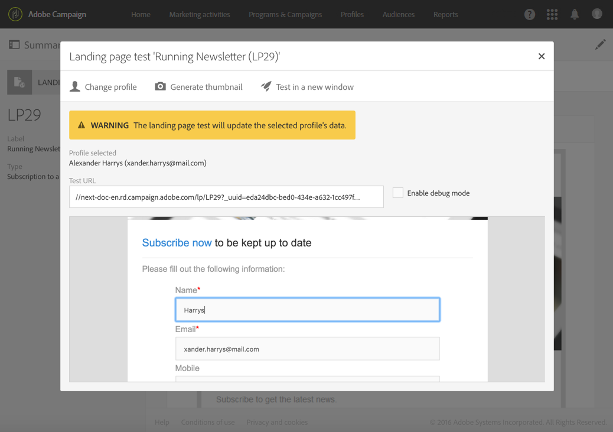
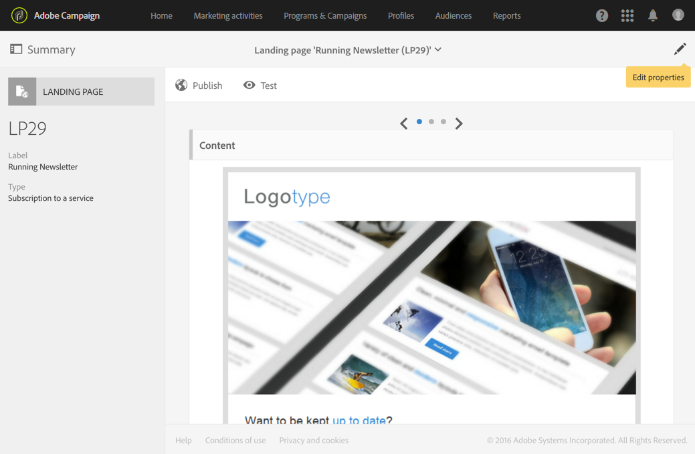
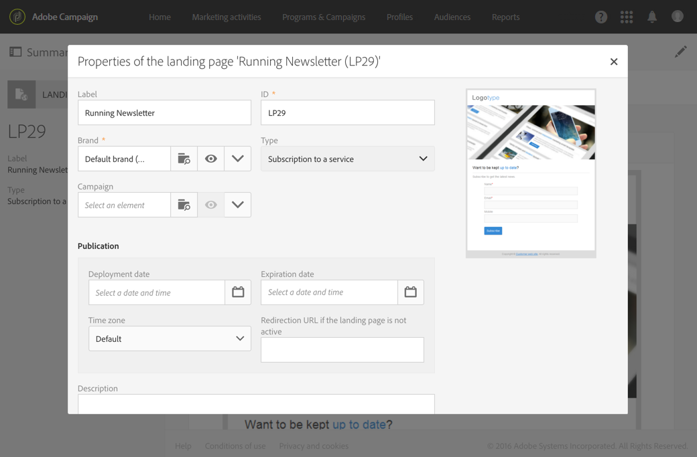

# Testing and publishing a landing page{#testing-publishing--landing-page}

## About landing page publication {#about-landing-page-publication}

Before publishing a landing page, you need to perform tests: validate the execution, configure access and set up your landing page end-of-life. These steps are prerequisites and need to be executed with caution.

## Testing the landing page {#testing-the-landing-page-}

As the landing page will impact your platform and data, you need to test carefully its execution. To do this:

1. Click the **[!UICONTROL Test]** button in the action bar of the landing page.
1. From the test screen, select a test profile, and a test service if the landing page is to manage subscriptions.

   

1. Enter data in the fields, and select options. 
1. Submit the landing page and check updates in the database.

   >[!IMPORTANT]
   >
   >When the form is submitted, service and profile used are updated.

1. Repeat this with various profiles and data.

You can also generate the landing page thumbnail from this screen.

>[!NOTE]
>
>To display the landing page preview in the Campaign user interface, the application server URL must be secure. In that case, use https:// rather than http:// to set up this URL when [configuring your brand](../../administration/using/branding.md#configuring-and-using-brands).

## Setting up validity parameters {#setting-up-validity-parameters}

Before publishing, for security reasons and platform performances, we highly recommend you to set an expiration date in the landing page properties. On the selected date, the landing page is automatically unpublished. To do this:

1. Edit the landing page properties accessed via the  button in the landing page dashboard.

   

1. Set up expiration date and time in the **[!UICONTROL Publication]** section: the landing page will automatically be unpublished on the specified date and therefore no longer be available.

   You can select the time zone to be taken into account for this date and time.

1. Define a redirection URL to redirect the visitors when trying to access a non-active landing page.

   

>[!IMPORTANT]
>
>You can also define a deployment date and time: the landing page will then be automatically published on the specified date.

## Publishing a landing page {#publishing-a-landing-page}

When you publish a landing page, it goes live and can be accessed by your visitors.

You can unpublish or update and republish your landing page at any time, via the **[!UICONTROL Publish]** button. However, if republishing fails and you have not yet unpublished your landing page, the first version will remain online.
