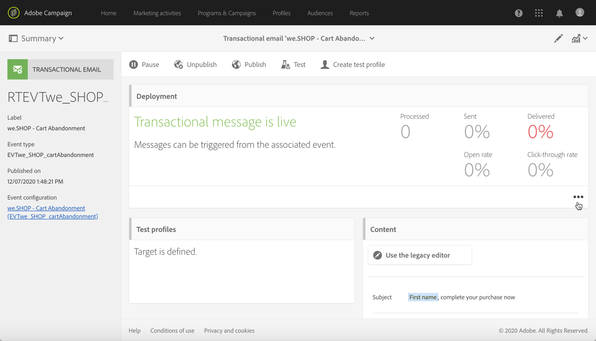
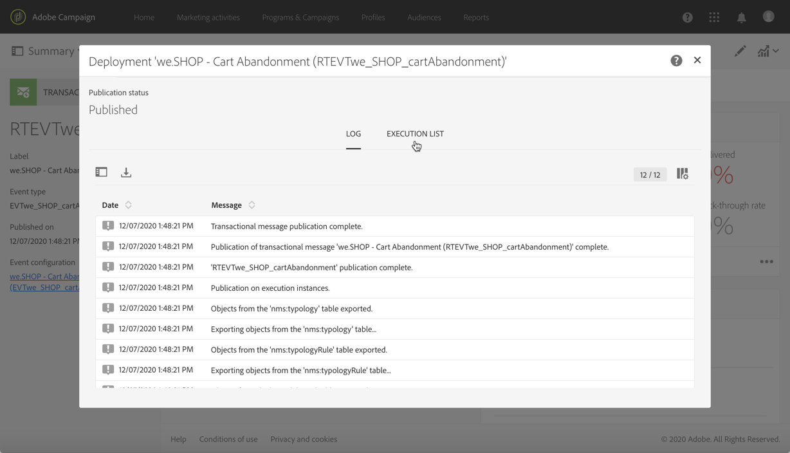
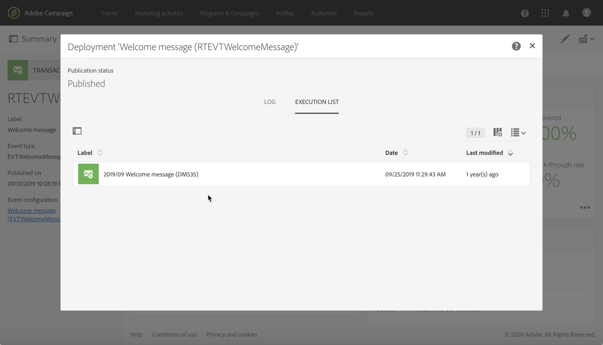
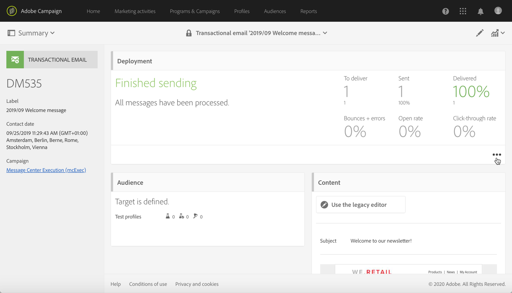

# Transactional messaging execution and monitoring {#transactional-messaging-execution}

## Transactional message execution delivery {#transactional-message-execution-delivery}

Once the message is published and your site integration is done, when an event is triggered, it is assigned to an execution delivery.

An **execution delivery** is a non-actionable and non-functional technical message created once a month for each transactional message, and each time a transactional message is edited and published again.

**Related topics**:
* [Publishing a transactional message](../../channels/using/publishing-transactional-message.md#publishing-a-transactional-message)
* [Integrate the event triggering](../../channels/using/getting-started-with-transactional-msg.md#integrate-event-trigger)

## Transactional messaging retry process {#transactional-message-retry-process}

A temporarily undelivered transactional message is subject to automatic retries that are performed until the delivery expires. For more on the delivery duration, see [Validity period parameters](../../administration/using/configuring-email-channel.md#validity-period-parameters).

When a transactional message fails to be sent, there are two retry systems:

* At the transactional messaging level, a transactional message can fail before the event is assigned to an execution delivery, meaning between the event reception and the delivery preparation. See [Event processing retry process](#event-processing-retry-process).
* At the sending process level, once the event has been assigned to an execution delivery, the transactional message can fail due to a temporary error. See [Message sending retry process](#message-sending-retry-process).

### Event processing retry process {#event-processing-retry-process}

When an event is triggered, it is assigned to an execution delivery. If the event cannot be assigned to an execution delivery, the event processing is postponed. Retries are then performed until it is assigned to a new execution delivery.

>[!NOTE]
>
>A postponed event does not appear in the transactional message sending logs, because it is not assigned to an execution delivery yet.

For example, the event could not be assigned to an execution delivery because its content was not correct, there was an issue with access rights or branding, an error was detected on applying typology rules, etc. In this case, you can pause the message, edit it to fix the problem and publish it again. The retry system will then assign it to a new execution delivery.

### Message sending retry process {#message-sending-retry-process}

Once the event has been assigned to an execution delivery, the transactional message can fail due to a temporary error, if the recipient's mailbox is full for example. For more on this, see [Retries after a delivery temporary failure](../../sending/using/understanding-delivery-failures.md#retries-after-a-delivery-temporary-failure).

>[!NOTE]
>
>When an event is assigned to an execution delivery, it appears in the sending logs of this execution delivery, and only at this time. The failed deliveries are displayed in the **[!UICONTROL Execution list]** tab of the transactional message sending logs.

### Retry process limitations {#limitations}

**Sending logs update**

In the retry process, the sending logs of the new execution delivery are not immediately updated (the update is performed through a scheduled workflow). It means that the message could be in **[!UICONTROL Pending]** status even if the transactional event has been processed by the new execution delivery.

**Failed execution delivery**

You cannot stop an execution delivery. However, if the current execution delivery fails, a new one is created as soon as a new event is received, and all new events are processed by this new execution delivery. No new events are processed by the failed execution delivery.

If some events already assigned to an execution delivery have been postponed as part of the retry process and if that execution delivery fails, the retry system does not assign the postponed events to the new execution delivery, which means that these events are lost. Check the [delivery logs](#monitoring-transactional-message-delivery) to see the recipients that may have been impacted.

## Monitoring transactional messages {#monitoring-transactional-message-delivery}

To monitor a transactional message, you need to access the corresponding [execution deliveries](#transactional-message-execution-delivery).

1. To view the message delivery log, click the icon at the bottom right of the **[!UICONTROL Deployment]** block.

   

1. Click the **[!UICONTROL Execution list]** tab.

   

1. Select the execution delivery of your choice.

   

1. Click again the icon at the bottom right of the **[!UICONTROL Deployment]** block.

   

   For each execution delivery, you can consult the delivery logs as you would do for a standard delivery. For more on accessing and using the logs, see [Monitoring a delivery](../../sending/using/monitoring-a-delivery.md).

### Profile-based transactional message specificities {#profile-transactional-message-monitoring}

For profile-based transactional messages, you can monitor the following profile information.

Select the **[!UICONTROL Sending logs]** tab. In the **[!UICONTROL Status]** column, **[!UICONTROL Sent]** indicates that a profile has opted in.

Select the **[!UICONTROL Exclusions logs]** tab to view recipients who have been excluded from the message target, such as addresses on denylist.

For any profile that has opted out, the **[!UICONTROL Address on denylist]** typology rule excluded the corresponding recipient.

This rule is part of a specific typology that applies to all transactional messages based on the **[!UICONTROL Profile]** table.

**Related topics**:

* [About typologies and typology rules](../../sending/using/about-typology-rules.md)
* [Monitoring a delivery](../../sending/using/monitoring-a-delivery.md)
