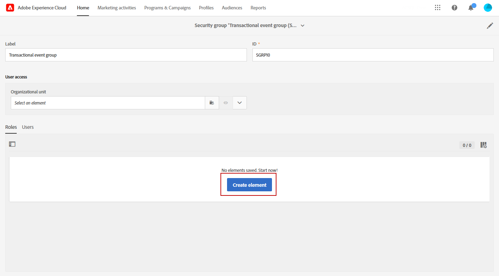
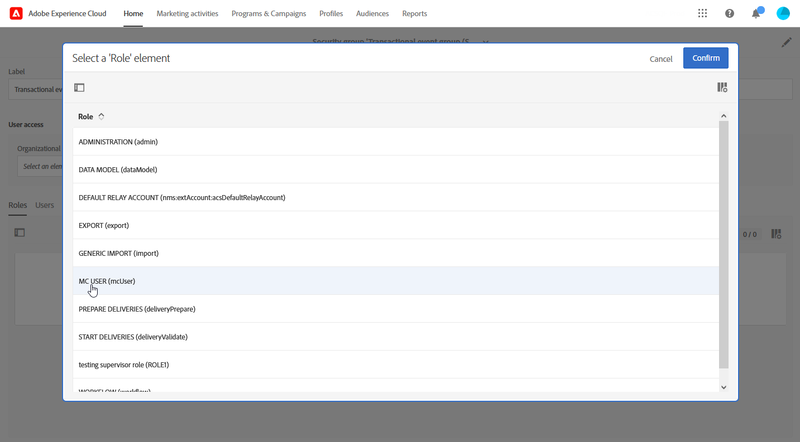
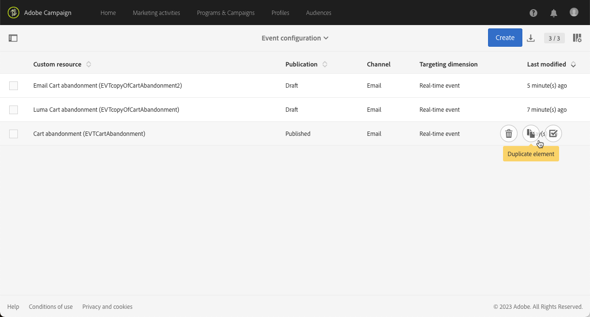
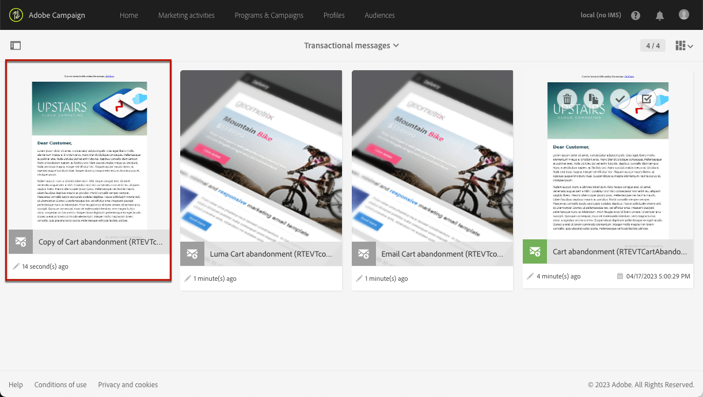
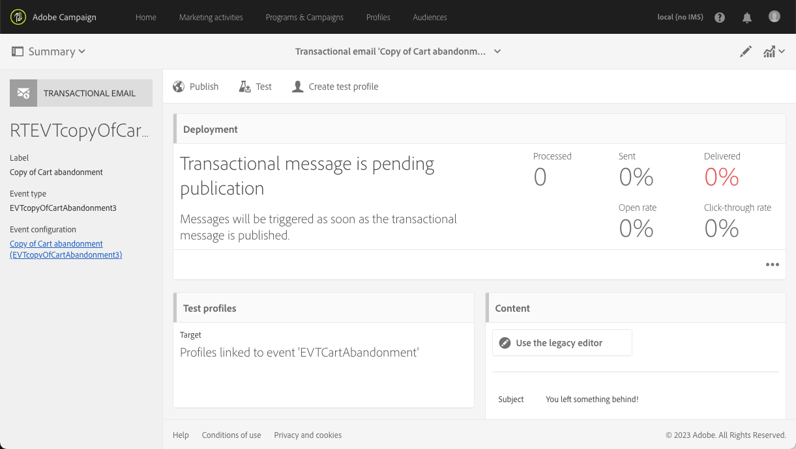

# Transactional event improvements {#transactional-event-improvements}

>[!AVAILABILITY]
>
>These features are currently only available for a set of organizations (Limited Availability). For more information, contact your Adobe representative.

Currently, in Adobe Campaign Standard, users without the Administrator security group cannot access, create, or publish transactional events, causing issues for business users who need to configure and publish events but lack Administrator rights. Also, it is not possible to duplicate transactional events.

We have implemented the following improvements to transactional messaging access control:

* A new **[!UICONTROL Role]**, called **MC user**, has been added to allow non-administrator users to manage transactional event configuration. The **MC user** role grants these users the ability to access, create, publish, and unpublish transactional events and messages.

* Execution deliveries (i.e. technical messages that are created each time a transactional message is edited and published again, or once a month by default) are now set to the **[!UICONTROL Organizational unit]** of the security group to which the user creating the event belongs, rather than being restricted to the **[!UICONTROL Organizational unit]** of the **Message Center agent (mcExec)** security group.

* **Administrators** can now duplicate published transactional events, as well as users with the **MC user** role provided they are in the same **Organizational unit** hierarchy as the user who created the event.

## Assign the MC user role {#assign-role}

To assign the **MC user** role to your security group:

1. Create a new **[!UICONTROL Security group]** or update an existing one. [Learn more](../../administration/using/managing-groups-and-users.md).

1. Click **[!UICONTROL Create element]** to assign roles to your security group.

   

1. Select the MC user **[!UICONTROL Role]** and click **[!UICONTROL Confirm]**.

    >[!IMPORTANT]
    >
    > Proceed with caution when assigning the MC User role to operators, as this grants them the ability to unpublish events.

   

1. Once configured, click **[!UICONTROL Save]**.

Users linked to this **[!UICONTROL Security group]** can now access, create, and publish transactional events and messages.

## Assign the MC user security group {#assign-group}

1. In the Admin Console, select the **Products** tab.

1. Select **Adobe Campaign Standard** then choose your instance.

1. From the **Product profiles** list, select the **MC user** group.

1. Click **Add user** and enter the name, user group, or email address of the profile you want to add to this product profile.

1. Once added, click **Save**.

Users added to this **[!UICONTROL Security group]** can now access, create, and publish transactional events and messages.

## Duplicate transactional events {#duplicate-transactional-events}

A user with the **Administrator** security group<!--([Functional administrators](../../administration/using/users-management.md#functional-administrators)?)--> can now duplicate an event configuration if the event has been **published**.

Moreover, non-administrator users with the **MC user** role can now access event configurations, but their permission to duplicate is determined by the **Organizational unit** they belong to. If the current user and the user who created the event belong to the same organizational unit hierarchy, duplication is allowed.

For example, if a user belonging to the 'France Sales' organizational unit creates an event configuration:

* Another user whose organizational unit is 'Paris Sales' will be able to duplicate this event, because 'Paris Sales' is part of the 'France Sales' organizational unit.

* However, a user whose organizational unit is 'San Francisco Sales' will not be able to do so, because 'San Francisco Sales' is under the 'US Sales' organizational unit, which is separate from the 'France Sales' organizational unit.

To duplicate an event configuration, follow the steps below.

1. Click the **Adobe** logo, in the top-left corner, then select **[!UICONTROL Marketing plans]** > **[!UICONTROL Transactional messages]** > **[!UICONTROL Event configuration]**.

1. Hover the mouse over the published event configuration of your choice and select the **[!UICONTROL Duplicate element]** button.

   

   >[!CAUTION]
   >
   >You cannot duplicated an event configuration that is not published. [Learn more](publishing-transactional-event.md)

1. The duplicated event automatically displays. It contains the same configuration that you defined for the original event, but it has the **[!UICONTROL Draft]** status.

   

1. The corresponding transactional message is automatically created. To access it, go to **[!UICONTROL Transactional messages]** > **[!UICONTROL Transactional messages]**.

   

1. Open the newly duplicated message. It contains the same design you defined for the original message, but it has the **[!UICONTROL Draft]** status, even if the original transactional message was published.

   

1. You can now edit and personalize this message. See [Editing transactional messages](../../channels/using/editing-transactional-message.md).

## Impacts {#impacts}

The table below outlines the impact of these improvements:

| Objects | Before this change | After this change |
|:-: | :--: | :-:|
|Transactional Events| Only users within the **Administrator** security group can create and publish events. | The **MC user** role allows users to create and publish events.|
|Transactional Messages| Transactional messages are set to the **Organizational unit** of the **Message Center agent (mcExec)** security group. | Transactional messages are set to the **Organizational unit** of the security group to which the user creating the transactional event/message belongs.|
| Execution Deliveries| Execution deliveries are set to the **Organizational unit** of the **Message Center agent (mcExec)** security group.| Execution deliveries are set to the **Organizational unit** of the security group to which the user creating the transactional event/message belongs.|
|Published Transactional Events| Duplication is not possible for any user. | <ul><li>Users with the **Administrator** security group can duplicate published events.</li> <li>Users with the **MC user** role can duplicate published events provided they are in the same **Organizational unit** hierarchy as the user who created the event.</li></ul>|

<!--Transactional Message Templates| Transactional Message templates are set to the Organizational unit **All**. | Transaction Message Template will be set to the **Organizational unit** of the security group to which the user creating the message template belongs.-->