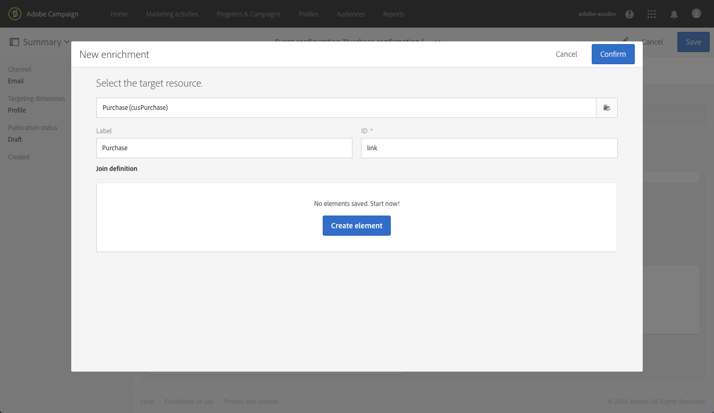
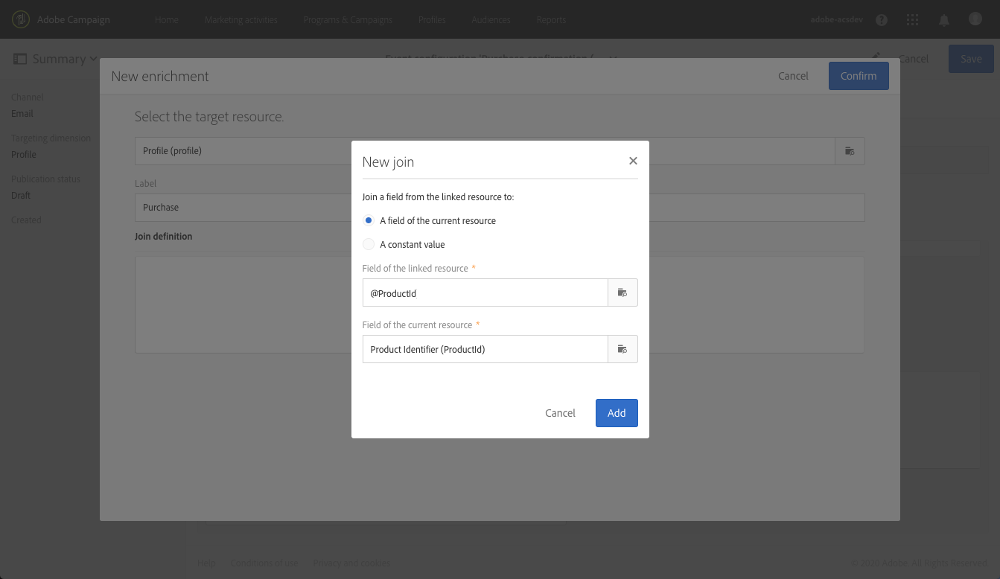

# Transactional messaging use case {#transactional-messaging-use-case}

In this example, you want to use the Adobe Campaign transactional messaging functionality to send a confirmation email after each purchase on your website, identifying your customers via their CRM ID.

The prerequisites are as follows:

* Make sure that the **[!UICONTROL Profile]** resource has been extended with a new field corresponding to the CRM ID.

* Create and publish a custom resource corresponding to purchases and link it to the **[!UICONTROL Profile]** resource. This way, you will be able to retrieve information from this resource to enrich the message content.

For more on extending, creating and publishing resources, see [this section](../../developing/using/key-steps-to-add-a-resource.md).

The main steps to implement this use case are as follows. To see a graphical representation of the transactional messaging general process, see [this chart](../../channels/using/getting-started-with-transactional-msg.md#key-steps).

## Step 1 - Create and publish the event configuration {#create-event-configuration}

1. Create a new event using the **[!UICONTROL Email]** channel. See [Creating an event](../../channels/using/configuring-transactional-event.md#creating-an-event)

1. Select the **[!UICONTROL Profile]** targeting dimension to create a [profile-based transactional message](../../channels/using/configuring-transactional-event.md#profile-based-transactional-messages).

1. Define the attributes that will be available to personalize the transactional message. In this example, add the "CRM ID" and the "Product identifier" fields. See [Defining the event attributes](../../channels/using/configuring-transactional-event.md#defining-the-event-attributes).

   

1. To enrich the message content with information regarding the customer's purchases, create an enrichment targeting the **[!UICONTROL Purchase]** resource. See [Enriching the event](../../channels/using/configuring-transactional-event.md#enriching-the-transactional-message-content).

   

1. Create a join condition between the "Product identifier" field that was previously added to the event, and the corresponding field from the **[!UICONTROL Purchase]** resource.

   

1. Because it is mandatory for profile-based events, you must also create an enrichment targeting the **[!UICONTROL Profile]** resource.

1. Create a join condition between the "CRM ID" field that was previously added to the message, and the corresponding field from the **[!UICONTROL Profile]** resource that you extended. <!--What's the purpose to have created a CRM ID for this event and to have the CRM ID as a join condition? could it be any other field provided you created it in the event?-->

1. In the Targeting enrichment section, select the enrichment on **[!UICONTROL Profile]** resource (it will be used as the message target during the delivery execution).

1. Preview and publish the event. See [Previewing and publishing the event](../../channels/using/publishing-transactional-event.md#previewing-and-publishing-the-event).

## Step 2 - Edit and publish the transactional message {#create-transactional-message}

1. Go to the transactional message that was automatically created upon publishing the event. See [Accessing transactional messages](../../channels/using/editing-transactional-message.md#accessing-transactional-messages).

1. Edit and personalize the message. See [Editing a profile transactional message](../../channels/using/editing-transactional-message.md#editing-profile-transactional-message).

1. As you have direct access to all profile information to [personalize](../../designing/using/personalization.md#inserting-a-personalization-field) your message, select the "CRM ID" field that you added to the **[!UICONTROL Profile]** resource.

1. Enrich the message content with information regarding the customer's purchases by adding the "Product identifier" field (or any other field) from the **[!UICONTROL Purchase]** resource.

1. You can test your message using a specific test profile. See [Testing a transactional message](../../channels/using/publishing-transactional-message.md#testing-a-transactional-message).

1. Once your content is ready, save your changes and publish the message. See [Publishing a transactional message](../../channels/using/publishing-transactional-message.md#publishing-a-transactional-message).

## Step 3 - Integrate the event triggering {#integrate-event-trigger}

Integrate the event into your website (see [Integrate event triggering](../../channels/using/getting-started-with-transactional-msg.md#integrate-event-trigger)).

## Step 4 - Message delivery {#message-delivery}

Once all of these steps have been carried out, as soon as a customer makes a purchase on your website, they receive a confirmation email with details on their CRM ID and their purchase.