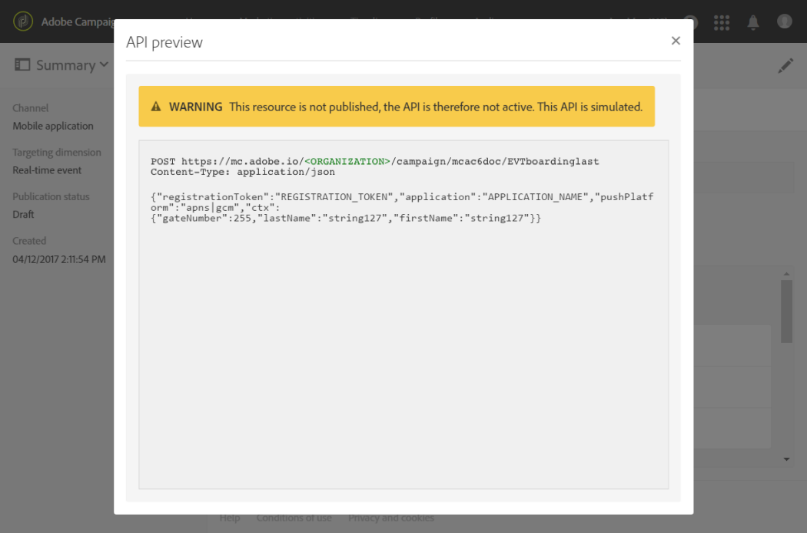
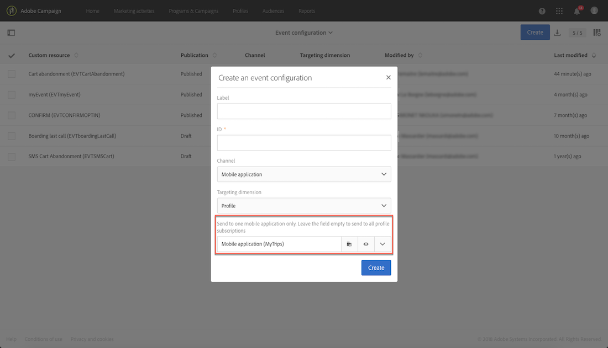

# Transactional push notifications{#transactional-push-notifications}

You can use Adobe Campaign to send transactional push notifications on iOS and Android mobile devices. These messages are received on mobile applications that you set up in Adobe Campaign by leveraging the Experience Cloud Mobile SDK.

>[!NOTE]
>
>The push channel is optional. Please check your license agreement. For more information on standard push notifications, see [About push notifications](../../channels/using/about-push-notifications.md).

To be able to send transactional push notifications, you need to configure Adobe Campaign accordingly. See [Configuring a mobile application](../../administration/using/configuring-a-mobile-application.md).

You can send two types of transactional push notifications:

* [Transactional push notifications targeting an event](#transactional-push-notifications-targeting-an-event)
* [Transactional push notifications targeting profiles](#transactional-push-notifications-targeting-a-profile) from the Adobe Campaign database

## Transactional push notifications targeting an event {#transactional-push-notifications-targeting-an-event}

You can use Adobe Campaign to send **anonymous transactional push notifications to all users** who have opted in to receive notifications from your mobile application.

In this case, only **the data contained in the event itself is used to define the delivery target**. No data from the Adobe Campaign integrated profile database is leveraged.

### Configuring an event-based transactional push notification {#configuring-event-based-transactional-push-notification}

To send a transactional push notification to all users who have opted in to receive notifications from your mobile application, you first need to create and configure an event targeting the data contained in the event itself.

>[!NOTE]
>
>You can still personalize the content of an event-based transactional push notification using [event attributes](../../channels/using/configuring-transactional-event.md#defining-the-event-attributes) (data from the event) and [event enrichment](../../channels/using/configuring-transactional-event.md#enriching-the-transactional-message-content) (data from the Campaign database). See [the example below](#sending-event-based-transactional-push-notification).

The event must contain the three following elements:

* A **registration token**, which is the user ID for one mobile application and one device. It may not correspond to any profile from the Adobe Campaign database.
* A **mobile application name** (one for all devices - Android and iOS). This is the ID of the mobile application configured in Adobe Campaign that will be used to receive push notifications on the users' devices. For more on this, refer to [Configuring a mobile application](../../administration/using/configuring-a-mobile-application.md).
* A **push platform** ("gcm" for Android or "apns" for iOS).

To configure the event, follow the steps below:

1. When creating the event configuration, select the **[!UICONTROL Push notification]** channel and the **[!UICONTROL Real-time event]** targeting dimension (see [Creating an event](../../channels/using/configuring-transactional-event.md#creating-an-event)).
1. Add fields to the event. This will allow you to personalize the transactional message (see [Defining the event attributes](../../channels/using/configuring-transactional-event.md#defining-the-event-attributes)). In this example, define the "gateNumber", "lastname" and "firstname" fields.
1. You can also enrich the content of your message. To do this, add fields from the table that you linked to your event configuration (see [Enriching the event](../../channels/using/configuring-transactional-event.md#enriching-the-transactional-message-content)).

   <!--Event-based transactional messaging is supposed to use only the data that are in the sent event to define the recipient and the message content personalization. However, you can enrich the content of your transactional message using information from the Adobe Campaign database.-->

1. [Preview and publish the event](../../channels/using/publishing-transactional-event.md#previewing-and-publishing-the-event).

   When previewing the event, the REST API contains the "registrationToken", "application" and "pushPlatform" attributes that will be used to target the delivery.

   

   Once the event has been published, a transactional push notification linked to the new event is automatically created. You can now modify and publish the message that was just created (see [this section](#sending-event-based-transactional-push-notification)).

1. Integrate the event into your website (see [Integrate the event triggering](../../channels/using/getting-started-with-transactional-msg.md#integrate-event-trigger)).

### Sending an event-based transactional push notification {#sending-event-based-transactional-push-notification}

For example, an airline company wants to invite its mobile application users to proceed to the relevant gate for boarding.

The company will send one transactional push notification per user (identified with a registration token), using one mobile application, through one single device.

1. Go the transactional message that was created to edit it. See [Accessing transactional messages](../../channels/using/editing-transactional-message.md#accessing-transactional-messages).

   

1. Click the **[!UICONTROL Content]** block to modify your message's title and body.

1. You can insert personalization fields to add elements that you defined when you created your event (see [Defining the event attributes](../../channels/using/configuring-transactional-event.md#defining-the-event-attributes)).

   

   To find these fields, click the pencil next to an item, click **[!UICONTROL Insert personalization field]** and select **[!UICONTROL Context]** > **[!UICONTROL Real-time event]** > **[!UICONTROL Event context]**.

   

   For more on editing a push notification content, see [Preparing and sending a push notification](../../channels/using/preparing-and-sending-a-push-notification.md).

1. You can also enrich the transactional message content if you want to use additional information from Adobe Campaign database (see [Enriching the event](../../channels/using/configuring-transactional-event.md#enriching-the-transactional-message-content)).

1. Save your changes and publish the message. See [Publishing a transactional message](../../channels/using/publishing-transactional-message.md#publishing-a-transactional-message).

1. Using the Adobe Campaign Standard REST API, send an event to a registration token (ABCDEF123456789), using one mobile application (WeFlight), on Android (gcm), containing the boarding data:

   ```
   
   {
     "registrationToken":"ABCDEF123456789",
     "application":"WeFlight",
     "pushPlatform":"gcm",
     "ctx":
     {
       "gateNumber":"Gate B18",
       "lastname":"Green",
       "firstname":"Jane"
     }
   }
   
   ```

   For more on integrating the triggering of an event into an external system, see [Integrate the event triggering](../../channels/using/getting-started-with-transactional-msg.md#integrate-event-trigger).

If the registration token exists, the corresponding user receives a transactional push notification including the following content:

*"Hello Jane Green, boarding has just started! Please proceed to Gate B18."*

## Transactional push notifications targeting a profile {#transactional-push-notifications-targeting-a-profile}

You can send a transactional push notification **to the Adobe Campaign profiles who have subscribed to your mobile application**. This delivery can contain [personalization fields](../../designing/using/personalization.md#inserting-a-personalization-field), such as the recipient's first name, directly retrieved from the Adobe Campaign database.

In this case, the event must contain some fields **allowing reconciliation with a profile from the Adobe Campaign database**.

When targeting profiles, one transactional push notification is sent per mobile application and per device. For example, if an Adobe Campaign user has subscribed to two applications, this user will receive two notifications. If a user has subscribed to the same application with two different devices, this user will receive a notification on each device.

The mobile applications a profile has subscribed to are listed in the **[!UICONTROL Mobile App Subscriptions]** tab of this profile. To access this tab, select a profile and click the **[!UICONTROL Edit profile properties]** button on the right.


For more information on accessing and editing profiles, see [About profiles](../../audiences/using/about-profiles.md).

### Configuring a profile-based transactional push notification {#configuring-profile-based-transactional-push-notification}

To send a transactional push notification to the Adobe Campaign profiles who have subscribed to your mobile application, you first need to create and configure an event targeting the Adobe Campaign database.

1. When creating the event configuration, select the **[!UICONTROL Push notification]** channel and the **[!UICONTROL Profile]** targeting dimension (see [Creating an event](../../channels/using/configuring-transactional-event.md#creating-an-event)).

   By default, the transactional push notification will be sent to all mobile applications to which the recipients subscribed. To send the push notification to a specific mobile application, select it in the list. The other mobile applications will be targeted by the message but will be excluded from the sending.

   

1. Add fields to the event, if you want to personalize the transactional message (see [Defining the event attributes](../../channels/using/configuring-transactional-event.md#defining-the-event-attributes)).

   >[!NOTE]
   >
   >You must add at least one field to create an enrichment. You do not need to create other fields such as **First name** and **Last name** as you will be able to use personalization fields from the Adobe Campaign database.

1. Create an enrichment in order to link the event to the **[!UICONTROL Profile]** resource (see [Enriching the event](../../channels/using/configuring-transactional-event.md#enriching-the-transactional-message-content)) and select this enrichment as the **[!UICONTROL Targeting enrichment]**.

   >[!IMPORTANT]
   >
   >This step is mandatory for profile-based events.
   
1. [Preview and publish the event](../../channels/using/publishing-transactional-event.md#previewing-and-publishing-the-event).

   When previewing the event, the REST API does not contain an attribute specifying the registration token, the application name and the push platform as they will be retrieved from the **[!UICONTROL Profile]** resource.

   Once the event has been published, a transactional push notification linked to the new event is automatically created. You can now modify and publish the message that was just created (see [this section](#sending-profile-based-transactional-push-notification)).

1. Integrate the event into your website (see [Integrate the event triggering](../../channels/using/getting-started-with-transactional-msg.md#integrate-event-trigger)).

### Sending a profile-based transactional push notification {#sending-profile-based-transactional-push-notification}

For example, an airline company wants to send a last call for boarding to all Adobe Campaign users who have subscribed to its mobile application.

1. Go the transactional message that was created to edit it. See [Accessing transactional messages](../../channels/using/editing-transactional-message.md#accessing-transactional-messages).

1. Click the **[!UICONTROL Content]** block to modify your message's title and body.

   As opposed to configurations based on real-time events, you have direct access to all profile information to personalize your message. See [Inserting a personalization field](../../designing/using/personalization.md#inserting-a-personalization-field).

   For more on editing a push notification content, see [Preparing and sending a push notification](../../channels/using/preparing-and-sending-a-push-notification.md).

1. Save your changes and publish the message. See [Publishing a transactional message](../../channels/using/publishing-transactional-message.md#publishing-a-transactional-message).
1. Using the Adobe Campaign Standard REST API, send an event to a profile:

   ```
   
   {
     "ctx":
     {
       "email":"janegreen@email.com",
       "gateNumber":"D16",
     }
   }
   
   ```

For more on integrating the triggering of an event into an external system, see [Integrate the event triggering](../../channels/using/getting-started-with-transactional-msg.md#integrate-event-trigger).

The corresponding user receives a transactional push notification including the all personalization elements retrieved from the Adobe Campaign database.

   >[!NOTE]
   >
   >There is no registration token, application and push platform fields. In this example, the reconciliation is performed with the email field.
