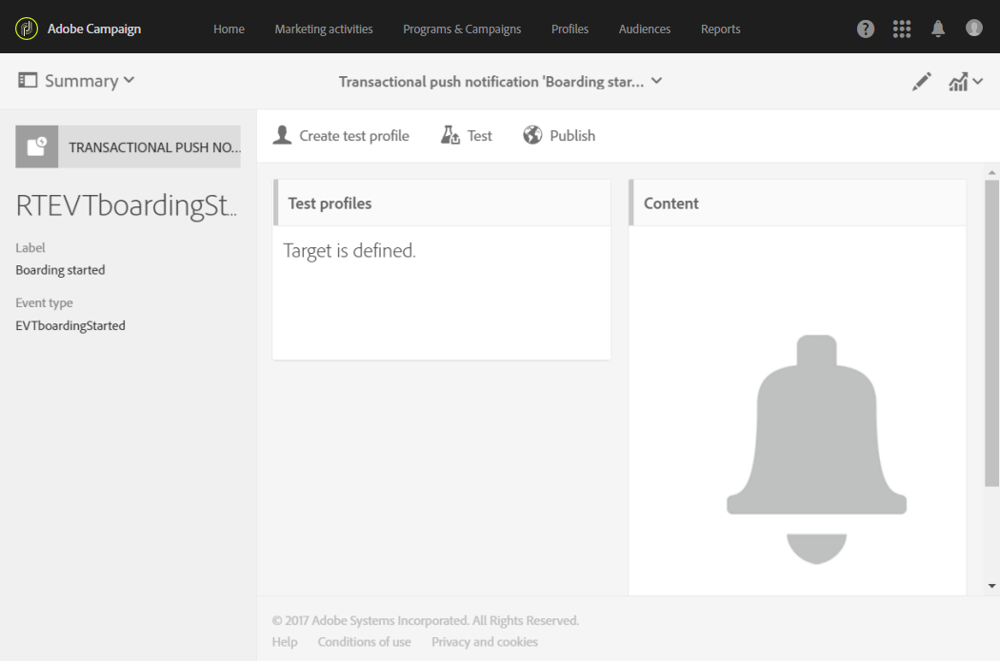
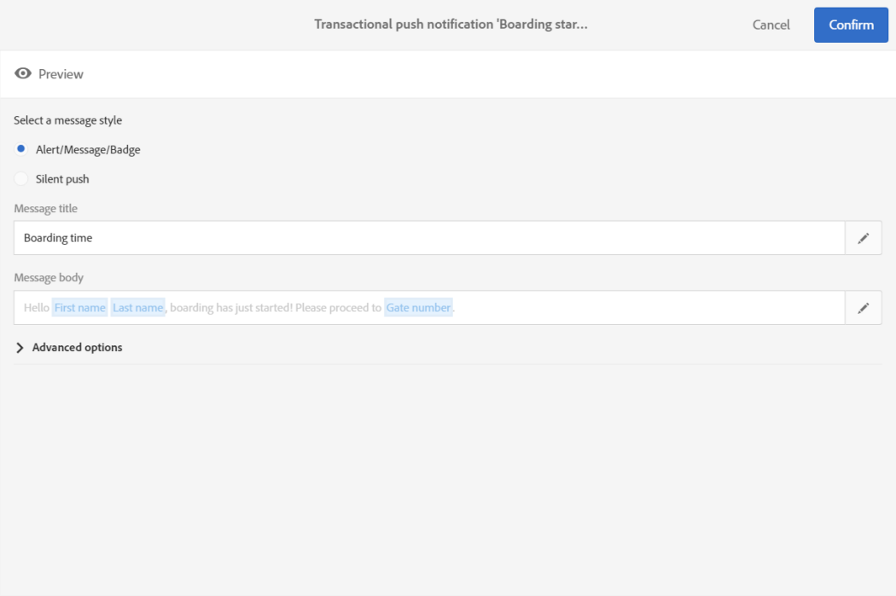
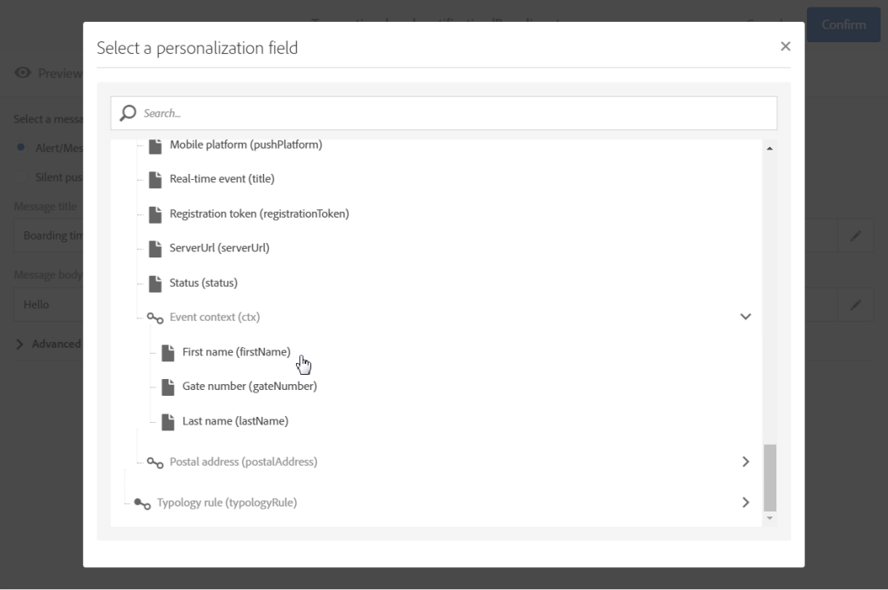
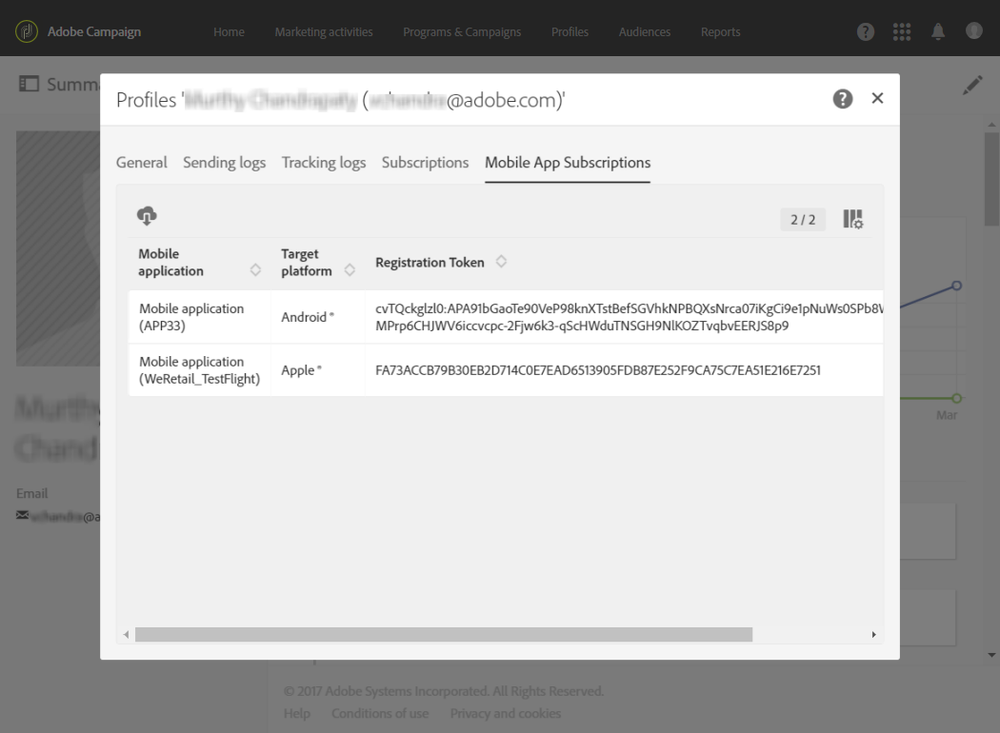
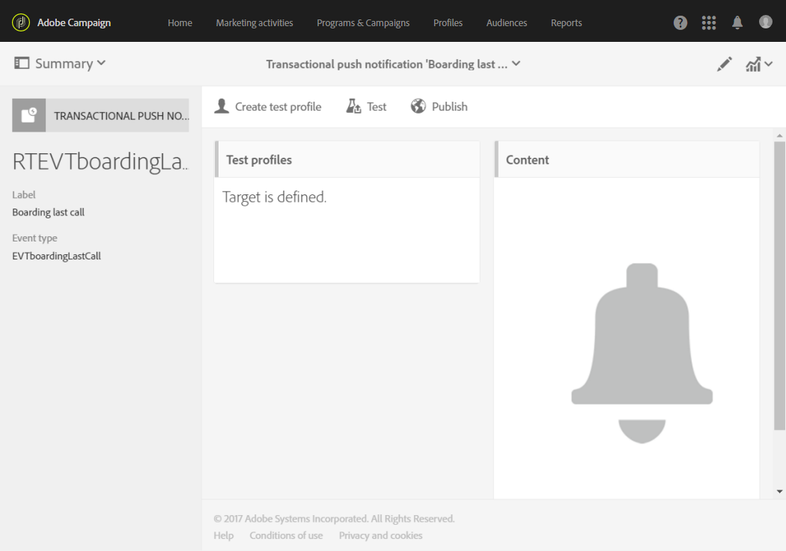
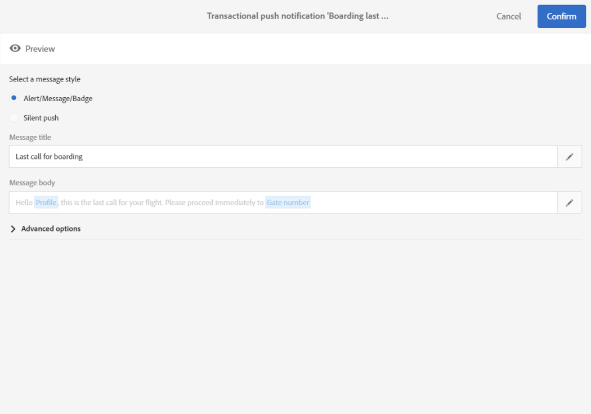

# Transactional push notifications{#transactional-push-notifications}

Transactional push notifications

You can use Adobe Campaign to send transactional push notifications on iOS and Android mobile devices. These messages are received on mobile applications that you set up in Adobe Campaign by leveraging the Experience Cloud Mobile SDK.

>[!NOTE]
>
>The push channel is optional. Please check your license agreement. For more information on standard push notifications, see [Push notifications](../../channels/using/about-push-notifications.md).

You can send two types of transactional push notifications:

* Transactional push notifications targeting an event.
* Transactional push notifications targeting profiles from the Adobe Campaign database.

Once you have created and published an event (the cart abandonment explained in [this section](../../channels/using/about-transactional-messaging.md#transactional-messaging-operating-principle)), the corresponding transactional push notification is created automatically.

The configuration steps are presented in the [Configuring an event to send a transactional push notification](../../administration/using/configuring-transactional-messaging.md#use-case--configuring-an-event-to-send-a-transactional-message) section.

In order for the event to trigger sending a transactional message, you have to personalize the message, then test it and publish it.

>[!NOTE]
>
>To access the transactional messages, you must have administration rights or appear in the **Message Center agents** (mcExec) security group.

## Transactional push notifications targeting an event {#transactional-push-notifications-targeting-an-event}

You can send an anonymous transactional push notification to all users who have opted in to receive notifications from your mobile application.

In this case, only the data contained in the event itself is used to define the delivery target. No data from the Adobe Campaign database is leveraged.

### Sending a transactional push notification targeting an event {#sending-a-transactional-push-notification-targeting-an-event}

For example, an airline company wants to invite its mobile application users to proceed to the relevant gate for boarding.

The company will send one transactional push notification per user (identified with a registration token), using one mobile application, through one single device.

1. Go the transactional message that was created to edit it. See [Event transactional messages](../../channels/using/event-transactional-messages.md).

   

1. Click the **Content** block to modify your message's title and body.

   You can insert personalization fields to add elements that you defined when you created your event.

   

   To find these fields, click the pencil next to an item, click **Insert personalization field** and select **Transactional event** > **Event context**.

   

   For more on editing a push notification content, see [Creating a push notification](../../channels/using/preparing-and-sending-a-push-notification.md).

1. Save your changes and publish the message. See [Publishing a transactional message](../../channels/using/event-transactional-messages.md#publishing-a-transactional-message).
1. Using the Adobe Campaign Standard REST API, send an event to a registration token (ABCDEF123456789), using one mobile application (WeFlight), on Android (gcm), containing the boarding data.

   ```
   
   {
     "registrationToken":"ABCDEF123456789",
     "application":"WeFlight",
     "pushPlatform":"gcm",
     "ctx":
     {
       "gateNumber":"Gate B18",
       "lastname":"Green",
       "firstname":"Jane"
     }
   }
   
   ```

   For more on integrating the triggering of an event into an external system, see [Site integration](../../administration/using/configuring-transactional-messaging.md#integrating-the-triggering-of-the-event-in-a-website).

If the registration token exists, the corresponding user receives a transactional push notification including the following content:

"Hello Jane Green, boarding has just started! Please proceed to Gate B18."

## Transactional push notifications targeting a profile {#transactional-push-notifications-targeting-a-profile}

You can send a transactional push notification to the Adobe Campaign profiles who have subscribed to your mobile application. This delivery can contain [personalization](../../designing/using/inserting-a-personalization-field.md) fields, such as the recipient's first name.

In this case, the event must contain some fields allowing reconciliation with a profile from the Adobe Campaign database.

When targeting profiles, one transactional push notification is sent per mobile application and per device. For example, if an Adobe Campaign user has subscribed to two applications, this user will receive two notifications. If a user has subscribed to the same application with two different devices, this user will receive a notification on each device.

The mobile applications a profile has subscribed to are listed in the **Mobile App Subscriptions** tab of this profile. To access this tab, select a profile and click the **Edit profile properties** button on the right.



For more information on accessing and editing profiles, see [Profiles](../../audiences/using/creating-profiles.md).

### Sending a transactional push notification targeting a profile {#sending-a-transactional-push-notification-targeting-a-profile}

For example, an airline company wants to send a last call for boarding to all Adobe Campaign users who have subscribed to its mobile application.

1. Go the transactional message that was created to edit it. See [Event transactional messages](../../channels/using/event-transactional-messages.md).

   

1. Click the **Content** block to modify your message's title and body.

   As opposed to configurations based on real-time events, you have direct access to all profile information to personalize your message. See [Inserting a personalization field](../../designing/using/inserting-a-personalization-field.md).

   

   For more on editing a push notification content. See [Creating a push notification](../../channels/using/preparing-and-sending-a-push-notification.md).

1. Save your changes and publish the message. See [Publishing a transactional message](../../channels/using/event-transactional-messages.md#publishing-a-transactional-message).
1. Using the Adobe Campaign Standard REST API, send an event to a profile.

   ```
   
   {
     "ctx":
     {
       "email":"janegreen@email.com",
       "gateNumber":"D16",
     }
   }
   
   ```

   For more on integrating the triggering of an event into an external system, see [Site integration](../../administration/using/configuring-transactional-messaging.md#integrating-the-triggering-of-the-event-in-a-website).

   >[!NOTE]
   >
   >There is no registration token, application and push platform fields. In this example, the reconciliation is performed with the email field.

