# Creating and updating profile information based on mobile application data

## Overview

This page describes the steps to develop a workflow which creates/updates profile data after a Mobile Application sends Collect PII data, on a scheduled basis.

* **PII** stands for “Personally Identifiable Information”. It can be any data, including information that does not appear in the Profile table from your Campaign database like, for example, Analytics for Mobile [Points of Interest](../../integrating/using/about-campaign-points-of-interest-data-integration.md). The PII is defined by the Mobile App Developer, usually with a Marketer.
* **Collect PII** is an HTTP-POST operation to a Rest API in Adobe Campaign Standard from a Mobile App.

The goal of this use case is to create or update a Campaign Standard profile, if the PII data returned by a Mobile Application contains profile-related data.

## Prerequisites

There are several configuration steps to follow to enable push notifications in Campaign Standard, before Profiles can be created or updated based on Mobile App Subscription data:

1. [Create a Mobile Application](../../administration/using/configuring-a-mobile-application.md)
1. [Integrate the Adobe Mobile SDK with your mobile application](https://helpx.adobe.com/campaign/kb/integrate-mobile-sdk.html).
1. [Configure Adobe Campaign to send push notifications](https://helpx.adobe.com/campaign/kb/configuring-app-sdkv4.html).

## Step 1 - Extend the Profile resource for Push Notifications/Subscriptions

To be able to create or update the Profile resource with PII data, you must first extend the Profile resource with the desired fields. To do this:

* Identify the PII fields that are sent by the Mobile Application.
* Identify the field to use for reconciliation to associate the PII data with the Profile Data.

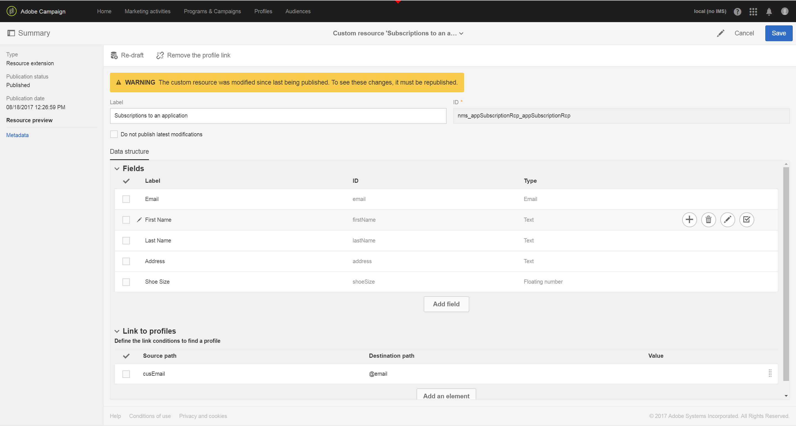

In this example, the **[!UICONTROL Fields]** section reflect the PII data sent by the Mobile Application. The **[!UICONTROL Link to profiles]** section indicates the field that is used to associate the PII with the Profile Data, where **cusEmail** maps to **@email**.

The mapping for Profile Data while extending the **[!UICONTROL Subscriptions to an Application]** resource is READ-ONLY. It is used for reconciliation. The profile must be entered into the system with the necessary data to reconcile the profile with the PII data. In our case, an email address for the profile must match an email from the Collect PII in order for the reconciliation to occur:

* Collect PII is received from a Mobile App for a user where their First Name is “Jane, Last Name is “Doe” and Email address is janedoe@doe.com.
* Separately, the Profile Data must exist (for example, the data must be manually entered or already come from some other resource) where the profile’s Email address is janedoe@doe.com.

**Related topics:**

* [Extending the subscriptions to an application resource](../../developing/using/extending-the-subscriptions-to-an-application-resource.md).
* [Creating or extending an existing resource](../../developing/using/key-steps-to-add-a-resource.md).

## Step 2 - Create the workflow

Using a Workflow in Campaign Standard allows an Administrator to uniquely identify and synchronize data between the AppSubscription (Subscriber) data and Profile or Recipient data. While a workflow-based update does not synchronize profile data in real time, it should not cause any undue database locks or overhead.

The main steps to build the workflow are:

1. Use a **[!UICONTROL Query]** or **[!UICONTROL Incremental query]** activity to get a list of the latest subscriptions.
1. Use a **[!UICONTROL Reconciliation]** activity to map the PII data with the profile.
1. Add some verification process.
1. Use an **[!UICONTROL Update data]** to update or create the profile with the PII data.

The following requirements are assumed in this workflow:

* Any/All fields that have been extended should be available to create/update the Profile Table.
* The Profile table can be extended to support fields that are not natively supported (for example, T-Shirt Size).
* Any field from the AppSubscription table which is blank should not be updated in the Profile Table.
* Any record that has been updated in the AppSubscription table should be included in the next run of the Workflow.

To build the workflow, drag and drop the following activities into the workspace and link them together: **[!UICONTROL Start]**, **[!UICONTROL Scheduler]**, **[!UICONTROL Incremental query]**, **[!UICONTROL Update data]**.

 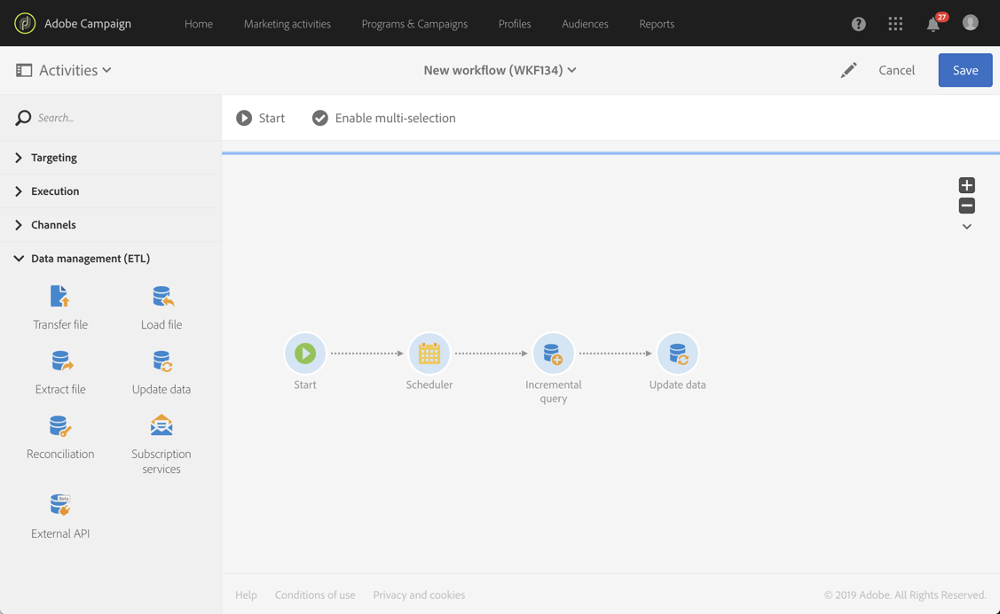

Then follow the steps below to configure each activity.

### Configure the **[!UICONTROL Scheduler]** activity

In the **[!UICONTROL General]** tab, set the **[!UICONTROL Execution frequency]** (for example, "Daily"), the **[!UICONTROL Time]** (for example, "1:00:00 AM"), and the **[!UICONTROL Start]** (for example, Today's date).

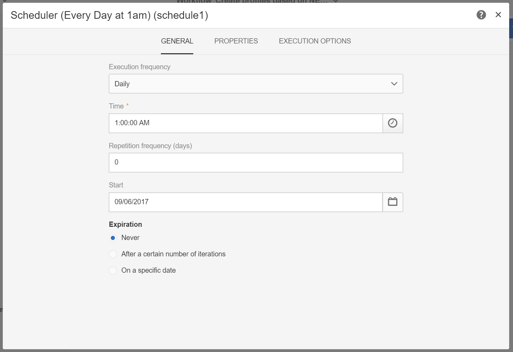

### Configure the **[!UICONTROL Incremental query]** activity.

1. In the **[!UICONTROL Properties]** tab, click the **[!UICONTROL Select an element]** icon of the **[!UICONTROL Resource]** field, then select the **[!UICONTROL Subscriptions to an application (nms:appSubscriptionRcp:appSubscriptionRcpDetail)]** element.

    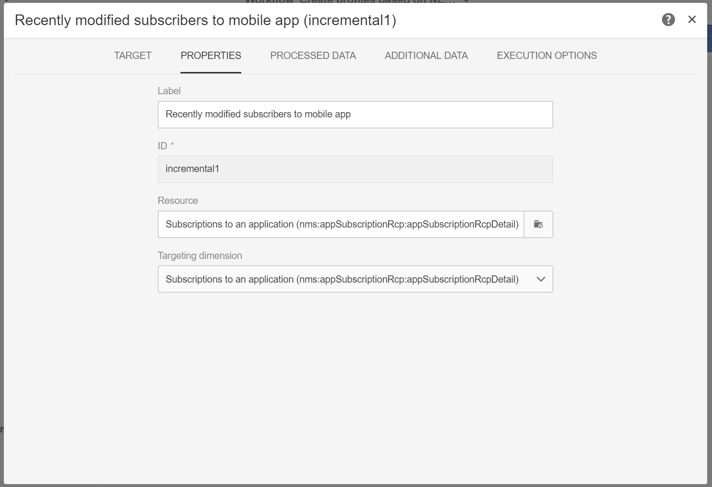

1. In the **[!UICONTROL Target]** tab, drag the **[!UICONTROL Mobile application]** filter, then select a Mobile application name.

    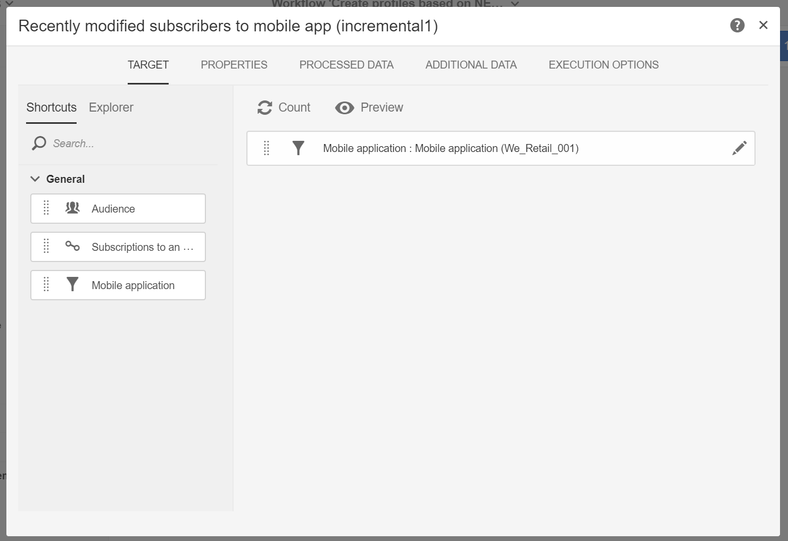

1. In the **[!UICONTROL Processed data]** tab, select **[!UICONTROL Use a date field]**, then add the **[!UICONTROL Last modified (lastModified)]**  field as **[!UICONTROL Path to the date field]**.

    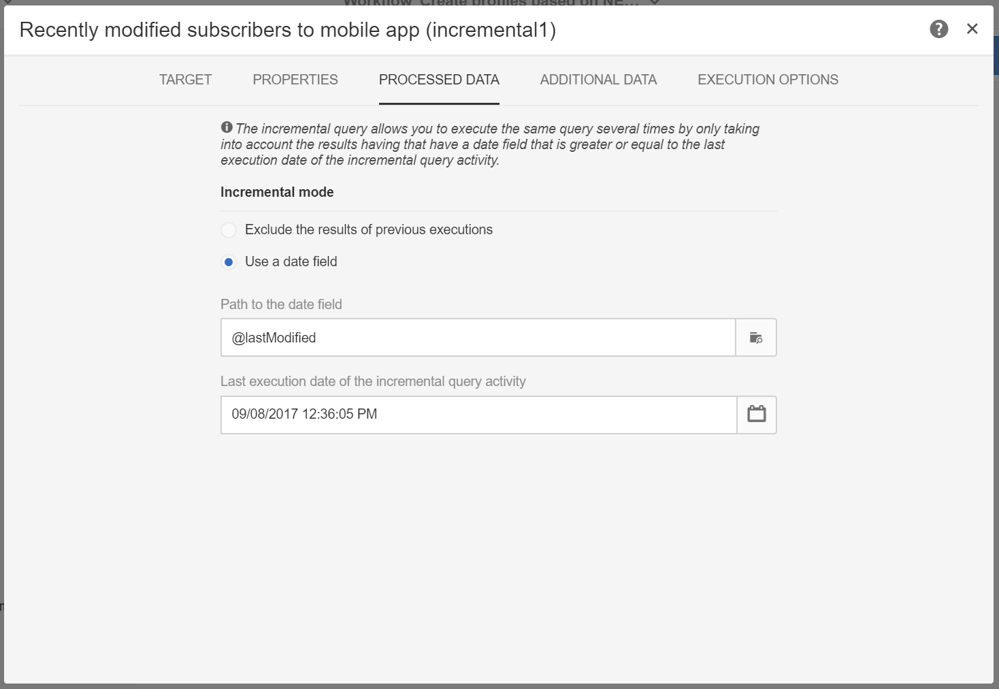

### Configure the **[!UICONTROL Update data]** activity.

1. In the **[!UICONTROL Identification]** tab, make sure that the **[!UICONTROL Dimension to update]** field is set to "Profiles (profile)", then click the **[!UICONTROL Create element]** button to add a field as a reconciliation criteria.

    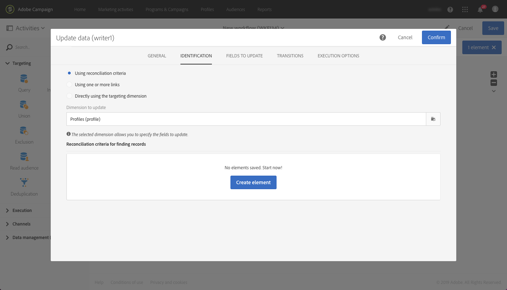

1. In the **[!UICONTROL Source]** field, select a field from the appSubscrsiptionRcp table as a reconciliation field. It can be the profile's email, crmId, marketingCloudId, etc. In this example case, we will use the "Email (cusEmail)" field.

1. In the **[!UICONTROL Destination]** field, select a field from the profile table to reconcile the data from the appSubscriptionRcp table. It can be the profile's email, or any extended field such as crmId, marketingCloudId, etc. In this example, we need to select the "Email (email)" field to map it with the "Email (cusEmail)" field from the appSubscriptionRcp table.

    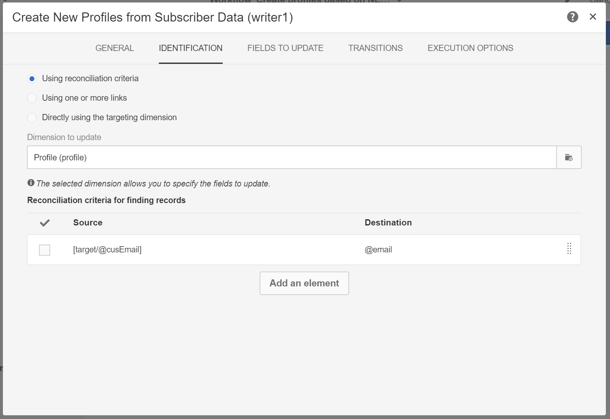

1. In the **[!UICONTROL Fields to update]** tab, click the **[!UICONTROL Create element]** button, then map the fields that are coming from the appSubscriptionRcp table (**[!UICONTROL Source]** field) with the fields that you want to update in the Profile table (**[!UICONTROL Destination]** field).

1. In the **[!UICONTROL Enabled if]** field, add an expression to ensure that the corresponding field in the Profile table is updated only if the source field contains a value. To do this, select the field from the list, then add the "!=''" expression (if the Source field is `[target/@cusEmail]` in the Expression editor make sure to type `[target/@cusEmail] != ''"`).

    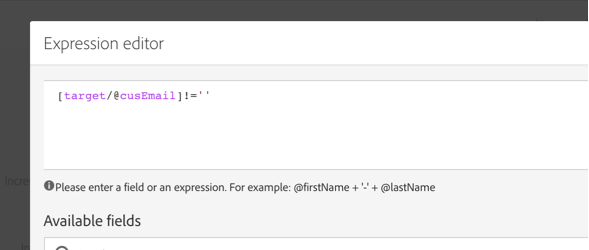

>[!NOTE]
>
>In this case, the Workflow performs an UPSERT but since it's based on an **[!UICONTROL Incremental query]** data is only inserted. Changing the Query can affect what data is inserted or updated.
>In addition, settings in the Fields to update tab determine what fields are inserted or updated under specific conditions. These settings can be unique for each application or customer.
>Take care when configuring these settings as there can be unintended consequences, as updating records in the Profile based on appSubscriptionRcp data can change users personal information without validation.

When all of the fields to insert/update in Profile have been added, click **[!UICONTROL Confirm]**.

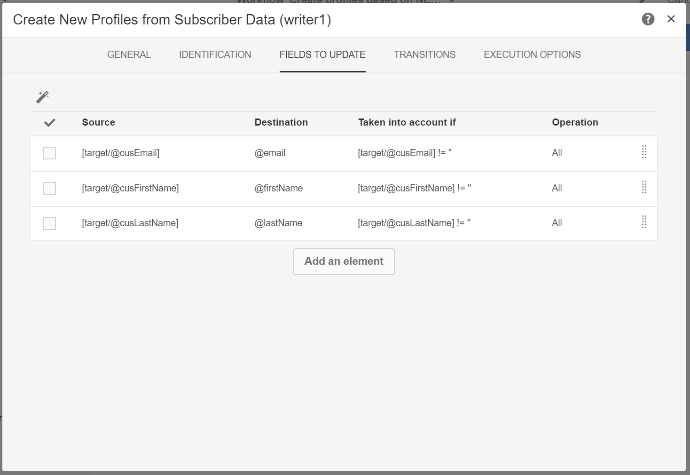

Save the workflow, then click **[!UICONTROL Start]** to execute the Workflow.

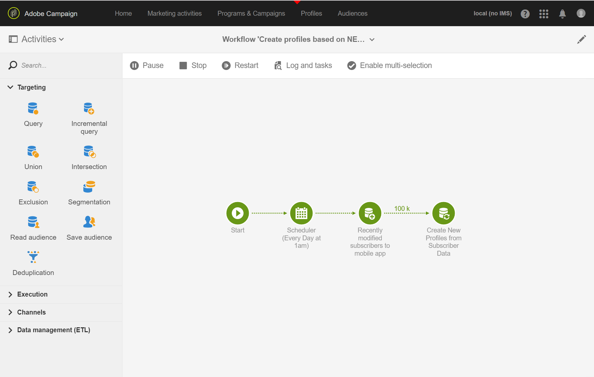
